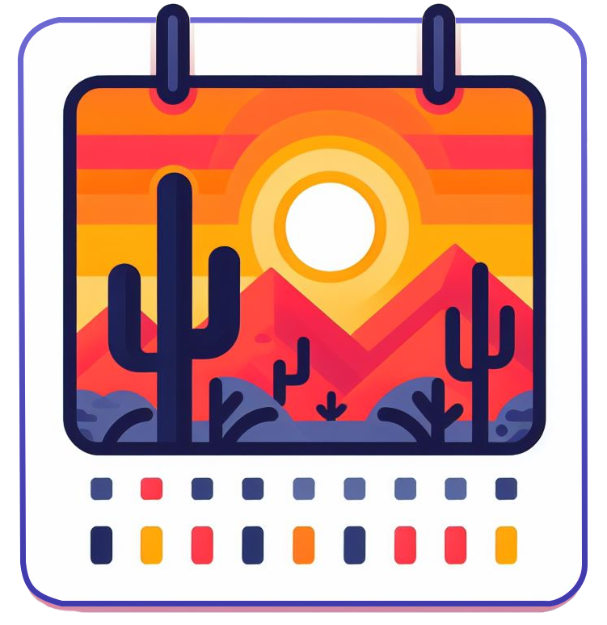

<link rel="stylesheet" href="../../assets/stylesheets/events.css">
<link rel="stylesheet" href="../../assets/stylesheets/images.css">

Every semester, [we host training workshops](../workshop_materials/) on topics ranging from intro to HPC, to machine learning, to parallel computing, and beyond. In addition, there are many great opportunities for learning hosted by other organizations within the community. Whether you're interested in learning about specific programming languages, exploring data analytics techniques, or cloud computing, there's a wide array of learning opportunities available.

Check below for a list of upcoming workshops.

## HPC Calendar

We are excited to host a full semester's worth of workshops this Fall. All workshops will be held on Fridays throughout the semester from 11am to noon in the Weaver Science and Engineering Library, Rm 212. The registration button below will allow you to register for any/all of the workshops listed below. Please note that you will need to be logged into your University of Arizona account in order to access the registration form.

[Register](https://docs.google.com/forms/d/e/1FAIpQLSeUV_zHbrPPJCp1qU0ztCuXa5EPuGUK06eLG1pXacfbQo3rCQ/viewform?usp=sf_link){ .md-button }

### Fall 2024 Workshop Schedule

| Date | Topic | Instructor |
| - | - | - |
|Sep 6  | HPC Overview and Access | Ethan Jahn |
|Sep 13 | Storage and Software Overview | Ethan Jahn |
|Sep 20 | Scheduling and Running Jobs | Ethan Jahn |
|Sep 27 | Managing and Optimizing Jobs | Ethan Jahn |
|Oct 4  | Parallel Computing Theory | Ethan Jahn |
|Oct 11 | Parallel Computing in Practice | Soham Pal |
|Oct 18 | Software and Environments | Soham Pal |
|Oct 25 | Machine Learning on HPC | Soham Pal |
|Nov 1  | Intro to Containers | Soham Pal |
|Nov 8  | Error Handling and Debugging | Ethan Jahn |
|Nov 15 | Intro to Statistics | Chris Reidy |
|Nov 22 | Using GPUs on HPC | Soham Pal |
|Dec 6  | Intro to Visualization | Devin Bayly |
|Dec 13 | Intermediate Techniques in Visualization | Devin Bayly |

## Our Friends and Partners

### Upcoming Events

<!-- ??? example "No listed events. Check back later."
    *If you have an event that you would like us to display here, please let us know!* -->

**Fall 2024 U of A Datalab Workshops**

View these workshops on the [DataLab Website](https://datascience.arizona.edu/education/uarizona-data-lab)

- Tues 2-3pm [NextGen Geospatial: AI & Cloud tools for Geographic Analysis](https://github.com/ua-datalab/Geospatial_Workshops/wiki) - Jeff Gillan
- Tues 3-4pm [Exploring Tools for Data Analysis and AI Applications in Biosciences and Genomics](https://github.com/ua-datalab/Bioinformatics/wiki) - Michele Cosi & Carlos Lizarraga
- Weds 1-2:30pm [Research Productivity](https://datascience.arizona.edu/events/leadership-through-project-management-team-culture-tips-successful-research-projects) - Rudy Salcido
- Thurs 1-2pm [Advanced AI for Healthcare: A Transformative Force](https://github.com/ua-datalab/ai-healthcare) - Greg Chism
- Thurs 2-3pm [Exploring the LLM Frontier: From Hugging Face to RAG and Beyond](https://github.com/ua-datalab/Generative-AI) - Carlos Lizarraga & Enrique Noriega Atala
- Thurs 3-4pm [Natural Language Processing for All](https://github.com/ua-datalab/NLP-Speech) - Megh Krishnaswamy

### External Event Pages

Please check out these workshops and activities from our partners around campus!

- The Data Science Institute's [official calendar](https://datascience.arizona.edu/calendar)
- Data Lab [home page](https://datainsight.arizona.edu/uarizona-data-lab)
- The UArizona Libraries [event calendar](https://libcal.library.arizona.edu/calendar/events)

<!--
!!! example "No upcoming workshops scheduled. Check back later"
-->
<!--

Below is a nice format you can use to create cards for upcoming events. 

    

        
DAY

        
3 LETTER MONTH

    

        

            <h3><a href="PATH TO WORKSHOP PAGE">WORKSHOP NAME</a></h3>
            
TIME &#x25cf LOCATION

        

        

            <a href="REGISTRATION LINK"> <button class="register-button">Register</button></a>
        

As an example:

    

        
3

        
Apr

    

        

            <h3><a href="../intro_to_hpc/">Intro to HPC</a></h3>
            
10:00-11:00am &#x25cf Catalyst Studios Room 1

        

        

            <a href="REGISTRATION LINK"> <button class="register-button">Register</button></a>
        

-->