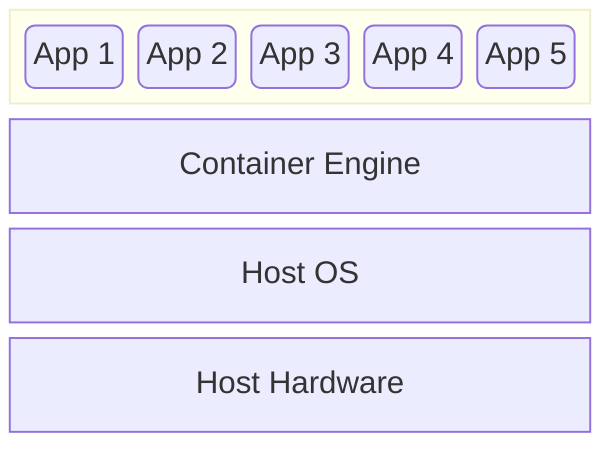

<link rel="stylesheet" href="../../../assets/stylesheets/embedded_files.css">
# Intro to Containers on HPC

There are times when the use of containers is more efficient for using HPC resources, and there are other times when it is the only way. This workshop will give you a quick view of some of the concepts and help you get familiar with Apptainer containers with some interactive examples.

See a presentation of this material from our Summer 2024 workshop series here:

<iframe width="560" height="315" src="https://www.youtube.com/embed/nPt8C9gX1eY?si=9fqEzxEP4dcOzBWj" title="YouTube video player" frameborder="0" allow="accelerometer; autoplay; clipboard-write; encrypted-media; gyroscope; picture-in-picture; web-share" referrerpolicy="strict-origin-when-cross-origin" allowfullscreen></iframe>

## What is a container?

> "A container is a standard unit of software that packages up code and all its dependencies so the application runs quickly and reliably from one computing environment to another." &#x2013; [Docker](https://www.docker.com/resources/what-container/)



## Why use containers?

-   Work in reproducible environments of your choosing and design
    -   You are not limited to the libraries and tools on the host system
    -   You can reproduce the same behavior across different systems
-   Containers are immutable
    -   Users cannot modify a container
    -   Users can create new containers based on existing ones
-   Limits user privileges
-   Make use of GPUs and high-speed networks

## Container engines

-   Docker (most popular, but not suitable for shared clusters)
-   Podman
-   CharlieCloud
-   Apptainer (earlier known as Singularity)
-   ... 

Apptainer was developed with shared clusters, and it is the container engine supported at UA HPC. For more information on the differences between Apptainer and the others, and why we use Apptainer, read [Singularity: Scientific containers for mobility of compute](https://doi.org/10.1371/journal.pone.0177459).

## How to use Apptainer containers

1.  Pull or build an Apptainer container in an interactive session
    -   Apptainer can build containers from Docker containers
2.  Run the Apptainer container from an interactive session or a batch submission script

## Your first Apptainer container

1.  Run `elgato`
2.  Start an interactive session with `interactive -a <pi-account-name>`
3.  Pull an Apptainer image with `apptainer pull docker://ghcr.io/apptainer/lolcow`

You will see something like the following:

```bash
[sohampal@cpu43 sohampal]$ apptainer pull docker://ghcr.io/apptainer/lolcow
INFO:    Converting OCI blobs to SIF format
INFO:    Starting build...
Getting image source signatures
Copying blob 16ec32c2132b done   | 
Copying blob 5ca731fc36c2 done   | 
Copying config fd0daa4d89 done   | 
Writing manifest to image destination
2024/07/17 15:50:32  info unpack layer: sha256:16ec32c2132b43494832a05f2b02f7a822479f8250c173d0ab27b3de78b2f058
2024/07/17 15:50:34  info unpack layer: sha256:5ca731fc36c28789c5ddc3216563e8bfca2ab3ea10347e07554ebba1c953242e
INFO:    Creating SIF file...
```

To run the container, run `apptainer run lolcow_latest.sif` from the interactive session:

```bash
[sohampal@cpu43 sohampal]$ apptainer run lolcow_latest.sif 
 ______________________________
< Wed Jul 17 15:52:49 MST 2024 >
 ------------------------------
        \   ^__^
         \  (oo)\_______
            (__)\       )\/\
                ||----w |
                ||     ||
```

## Container registries

You can pull containers from repositories, also known as container registries. Some useful ones are:

+  [Docker hub](https://hub.docker.com/)
    -   The most popular container registry
    -   Multiple providers for each application (try to stick to official containers)
+  [NVIDIA NGC Catalog](https://catalog.ngc.nvidia.com/)
    -   Provides Docker containers for various GPU accelerated packages (including Tensorflow and PyTorch)
    -   For more information on using NVIDIA containers on UA HPC, see [Pulling Nvidia Images](https://hpcdocs.hpc.arizona.edu/software/containers/pulling_containers/#pulling-nvidia-images)
+  [BioContainers](https://biocontainers.pro/)
    -   Provides tons of Docker containers for bioinformatics
+  [Neurodesk](https://www.neurodesk.org/)
    -   Provides Apptainer containers for neuroimaging
+  [Sylabs](https://cloud.sylabs.io/)
    -   Provides Apptainer containers

For more Apptainer-compatible registries, see [Apptainer documentation](https://apptainer.org/docs/user/main/docker_and_oci.html). Sometimes Apptainer containers created from Docker containers might not work exactly the same way as they would with Docker. If you find that the developers provide corresponding Apptainer containers (or definition files), then use those.

## What if no registry has the container you need?

Simple, build it yourself!

We will look at a simple example of building an Apptainer container. Create a file with the following contents, and name it `nyancat`:

```bash
Bootstrap: docker
From: debian:bookworm-slim

%post
  apt update -y && apt install -y nyancat

%runscript
  nyancat
```

Here is some explanation of what each line in the file means:

-   **`Bootstrap: docker`:** This tells Apptainer that we want to use a container from Docker hub as a base for this container.
-   **`From: debian:bookworm-slim`:** This provides the name of container that we want to use as the base. In this case we are using a container based on the Debian Linux system as the base. Bookworm is the latest version of Debian. The part after `:` in `debian:bookworm-slim`, i.e. `bookworm-slim`, is usually called the tag, and used for versioning; `-slim` indicates that this particular container has a minimal number of packages.
-   **`%post`:** The `%` indicates a section in the file. All commands for installing software are mentioned under this section.
-   **`apt update -y && apt install -y nyancat`:** These commands check for updates and then installs the `nyancat` package. Notice, we do not use `sudo` before the commands.
-   **`%runscript`:** In this section you indicate which commands will run by default when you run the container.
-   **`nyancat`:** `nyancat` under `%runscript` means that `apptainer run nyancat.sif` will run `nyancat`.

This file is known as an Apptainer Definition file, it can be far more complex than this example. For more information, see [Definition Files](https://apptainer.org/docs/user/main/definition_files.html). You can build any container from a definition with `apptainer build <path-to-container> <path-to-definition-file>`. In this case it will be `apptainer build nyancat.sif nyancat`.

You can run it with `apptainer run nyancat.sif`. (Run it and be amazed. You can cancel it with `Ctrl + C`.)
To run something other than the default program, use `apptainer exec <path-to-container> <command>`. For example:

```bash
[sohampal@cpu37 sohampal]$ apptainer exec nyancat.sif whoami
sohampal
```

Notice that our HPC clusters run on RedHat-based Linux OSs. However this container is based on Debian, a different OS. Containers allow you to "mix-and-match" certain parts of OSs.

## Building containers for Python and R packages

Sometimes Python or R packages have dependencies which we cannot support on the HPC clusters. Containers can be an good alternative in such cases.

1.  Check if the package developers already provide containers (many often do)
2.  In the absence of ready-made containers try the suggestions below to build your own container


### Python

For the base container, use:

-   one of the official [Python](https://hub.docker.com/_/python) containers from Docker hub, if you do not need `conda`
-   one of the [mambaforge](https://hub.docker.com/r/condaforge/mambaforge) containers from Docker hub, if you need `conda` (provides `mamba`, a faster implementation of `conda`)

The example below shows a Definition file for a container containing the [Astropy](https://www.astropy.org/) Python package. You can use this as a template to write your own Definition files.

```bash
Bootstrap: docker
From: python:3.11-slim-bookworm

%post
  pip install ipython matplotlib astropy

%runscript
  ipython
```

You can build it as before. When you run it, it will start an IPython shell, in which you can import Astropy.

```bash
[sohampal@cpu37 sohampal]$ apptainer run astropy_latest.sif 
Python 3.11.9 (main, May 14 2024, 08:15:15) [GCC 12.2.0]
Type 'copyright', 'credits' or 'license' for more information
IPython 8.25.0 -- An enhanced Interactive Python. Type '?' for help.

In [1]: import astropy

In [2]: 
```

### R

For the base containers, use one of `rstudio` containers provided by [Rocker](https://hub.docker.com/r/rocker/rstudio) on Docker hub. Depending on what packages you need you might even find a ready-made container provided by Rocker.

The example below shows a Defnition file for container with the [Signac](https://stuartlab.org/signac/) R package, used for analysis of single-cell chromatin data. Signac requires installation of some OS-level libraries and some BioConductor packages.

```bash
Bootstrap: docker
From: rocker/rstudio:4.3.2

%post
  apt update -y
  apt install -y --no-install-recommends liblzma-dev libbz2-dev patch zlib1g-dev

  export R_LIBS_USER=/usr/lib/R/site-library

  R -e 'install.packages("BiocManager")'
  R -e 'BiocManager::install(c("GenomeInfoDb", "GenomicRanges", "IRanges", "Rsamtools", "S4Vectors", "BiocGenerics"))'
  R -e 'setRepositories(ind=1:3); install.packages(Signac")'

  apt clean && rm -rf /var/lib/apt/lists/*

%runscript
  R
```

After building the container if you run it from the command line, it will take to you a R prompt and you can load the Signac library.

```bash
[sohampal@cpu37 sohampal]$ ./r-signac.sif 

R version 4.3.2 (2023-10-31) -- "Eye Holes"
Copyright (C) 2023 The R Foundation for Statistical Computing
Platform: x86_64-pc-linux-gnu (64-bit)

R is free software and comes with ABSOLUTELY NO WARRANTY.
You are welcome to redistribute it under certain conditions.
Type 'license()' or 'licence()' for distribution details.

  Natural language support but running in an English locale

R is a collaborative project with many contributors.
Type 'contributors()' for more information and
'citation()' on how to cite R or R packages in publications.

Type 'demo()' for some demos, 'help()' for on-line help, or
'help.start()' for an HTML browser interface to help.
Type 'q()' to quit R.

> library(Signac)
Signac built for for SeuratObject v4 was just loaded with SeuratObject
v5; disabling v5 assays and validation routines, and ensuring assays
work in strict v3/v4 compatibility mode
> 
```

To use RStudio, see [Using RStudio](../../../software/popular_software/R/#__tabbed_2_2).


## Containers provided by UA HPC

We provide a few Apptainer containers. You can use them directly, or as a base to create your own containers. These are available at:

-   `/contrib/singularity/nvidia`
    -   Contains GPU enabled images from NVIDIA NGC
    -   Includes PyTorch and Tensorflow among others
-   `/contrib/singularity/ua-hpc`
    -   Contains images not directly provided by NVIDIA
    -   Some like AlphaFold are GPU enabled


## Using containers in batch jobs

We will look at a simple Linear Regression example using one of the Tensorflow containers available under `/contrib/singularity/nvidia`. The Tensorflow, PyTorch, and AlphaFold containers are also available as modules, so you do not have to use `apptainer exec` or `apptainer run` when you run these containers. You simply have to load the corresponding module.

First create a Python file with the following content:

```python
#Linear Regression Example with TensorFlow v2 library 

from __future__ import absolute_import, division, print_function
#
import tensorflow as tf
import numpy as np
from tensorflow.keras import optimizers
tf.enable_eager_execution()
rng = np.random
#
# Parameters.
learning_rate = 0.01
training_steps = 1000
display_step = 50
#
# Training Data.
X = np.array([3.3,4.4,5.5,6.71,6.93,4.168,9.779,6.182,7.59,2.167,
              7.042,10.791,5.313,7.997,5.654,9.27,3.1])
Y = np.array([1.7,2.76,2.09,3.19,1.694,1.573,3.366,2.596,2.53,1.221,
              2.827,3.465,1.65,2.904,2.42,2.94,1.3])
n_samples = X.shape[0]
#
# Weight and Bias, initialized randomly.
W = tf.Variable(rng.randn(), name="weight")
b = tf.Variable(rng.randn(), name="bias")

# Linear regression (Wx + b).
def linear_regression(x):
    return W * x + b

# Mean square error.
def mean_square(y_pred, y_true):
    return tf.reduce_sum(tf.pow(y_pred-y_true, 2)) / (2 * n_samples)

# Stochastic Gradient Descent Optimizer.
optimizer = tf.keras.optimizers.SGD(learning_rate)
#
# Optimization process. 
def run_optimization():
# Wrap computation inside a GradientTape for automatic differentiation.
    with tf.GradientTape() as g:
        pred = linear_regression(X)
        loss = mean_square(pred, Y)

    # Compute gradients.
    gradients = g.gradient(loss, [W, b])

    # Update W and b following gradients.
    optimizer.apply_gradients(zip(gradients, [W, b]))
#
# Run training for the given number of steps.
for step in range(1, training_steps + 1):
    # Run the optimization to update W and b values.
    run_optimization()

    if step % display_step == 0:
        pred = linear_regression(X)
        loss = mean_square(pred, Y)
        print("step: %i, loss: %f, W: %f, b: %f" % (step, loss, W.numpy(), b.numpy()))
```

Now create a bash script with the following content (replace the placeholder variables with `<>` in their names with the actual values):

```bash
#!/bin/bash
#SBATCH --output=Sample-tensorflow-example-%a.out
#SBATCH --ntasks=1
#SBATCH --nodes=1
#SBATCH --time=00:01:00
#SBATCH --gres=gpu:1
#SBATCH --partition=standard
#SBATCH --account=<your-group>

module load tensorflow/nvidia/2.0.0
echo "Tensorflow executable: " $(which tensorflow)
echo "The command tensorflow is a bash script added to your PATH. Contents of the executable: " 
echo
cat $(which tensorflow)
echo
echo "Executing: tensorflow <path/to/python/script>"
echo 
tensorflow <path/to/python/script>
```

You can submit this with `sbatch <path/to/bash/script>`. For an example of using the AlphaFold container in a batch job, see [AlphaFold 2](../../../software/common_datasets/#alphafold-2).

# Additional resources

-   Check out the [Containers](../../../software/containers/what_are_containers/) section in our docs.
-   Apptainer fully supports using GPUs with the `--nv` flag. For more information on using Apptainer containers with GPUs, read [GPU Support](https://apptainer.org/docs/user/main/gpu.html).
-   If you want to build Apptainer containers with MPI support, read [Apptainer and MPI applications](https://apptainer.org/docs/user/main/mpi.html). The MPI type and version inside the container must match the MPI type and version on the host system. Build your containers with Open MPI 3 or Intel MPI to match the MPI on our clusters.
