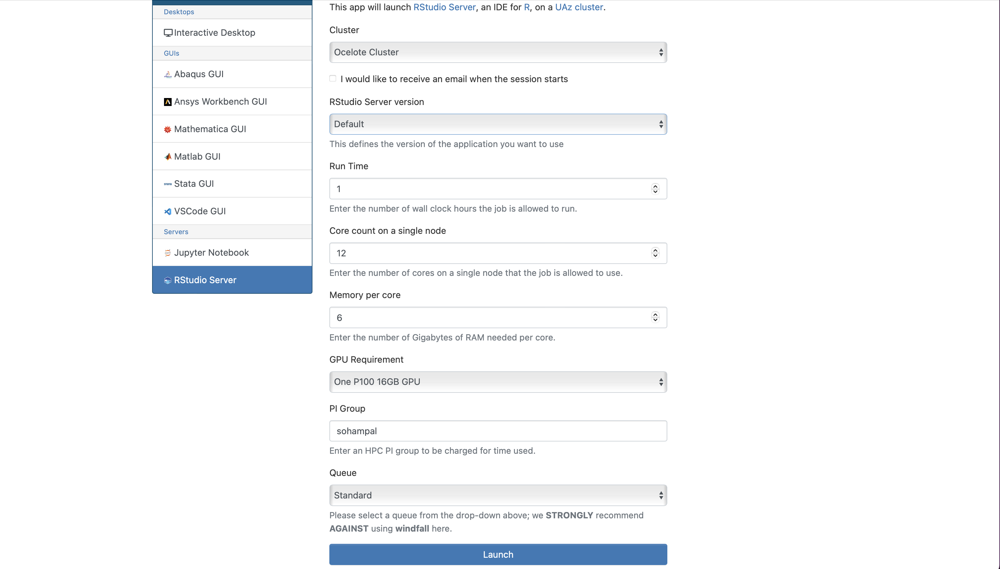
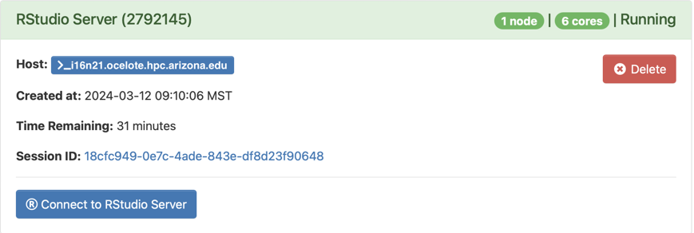
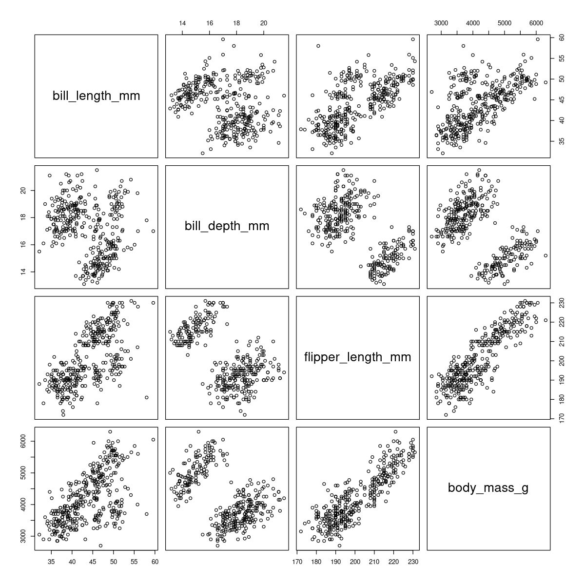
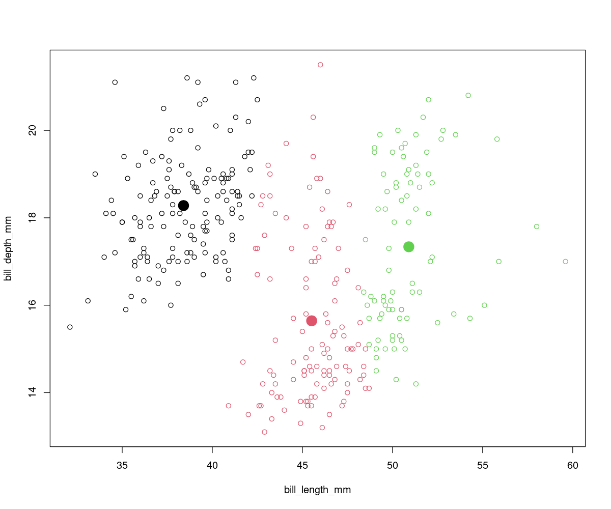
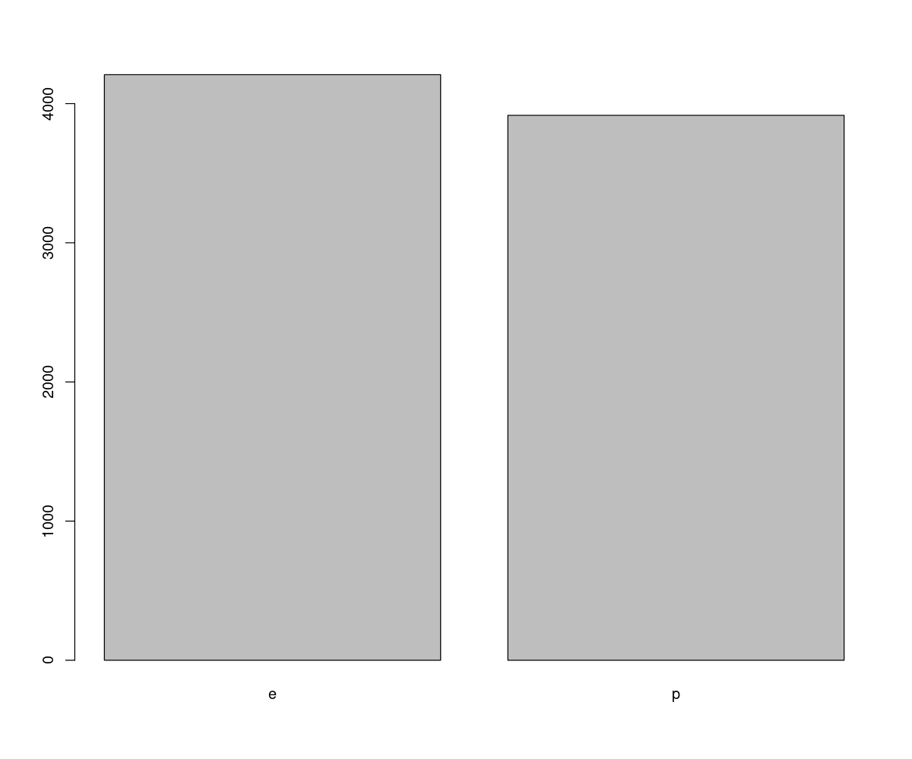

<link rel="stylesheet" href="../../../../assets/stylesheets/embedded_files.css">
<link rel="stylesheet" href="../../../../assets/stylesheets/buttons.css">
# Intro to Machine Learning with R on HPC

We will discuss a few hands-on examples of machine learning with R. You can run these in a RStudio notebook, or using a batch script (see [Intro to HPC](../../intro-to-hpc/index.md)). Here we emphasize on using RStudio notebooks. We recommend that you try these hands-on examples.

## Why use R for machine learning?

- R has been the quintessential language for Statistics for a while
- Comes batteries included -- tons of datasets and data visualization tools
- RStudio & Shiny provide an excellent platform to develop and share your code
- Most HPC consultants are familiar with R

## Things to look out for
The popularity of R also means that there are a lot of moving pieces. Sometimes, that can complicate your workflow. For machine learning with R on HPC, keep the following in mind:

<div class="annotate" markdown>
- Don't mix R versions
- Bazillion packages to do the same thing, but not all equally efficient (1)
- Installing packages on HPC clusters can sometimes be non-trivial (2)
- Using GPUs might need some extra configuration
- Not all R package managers play well with HPC environments
</div>

1. Use packages from the [`tidyverse`](https://www.tidyverse.org/) universe if possible. However to keep things simple we will not use `tidyverse` packages in this workshop, but we highly recommend that you look them up if you are using R for data-based research.
2. Read the [section](../../../../software/popular_software/R/index.md) on R in our docs.

## Setting up R for machine learning on HPC
- R and RStudio are already installed on HPC
- Read the [section](../../../../software/popular_software/R/index.md) on R in our docs to troubleshoot package installation issues

## Access RStudio from OOD

<div class="annotate" markdown>
1. Navigate to [https://ood.hpc.arizona.edu/](https://ood.hpc.arizona.edu/). After login, you will see the OOD dashboard.

2. Select **Interactive Apps**, and then from the drop-down menu select **RStudio Server**.

3. Fill in the details in the form that opens up (1), and select **Launch**.

4. After the session becomes available, select **Connect to RStudio Server** (2).

</div>

1. Use your PI's group's name for the *PI Group* field. You can find out your PI's group's name by running `va` in a terminal session.
2. 1. After you select **Launch** in the previous step, OOD will take you to a page with a tile that shows your pending job. When it's first submitted, its status will show as **Queued**. Once it starts, it's status will change to **Running** and you'll see the **Connect to RStudio Server** link.

## Examples

### Incomplete datasets

<center><a class="md-button" href="files/data-prelim.R">Click here to download R script</a></center>

Realistic datasets, like R's `airquality` dataset, often come with missing values. Not all machine learning models/algorithms are capable of dealing with datasets with missing values. Semi-supervised learning is a machine learning method that can deal with certain missing data. A more universal approach is to clean the dataset. Among other things this can involve:

-   Removing observations with missing entries
-   Filling the missing entries with token values

Which method you choose will depend on the problem you are trying to solve. In this example we will look at some of the tools that R's provides to help you clean the data.

The `airquality` dataset is part of the standard GNU R distribution. You can access it with the constant `airquality`. Instead of loading the whole dataset, we will just view the top 5 rows with the `head` function. (1)
{ .annotate }

1. The `head` function is useful to quickly glimpse the first $N$ rows of the dataset, without loading the whole dataset.

``` R
head(airquality, 5)
```

``` 
  Ozone Solar.R Wind Temp Month Day
1    41     190  7.4   67     5   1
2    36     118  8.0   72     5   2
3    12     149 12.6   74     5   3
4    18     313 11.5   62     5   4
5    NA      NA 14.3   56     5   5
```

The dataset has 6 columns. On the fifth row there are two `NA` entries. R uses `NA` (*N*ot *A*vailable) to indicate missing values. Thus the `airquality` dataset is missing values. While in this case we easily found out that this dataset is incomplete, `head` in general is not a good way to detect if there are missing values. (1)
{ .annotate }

1. Can you think why `head` is not a good missing value detector?

R comes with other tools to detect missing values. One of the is `is.na`, which tells you if a quantity is `NA` or not. It returns `TRUE` if a quantity is `NA` else false.

``` R
is.na(c("a", 5, NA))
```
```
[1] FALSE FALSE  TRUE
```

You can combine `is.na` with the functions `which` and `sum` to see if, where, and how many `NA` quantities are there. (1)
{ .annotate }

1. Find out what other tools R provides to detect missing values.

``` R
which(is.na(airquality)) # (1)!
```
{ .annotate }

1. Check what happens when you add the `arr.ind=TRUE` argument.

```
 [1]   5  10  25  26  27  32  33  34  35  36  37  39  42  43  45  46  52  53  54  55
[21]  56  57  58  59  60  61  65  72  75  83  84 102 103 107 115 119 150 158 159 164
[41] 180 249 250 251
```

There are 44 missing values, and the numbers not in brackets indicate the rows where the missing values are (we have already seen that there are two missing values in row 5). If you do not care where the missing values are you can run `sum(is.na(airquality))` which will tell you the number of missing values. This can be useful to determine if you should drop the observations (rows) with the missing values. If dropping incomplete observations do not substantially decrease the size of your dataset then dropping them is a good option. Otherwise you might want to consider alternative solutions. 

``` R
sum(is.na(airquality)) / nrow(airquality)
```

```
[1] 0.2875817
```

Dropping the incomplete observations will reduce the `airquality` dataset by little less than 30%. This is actually an upper bound on the amount of data loss, because some rows have multiple missing entries. Whether a 30% decrease is significant or not will depend on the problem you are trying to solve and the data you have. Here we will see how we can drop incomplete observations. (1)
{ .annotate }

1. Find out how to fill in the missing entries instead of dropping the incomplete observations.

``` R
airquality_no_na <- na.omit(airquality)
sum(is.na(airquality_no_na))
```

```
[1] 0
```

Sometimes it is actually better to first visualize the dataset, including the distribution of the missing data. We will not go into that in this workshop. But we recommend that you check out packages like `visdat` and `VIM` which provide advanced functionality to visualize missing data.

### Clustering 🐧

<center><a class="md-button" href="files/penguins_kmeans.R">Click here to download R script</a></center>

In this example we will cluster penguins into groups based on their bill features. We will use the [Palmer penguins](https://allisonhorst.github.io/palmerpenguins/articles/intro.html) dataset.


<cite>Artwork by [@allison_horst](https://twitter.com/allison_horst)</cite>

#### Accessing the data

The R package `palmerpenguins` provides the data, along with some other goodies. You can just download the data file from the sources mentioned in the link above. But it's much easier to use the packaged version. Note that while the package is called `palmerpenguins` the dataset itself is named `penguins`. 

``` R
install.packages("palmerpenguins")
library(palmerpenguins)
```

#### Visualizing the data

``` R
summary(penguins)
```

```
      species          island    bill_length_mm  bill_depth_mm  
 Adelie   :152   Biscoe   :168   Min.   :32.10   Min.   :13.10  
 Chinstrap: 68   Dream    :124   1st Qu.:39.23   1st Qu.:15.60  
 Gentoo   :124   Torgersen: 52   Median :44.45   Median :17.30  
                                 Mean   :43.92   Mean   :17.15  
                                 3rd Qu.:48.50   3rd Qu.:18.70  
                                 Max.   :59.60   Max.   :21.50  
                                 NA's   :2       NA's   :2      
 flipper_length_mm  body_mass_g       sex           year     
 Min.   :172.0     Min.   :2700   female:165   Min.   :2007  
 1st Qu.:190.0     1st Qu.:3550   male  :168   1st Qu.:2007  
 Median :197.0     Median :4050   NA's  : 11   Median :2008  
 Mean   :200.9     Mean   :4202                Mean   :2008  
 3rd Qu.:213.0     3rd Qu.:4750                3rd Qu.:2009  
 Max.   :231.0     Max.   :6300                Max.   :2009  
 NA's   :2         NA's   :2                   
```

The `summary` function is very handy to get an overall sense of a dataset. Often starting the exploration of your dataset with `summary` and `head` along with some visualizations is a good idea. (1)
{ .annotate }

1. Look at the last row of each column in the output of `summary`. Do you see something useful?

There are three unique species of penguins in the dataset. It might be tempting to think that there are three clusters in the dataset - one for each species. However, that need not be the case. Even if there are three clusters, they might not necessarily overlap with any species. Whether the clusters correspond to species will depend on the variance in intra-species differences and the variance in inter-species differences.

In addition to "species" there are three other categorical variables - "island", "sex", and "year". The remaining four are continuous variables. Plotting the categorical variables against each other will not give much useful information. We will plot the continuous variables.

``` R
cat <- c("species", "island", "sex", "year")
plot(penguins[, !(names(penguins) %in% cat)])
```



The figure above shows that only when we plot `bill_length_mm` vs `bill_depth_mm`, or `bill_length_mm` vs `flipper_length_mm` we see more than two clusters. This does not mean that there are not more that two clusters. It just means that in *two-dimensions* these are the only two cases where we see hints of more two clusters.

#### K-means clustering

{==Clustering is an unsupervised machine learning process==}, we do not provide any labels when we train the model. This is unlike the next examples, where we provided the labels. What this means is that a clustering model will not be able to tell if a particular cluster corresponds to a penguin species (or any other suitable label depending on the problem), but it will show the clusters that are there in the dataset. 

In K-means clustering the dataset is partitioned into K clusters, and each observation belongs to the cluster with the nearest mean (also known as centroid). The `stats` module of R comes with an implementation of K-means. See [A K-means clustering algorithm](https://academic.oup.com/jrsssc/article-abstract/28/1/100/6953842?login=false) for more information on the algorithm used in R's implementation of K-means clustering. K-means while one of the most popular clustering methods comes with the caveat that we have to choose K. The algorithm will then find those K clusters. There is no standard way to decide on a value of K. To keep things simple, here we will look at the `bill_length_mm` vs `bill_depth_mm` subset of the `penguins` dataset, which has at least two clusters.

``` R
df <- data.frame(penguins$bill_length_mm, penguins$bill_depth_mm) # (1)!
df <- na.omit(df)
cl <- kmeans(df, 3, nstart=10) # (2)!
plot(df, col=cl$cluster)
points(cl$centers, col=1:3, pch=19, lwd=10)
```
{ .annotate }

1. An alternative way to choose columns.
2. Why is `nstart` necessary? Try this with 2 clusters.



### 🍄 classification

<center><a class="md-button" href="files/mushroom_naivebayes.R">Click here to download R script</a></center>

In this example we are going to classify mushrooms as either edible or poisonous based on their physical features.

#### Accessing the dataset

The original dataset is hosted on UC Irvine's [Machine Learning Repository](https://archive.ics.uci.edu/dataset/73/mushroom). A version of it is also available at Brett Lantz's [Machine Learning with R datasets](https://github.com/stedy/machine-learning-with-R-datasets) Github repository. We will download Brett's version for this example.

``` R
download.file(
  "https://raw.githubusercontent.com/stedy/Machine-Learning-with-R-datasets/master/mushrooms.csv",
  destfile = "Mushroom.csv"
)
mushroom <- read.csv("Mushroom.csv", na.strings = "?")
```
#### Visualizing the dataset

This is a much larger dataset than the `penguins` or the `airquality` datasets. Without some prettier printing the outputs of `summary` or `head` might be difficult to parse visually. We will look at some other R functions to help with getting a sense of the dataset.

``` R
c(nrow(mushroom), ncol(mushroom), sum(is.na(mushroom)))
```
```
[1] 8124   23 2480
```

This dataset has 8124 observations and each observation has 23 features. There are 2480 missing entries. We also want to know what are these features and what type of data do they store. The more you know about the dataset the better. Often you will have to preprocess the data prior to train a machine learning model with it. Thus it useful to explore the dataset.

``` R
colnames(mushroom)
```
```
 [1] "type"                     "cap_shape"               
 [3] "cap_surface"              "cap_color"               
 [5] "bruises"                  "odor"                    
 [7] "gill_attachment"          "gill_spacing"            
 [9] "gill_size"                "gill_color"              
[11] "stalk_shape"              "stalk_root"              
[13] "stalk_surface_above_ring" "stalk_surface_below_ring"
[15] "stalk_color_above_ring"   "stalk_color_below_ring"  
[17] "veil_type"                "veil_color"              
[19] "ring_number"              "ring_type"               
[21] "spore_print_color"        "population"              
[23] "habitat"             
```
``` R
t(sapply(mushroom, summary)) # (1)!
```
{ .annotate }

1. `sapply` applies a function over all the elements of a `List` or `Vector`, and `t` returns the transpose of a `Matrix`.

```
                         Length Class       Mode       
type                     "8124" "character" "character"
cap_shape                "8124" "character" "character"
cap_surface              "8124" "character" "character"
cap_color                "8124" "character" "character"
bruises                  "8124" "character" "character"
odor                     "8124" "character" "character"
gill_attachment          "8124" "character" "character"
gill_spacing             "8124" "character" "character"
gill_size                "8124" "character" "character"
gill_color               "8124" "character" "character"
stalk_shape              "8124" "character" "character"
stalk_root               "8124" "character" "character"
stalk_surface_above_ring "8124" "character" "character"
stalk_surface_below_ring "8124" "character" "character"
stalk_color_above_ring   "8124" "character" "character"
stalk_color_below_ring   "8124" "character" "character"
veil_type                "8124" "character" "character"
veil_color               "8124" "character" "character"
ring_number              "8124" "character" "character"
ring_type                "8124" "character" "character"
spore_print_color        "8124" "character" "character"
population               "8124" "character" "character"
habitat                  "8124" "character" "character"
```

Interestingly, all the columns are categorical, and all the entries are character strings. Not all machine learning algorithms can work with character strings. You can use something like the `factor` function to convert those to numerical values. We will not have to do that in this example, but it is useful for you to know. The `type` column is our column of interest. We will take a more closer look at that.

``` R
unique(mushroom$type)
```
```
[1] "p" "e"
```
``` R
barplot(table(mushroom$type))
```


There are only two types of mushrooms, `p` for poisonous, and `e` for edible. As the dataset is fairly balanced, we have comparable numbers of poisonous and edible mushrooms. (1) We will train a machine learning model to recognize a mushroom as either poisonous or edible based on its other features. Thus the type of the mushroom will be the label, and the rest of the columns the inputs for the model.
{ .annotate }

1. Besides making a graph, how can you find out if a dataset is balanced?

#### Naive Bayes classifier

Naive Bayes classifiers are a class of probabilistic models that try to model the distribution of inputs of a given category. They apply Bayes' theorem with the assumption of conditional independence between every pair of inputs given the value of the category variable. Despite being a class of very simple models, they are impressively good at text classification. For more information on naive Bayes classifiers, see [Idiot's Bayes: Not So Stupid after All?](https://www.jstor.org/stable/1403452?origin=crossref).

To train a naive Bayes classifier, we will first randomly split the `mushroom` dataset into a train set containing 70% of the data, and a test set containing the remaining 30%. The `train_test_split` function implemented below is handy for this.

``` R
train_test_split <- function(data, ratio) {
  idx <- sample(c(TRUE, FALSE), nrow(data), replace = TRUE, prob = c(ratio, 1 - ratio))
  train <- data[idx, ]
  test <- data[!idx, ]
  return(list("train"=train, "test"=test))
}
```

``` R
split <- train_test_split(mushroom, 0.7)
c(nrow(split$train), nrow(split$test))
```

```
[1] 5629 2495
```

The `naivebayes` package provides a simple and efficient implementation of various naive Bayes classifiers.

``` R
install.packages("naivebayes") # (1)!
library(naivebayes)
```

1. After installing the package, run `vignette("intro_naivebayes")` to read a very nice introduction to this package, and to naive Bayes classifiers. You can also find the vignette on [CRAN]( https://cran.r-project.org/web/packages/naivebayes/vignettes/intro_naivebayes.pdf).

``` R
nb <- naive_bayes(type ~ ., split$train) # (1)!
pred <- predict(nb, split$test) # (2)!
tab <- table(pred, split$test$type) # (3)!
tab
```
{ .annotate }

1. `type ~ .` is a shorthand for indicating that the `type` column are the labels, and all the other columns are the inputs. 
2. When you run this, it will give a warning. Find out how you can modify `split$test` to not trigger the warning.
3. Apply `summary` to `nb`, `pred`, `tab`, and see what you get.

```
pred    e    p
   e 1278  130
   p    8 1079
```

``` R
sum(diag(tab)) / sum(tab)
```

```
[1] 0.9446894
```

Just with this simple model we get around 94% accuracy. Try to improve it.
