<link rel="stylesheet" href="../../../../assets/stylesheets/embedded_files.css">
<link rel="stylesheet" href="../../../../assets/stylesheets/buttons.css">
# Intro to Machine Learning with Python on HPC

We will discuss a few hands-on examples of machine learning with Python. You can run these in a Jupyter notebook, or using a batch script (see [Intro to HPC](../../intro-to-hpc/index.md)). Here we emphasize on using Jupyter notebooks. We recommend that you try these hands-on examples.

## Why use Python for machine learning?

- Python is probably the most popular language for machine learning
- Python has a large ecosystem of packages for everything machine learning
- All popular machine learning platforms provide Python APIs
- All HPC consultants are very familiar with Python

## Things to look out for
The popularity of Python also means that there are a lot of moving pieces. Sometimes, that can complicate your workflow. For machine learning with Python on HPC, keep the following in mind:

- Don't mix Python versions
- Using GPUs might need some extra configuration
- Not all Python package managers play well with HPC environments

## Setting up Python for machine learning on HPC
{==Use virtual environments to install Python packages.==} See [Python](../../../../software/popular_software/python/index.md) to learn how to create virtual environments with built-in Python tools. See [Anaconda](../../../../software/popular_software/anaconda/index.md) to learn how to create virtual environments with Conda (or its variants).

For the hands-on examples we will need the following packages (with GPU support):

- `torch` - base PyTorch, think of this as an accelerated version of NumPy
- `torchvision` - adds support for machine learning with images to PyTorch
- `fastai` - layer on top of PyTorch that makes training easier

We will install these in a Python (version 3.8) virtual environment, and then create a Jupyter kernel so that we can access them from a Jupyter notebook. Installing `fastai` will install various other packages, like `pandas` and `matplotlib`, which we will also use. But we do not need to install them separately.

To create a Python virtual environment you need to be in an [interactive session](../../../../running_jobs/interactive_jobs/index.md). Once in an interactive session run the following commands (1)
{ .annotate }

1. Choose suitable values for 

    - `<path-to-venv>`: location where you want to install your Python virtual environment
    - `<kernel-name>`: name of the Jupyter kernel, e.g. `ml-workshop`
    - `<optional-display-name>`: optional prettier name for the Jupyter kernel shown in the Jupyter dashboard, e.g. `Python (ML Workshop)`

  ``` bash
  module load python/3.8
  module load cuda11 cuda11-dnn cuda11-sdk # (1)!
  python3 -m venv --system-site-packages <path-to-venv>
  source <path-to-venv>/bin/activate
  pip3 install torch torchvision torchaudio --index-url https://download.pytorch.org/whl/cu118
  pip3 install fastai
  pip3 install jupyter --force-reinstall
  ipython kernel install --name <kernel-name> --user --display-name <optional-display-name>
  ```

1. Load these modules for GPU support.

## Jupyter Notebooks on UArizona HPC

UArizona HPC provides access to Jupyter notebooks via [Open OnDemand](../../../../running_jobs/open_on_demand) (OOD). The following steps show how you can launch a Jupyter notebook from UArizona HPC's OOD portal:

<div class="annotate" markdown>
1. Navigate to [https://ood.hpc.arizona.edu/](https://ood.hpc.arizona.edu/). After login, you will see the OOD dashboard.
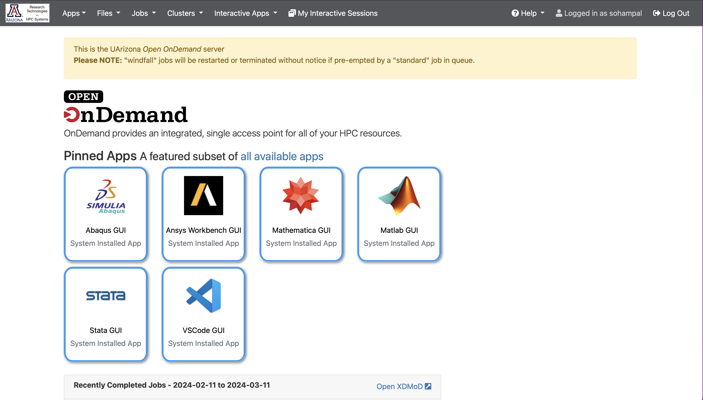
2. Select **Interactive Apps**, and then from the drop-down menu select **Jupyter Notebook**.

3. Fill in the details in the form that opens up (1), and select **Launch**.
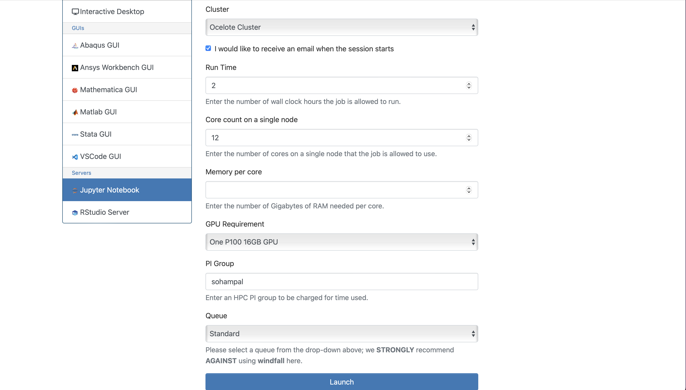
4. After the session becomes available, select **Connect to Jupyter** (2).
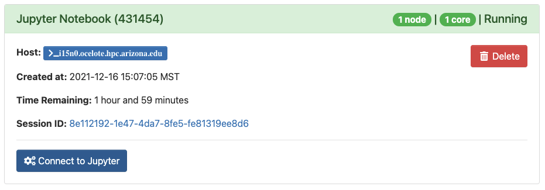
5. Once you are in the Jupyter dashboard, create a notebook with the kernel you had installed.
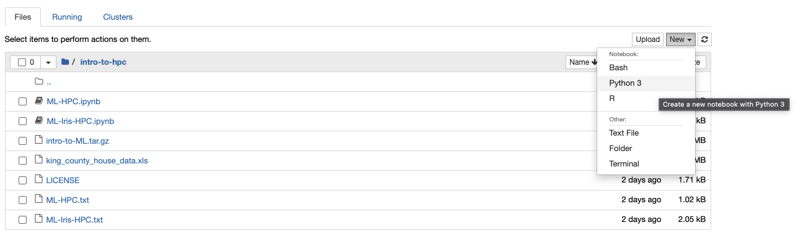
</div>

1. Use your PI's group's name for the *PI Group* field. You can find out your PI's group's name by running `va` in a terminal session.
2. After you select **Launch** in the previous step, OOD will take you to a page with a tile that shows your pending job. When it's first submitted, its status will show as **Queued**. Once it starts, it's status will change to **Running** and you'll see the **Connect to Jupyter** link. 

## Examples

### 🍄 Classification

<center><a class="md-button" href="files/fungi-classification.ipynb">Click here to download Jupyter notebook</a></center>

In this example we will identify fungi species by their images. We will use a subset of the [Danish Fungi 2020](https://sites.google.com/view/danish-fungi-dataset/home) dataset.

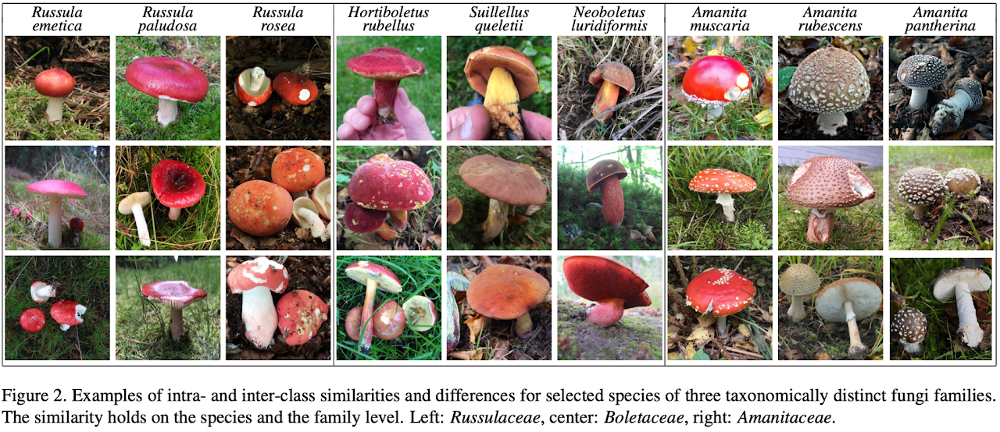

#### Accessing the data

The local dataset is at `/contrib/datasets/workshops/DF20M-4.tar.gz`. You can access from an interactive session. It consists of the four species with the most images in the DF20-Mini dataset. Copy it to your working directory (1), and untar it.
{ .annotate }

1. under your home directory, or your PI's `/groups` or `/xdisk` share

From an interactive session, run the following:
``` bash
cd <working-dir>
cp /contrib/datasets/workshops/DF20M-4.tar.gz ./
tar xvf DF20M-4.tar.gz
```

#### Visualize the data

A sample of the local dataset will look different from the image above because it only contains a subset of the species. Visualizing the data will help us to decide which model to use, and how to train it. 

``` python
from pathlib import path
from itertools import islice

def _ls(p, n=None): return list(islice(p.iterdir(), n)) # (1)!

p = Path("/xdisk/sohampal/sohampal/fungi/DF20M-4/") # (2)!
_ls(p)
```

1. Helper function to list the contents of a directory. Why do we need `n`?
2. Replace this with the path to where you downloaded the data.

```
[PosixPath('/xdisk/sohampal/sohampal/fungi/DF20M-4/train'),
 PosixPath('/xdisk/sohampal/sohampal/fungi/DF20M-4/DF20M-4.tar'),
 PosixPath('/xdisk/sohampal/sohampal/fungi/DF20M-4/test')]
```

There are two directories in the dataset, `train` and `test`: 

- `train` contains images for training your model
- `test` contains images for testing how well your model has learned

We can use `_ls()` to probe the contents of `train`, `test`, and their subdirectories.

``` python
_ls(p / "train")
```

```
[PosixPath('/xdisk/sohampal/sohampal/fungi/DF20M-4/train/Mycena galericulata'),
 PosixPath('/xdisk/sohampal/sohampal/fungi/DF20M-4/train/Boletus edulis'),
 PosixPath('/xdisk/sohampal/sohampal/fungi/DF20M-4/train/Amanita muscaria'),
 PosixPath('/xdisk/sohampal/sohampal/fungi/DF20M-4/train/Clitocybe nebularis')]
```

``` python
_ls(p / "test")
```

```
[PosixPath('/xdisk/sohampal/sohampal/fungi/DF20M-4/test/Mycena galericulata'),
 PosixPath('/xdisk/sohampal/sohampal/fungi/DF20M-4/test/Boletus edulis'),
 PosixPath('/xdisk/sohampal/sohampal/fungi/DF20M-4/test/Amanita muscaria'),
 PosixPath('/xdisk/sohampal/sohampal/fungi/DF20M-4/test/Clitocybe nebularis')]
```

``` python
_ls(p / "test" / "Mycena galericulata", 4) # (1)!
```

1. Change the number to something else, and see what you get.

```
[PosixPath('/xdisk/sohampal/sohampal/fungi/DF20M-4/test/Mycena galericulata/2238582384-112591.JPG'),
 PosixPath('/xdisk/sohampal/sohampal/fungi/DF20M-4/test/Mycena galericulata/2427873332-344961.JPG'),
 PosixPath('/xdisk/sohampal/sohampal/fungi/DF20M-4/test/Mycena galericulata/2238559251-255760.JPG'),
 PosixPath('/xdisk/sohampal/sohampal/fungi/DF20M-4/test/Mycena galericulata/2238471930-167014.JPG')]
``` 

The subdirectories of `train` and `test` tell us the name of the species. For example, all the training images corresponding to  *Boletus edulis* are grouped under the subdirectory `Boletus edulis`.

``` python
{d.name: len(_ls(d)) for d in _ls(p / "train")} 
```

```
{'Mycena galericulata': 1099,
 'Boletus edulis': 811,
 'Amanita muscaria': 863,
 'Clitocybe nebularis': 1003}
```

The dataset is fairly balanced:

- *Mycena galericulata* and *Clitocybe nebularis* have similar number of training images
- *Boletus edulis* and *Amanita muscaria* have similar number of training images (around 80% of the other two)

It is usually much easier to train models with balanced datasets. For unbalanced datasets you might have to adopt smarter training processes to counter the bias in the datasets.

```python
from PIL import Image
import matplotlib.pyplot as plt
%matplotlib inline

def show_images(p, ncols=8):
    fig, axes = plt.subplots(1, ncols, figsize=(20, 2))
    imgs = p.iterdir()
    for i, ax in enumerate(axes):
        img = next(imgs)
        ax.imshow(Image.open(img))
        ax.axes.get_xaxis().set_ticks([])
        ax.axes.get_yaxis().set_ticks([])
    fig.suptitle(p.name)

for d in _ls((p / "train")): show_images(d)
```

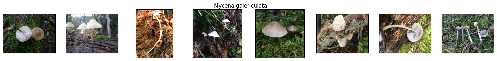


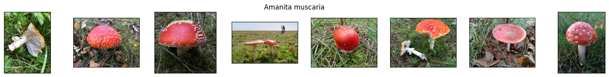

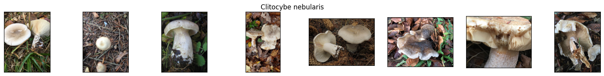

The images are of different shapes, this will be important when you train a model. 

#### Simpler problem: binary classification

In the image samples above, we see that *Boletus edulis* and *Amanita muscaria* look drastically different from each other (they also have similar number of images). As a simpler problem, we will train a model to classify these two fungi species.

We will create a subdirectory called `binary` and copy the `train` and `test` images for the two species to it. This is not strictly necessary, but it will be easier to use the `fastai` dataloaders in this way.

You can copy the images using either [shell tools](../../../cheat_sheet/index.md) from a terminal, or by running the following Python code from Jupyter.

``` python
import shutil

def copy_images(partition):
    for fungi in ("Boletus edulis", "Amanita muscaria"):
        (p / "binary" / partition / fungi).mkdir(parents=True, exist_ok=True)
        for img in (p / partition / fungi).iterdir():
            shutil.copy2(img, p / "binary" / partition / fungi)

copy_images("train")
copy_images("test")
```

Check that all the data has been copied correctly.

``` python
{d.name: len(_ls(d)) for d in _ls(p / "binary" / "train")}
```

```
{'Boletus edulis': 811, 'Amanita muscaria': 863}
```

```python
{d.name: len(_ls(d)) for d in _ls(p / "binary" / "test")}
```

```
{'Boletus edulis': 90, 'Amanita muscaria': 96}
```
The `fastai` package provides a `DataBlock` class to easily load the data to the model.

``` python
from fastai.data.all import *
from fastai.vision.all import *

dblock = DataBlock(blocks = (ImageBlock, CategoryBlock),
                   get_items = get_image_files,
                   get_y = parent_label,
                   splitter = RandomSplitter(),
                   item_tfms = Resize(224))
```

It is useful to understand the different arguments used when instantiating the `DataBlock` class:

- `blocks = (ImageBlock, CategoryBlock)`: Every instance of data consists of an image and a corresponding category (species name)
- `get_items = get_image_files`: Uses the `get_image_files` function from `fastai` to load the image files
- `get_y = parent_label`: Uses the `parent_label` function from `fastai` to get the corresponding categories (in this case the name of the parent directory)
- `splitter = RandomSplitter()`: Randomly splits the data in to a train set and a validation set
- `item_tfms = Resize(224)`: Resizes all images to a size of 224 pixels x 224 pixels

`dblock`  does not actually know where the images are. We can create a `Datasets` object from `dblock` which knows where the images are. Think of it as applying `dblock` to each of the images under `binary/train`.

``` python
dsets = dblock.datasets(p / "binary" / "train")
```

By default, `RandomSplitter` does a 80:20 split, i.e. 80% of the data under is used for training, and 20% for validation.

``` python
len(dsets.train), len(dsets.valid)
```

```
(1340, 334)
```

After training the model, we can test it with the images under `binary/test`. The model has never seen the images under `binary/test` during the training process, and thus this is a good way to test the generalization of the model. Sometimes, when we don't have a lot of data, we only split the data into a train set and a validation set.

It is useful to see how `Datasets` internally represents the data.

``` python
dsets.train[0], dsets.valid[0]
```

```
((PILImage mode=RGB size=1126x1000, TensorCategory(0)),
 (PILImage mode=RGB size=3024x4032, TensorCategory(1)))
```

It records the type of input, colored images, along with their original sizes. But more importantly, it automatically transforms the categories *Boletus edulis* and *Amanita muscaria* to 1 and 0, respectively. (1)
{ .annotate }

1. The `vocab` attribute of the `Datasets` object will tell you which category is mapped to which number. Try running `dsets.vocab`, the list index of a species is the number it has been mapped to.

We can use `dsets` to load the data to a model. However, it is best to load the images to a model in small batches (mini-batch). We will create a `DataLoaders` object which can load the images in small batches (default size is 64). (1)
{ .annotate }

1. You do not need to create a `Datasets` object to create a `DataLoaders` object. `dsets` was just for demonstrating some of the internals of `fastai`. Think of `DataLoaders` as `Datasets` but with a batch size.

``` python
dls = dblock.dataloaders(p / "binary" / "train")
dls.show_batch(max=9)
```

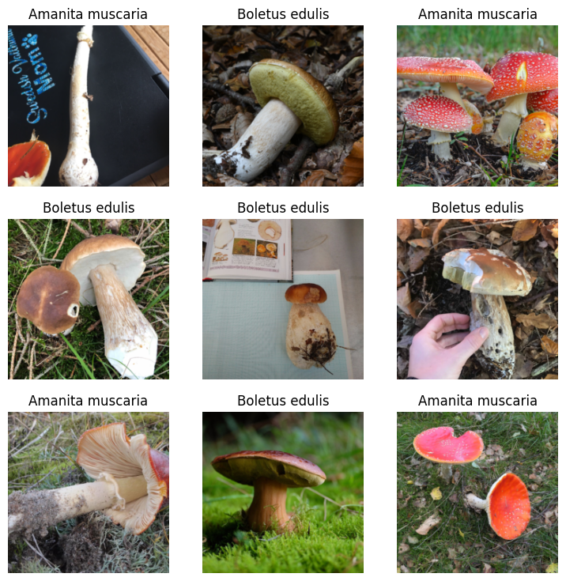

Now it is the time to train a model. You can build and train a deep learning model from scratch. An alternative is to fine-tune a pre-trained model. Fine-tuning is essentially taking advantage of past training, usually training done by the community, or some corporate. Instead of starting with a model with random parameters, you now start with a model that knows something. Generally fine-tuning a pre-trained model takes less time and data than training a model from scratch.

For an image classification you should a choose a model that has been trained on some large image dataset. One such model is Resnet-34 from [Deep Residual Learning for Image Recognition](https://arxiv.org/abs/1512.03385), trained on the ImageNet dataset. See [Which image models are best? ](https://www.kaggle.com/code/jhoward/which-image-models-are-best) for a catalog of such models. `fastai` provides a `vision_learner` object for easy training or fine-tuning image models.

``` python
learn = vision_learner(dls, resnet34, metrics=error_rate)
```

The `lr_find` method helps to choose a suitable learning rate. 

``` python
learn.lr_find()
```

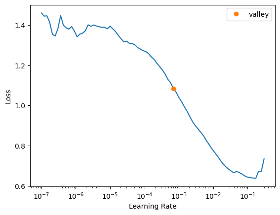

Any learning around, preferably larger, the valley (orange point) will be suitable for fine-tuning Resnet-34 to the binary dataset. Fine-tune the model for 3 epochs. (1)
{ .annotate }

1. A good exercise to change the number of epochs, and see how that affects the model's learning. 

``` python
learn.fine_tune(3, 2e-3)
```

```
epoch 	train_loss 	valid_loss 	error_rate 	time
    0 	0.605542 	0.055386 	0.017964 	01:21

epoch 	train_loss 	valid_loss 	error_rate 	time
    0 	0.139088 	0.088573 	0.032934 	01:21
    1 	0.088828 	0.051099 	0.020958 	01:21
    2 	0.061853 	0.035076 	0.008982 	01:22
```

We can use the `show_results` method of the `vision_learner` class to get a more visual sense of the quality of the learning. A better method is to use an `Interpretation` object. With an `Interpretation` object we can plot a confusion matrix, or print a overall performance report.

``` python
interp = ClassificationInterpretation.from_learner(learn) 
interp.plot_top_losses(9, figsize=(15, 11))
```

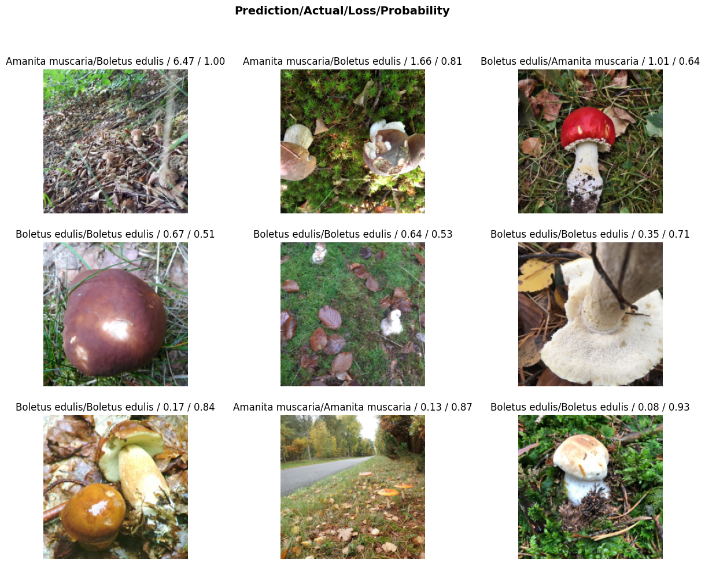

``` python
interp.plot_confusion_matrix()
```

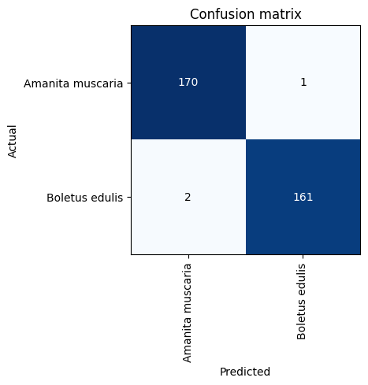

``` python
interp.print_classification_report()
```
```
                  precision    recall  f1-score   support

Amanita muscaria       1.00      0.98      0.99        96
  Boletus edulis       0.98      1.00      0.99        90

        accuracy                           0.99       186
       macro avg       0.99      0.99      0.99       186
    weighted avg       0.99      0.99      0.99       186
```

The confusion matrix and the classification report show how well the trained model performs on the validation set. Both the confusion matrix and the classification report give us the same information, we can explicitly calculate the metrics in the classification report from the confusion matrix. Choose whichever one that conveys the information better.

We can also do the same with the test set (`binary/test`), which the model didn't see during training.

``` python
test_files = get_image_files(p / "binary" / "test") 
test_dl = dls.test_dl(test_files, with_labels=True) # (1)!
```

1. This creates a test dataloader using the same transformations used to create the dataloader for the validation set.

``` python
preds = learn.get_preds(dl=test_dl)
for index, item in enumerate(preds[0]): 
    prediction = dls.categorize.decode(torch.argmax(item)) 
    confidence = max(item) 
    percent = float(confidence) 
    print(f"Prediction: {prediction:18} - Confidence: {percent:.2%} - Image: {test_dl.items[index].name}")
```

```
...
Prediction: Boletus edulis     - Confidence: 100.00% - Image: 2238481466-242195.JPG
Prediction: Boletus edulis     - Confidence: 100.00% - Image: 2864902315-212162.JPG
Prediction: Boletus edulis     - Confidence: 98.13% - Image: 2860312323-62558.JPG
Prediction: Boletus edulis     - Confidence: 99.98% - Image: 2413150418-44022.JPG
Prediction: Boletus edulis     - Confidence: 98.77% - Image: 2860298436-285200.JPG
Prediction: Boletus edulis     - Confidence: 96.30% - Image: 2856920321-284750.JPG
Prediction: Amanita muscaria   - Confidence: 100.00% - Image: 2238561790-182394.JPG
Prediction: Amanita muscaria   - Confidence: 74.62% - Image: 2874318440-215186.JPG
Prediction: Amanita muscaria   - Confidence: 99.99% - Image: 2898623358-68526.JPG
Prediction: Amanita muscaria   - Confidence: 99.81% - Image: 2864909415-212510.JPG
Prediction: Amanita muscaria   - Confidence: 100.00% - Image: 2430667070-196992.JPG
Prediction: Amanita muscaria   - Confidence: 100.00% - Image: 2238525200-175134.JPG
...
```

``` python
interp = ClassificationInterpretation.from_learner(learn, dl=test_dl)
interp.plot_confusion_matrix()
```

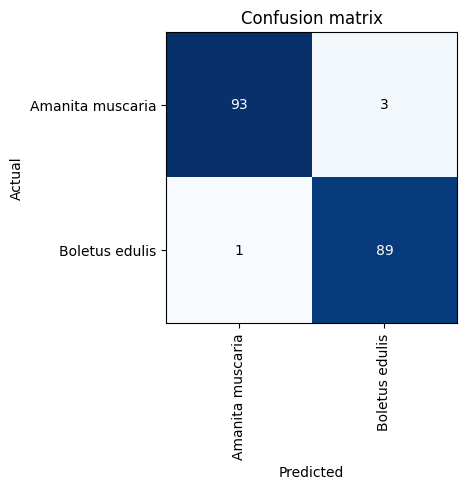

#### Multi-class classification

The code for the multi-class classification can be exactly the same as for the binary classification. Just for experimentation and demonstration, we will try something little different. Instead of a train/validation/test split, try a train/validation split - all images under `train` used for training, and all images under `test` used for validation, with no separate test set. The `GrandparentSplitter` from `fastai` is useful for this arrangement.

``` python
dblock = DataBlock(blocks = (ImageBlock, CategoryBlock),
                   get_items = get_image_files,
                   get_y = parent_label,
                   splitter = GrandparentSplitter(train_name="train", valid_name="test"),
                   item_tfms = Resize(224))
                   
dls = dblock.dataloaders(p)
dls.show_batch()
```

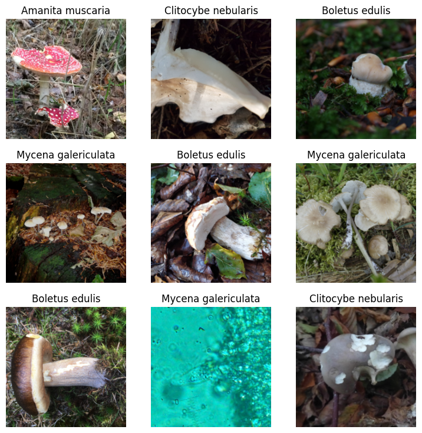

``` python
learn = vision_learner(dls, resnet34, metrics=error_rate)
learn.lr_find()
```

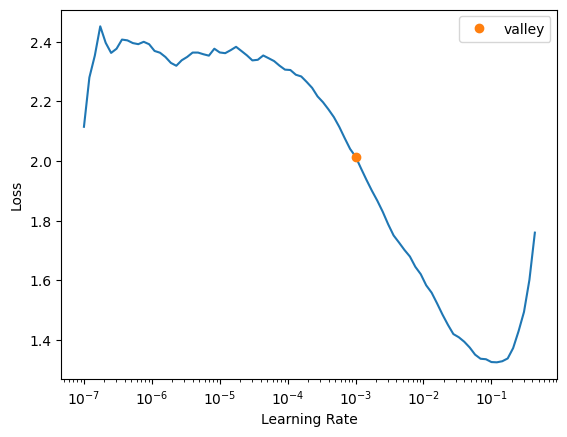

```python
learn.fine_tune(5, 2e-3)
```
```
epoch 	train_loss 	valid_loss 	error_rate 	time
    0 	0.660746 	0.330275 	0.102310 	04:38

epoch 	train_loss 	valid_loss 	error_rate 	time
    0 	0.239338 	0.225458 	0.077558 	04:31
    1 	0.141983 	0.287751 	0.080858 	04:33
    2 	0.072769 	0.190867 	0.049505 	04:30
    3 	0.029050 	0.197074 	0.049505 	04:28
    4 	0.015718 	0.200661 	0.049505 	04:39
```

```python
interp = ClassificationInterpretation.from_learner(learn)
interp.plot_confusion_matrix()
```
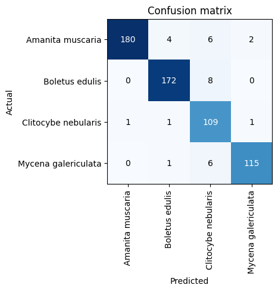

### Clustering 🐧

<center><a class="md-button" href="files/penguins-clustering.ipynb">Click here to download Jupyter notebook</a></center>

In this example we will cluster penguins into groups based on their bill features. We will use the [Palmer penguins](https://allisonhorst.github.io/palmerpenguins/articles/intro.html) dataset.


<cite>Artwork by [@allison_horst](https://twitter.com/allison_horst)</cite>

#### Accessing the data

There is a Python package `palmerpenguins` that provides the data, along with some other goodies. However for the purposes of this example you can simply download the [penguins.csv](https://raw.githubusercontent.com/mcnakhaee/palmerpenguins/master/palmerpenguins/data/penguins.csv) from the Github repo of the package.

#### Visualizing the data

``` python
import pandas as pd
import matplotlib.pyplot as plt
from matplotlib import colormaps

penguins = pd.read_csv("penguins.csv") # (1)!
penguins.head()
```

1. Replace this with the full path to the `penguins.csv` file if the file and the notebook are not in the same directory.

```
 	species 	   island 	bill_length_mm 	bill_depth_mm 	flipper_length_mm 	body_mass_g 	sex 	year
0 	 Adelie 	Torgersen 	          39.1 	         18.7 	            181.0 	     3750.0    male 	2007
1 	 Adelie 	Torgersen 	          39.5 	         17.4 	            186.0 	     3800.0  female 	2007
2 	 Adelie 	Torgersen 	          40.3 	         18.0 	            195.0 	     3250.0  female 	2007
3 	 Adelie 	Torgersen 	           NaN 	          NaN 	              NaN 	        NaN 	NaN 	2007
4 	 Adelie 	Torgersen 	          36.7 	         19.3 	            193.0 	     3450.0  female 	2007
```

The dataset list the species of each penguin, which island in Palmer archipelago and which year they were observed in, and some physical features. Complete data for all penguins are not available, missing values are indicated by `NaN`.

``` python
penguins["species"].unique()
```
```
array(['Adelie', 'Gentoo', 'Chinstrap'], dtype=object)
```

There are three unique species of penguins in the dataset. It might be tempting to think that there are three clusters in the dataset - one for each species. However, that need not be the case. Even if there are three clusters, they might not necessarily overlap with any species. Whether the clusters correspond to species will depend on the variance in intra-species differences and the variance in inter-species differences.

``` python
pd.plotting.scatter_matrix(penguins, columns=["bill_length_mm", "bill_depth_mm", "flipper_length_mm", "body_mass_g"], figsize=(8, 8))
```

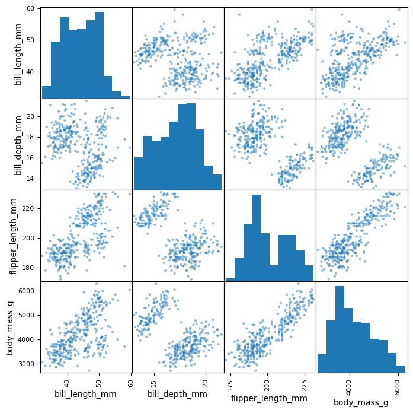

The figure above shows that only when we plot `bill_length_mm` vs `bill_depth_mm`, or `bill_length_mm` vs `flipper_length_mm` we see more than two clusters. This does not mean that there are not more that two clusters. It just means that in *two-dimensions* these are the only two cases where we see hints of more two clusters.

#### Mean shift clustering

{==Clustering is an unsupervised machine learning process==}, we do not provide any labels when we train the model. This is unlike the previous case of image classification, where we provided the labels (the species that image belonged to). What this means is that a clustering model will not be able to tell if a particular cluster corresponds to a penguin species (or any other suitable label depending on the problem), but it will show the clusters that are there in the dataset.

In mean shift clustering, candidates for centroids are updated to be the mean of the points within a given region. Each observation belongs to the cluster with the nearest mean. See [Mean shift: a robust approach toward feature space analysis](https://ieeexplore.ieee.org/document/1000236) for more information on mean shift clustering.

Here is a naive implementation of mean shift clustering. Mean shift clustering depends on a kernel function, which takes in one hyperparameter called bandwidth. In this implemetation, we use the Gaussian kernel: 

\[
g(x) = \frac{1}{\sigma\sqrt{2\pi}}\exp\left(-\frac{1}{2}\frac{(x - \mu)^2}{\sigma^2}\right).
\]

For the Gaussian kernel, the bandwidth is the same as the standard deviation.

``` python
import torch

def gaussian(x, mu, sigma):
    return torch.exp(-0.5 * ((x - mu) / sigma) ** 2) / (
        sigma * torch.sqrt(torch.tensor(2 * torch.pi))
    )
    
def meanshift(data, bw, bs=None, epochs=10):
    X = data.clone()
    n = len(data)
    if bs is None or bs > n:
        bs = n
    for _ in range(epochs):
        for i in range(0, n, bs):
            dist = torch.cdist(X[i : min(i + bs, n)], X)
            weights = gaussian(dist, 0, bw)
            X[i : min(i + bs, n)] = (weights @ X) / weights.sum(1, keepdim=True)
    return X
```

In this workshop we will look at a two-dimensional case, as it is easier to visualize. We will pick two physical features of the penguins, and see if we can identify the clusters in that two-dimensional data. (1)
{ .annotate }

1. A good exercise will be to try a multidimensional case, by considering more than two physical features of the penguins.

``` python
data = penguins[["bill_length_mm", "bill_depth_mm"]]
data = data.dropna() # (1)
```

1. We need to remove the missing values.

Since the mean shift implementation above is with PyTorch, we have to convert the data to PyTorch tensors. This also gives us the opportunity to use GPUs, if available.

``` python
data = torch.tensor(data.values)
if torch.cuda.is_available(): data = data.cuda()
```

``` python
centroids = meanshift(data, 1.5, 10).cpu() # (1)!
```

1. Try a different value, than 1.5, for the bandwidth, and see how that affects the results.

``` python
fig, ax = plt.subplots()
ax.scatter(data = penguins, x = "bill_length_mm", y = "bill_depth_mm")
ax.set_xlabel("bill_length_mm")
ax.set_ylabel("bill_depth_mm")
ax.scatter(centroids[:, 0], centroids[:, 1], marker="x", color="red")
```

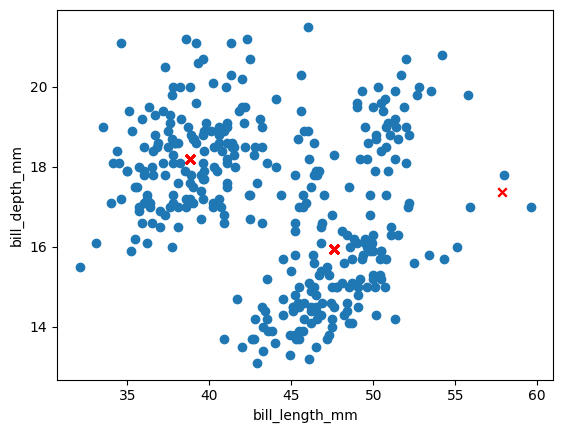

The algorithm gives the centroids for three clusters, but not necessarily in the positions that you would expect them. A good exercise will be to check the scikit-learn implementation of mean shift clustering, and see if the naive implementation above can be improved.
