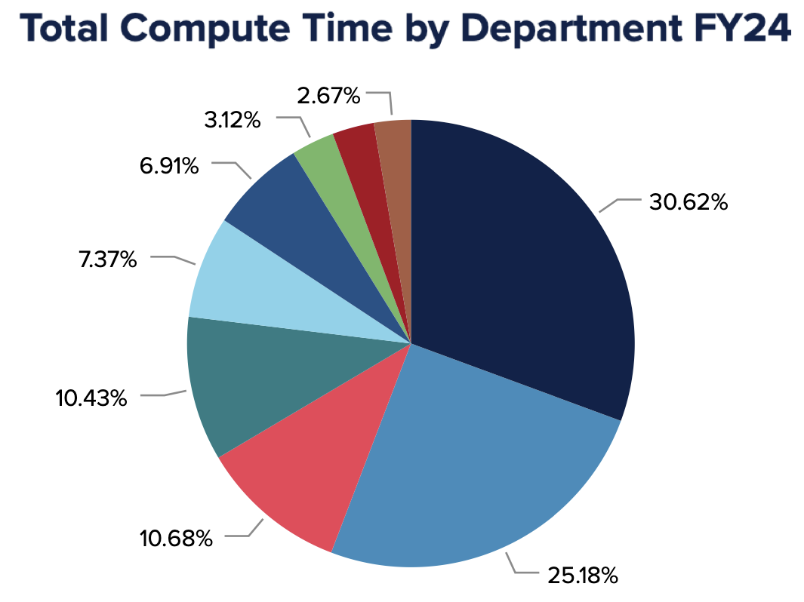
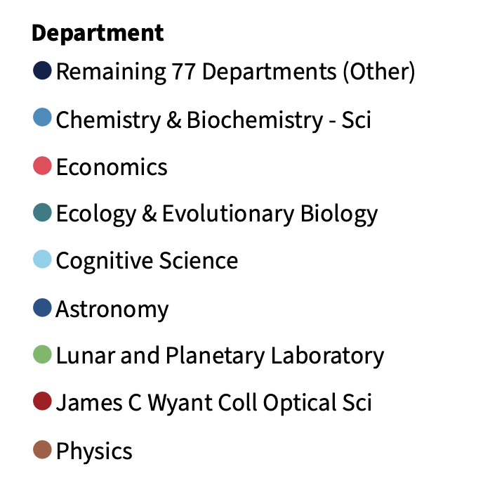
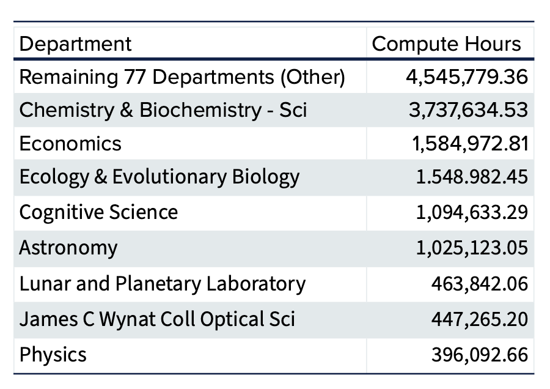
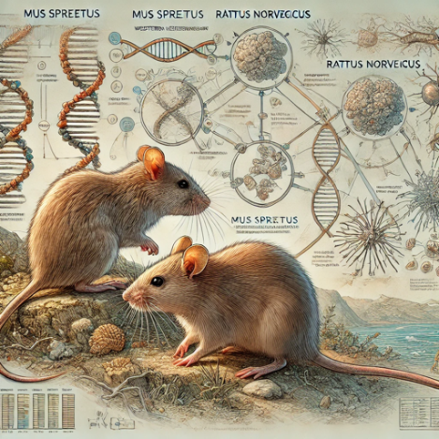
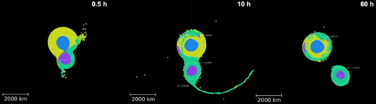
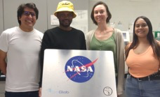
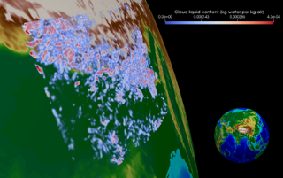
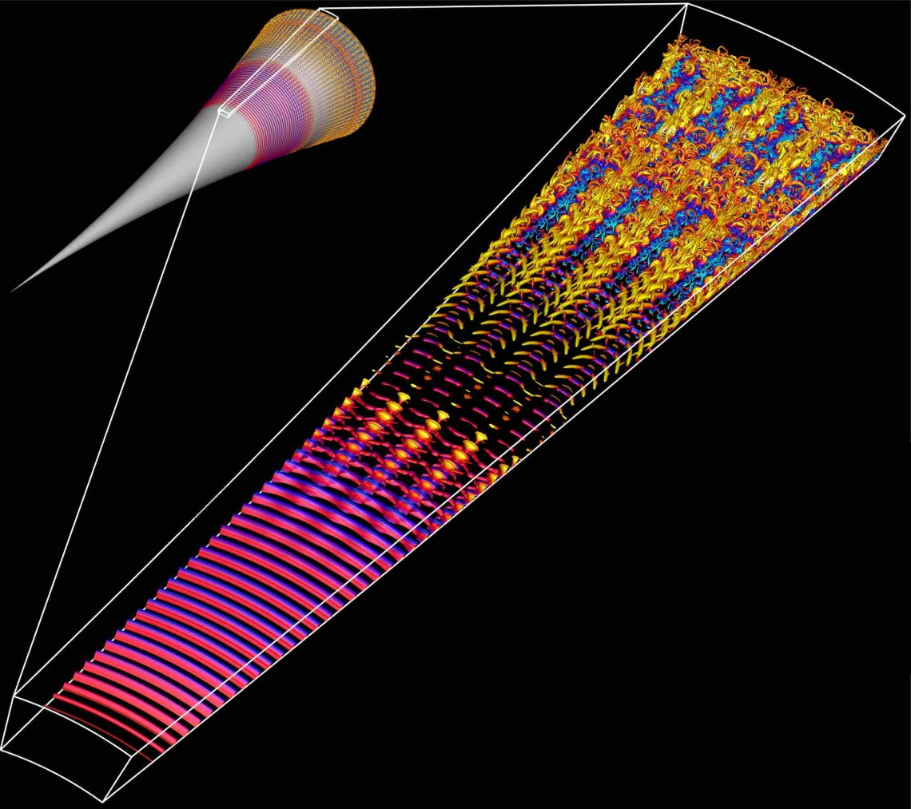

# Welcome to the UArizona HPC Documentation Site
<link rel="stylesheet" href="assets/stylesheets/images.css">

???+ warning "HPC Downtime Jan 4-6"

    HPC systems will be unavailable from 6pm on January 4th until power maintenance is completed on January 6th. An all-clear will be sent once the HPC systems are operational upon completion of the scheduled building work.

    **Jobs submitted prior to January 4th whose run times overlap with this period will be held until servives are restored.**

## Introduction

The University of Arizona offers High Performance Computing (HPC) resources in the Research Data Center (RDC), a state-of-the-art facility that hosts our large computer clusters. HPC services are available at no cost to researchers. Each faculty member is eligible for a free standard allocation of [CPU time](./resources/allocations/) and [storage space](./storage_and_transfers/storage/overview/). 

This documentation site provides technical details relevant to using our HPC system. Whether you are just starting your journey into computational sciences or are a seasoned programmer, we hope you will find something useful in these pages. This site is managed by the HPC Consult team. Please [contact us](./support_and_training/consulting_services/) if you have questions or comments about the content of this site.

## Featured Links

  
  <a href="./registration_and_access/account_creation/"> Account Creation</a>

If you are an active UArizona affiliate (e.g. student, post-doc, faculty), you can register an account. If you are not affiliated with UArizona but are working with collaborators here, you can register as a <a href="https://it.arizona.edu/service/designated-campus-colleague-accounts">Designated Campus Colleague</a> (DCC). 

  
  <a href="./quick_start/overview/">HPC Quick Start</a>

If you are new to the UArizona HPC, or to HPC in general, our self-guided quick start tutorial will provide a solid foundation for using our system.

  
  <a href="./support_and_training/consulting_services/"> Getting Help</a> | <a href="./support_and_training/faqs/">FAQs</a>

 Find out how to contact the HPC Consult team, or view our FAQs, glossary, cheat sheets, and more! 

  
  <a href="./events/calendar/"> Events Calendar</a> | <a href="./events/workshop_materials/"> Workshop Materials</a>

Every semester we host training sessions on topics including intro to HPC, machine learning, parallel computing, and beyond. Click the link above to see our workshop schedule, our old training materials, and find more workshops from around campus. 

## System Highlights 2024

[Download Full Report](./assets/pdfs/HPC%20FY24%20Metrics.pdf){ .md-button .md-button--primary }

Over the past four years, Puma has been a vital resource for researchers at the University of Arizona. In fiscal year 2024, our systems supported over 300 million compute hours enabling diverse research spanning climate modeling, genomics, neuroimaging, and more. With more than 80 active departments, 500 principal investigators, and 1,500 users, Puma continues to advance discovery and innovation.

Researchers rely on our HPC resources not only for computational power, but also for expert support. This past year, we assisted users with nearly 2000 support requests. Explore highlights from this year, including testimonials from researchers and key statistics by downloading the full annual report.

## Highlighted Research

=== "Ten Millionth Job"

    

    Puma has been a tremendous resource for our research community. Just recently it processed the 10 millionth job since we provisioned it in 2020. Just to get a perspective on that, if you took one step for each job you could walk to Niagara Falls. And back.

    David Castellano, a member of Dr. Ryan Gutenkunst's team, was the researcher who achieved this milestone. They study the evolutionary processes that generated the complex networks that comprise life. Dr. Gutenkunst told us that David’s been maximizing his chances to hit this milestone with all the jobs he’s been running.

    David says about his work: “Understanding the relationship between DNA mutation rates and fitness effects is central to evolutionary biology. My work is investigating this relationship in three species: Homo sapiens, Mus musculus, and Arabidopsis thaliana. The inference of fitness effects from population genomics data requires intensive computation which could not be possible without a High Performance Computing service.”

    The software used in their research is called  ‘dadi’: Diffusion Approximations for Demographic Inference. This work on three species with 96 mutation types and 1000 bootstrap replicates equates to 288,000 compute jobs.

=== "Planetary History"
    
    **Reconstructing the History of the Solar System Using HPC**

    

    Erik Asphaug’s Planetary Formation Lab in the Lunar and Planetary Laboratory uses smoothed-particle hydrodynamics (SPH) simulations to explore how collisions between bodies in the Solar System shape its evolution through time. These three-dimensional simulations, which approximate planetary bodies as collections of particles, incorporate realistic geologic properties to track their structural and thermal changes during and after giant impacts. 
    From Eric: “The access to increased time allocations as well as large volumes of temporary storage on xdisk provided by the HPC has revolutionized our ability to run our most complex simulations at high resolution, with enough space and time to explore the full parameter space necessary to make key discoveries that inform our understanding of Solar System evolution.”

    One of their major projects has occupied a large fraction of their HPC hours and storage: the capture of Pluto’s moon, Charon, from a giant impact early in the Solar System’s history.
    High resolution is also critical to track detailed interactions between Pluto and Charon, including any material transferred between them. Without the HPC and the allocation of computation time and storage space, they would not have been able to run the hundreds of models necessary to successfully reproduce systems that look similar to Pluto and Charon today. The models have revealed new insights about how bodies like Pluto capture satellites: the dwarf planet and its proto-satellite collide, briefly merge, and then re-separate as Charon slow begins to move outward. They call this new process, which significantly redefines our understanding of giant collisions, “kiss and capture.” An example kiss-and-capture is shown in the image above. The simulation shown covers 60 hours of model time, which takes ~1.5 months on the HPC. The ability to run such long simulations in parallel was crucial to completing this work. 

    [Read more about the full story here!](https://news.arizona.edu/news/how-pluto-got-its-heart)

=== "Cloud Research"
    
    Sylvia Sullivan is an Assistant Professor in Chemical and Environmental Engineering who performs atmospherically related research and has a joint appointment to the Department of Hydrology and Atmospheric Sciences. Her academic background is in chemical engineering, but she has picked up atmospheric science and computing skills along the way to model and understand cloud and storm systems. “I really liked environmental work because I felt it was very impactful,” she says.  Her research includes investigating cloud ice formation. From a chemical engineering perspective, you can think about clouds as a control volume, flows in and out and phase changes occurring inside. Along with this more technical view, Sylvia says she “fell in love with clouds because they are very beautiful and poetic”. This blend of fields brought her to the University of Arizona as it is one of the only Universities where Chemical and Environmental Engineering are in the same department. And besides, “Tucson is a wonderful location”.

    
    She is building a research group to study the impact of ice clouds, particularly their energetic and precipitation effects. Sylvia’s group runs very high-resolution simulations called storm resolving simulations, where the meshes are fine enough to represent individual storms. In global climate models, the mesh has a resolution on the order of 100 km, in which several storm cells can form simultaneously. These storm-resolving computations are very expensive and produce terabytes of data, which then need to be post-processed and visualized. Currently, Sylvia and her group are very focused on working with other visualization experts on campus to illustrate the structures and evolution of clouds and storm systems.

=== "Hypersonic Flow"
    
    **Faster Speeds Need Faster Computation**

    

    Professors Christoph Hader, Hermann Fasel, and their team are exploring the use of our GPUs to optimize Navier-Stokes codes for simulating the flow field around hypersonic vehicles traveling at size times the speed of sound (Mach 6) or more.

    In the image to the right, instantaneous flow structures obtained from a DNS for a flared cone at Mach 6 are visualized using the Q-isocontours colored with instantaneous temperature disturbance values. The small scales towards the end of the computational domain indicate the regions where the boundary layer is turbulent. 

## Available Resources

??? info "Our Clusters (click to expand)"

    === "Puma"
        
        Implemented in the middle of 2020, Puma is the biggest cat yet. Similar to Ocelote, it has standard CPU nodes (with 94 cores and 512 GB of memory per node), GPU nodes (with Nvidia V100) and two high-memory nodes (3 TB). Local scratch storage increased to ~1.4 TB. Puma runs on Rocky Linux 9.

        As is the case for our other supercomputers, we use the RFP process to get the best value for our financial resources, that meet our technical requirements. This time Penguin Computing one with AMD processors. This is tremendously valuable as each node comes with:

        - Two AMD Zen2 48 core processors
        - 512GB RAM
        - 25Gb path to storage
        - 25Gb path to other nodes for MPI
        - 2TB internal NVME disk (largely available as /tmp)
        - Qumulo all flash storage array for shared filesystems
        - Two large memory nodes with 3TB memory and the same processors and memory as the other nodes
        - Six nodes with four Nvidia V100S GPU's each

    === "Ocelote"
        
        Ocelote arrived in 2016. Lenovo's Nextscale M5 technology was the winner of the RFP mainly on price, performance and meeting our specific requirements. Ocelote has one large memory node with 2TB of memory and 46 nodes with Nvidia P100 GPUs for GPU-accelerated workflows. This cluster is actually the next generation of the IBM cluster we call El Gato. Lenovo purchased IBM's Intel server line in 2015.

        In 2021, Ocelote's operating system was upgraded from CentOS6 to CentOS7 and was configured to use SLURM, like Puma. It will continue until it is either too expensive to maintain or it is replaced by something else.
            - Intel Haswell V3 28 core processors
            - 192GB RAM per node
            - FDR infiniband for fast MPI interconnect
            - Qumulo all flash storage array (all HPC storage is integrated into one array)
            - One large memory node with 2TB RAM, Intel Ivy Bridge V2 48 cores
            - 46 nodes with Nvidia P100 GPU's

    === "El Gato"
        
        Implemented at the start of 2014, El Gato has been reprovisioned with CentOS 7 and new compilers and libraries. From July 2021 it has been using Slurm for job submission. El Gato is our smallest cluster with 130 standard nodes each with 16 CPUs. Purchased by an NSF MRI grant by researchers in Astronomy and SISTA.

<h3><svg xmlns="http://www.w3.org/2000/svg" viewBox="0 0 512 512" width="18" height="18"><!--!Font Awesome Free 6.5.1 by @fontawesome - https://fontawesome.com License - https://fontawesome.com/license/free Copyright 2024 Fonticons, Inc.--><path d="M64 32C28.7 32 0 60.7 0 96v64c0 35.3 28.7 64 64 64H448c35.3 0 64-28.7 64-64V96c0-35.3-28.7-64-64-64H64zm280 72a24 24 0 1 1 0 48 24 24 0 1 1 0-48zm48 24a24 24 0 1 1 48 0 24 24 0 1 1 -48 0zM64 288c-35.3 0-64 28.7-64 64v64c0 35.3 28.7 64 64 64H448c35.3 0 64-28.7 64-64V352c0-35.3-28.7-64-64-64H64zm280 72a24 24 0 1 1 0 48 24 24 0 1 1 0-48zm56 24a24 24 0 1 1 48 0 24 24 0 1 1 -48 0z"/></svg> Compute</h3>

UArizona HPC systems are available to all university faculty, staff, undergraduate and graduate students, postdocs, and designated campus colleagues (DCCs) at no cost. Researchers have access to [compute resources on our three clusters](./resources/compute_resources/) Puma, Ocelote, and El Gato located in our data center. Presently each research group is provided with a [free standard monthly allocation](./resources/allocations/) on each: 100,000 CPU-hours on Puma, 70,000 CPU-hours on Ocelote, and 7,000 CPU-hours on El Gato.

<h3><svg xmlns="http://www.w3.org/2000/svg" viewBox="0 0 576 512" width="18" height="18"><!--!Font Awesome Free 6.5.1 by @fontawesome - https://fontawesome.com License - https://fontawesome.com/license/free Copyright 2024 Fonticons, Inc.--><path d="M0 112.5V422.3c0 18 10.1 35 27 41.3c87 32.5 174 10.3 261-11.9c79.8-20.3 159.6-40.7 239.3-18.9c23 6.3 48.7-9.5 48.7-33.4V89.7c0-18-10.1-35-27-41.3C462 15.9 375 38.1 288 60.3C208.2 80.6 128.4 100.9 48.7 79.1C25.6 72.8 0 88.6 0 112.5zM288 352c-44.2 0-80-43-80-96s35.8-96 80-96s80 43 80 96s-35.8 96-80 96zM64 352c35.3 0 64 28.7 64 64H64V352zm64-208c0 35.3-28.7 64-64 64V144h64zM512 304v64H448c0-35.3 28.7-64 64-64zM448 96h64v64c-35.3 0-64-28.7-64-64z"/></svg> Funding Sources</h3>
UArizona HPC systems are funded through the [UArizona Research Office (RII)](http://research.arizona.edu/) and CIO/UITS (Chief Information Officer, and University Information Technology Services). Staff is funded to administer the systems and provide [consulting services](./support_and_training/consulting_services/) (no charge) for all researchers.

<h3><svg xmlns="http://www.w3.org/2000/svg" viewBox="0 0 512 512" width="18" height="18"><!--!Font Awesome Free 6.5.1 by @fontawesome - https://fontawesome.com License - https://fontawesome.com/license/free Copyright 2024 Fonticons, Inc.--><path d="M336 352c97.2 0 176-78.8 176-176S433.2 0 336 0S160 78.8 160 176c0 18.7 2.9 36.8 8.3 53.7L7 391c-4.5 4.5-7 10.6-7 17v80c0 13.3 10.7 24 24 24h80c13.3 0 24-10.7 24-24V448h40c13.3 0 24-10.7 24-24V384h40c6.4 0 12.5-2.5 17-7l33.3-33.3c16.9 5.4 35 8.3 53.7 8.3zM376 96a40 40 0 1 1 0 80 40 40 0 1 1 0-80z"/></svg> Regulated Research</h3>

These resources specifically do not support Regulated Research, which might be ITAR, HIPAA or CUI (Controlled Unclassified Information). For more information on services that can support regulated research, see: [HIPAA support services](https://uarizona.service-now.com/sp?id=sc_cat_item&sys_id=32755b2d1bcb28107947edf1604bcbd1) and [CUI support services](https://uarizona.service-now.com/sp?id=sc_cat_item&sys_id=da15df6d1bcb28107947edf1604bcbeb).

## News

-   :material-update:{ .lg .middle } __Puma OS Update__

    ---

    As of January 29th, 2025, Puma’s operating system has been updated from CentOS 7 to Rocky Linux 9. Need help transitioning to the new operating system? Visit our [migration documentation](./resources/updates/) for detailed instructions.

-   :material-chair-school:{ .lg .middle } __Fall Semester Workshops__

    ---
    
    This Fall semester we are conducting the workshops in a different manner.  Rather than compress them into a week, there will be one each Friday at 11am.  We plan to use a hybrid modality – you can attend in person which provides greater opportunity to engage; or attend virtually by Zoom. In person sessions will be held in Weaver Science and Engineering Library Rm 212. There will be a recorded version made available on YouTube.

    
[Registration Form](https://docs.google.com/forms/d/e/1FAIpQLSeUV_zHbrPPJCp1qU0ztCuXa5EPuGUK06eLG1pXacfbQo3rCQ/viewform) :fontawesome-solid-hippo: [Calendar](./events/calendar/) 

-   :material-alert-decagram:{ .lg .middle } __July 2024 Maintenance__

    ---

    * [User portal](https://portal.hpc.arizona.edu) interface change for mobile compatibility. 
    * [Open OnDemand graphical jobs](./running_jobs/open_on_demand/#interactive-graphical-applications) limited to four days, reduced from 10 days. For workflows that need longer than four days, batch jobs can be used. [Contact our consultants](./support_and_training/consulting_services/) for help if you're unsure how to do this. 
    * New partitions have been introduced for GPU jobs. This will prevent non-GPU jobs from running on GPU nodes, improving availability. See [batch directives](./running_jobs/batch_jobs/batch_directives/#allocations-and-partitions) for more information on how to request GPU nodes. 

-   :material-expansion-card-variant:{ .lg .middle } __New Ocelote GPUs__

    ---

    We recently added 22 new P100 GPUs to Ocelote. Need to request multiple GPUs on a node and you're finding Puma queue times too slow? You can now request two GPUs per node on Ocelote using `--gres=gpu:2`. 

## Acknowledgements

Published research that utilized UArizona HPC resources should follow our [guidelines](./policies/acknowledgements/) on how to acknowledge us. 

If you wish for your research to be featured in our [Results](./results/) page, please [contact HPC consult](./support_and_training/consulting_services/) with news of the publication!

----

We respectfully acknowledge the University of Arizona is on the land and territories of Indigenous peoples. Today, Arizona is home to 22 federally recognized tribes, with Tucson being home to the O’odham and the Yaqui. Committed to diversity and inclusion, the University strives to build sustainable relationships with sovereign Native Nations and Indigenous communities through education offerings, partnerships, and community service.

