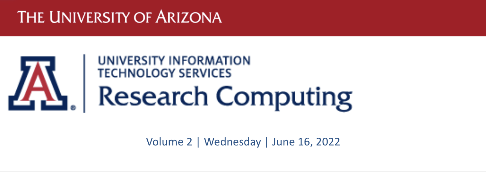
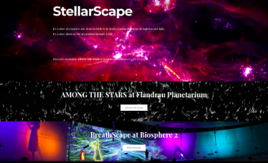

# Volume 2 - June 16, 2022

<link rel="stylesheet" href="../../assets/stylesheets/images.css">
<link rel="stylesheet" href="../../assets/stylesheets/newsletters.css">

    

    
    <h2 class="newsletter-heading">To our Research Computing Community:</h2>
    
The last quarter has been a busy one for Research Technologies. In addition to our normal services and support, we deployed a new cloud-based data storage service for research which is currently branded "Tier 2". This new Tier 2 service is intended to be a low-cost, semi-archival storage service to support research data at scale, and more details on this service are provided in this newsletter.

    
I do want to mention that we are beginning our pre-work towards developing an RFP for the next HPC cluster, which is scheduled to go-live in 2024. An important part of this process is faculty researcher engagement, especially engagement with the Research Computing Governance Committee (RCGC). We are looking for additional research faculty to be nominated (self-nomination is fine) to participate on RCGC and to help us as we vet requirements and specifics for the next HPC system. If you are interested in participating in RCGC, please <a title="Offering expired" style="font-weight: bold;">email me</a> stating your interest.

    
Finally, I want to recognize our Controlled and Regulated Research Services Team (Ryan Duitman, James Morales, Todd Merritt, James Campagna, and Will Stoltz) for their efforts that have led us to receive the first "Authorization to Operate" (ATIO) letter given out by the HIPAA Privacy Office. This important internal certification validates that our AWS-based compute/analysis environments are HIPAA compliant, and this authorization is good for 3 years. Congratulations team!

    

    

    

    <h2 class="newsletter-heading">Journey to the Stars</h2>
    
    
When you think of High Performance Computing you are probably not thinking of dance. Stellarscape is a collaboration between the UA Dance, Music, ISTA , Astronomy departments and our visualization consultant, Devin Bayly. This project is an immersive multimedia performance synthesizing music, science, visual art, and technology. The performance includes live musicians, electronic music, and dance, collaborating with interactive cinematography - fusing kinesthetic and acoustic sensing with cosmic simulation, in real time.

    

    

    

    <h2 class="newsletter-heading">Office Hours</h2>
    
Join us on Office Hours if you want to ask any questions about using the HPC resources.  It might be a bunch of getting started questions, or you might want to share your screen and show where you are getting hung up. We use Gather Town which is a nifty tool.

    
<b>Every Wednesday from 2pm to 4pm</b>, <a href="../../support_and_training/office_hours/" style="font-weight: bold;">information here</a>.

    

    

    <h2 class="newsletter-heading">Training Sessions</h2>
    
Each semester we conduct workshops to assist new and existing researchers with taking advantage of HPC resources. None of them have been scheduled yet, but they are all available to view offline.  In particular we encourage new users to watch or read Intro to HPC.

    
Fall Semester: Data Management Part 1

    
Learn about managing your data on UA's HPC cluster. Co-sponsored with University Libraries

    
Fall Semester: Data Management Part 

    
Tools and workflows for managing data on UA’s HPC cluster. Co-sponsored with University Libraries

    
<b>Introduction to HPC</b>: A video version and companion PDF are online

    
We recommend all new users attend the workshop or watch the video to help you get started on using HPC resources.

    
Machine Learning on HPC

    
These short workshops provides a brief introduction to key concepts of machine learning.  One uses R for the exercises and the other uses Python and Jupyter notebooks.

    
Containers on HPC

    
We use Singularity (which is being rebranded to Apptainer) to support portability, custom configurations, and otherwise unsupported code.

    
Parallel Computing on HPC

    
Supercomputers are more powerful when you can take advantage of the many cores and their associated memory.  This short presentation covers the fundamentals of parallel computing and some information on how we implement it.

    

    

    

    
    <h2 class="newsletter-heading">Did You Know...</h2>
    
Allocations of standard compute time have increased from 70,000 cpu hours per PI per month to 100,000. When we provision a new cluster, we conservatively set up the allocation because we don’t know how many of those allocated hours will actually be consumed.  After a year of usage, we have a good idea of how much we can adjust. For perspective, 100,000 cpu hours is about the same as having 1 1/2 dedicated Puma nodes.

    

    

    

    <h2 class="newsletter-heading">Visualizing Black Holes</h2>
    
    
Whichever news sources you followed last week you were likely to see startling images of the black hole at the center of our Milky Way galaxy. The Event Horizon Telescope comprises eight radio telescopes from around the world. Along with the images are extensive theoretical models that created a library of thousands of datasets which consumed 80 million cpu hours on the Frontera supercomputer at the Texas Advanced Supercomputer Center.  Many of the early models were created by CK Chan on ElGato, and you may remember the early simulation images which look remarkably like the telescope images. One of our goals is to assist researchers like CK with developing code here so that he could obtain the very large allocation on a national resource like Frontera.

    

    

    

    <h2 class="newsletter-heading">All New Cloud Storage Service for Research</h2>
    
    
Amazon Web Services storage space is now available for campus researchers</b>
    
With Google announcing that they will no longer provide us with free and unlimited storage on Google Drive, we are working on strategies and solutions to support researchers who need long-term data storage.

    
UITS Research Technologies is excited to announce a new cloud-based research data storage service, titled <b>Tier 2 Storage</b>. This new service provides active data storage in the cloud while automatically archiving data into Amazon’s Glacier service or Deep Glacier service if that data is not accessed after 90 days (Glacier) and 180 days (Deep Glacier).

    
The new Tier 2 Storage service is intended for data not immediately undergoing active analyses – it is intended as an affordable data storage for data and semi-archival data. UITS covers the first terabyte (1TB) of active storage, and all other costs associated with the service, including the costs of data that is archived in Glacier and Deep Glacier. Researchers only pay for additional data beyond 1TB that stays on the active layer of the service.

    
After working with a team of researchers to pilot the service, Tier 2 Storage was opened to the University research community at the end of April 2022. Since then, over 50TB of data has been moved from Google Drive or HPC storage using Globus. Throughout the summer, Research Technologies will be identifying larger users of Google Drive to begin their transition. The new service is also available to researchers who do not use the HPC systems. For more information, <a href="../../storage_and_transfers/storage/tier2_storage/" style="font-weight: bold;">visit our documentation</a>.

    

    

    

    <h2 class="newsletter-heading">Tech Notes</h2>
    
Matlab 2022a is available on the clusters. We are not going to officially change the default until the next maintenance window so as not to upset existing workflows. So "module load matlab" will continue to load version 2020b. And "module load matlab/r2022a" will get the new one.

    
The Kepler GPUs (K20) in El Gato are at the end of support since they will no longer take firmware updates from Nvidia.  They are no longer accessible. The good news is that long delayed orders of new GPU nodes for Puma are starting to arrive. This will mark a significant increase in our GPU capacity.

    

    

    <h2>StellarScape Continued</h2>
    

    
   
    
    
Devin became involved to support their scientific visualization and real time interactive visualization needs. To support these needs, he made connections with established researchers and got permission to use simulation data, and fixed media renders for this project. In the image above we see a breathtaking still from the <b>Starforge</b> solar formation system courtesy of Mike Grudić. He provided 4k video to use in the piece. He also used HPC resources to generate simulation snapshots from AGORA (Assembling Galaxies Of Resolved Anatomy) comparison project and their provided initial condition datasets.

    
The team used part of their production budget to purchase a commercial license for TouchDesigner to incorporate data in interactive visualizations. This program made it possible to render the AGORA snapshots in real time as well as input from 2 different types of sensors. According to Devin; "We had access to a number of sensors from the new Health Sciences Sensor Lab. To track the dancer as they moved on the stage I used a wearable HTC vive tracker. When I wanted more than a single point of data I switched to using an overhead camera or Azure Kinnect depth camera."

    
Since spring of 2021 I’ve had the opportunity to perform with this project in a number of special events. We performed a private dress premier at Crowder Hall in the School of Music in January 2022 for only a handful of people since the Omicron variant was surging. Then we received the Sensor Lab seed grant which allowed us to travel to the UA Wonderhouse at SXSW and premier a fixed media version of our show. This was also where we demonstrated the interactive technology used for the show. After returning from SXSW we switched gears in preparation for the Biosphere2 Mother’s day show which experimented with projection mapping my visualizations across a 40’ section of wall space. Just a week ago we did our latest show for the Flandrau eclipse party and let upwards of 500 people experience these interactive visualizations. This has been an incredible experience to work as a data visualization consultant on this unique project.

    

    

    <h2 class="newsletter-heading">Resources</h2>
    

    <a href="https://experts.illinois.edu/en/publications/the-agora-high-resolution-galaxy-simulations-comparison-project" style="font-weight: bold;">https://experts.illinois.edu/en/publications/the-agora-high-resolution-galaxy-simulations-comparison-project</a>
    

    
<a href="https://gasoline-code.com/" style="font-weight: bold;">https://gasoline-code.com/</a>

    
<a href="https://ciera.northwestern.edu/gallery/starforge-simulation-the-anvil-of-creation/" style="font-weight: bold;">https://ciera.northwestern.edu/gallery/starforge-simulation-the-anvil-of-creation/</a>

    
Michael Y Grudić, Dávid Guszejnov, Philip F Hopkins, Stella S R Offner, Claude-André Faucher-Giguère, STARFORGE: Towards a comprehensive numerical model of star cluster formation and feedback, <i>Monthly Notices of the Royal Astronomical Society</i>, Volume 506, Issue 2, September 2021, Pages 2199–2231, <a href="https://doi.org/10.1093/mnras/stab134" style="font-weight: bold;">https://doi.org/10.1093/mnras/stab134</a>

    

     
    

    <h2 class="newsletter-heading">HPC News</h2>
    

    Do you have story ideas for the HPC News? <a href="../../support_and_training/consulting_services/"><b>Submit your suggestions to us</b></a>.
    

    

