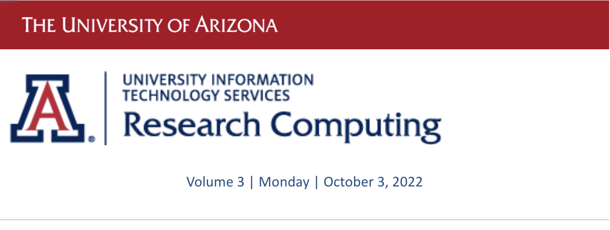
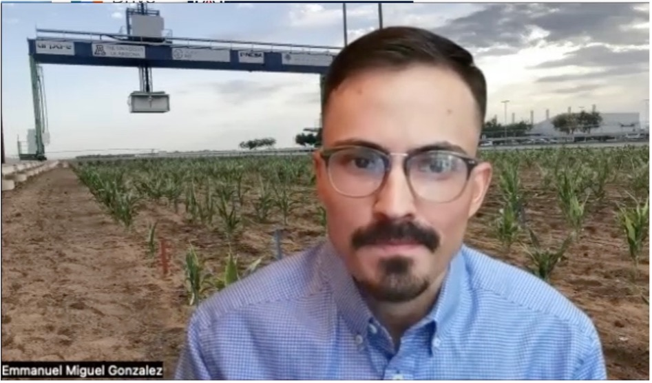
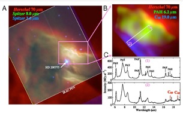

# Volume 3 - October 3, 2022

<link rel="stylesheet" href="../../assets/stylesheets/images.css">
<link rel="stylesheet" href="../../assets/stylesheets/newsletters.css">

    

    
    <h2 class="newsletter-heading">To our Research Computing Community:</h2>
    

    Welcome back to our research computing community. Research computing remained very active over the summer, with our HPC systems continuing to be used at full capacity, along with our deployment of <b>our new AWS-based Tier 2 storage service</b>. This new service is intended to be an option for researchers who have been using Google Drive or other cloud-based storage solutions and should be an inexpensive solution for many in our research community.
    

    

    The beginning of the fall semester has also meant the kickoff of our Research Computing Governance Committee (RCGC), chaired this year by <b>Dr. Joellen Russell</b>. Dr. Russell is the Thomas R. Brown Distinguished Chair of Integrative Science and has also been a past chair of RCGC. This year is an especially important year for RCGC and research computing, as we begin our process towards designing and purchasing our next HPC cluster. To support this 18-month process, it is critical that we engage with our faculty research community to ensure that our next HPC cluster is architected to best meet the needs across our research domains. With RCGC’s support, guidance, and engagement, I am looking forward to our journey towards our next HPC system.
    

    

    On behalf of the entire Research and Discovery Technologies unit, we look forward to working with you this academic year!
    

    

    

    

    <h2 class="newsletter-heading">A Land Grant Project</h2>
    
    

    There are lessons in life. You can follow your dreams. Your upbringing can shape your successful future. Emmanuel Gonzales embodies these lessons.  His family is from El Centro California. If you have driven from here to San Diego, you may have noticed that El Centro is very agricultural. Emmanuel’s grandfather migrated here many years ago under the Bracero field worker program. He is the first from his family to attend college, and studies agriculture.  Specifically, he studies how plants tolerate drought conditions. He combines this familial background with a fascination of photography.  His studies gradually lead him to a deep interest in plant resilience to drought conditions, and he is now a graduate student in the School of Plant Sciences.
    

    

    In the image behind him is the world’s largest plant imager, located in Maricopa, Arizona. With the increase in climate change, the availability of water will become a more pressing issue. Emmanuel processes TeraBytes of image and 3D data. He seeks to understand how plants develop over time and their response to environmental conditions.  Specifically, he identifies genes related to adaptive traits in stress conditions. He uses the HPC resources to process data quickly, reproducibly, efficiently, and creates an automated workflow.  Using distributed workflows, he can take advantage of the parallel processing power of HPC. Machine Learning and AI methods are used for information extraction. And so knowledge is created from data. The result could lead to the development of resilient crops.
    

    

    Chosen Obih is a PhD student in Dr Eric Lyons Plant Sciences program. His studies started in Nigeria and he has since completed his Masters degree in Plant Technology and worked as a lecturer. In his subsequent work in Nigeria, he was using CyVerse tools and observed a lack of computational skills in Life Sciences.  He thought about applying data science to biological questions which lead to joining Dr Eric Lyons PhD program.  He heard about the HPC systems during a class where he had been just using traditional workstations. 
    

    

    Chosen now uses the HPC to develop scalable pipelines for data identification and characterizations of RNA modifications in model plants and crops. He is studying the role of RNA modification in gene regulation.  There are about 160 types of RNA modifications. The modifications change the structure of the RNA which impacts the catalytic function of the resulting RNA. In this research they mine RNASeq public data sets in PB size.  This is where HPC comes in. He develops pipelines to analyze all this data. 
    

    
<i>
    "I can get a bunch of RNASeq, put it in pipeline in parallel. One time I was thinking that on my local machine this is probably going to take forever.. Thankfully we have the HPC system. I am still learning but I can see how much it is speeding up my research. It has made my research so easy. It is fun to know that a system like this exists. I can’t imagine the discovery we will do with this in the coming months and years of my PhD".   
    </i>

    
<i>~Chosen Obih</i>

    

    

    

    <h2 class="newsletter-heading">Usage Metrics</h2>
    

    We consider support for researchers to be the most important measure of value.  These contacts are hard to put into meaningful metrics. However, we have had <b>86 separate engagements</b> so far in the first half of September. Also, we recorded 50 attendees to the in person workshops. 
    

    
<b>BY THE NUMBERS</b>

    

    <b>28,764 cores</b>. The total number of cores researchers are contributing their funding to in Puma. When Puma started, it had only <b>19,200 cores</b>.
    

    

    <b>149 software applications</b> shared on the three clusters.
    

    

    <b>53 GPUs</b> on Puma. Researchers started with only 24.
    

    

    <b>286.7 million CPU hours</b> consumed in fiscal year 2022. An increase of 38% over 2021.
    

    

    <b>495 active users</b> per month. An increase of 15% over 2021.
    

    

    <b>$395M in Support of Sponsored Research</b> in fiscal year 2022.
    

    

    

    

    <h2 class="newsletter-heading">Training Sessions</h2>
    

    Each semester we conduct workshops to assist new and existing researchers with taking advantage of HPC resources. If you were not able to attend any of the recent workshops, the PDF version is available online. Some of them also have video recordings.  In particular, we encourage new users to watch or read Intro to HPC.
    

    

    We also conduct workshops in partnership with our vendors and we have one coming up soon with Nvidia, including free lunch.
    

    <table class="newsletter-table">
        <tr>
            <th>Subject</th>
            <th>Date</th>
            <th>Time</th>
            <th>Location</th>
            <th>Registration</th>
        </tr>
        <tr>
            <td>Nvidia Workshop</td>
            <td>Friday September 30, 2022</td>
            <td>12:00 pm - 3:00 pm</td>
            <td>Main Library B252</td>
            <td><a title="No longer available">Registration</a></td>
    </table>

    

    

    
    

    
    <h2 class="newsletter-heading">Did You Know...</h2>
    

    You can request a special allocation of compute hours beyond your standard allocation. We call these <b>Special Projects</b>. These are typically granted in support of a conference or publication deadline when more intensive compute is needed. There are guidelines and limits, and you can <a href="../../policies/special_projects/">find them here</a>.
    

    
    

    One of our researchers used a Special Projects allocation and recently published this article on fullerene formation in the interstellar medium.
    

    

    Buckminsterfullerene (C60) was recently confirmed as the largest molecule identified in space. However, it remains unclear how and where this molecule is formed. It is generally believed that C60 is formed from the buildup of small carbonaceous compounds in the hot and dense envelopes of evolved stars.
    

    

    

    

    <h2 class="newsletter-heading">All New Cloud Storage Service for Research</h2>
    
    
<b>Amazon Web Services storage space is now available for campus researchers</b>

    

    With Google announcing that they will no longer provide us with free and unlimited storage on Google Drive, we are working on strategies and solutions to support researchers who need long-term data storage. 
    

    

    UITS Research Technologies is excited to announce a new cloud-based research data storage service titled <b>Tier 2 Storage</b>. This new service provides active data storage in the cloud while automatically archiving data into Amazon’s Glacier service or Deep Glacier service if that data is not accessed after 90 days (Glacier) and 180 days (Deep Glacier). 
    

    

    The new Tier 2 Storage service is intended for data not immediately undergoing active analyses – it is intended as an affordable data storage for data and semi-archival data. UITS covers the first terabyte (1TB) of active storage, and all other costs associated with the service, including the costs of data that is archived in Glacier and Deep Glacier. Researchers only pay for additional data beyond 1TB that stays on the active layer of the service.
    

    

    Tier 2 Storage was opened to the University research community earlier this year. Over the summer, Research Technologies has identified larger users of Google Drive to begin their transition. Since then, over 58TB of data has been moved from Google Drive or HPC storage using Globus. All data must be moved to Tier 2 by the end of March 2023. The new service is also available to researchers who do not use the HPC systems. For more information, <a href="../../storage_and_transfers/storage/tier2_storage/"><b>visit our documentation</b></a>. 
    

    

    

    

    <h2 class="newsletter-heading">Our Services</h2>
    

        <ol>
            <li><b>Controlled Unclassified Information (CUI) Environment:</b>Secure computational and storage services are available to UA researchers when their government contract/award indicating they are working with CUI or contract clauses indicate that NIST SP 800-171 controls are required. For more information on this service see our Service Catalog. </li>
            <li><b>HIPAA Research Computing Services:</b> Secure computational and storage services are available to UA researchers working with data sets protected by the Health Insurance Portability and Accountability Act (HIPAA). For more information on this service see our Service Catalog.</li>
        </ol>
    

    

    

    

    <h2 class="newsletter-heading">New Staff</h2>
    

    Kiana Robinson, Statistical Consultant: Kiana joined our team recently as a second Statistics Consultant to join Mark. She moved to Tucson with her family from Mississippi so we are not only happy to have her on the team but also to have her in our Tucson community.  She has already found out that hurricanes are different here having experienced both Hurricanes Kay and Katrina.  She brings extensive experience with academic statistics and has hit the ground running.
    

    

    Kat Salthouse, Senior Business Analyst: Research Technologies, welcomes new Business Analyst, Kat Salthouse. Kat is a two-time U of A grad earning her masters in MIS and bachelor’s in finance. Most recently she hails from the Registrar’s Office, but during her career has collaborated on many campus projects. She is an avid cyclist mornings and weekends, and as a test of skill is also trying her hand at woodworking. She is looking forward to working with many of you!
    

    

    John-Amos Stompoly, CRRSP Computing Sciences Researcher II: John-Amos is a new member of the CRRSP team at UITS.  Prior to this position, he worked for nearly 4 years at the Parking & Transportation Services department here at the U of A as their ITSA/System Administrator, and before that he had around 8 years of experience in the restaurant industry.  While he loved the restaurant world, he has worked and played on computers for his entire life, so transitioning his employment to a tech focused field felt like the right decision. 
    

    

    In addition to working here at UITS,he is also a full-time student at the U of A in his senior year.  John-Amos's major is East Asian Studies with an emphasis on Japanese Language, and his minor is in Religious Studies.  After graduation in the Spring of 2023, he hopes to continue his education as a Wildcat in graduate school. 
    

    

    Outside of work and school, John-Amos' two main hobbies are playing music and video games.  He began playing piano at 5 years old, and music has been a lifelong companion of his.  He is very excited to be a part of the team here at UITS and look forward to working with everyone.
    

    

    

    

    <h2 class="newsletter-heading">Undergraduate Research Opportunities</h2>
    

    Coming soon to all units! In collaboration with <b>Research, Innovation, and Impact (RII)</b>, UA Vitae provides researchers a place to post available opportunities for undergraduate students.
    

    

    Types of research opportunities can be paid, volunteer, or for credit, and postings are easily managed by the researcher. When opportunities are entered in UA Vitae, they are displayed for students on the <a href="https://ur.arizona.edu/" style="font-weight: bold;">Undergraduate Research & Inquiry Collaborative website</a>. On this website you can check out what early adopters are doing.
    

    

    

    <h2 class="newsletter-heading">HPC News</h2>
  

    Do you have story ideas for the HPC News? <a href="../../support_and_training/consulting_services/"><b>Submit your suggestions to us</b></a>.
  

