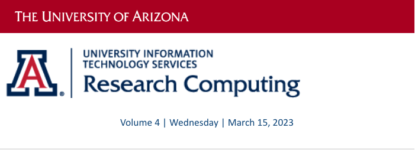
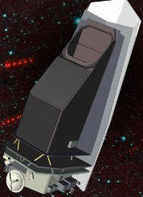
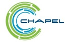

# Volume 4 - March 15, 2023

<link rel="stylesheet" href="../../assets/stylesheets/images.css">
<link rel="stylesheet" href="../../assets/stylesheets/newsletters.css">

    
    

    
    <h2 class="newsletter-heading">From The Director</h2>
    
Happy Spring!

    

    As we work our way through the Spring semester, we continue to see strong growth in research being supported by the services provided by Research and Discovery Technologies and Research Computing. So far this Spring there has been an 11% growth in the number of faculty researchers using our HPC systems, and nearly 18% growth in overall active users, compared with our numbers from last Spring. We are also seeing an increase in the number of research efforts that require support for government controls and regulations, such as HIPAA, ITAR, and CUI (Controlled Unclassified Information). On top of all of this, researchers continue to demonstrate the increasing need for secure, scalable, and affordable data management and storage solutions.
    

    

    With the University’s goals for growing funded research continuing to move forward, our team in Research and Discovery Technologies continues to partner with RII and our research community to extend and mature current services and infrastructure, as well as work to developing additional services that best support research at the University of Arizona. Along with the emerging efforts from the Accelerating Secure IT Services (ASITS) program, there is an enormous amount of effort and activity happening in support of data-intensive computing and research data management support that will position UArizona as a leader in supporting researchers, data-intensive research, and research data management through research computing services and infrastructure.
    

    

    I look forward to the next year and am hopeful that our continued efforts to support the research community are impactful and continue to position our researchers for success.
    

    

    Thank You, 
    Jeremy Frumkin
    

    

    

    

    <h2 class="newsletter-heading">Finding Asteroids Before They Find Us</h2>
    
    

    Near Earth Objects or NEO’s, are asteroids and comets that come close to the Earth. And if you have watched any “object hits Earth” movies, you will know that some of them are potentially hazardous. Extremely hazardous. Professor Amy Mainzer is one of our researchers who has purchased compute capacity in Puma.  She is the Survey Director for the planetary defense mission designed to respond to the objectives of NASA’s Planetary Defense Coordination Office which detects, catalogues, and characterizes NEO’s.  
    

    

    The University of Arizona has a long history in the discovery and characterization of NEO’s. Two ground-based NEO surveys, the Spacewatch project at Kitt Peak National Observatory and the Catalina Sky Survey at the Mt Lemmon Observatory, have detected nearly 50% of all known NEO’s to date. In extending the capability to outer space, UArizona is home to the NEO Surveyor mission as well as the ongoing NEOWISE mission. Both are space-based infrared telescopes. NEOWISE is a smaller, Earth-orbiting telescope currently in extended mission operations, and serves as a key precursor mission for the new NEO Surveyor. This will greatly expand NASA’s ability to find Earth approaching asteroids and comets. 
    

    

    In recent news, the project passed a key NASA review and has been approved for launch no later than June 2028.
    

    

    

    

    <h2 class="newsletter-heading">Storage Activities</h2>
    

    We have a new rental storage service that works well with the changes coming to Google Drive.  Google has changed their terms of service and the free storage will be limited to 15GB instead of the current unlimited capacity.  UITS has extended the deadline for getting under the new limit to April 1st. That brings us to the new service for HPC storage.  It reimplements a rental model that existed on a previous system.  Researchers can rent storage space in the Research Data Center for $47.35 per TB per year.  It has been subsidized by RII to make it this affordable.  Our HPC consultants can help with the Google Drive migration whether you wish to use the new rental service or not. <a href="../../storage_and_transfers/storage/rental_storage/"><b>More details are here</b></a>.
    

    

    

    

    
    <h2 class="newsletter-heading">Coding Support</h2>
    

    Would you be interested in having your code written in Chapel (chapel-lang.org), a powerful parallel programming language? We can connect you with the core Chapel development team at HPE.  The team can work with you as you evaluate whether Chapel might help you parallelize your application workflow. The details would have to be worked out, but this could be a great opportunity to have your workloads take advantage of the powerful parallel capabilities of our supercomputers. <a href="../../support_and_training/consulting_services/"><b>Contact us</b></a>.
    

    

    

    

    <h2 class="newsletter-heading">Planning for a New Supercomputer</h2>
    

    We have started the process to add a new cat to the pride (Is that the right collective name?) It starts with vendor briefings which we conducted during the recent Supercomputing Conference in Dallas. Then we conducted a survey of researchers to guide us in the feature requirements. We are now in the phase of writing the RFP document which details what we ask for from the vendors. It should go out to the vendors in April which keeps us on track to make an award around August.
    

    

    

    

    <h2 class="newsletter-heading">Pilot Programs</h2>
    

    We are in the middle of a test program for supporting HIPAA controlled research.  The program is called Soteria. Soteria (Greek: Σωτηρία) was <b>the goddess or spirit (daimon) of safety and salvation, deliverance, and preservation from harm</b>. As a test cluster it is not generally available but should be a comprehensive research tool once the testing is complete.
    

    

    We are also in the early stages of a trial program for research that is controlled by CUI. (Controlled Unclassified Information). A small cluster will be set up in the Research Data Center that meets the compliance restrictions.
    

    <h3 class="newsletter-heading">And this from one of our researchers;</h3>
    

    "And I should add that my coauthors are at Columbia, and they are astounded at how great our HPC (and support for it!) is here at UA :-)"
    

    

    

    

    
    <h2 class="newsletter-heading">Did You Know...</h2>
    

    We now have a YouTube channel for instructional videos.  They are mostly a few minutes long and show visually what is sometimes complex to explain in our documentation.  If you have suggestions for topics that could use a quick video let us know.  We also have some stories recorded by our student researchers. 
    

    

    <a href="https://www.youtube.com/@universityofarizonauitsres7597"><b>https://www.youtube.com/@universityofarizonauitsres7597</b></a>

    

    

    <h2 class="newsletter-heading">HPC News</h2>
  

    Do you have story ideas for the HPC News? <a href="../../support_and_training/consulting_services/"><b>Submit your suggestions to us</b></a>.
  

