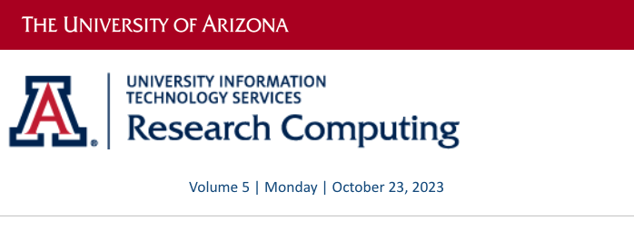
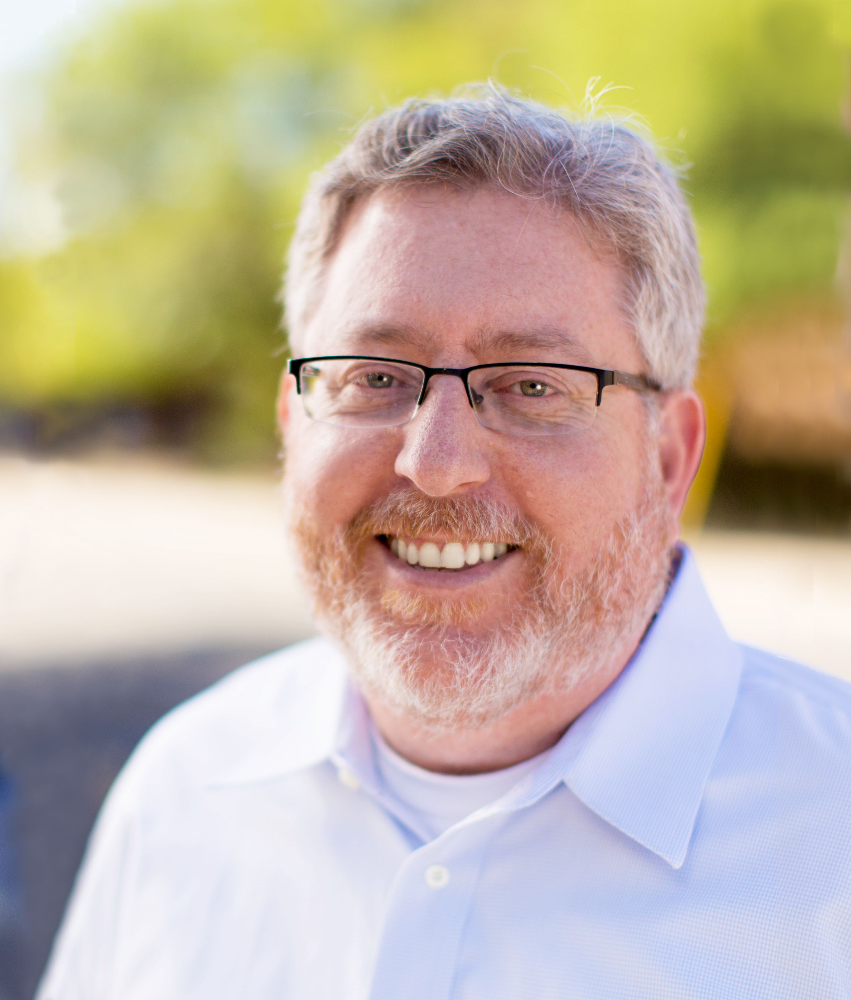
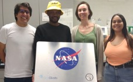
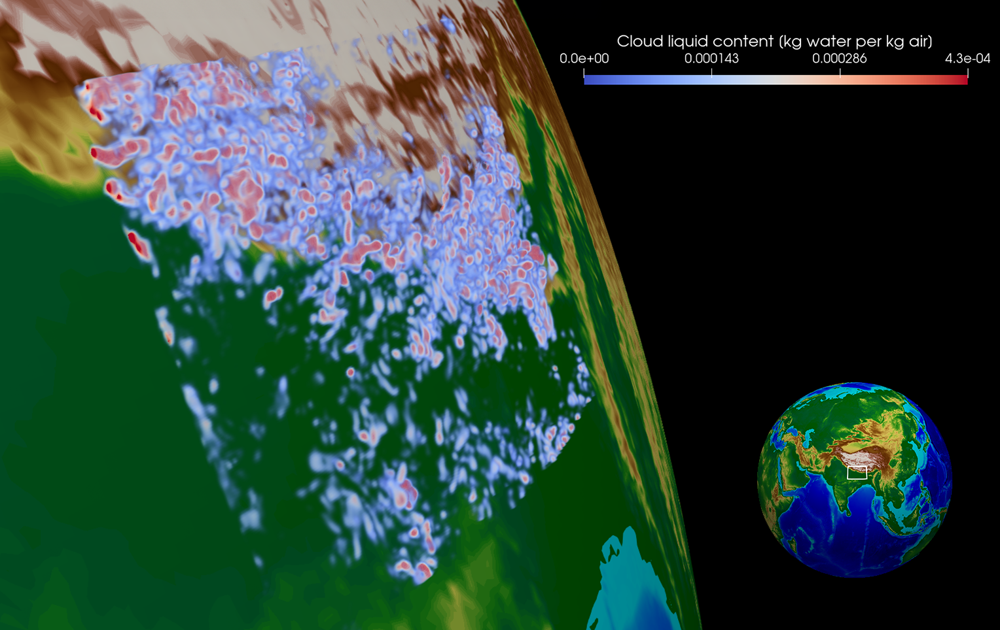

# Volume 5 - October 23, 2023

<link rel="stylesheet" href="../../assets/stylesheets/images.css">
<link rel="stylesheet" href="../../assets/stylesheets/newsletters.css">

    

    

    
    <h2 class="newsletter-heading">From The Director</h2>
    
Dear Colleagues,

    

    As we embark on a fresh academic year, I'd like to share some updates from the Research and Discovery Technologies Department and also take a moment to acknowledge the significant contributions our team has made in bolstering the research endeavors at the University.
    

    

    In collaboration with <b>Health Sciences</b> and the <b>Data Science Institute</b>, we launched a pilot <b>HIPAA-compliant HPC cluster</b> last year, a part of the broader <a href="https://soteria.arizona.edu/" target="_blank"><b>Soteria initiative</b></a>. We're now in the process of setting up a similar pilot to cater to <b>CUI</b> and <b>ITAR</b> compliant research, aiming for its rollout later this fiscal year.
    

    

    We're also in the midst of procuring our next HPC cluster via an RFP process. In preparation for this, we've collected data and sought insights from the research computing community and the <b>Research Computing Governance Committee (RCGC)</b> to shape the specifications of the upcoming cluster. Stay tuned for an official announcement once the RFP process concludes.
    

    

    Lastly, I am excited to announce that our latest research data storage solution, <a href="../../storage_and_transfers/storage/rdas_storage/" target="_blank"><b>R-DAS (Research Desktop Attached Storage)</b></a>, was launched on October 16. This will provide a complimentary 5TB of storage for every eligible researcher. More details about this offering can be found in the newsletter below.
    

    

    To support these new services, our research consulting team has welcomed two new HPC consultants. Additionally, we've successfully onboarded a research IT security analyst. This brings our team's strength to nineteen dedicated members. To give some perspective, when I assumed the role of director, we were a cohesive unit of eleven. This expansion is a testament to the increasing reliance and trust the UArizona research community places in our services and infrastructure.
    

    

    Thank You, 
    Jeremy Frumkin
    

    

    

    

    
    <h2 class="newsletter-heading">Cloud Research (not that cloud)</h2>
    

    <b>Sylvia Sullivan</b> is an <b>Assistant Professor in Chemical and Environmental Engineering</b> who performs atmospherically related research and has a joint appointment to the <b>Department of Hydrology and Atmospheric Sciences</b>. Her academic background is in chemical engineering, but she has picked up atmospheric science and computing skills along the way to model and understand cloud and storm systems. She explains, "I really liked environmental work because I felt it was very impactful."
    

    

    Her research includes investigating cloud ice formation. From a chemical engineering perspective, you can think about clouds as a control volume, flows in and out and phase changes occurring inside. Along with this more technical view, Sylvia says she, "fell in love with clouds because they are very beautiful and poetic." This blend of fields brought her to the University of Arizona as it is one of the only Universities where chemical and environmental engineering are in the same department. And besides she goes on to say, "Tucson is a wonderful location."
    

    

    

    Sylvia is building a research group to study the impact of ice clouds, particularly their energetic and precipitation effects. Her group runs very high-resolution simulations called storm resolving simulations, where the meshes are fine enough to represent individual storms. In global climate models, the mesh has a resolution on the order of 100km, in which several storm cells can form simultaneously. These storm-resolving computations are very expensive and produce terabytes of data, which then need to be post-processed and visualized. Currently, Sylvia and her group are very focused on working with other visualization experts on campus to illustrate the structures and evolution of clouds and storm systems.
    

    

    

    

    <h2 class="newsletter-heading">New Storage Service for Researchers</h2>
    

    UITS Research Technologies is excited to introduce a new data storage service, <b>Research Desktop Attached Storage (R-DAS)</b>. The R-DAS is a dedicated storage solution designed to empower your research by providing up to 5TB of no-cost storage space per Principal Investigator. With R-DAS, you will have a streamlined way to store and manage your open research project data. By directly mounting storage to your workstation, it mimics the convenience of a network shared drive. R-DAS is intended for storing open research data, but not controlled or regulated data.
    

    

    Should you require additional storage beyond the allocated 5TB, our Rental Storage option is available. This option leverages the Globus platform for connectivity, ensuring your expanding needs are met.
    

    

    The R-DAS is now available for research storage as of  October 16, 2023, and if you’re interested in more information <a href="../../support_and_training/consulting_services/"><b>reach out to us</b></a>.
    

    

    

    
    

    <h2 class="newsletter-heading">New Hires</h2>
    

    We recently welcomed two new HPC consultants to our team. <b>Soham Pal, PhD</b>, and <b>Ethan Jahn, PhD</b>, have hit the ground running and are here to provide thorough answers to all your questions.  They are also engaged with projects like the migration away from unlimited Google Drive storage and conducting workshops. 
    

    

