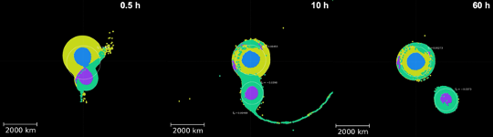
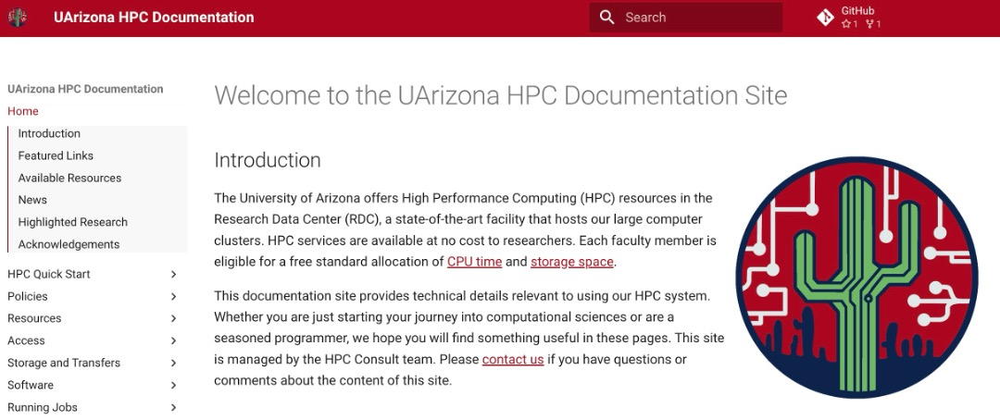

# Volume 6 - May 29, 2025

<link rel="stylesheet" href="../../assets/stylesheets/images.css">
<link rel="stylesheet" href="../../assets/stylesheets/newsletters.css">

    

    

        
        <h2 class="newsletter-heading">Plans for a New Cluster</h2>

        

        While we were unable to obtain funding in FY24 to refresh our HPC infrastructure, we have obtained a commitment from RII to fund the refresh in FY26, which could mean taking delivery in the middle of 2025. This funding will provide a new system to supersede Puma, though Puma is expected to still be available alongside our new cluster. The process to procure our next HPC system is already underway. 
        

        

        The meat and potatoes of the research workloads we observe running on our systems is currently, and will likely continue to be CPU based.  These workloads run from using single cores but hundreds or thousands of instances, to embarrassingly parallel jobs that consume hundreds or thousands of cores at a time. Puma is terrific at this workload, and we will continue to enhance that service.
        

        

        We also see a tremendous growth with research workloads that require GPU accelerators. There is tremendous buzz around AI, especially Large Language Models (LLMs) and we need to provide enough capacity to support this growing need in our research community. We will need to continue to leverage national resources for large-scale GPU and LLM needs, and we can focus on being the democratized institutional resource for foundational learning and research. It is also of no surprise that many of the domains we support are transforming their compute with machine learning models which are computationally hungry but tremendously productive. Our new cluster will enable us to increase our ability to support the growing need for GPU-based workloads, and the Research Computing team will continue to extend its support for researchers leveraging our local infrastructure as well as national HPC resources.
        

    

    

    

    <h2 class="newsletter-heading">Reconstructing the History of the Solar System Using HPC</h2>
    

    Erik Asphaug’s Planetary Formation Lab in the Lunar and Planetary Laboratory uses smoothed-particle hydrodynamics (SPH) simulations to explore how collisions between bodies in the Solar System shape its evolution through time. These three-dimensional simulations, which approximate planetary bodies as collections of particles, incorporate realistic geologic properties to track their structural and thermal changes during and after giant impacts.
    

    

    From Eric: <i style="color: grey;">"The access to increased time allocations as well as large volumes of temporary storage on xdisk provided by the HPC has revolutionized our ability to run our most complex simulations at high resolution, with enough space and time to explore the full parameter space necessary to make key discoveries that inform our understanding of Solar System evolution.</i>
    

    

    One of their major projects has occupied a large fraction of their HPC hours and storage: the capture of Pluto’s moon, Charon, from a giant impact early in the Solar System’s history.
    

    

    High resolution is also critical to track detailed interactions between Pluto and Charon, including any material transferred between them. Without the HPC and the allocation of computation time and storage space, they would not have been able to run the hundreds of models necessary to successfully reproduce systems that look similar to Pluto and Charon today. The models have revealed new insights about how bodies like Pluto capture satellites: the dwarf planet and its proto satellite collide, briefly merge, and then re-separate as Charon slow begins to move outward. They call this new process, which significantly redefines our understanding of giant collisions, "kiss and capture." An example kiss-and-capture is shown below. The simulation shown covers 60 hours of model time, which takes ~1.5 months on the HPC. The ability to run such long simulations in parallel was crucial to completing this work.
    

    
    

    

    

    <h2 class="newsletter-heading">Improvements to the HPC Services</h2>
    

    Earlier this year in February we introduced a new capacity called MIG. It may sound like a Russian aircraft, but it stands for Multi-Instance GPU. Puma has one compute node with A100 GPU’s, the rest have the V100S model.  MIG allowed us to provide 12 GPU slices out of the 4 physical GPU’s and let us test the capability for future systems. We provide <a href="../../running_jobs/batch_jobs/batch_directives/#gpus"><b>detailed instructions</b></a> even though the usage is transparent in many cases.
    

    

    The Research Computing Governance Committee (RCGC) approved the increase of standard allocation for all PI’s by about 50% on Puma and Ocelote. On March 1st each standard allocation on Puma increased <b>from 100,000 hours to 150,000 hours</b>, and Ocelote increased <b>from 70,000 hours to 100,000 hours</b>. This was made possible by careful analysis of usage over the last two years.
    

    

    

    

    <h2 class="newsletter-heading">More GPUs</h2>
    

    We had planned to add more GPUs over the last few years, but Covid and other financial matters got in the way. What we have recently been able to do is purchase older model GPUs to double the capacity of Ocelote. These additional P100s can still perform all of the CUDA functionality, and so should free up the more performant V100 models on Puma. There will be an announcement shortly, but you will mostly see that we are going from <b>46 nodes with a single GPU to 58 total, comprising 22 single and 36 dual GPUs</b>.
    

    

    

    

    <h2 class="newsletter-heading">New Documentation</h2>
    

    We are excited to let you know that we have completely revamped the HPC documentation. We have moved from Atlassian Confluence to an open-source solution based on Python and Github. If we have done this right you will find all the same useful information as you did before, just better organized. It is also designed to be mobile friendly and accessible. The old site will still be available at <a href="https://docs.hpc.arizona"><b>https://docs.hpc.arizona</b></a> for a little while to allow everyone to adapt. The new site will be <a href="https://hpcdocs.hpc.arizona.edu"><b>https://hpcdocs.hpc.arizona.edu</b></a>. We welcome any feedback.
    

    
    

    

        

        <h2 class="newsletter-heading">By the Numbers</h2>
        

        Sometimes it is hard to fathom how much work gets done on the three supercomputers, but here are a few stats from the first three months of this year:
        <ol>
        <li>1007 different users ran jobs from 75 different Departments.</li>
        <li>401 different PIs were engaged.</li>
        <li>1,170,757 jobs completed. Python represented nearly half at 48%.</li>
        <li>226,294 jobs ran in 1-5 hours, but 444,034 ran in 1-30 seconds.</li>
        <li>Since coming online in 2020, Puma has run over 9,480,000 jobs.</li>
        </ol>
        

        

        <h2 class="newsletter-heading">Pilot Programs</h2>
        

        Soteria is the secure data and analysis enclave for conducting Personally Identifiable Information (PII) and Protected Health Information (PHI) data. The pilot project has successfully completed and now migrated into full production. We are grateful to the PIs and their research teams who participated in the pilot. More information can be found on the <a href="https://soteria.arizona.edu/"><b>Data Science Institute website</b></a>, as they are sponsors of the program
        

        

        We are working to deploy a new pilot for CUI. (Controlled Unclassified Information). A small cluster is being provisioned to meet the extensive compliance restrictions. And these restrictions are VERY onerous, so this will be a very valuable exercise for researchers needing this capability in the future
        

        

        

        <h2 class="newsletter-heading">And this feedback from our researchers…</h2>
        

        "I cannot thank you enough! This is so appreciated. Now, I only wish I'd asked sooner."
        

        

        "Thank you so much for the great instructions. I have done the changes myself as you recommended and I believe that it all worked."
        

        

        And for the statistical consultants:
        

        

        "I wanted to share some exciting news with you and let you know that the abstract we had submitted to Digestive Disease Week 2024 has been accepted for poster presentation on May 18, 2024 in Washington DC. It means a lot to have this opportunity and thank you both for all of your hard work in making this happen!"
        

        

        

        
        <h2 class="newsletter-heading">Did You Know…</h2>
        

        Part of our mission is to provide an on-ramp to national resources, funded by agencies like the NSF. From one of our faculty who we helped to obtain an instruction allocation using GPU’s on Jetstream2:
        

        

        "Thank you so much for introducing me to Devin and Soham. My students are now using the Jetstream2. Devin and Soham met me multiple times, we recorded our sessions for future reuse. All happened in a very short period of time from 0 to now students having a GPU 24x7."
        

        

        <a href="../../support_and_training/consulting_services/"><b>Contact us</b></a> for more information or check out <a href="https://access-ci.org/"><b>ACCESS</b></a>.
        

        

    

