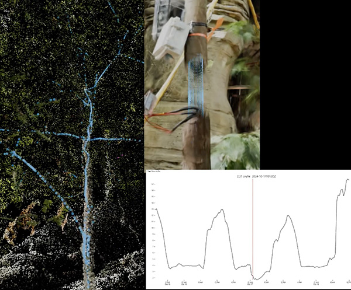

# Volume 7 - June 9, 2026

<link rel="stylesheet" href="../../assets/stylesheets/images.css">
<link rel="stylesheet" href="../../assets/stylesheets/newsletters.css">

  

  

    
    <h2 class="newsletter-heading"> Update on Plans for a New Cat</h2>

    

    The university’s Research Data Center (RDC) is preparing to install its next HPC cluster in fall 2026. The new system will have 40 nodes of CPU compute, two 8-GPU nodes with H200 GPUs, and one 3TB High-memory node, and will incorporate InfiniBand networking for MPI capabilities.
    

    

    This has been a long and challenging process, and we would not have been successful without the support of the Research Computing Governance Committee (RCGC) and our research community. We would also like to extend special thanks to the Office of Research & Partnerships (ORP), Senior VP of Research Tomás Díaz de la Rubia, CIO Elliott Cheu, and COO Richard Cate for their support and recognition of HPC's importance to the University's research and AI missions. 
    

    <h3 class="newsletter-heading">Buy-In Opportunity</h2>

    

    We are continuing our practice of supporting faculty funds for adding compute nodes to the central purchase. Please <a href="../../support_and_training/consulting_services/">contact us</a> if you are interested in purchasing GPU or CPU computation capacity.
    

    

    ~ Jeremy Frumkin, Senior Director, UITS Research & Discovery Technologies
    

    

  

  

  

    <h2 class="newsletter-heading">HPC Advances Brain Health Research</h2>

    

    To help unlock the mysteries of how our brains age, the <b>Precision Aging Network (PAN)</b> is examining MRIs of more than 1,000 diverse participants across four American cities. The nationwide study, led by <b>Dr. Carol Barnes</b>, is looking at how factors like heart health, blood sugar, inflammation, and even genetics influence cognitive decline as we age.
    

    

    Each participant undergoes a series of detailed brain scans—anatomical, functional, diffusion, and perfusion MRI, which provide a rich view of brain structure and activity. Then the university’s <b>Brain and Body Imaging Center</b> relies on the U of A Research Data Center’s high-performance computing (HPC) systems to process and analyze the millions of 3D data points, called voxels, per scan.
    

    

    Read more about <a href="https://it.arizona.edu/news/hpc-advance-brain-health-research?utm_source=trellis&utm_medium=email&utm_campaign=HPC%20Newsletter%20Spring%202026"><b>HPC support of PAN</b></a>.
    

    

    

    

    

    <h2 class="newsletter-heading">Picturing Research at Biosphere 2</h2>
    
    

    Postdoctoral researcher Justin Bestily is studying the impacts of climate change on rainforest health by tracking water uptake in a cacao tree at Biosphere 2. Justin has also collaborated with Research Technologies’ Devin Bayly to translate raw data into visual and cinematic illustrations that explain the science to Biosphere 2 visitors and other lay audiences. 
    

    

    Read more about the different modeling Devin and Justin worked on and <a href="https://it.arizona.edu/news/picturing-research-biosphere-2?utm_source=trellis&utm_medium=email&utm_campaign=HPC%20Newsletter%20Spring%202026"><b>see the results</b></a>.
    

    

  

    <h2 class="newsletter-heading">National Research Compute Resources - FREE </h2>

    

      The National Science Foundation has funded advanced computation resources at academic centers around the country. These are available at no cost to researchers and educators. Our research consultants are available to help you to select the resource that is right for you. You can share our allocation for a trial run, and then we will assist you to get your own allocation. 
    

    

      <a href="https://allocations.access-ci.org/resources"><b>https://allocations.access-ci.org/resources</b></a>
    

    

    One example of the resources is <b>DeltaAI</b>, hosted at NCSA. It is provisioned with Nvidia GH200 Superchips, similar to the H200 GPUs coming with our new supercomputer. You could apply for an allocation to get an early run at the same GPUs we are buying. Or you could test your codes on our H200’s then request an allocation on DeltaAI to scale your code.
    

  

  

  <h2 class="newsletter-heading">Quick Notes</h2>

    

   Have you tried out the new U of A AI platform? It provides secure, university-governed access to AI tools, supporting teaching, learning and research. 
   

    

    The new <a href="https://responsibleai.arizona.edu/tools-support/u-gen-ai?utm_source=trellis&utm_medium=email&utm_campaign=HPC%20Newsletter%20Spring%202026"><b>U of A GenAI collection</b></a>, built on Amazon Bedrock, will expand the university’s existing free and secure access to Amazon Web Services, or AWS, technology. Read more about <a href="https://it.arizona.edu/news/new-u-ai-resources?utm_source=trellis&utm_medium=email&utm_campaign=HPC%20Newsletter%20Spring%202026"><b>the university’s AI resources</b></a>. 
    

  

  

    <h2 class="newsletter-heading">By the Numbers</h2>

    

    Over the last fiscal year, we have compiled metrics demonstrating some of the value Research Computing brings to the University research community. You can view more metrics in the <a href="https://hpcdocs.hpc.arizona.edu/assets/pdfs/Annual%20Report%20HPC%202025.pdf?utm_source=trellis&utm_medium=email&utm_campaign=HPC%20Newsletter%20Spring%202026"><b>HPC System Highlights 2025 Report</b></a>.
    

  

  

    <h2 class="newsletter-heading">Feedback From Our Researchers...</h2>

    

    "Terrific - thanks so much! So far I’ve just done some quick tests using the compiled version you shared and everything is working nicely - a wonderful feeling after days of head scratching."
    

    

    "Thank you so much for helping me and guiding me to resolve my problem… Once again, thank you for taking the time out of your busy schedule to get back to me and guide me through this process. I really appreciate the help I've received."
    

  

  

    <h2 class="newsletter-heading">HPC Tech Tips</h2>

    

    We have two very useful <b>command-line tools</b> to make your workflow a little easier.
    

    

    Have you tried to find what all the data is in your home directory, or why it is taking up so much space?
    

    

    <b>The command <code>gdu</code></b> can be run from a login node and will, by default, sort your directories by size, including hidden directories.
    

    

    What about reviewing recent jobs for some brief metrics and analyzing their efficiency? Maybe you need to assign more memory. Or less. <b>Try <code>multiseff -h</code></b>, also from the login nodes.
    

  

