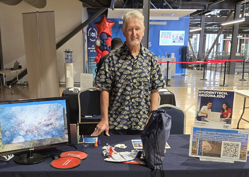
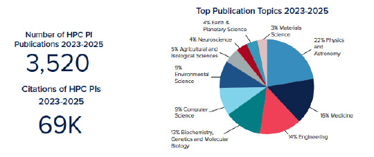

# Volume 8 - August 28, 2026

<link rel="stylesheet" href="../../assets/stylesheets/images.css">
<link rel="stylesheet" href="../../assets/stylesheets/newsletters.css">

    
    

    
    <h2 class="newsletter-heading"> Lynx is coming — buy-in is still available!</h2>
    

    Pallets are arriving at the Computer Center for the campus’s brand-new supercomputer, <b>Lynx</b>. Lenovo will be on site in September to begin assembly, which will be followed by testing and integration work. Watch for the Lynx grand opening late in the fall semester. 
    

    

    If your research would benefit from dedicated compute on the campus supercomputer, consider buying GPU or CPU nodes to add to the system, giving you priority use time equivalent to your purchase. The HPC team is excited that the <a href="https://news.arizona.edu/news/u-scientists-play-crucial-roles-nancy-grace-roman-space-telescope-science-eagerly-await?utm_source=trellis&utm_medium=email&utm_campaign=Research%20Computing%20News%20Fall%202026"><b>Nancy Grace Roman telescope project</b></a> has purchased $800,000 worth of nodes on Lynx to run models to help them understand the underlying physical properties of the universe.
    

    

    Here are the specifications for the centrally funded purchase of Lynx, so that you can determine which components might best serve your projects. All are the latest Lenovo compute nodes, much more powerful than previous generations installed in Puma and Ocelote:
    

    

    <b>CPU Node</b>
    <ul>
        <li>Lenovo SR645 V3</li>
        <li>Two AMD EPYC 96-core 2.6GHz (Turin) processors</li>
        <li>768GB TruDDR5 6400MHz memory</li>
        <li>Nvidia NDR200 Infiniband</li>
        <li>One 1.92TB NVMe SSD</li>
    </ul>

    <b>GPU Node</b>
    <ul>
        <li>Lenovo SR675 V3</li>
        <li>Two AMD EPYC 48-core 3.15GHz (Turin) processors</li>
        <li>1536GB TruDDR5 6400MHz memory</li>
        <li>Nvidia OSFP400 Infiniband</li>
        <li>One 1.92TB NVMe SSD</li>
        <li>Eight Nvidia H200 NVL GPUs</li>
    </ul>

    <b>High Memory Node</b>
    <ul>
        <li>Lenovo SR645 V3</li>
        <li>Two AMD EPYC 48-core 3.15GHz (Turin) processors</li>
        <li>3072GB  TruDDR5 6400MHz memory</li>
        <li>Nvidia OSFP400 Infiniband</li>
        <li>One 1.92TB NVMe SSD</li>
    </ul>
    

    

    Please <a href="https://uarizona.service-now.com/sp?id=sc_cat_item&sys_id=12eaba153bf9ba5017be8a8a25e45a7d"><b>submit a ticket to HPC Consulting</b></a> if you are interested in purchasing nodes on Lynx.
    

    ~ Jeremy Frumkin, Senior Director, UITS Research & Discovery Technologies
    

    

    

        
        <h2 class="newsletter-heading">Scaling to a (Free) National Resource</h2>
        

        As artificial intelligence transforms medicine, the need for transparent, trustworthy models is more critical than ever. At the University of Arizona, fifth-year computer science PhD student <b>Saiful Islam</b> is tackling this challenge head-on by examining the inner workings of large language models (LLMs).
        

        

        Saiful’s research focuses on Explainable AI (XAI) within healthcare and bioinformatics. Modern LLMs often operate as "black boxes," providing answers without revealing their underlying reasoning. While high accuracy may work for everyday tasks, high-stakes clinical settings demand clear accountability. As Saiful notes, high accuracy alone isn't enough when human lives are involved—explainability is essential for medical professionals to safely trust AI diagnostics.
        

        

        However, training and interpreting massive language models requires immense computational power, and local university servers were quickly stretched thin. To overcome these bottlenecks, Saiful turned to the NSF ACCESS community and Jetstream, an advanced cloud infrastructure designed for high-performance computing.
        

    
    

    

    With support from local facilitators, Saiful initially gained access to four NVIDIA H100 GPUs, giving his team the raw power needed for demanding NLP training. He soon discovered that PhD students can apply directly as Principal Investigators for their own ACCESS allocations. After submitting a proposal, his allocation was approved in just one day, allowing him to expand his work to national supercomputing resources like Delta AI at NCSA.
    

    

    This computing power enabled Saiful to complete a major research paper now prepared for journal submission. His journey demonstrates how ACCESS and Jetstream bridge the gap between ambitious ideas and real breakthroughs by offering frictionless access to GPU clusters and expert support.
    

    

    For researchers facing compute constraints, ACCESS and Jetstream provide a streamlined pathway to supercomputing power. <a href="https://allocations.access-ci.org/resources"><b>Explore available allocations</b></a> today to accelerate your research.
    

    

    

    

    
    <h2 class="newsletter-heading">Welcoming New Wildcats</h2>
    

    The Research & Discovery Technologies team attended <b>Graduate Orientation</b> on Aug. 19 to let new master's and doctoral students know about campus computing resources available to them. From HPC compute time at no cost to supercomputing consultation and workshops to expert visualization support to computing resources for researchers working with regulated data, R&DT has services to give the next generation of researchers a strong start to the Fall 2026 Semester.  
    

    

    

        

        <h3 class="newsletter-heading">By the Numbers</h3>
        

        Our HPC community is made up of prolific authors. We collected this data on Publications and Citations. You can view more metrics in the <a href="https://hpcdocs.hpc.arizona.edu/assets/pdfs/Annual%20Report%20HPC%202025.pdf?utm_source=trellis&utm_medium=email&utm_campaign=HPC%20Newsletter%20Spring%202026"><b>HPC System Highlights 2025 Report</b></a>.
        

        
        

        

        <h3 class="newsletter-heading">Feedback from one of our researchers…</h3>
        

        "Thank you so much for your effort and troubleshooting. I've done some more testing as well, and this was really useful information for my local installation as well. I'm now getting 1ns/1.5 hours, previously I was getting 1ns/1.5 days; installing with your instructions was so helpful… I’m trying to finish some more testing of GROMACS simulations and will submit for large-scale soon, so this is great timing as well."
        

        

        "Thank you again for always being so helpful."
        

        

        

        <h3 class="newsletter-heading">Fall 2026 HPC Workshops</h3>
        <h4 class="newsletter-heading">Friday, Sept. 11</h4>
        

        <b>Introduction to HPC</b>
        <ul>
        <li>Intro to HPC: Overview and ACCESS</li>
        <li>Intro to HPC: Software and Storage</li>
        <li>Scheduling and Running Jobs on HPC</li>
        <li>Managing and Optimizing Jobs</li>
        <h4 class="newsletter-heading">Thursday, Sept. 17</h4>
        <b>Special Topic: Introduction to Quantum Computing with MATLAB</b>
        <h4 class="newsletter-heading">Friday, Sept. 18</h4>
        <b>Software on HPC</b>
        <ul>
        <li>Intro to Bash and Linux on HPC</li>
        <li>Software and Environments</li>
        <li>Error Handling and Debugging</li>
        <li>Intro to Containers</li>
        <h4 class="newsletter-heading">Friday, Sept. 25</h4>
        <b>Machine Learning, GPUs, and NSF ACCESS</b>
        <ul>
        <li>Intro to Machine Learning on HPC</li>
        <li>Using GPUs on HPC</li>
        <li>Getting a Compute Allocation through NSF ACCESS</li>
        </ul>
        

        
 Register for standard HPC workshops: <a href="https://bit.ly/fall26workshops" target="_blank"><b>bit.ly/fall26workshops</b></a>

        
 Register for Quantum Computing Workshop: <a href="https://bit.ly/fall26quantum" target="_blank"><b>bit.ly/fall26quantum</b></a>

        

    

