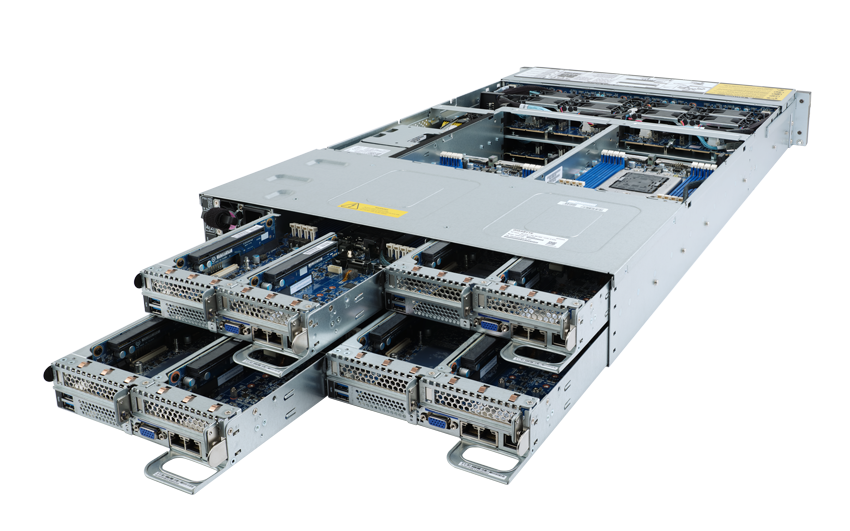
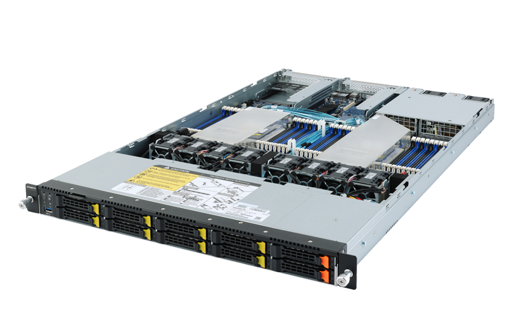

# Buy-in

## Overview
The University of Arizona's High Performance Computing (HPC) clusters are servers (computing nodes) and associated high performance storage. There are additional nodes to meet specific needs like high amounts of memory or GPUs. All UA research faculty can sign up for free monthly allocation [following these directions](/registration_and_access/account_creation). For researchers who need compute resource beyond the free standard allocation, and who have funding available, we encourage 'buy-in' of additional compute nodes.

## Benefits of Buy-in
|||
|-|-|
| **Dedicated Research Compute** | Research groups can 'Buy-In' (add resources such as processors, memory, etc.) to the base HPC systems as funding becomes available. Researchers receive 100% of the CPU*hour time their purchases create as a monthly high-priority allocation. This time receives the highest priority queue on the HPC systems.|
|**Quality Environment**|The Buy-In option allows research groups to take advantage of the central machine room space that is designed for maintaining high performance computing resources. The UITS Research Technologies group physically maintains the purchased nodes, applies updates and patches, monitors the systems for performance and security, and manages software. Additionally, Research Technologies staff is [available for research support](../../support_and_training/consulting_services/). In short, essentially all costs associated with maintaining compute resources are covered by UITS rather than individual researchers.|
|**Flexible Capacity**|Buy-in research group members also benefit from their resources being integrated into a larger computing resource. This means the buy-in resources can be used in conjunction with the free allocation and resources provided to address computational projects that would be beyond the capacity of a group running an independent system alone.|
|**Shared Resource**|The University research computing community as a whole benefits from buy-in expansions to the HPC systems. As mentioned above, researchers who buy-in receive 100% of the allocation of time for their purchase. However if the buy-in resources are not fully utilized, they are made available as windfall resources. This helps to ensure full use of all HPC resources and can be used to justify future purchases of computing resources.|
|**Cost Competitiveness**|Lower costs included in the grant proposals (i.e. hardware only, no operations costs) and evidence of campus cost‐sharing give a positive advantage during funding agency review.|
|**Pricing**|For the year following the award the UA HPC request for proposal (RFP) pricing is locked in and is often considerably less than the "market price."|

## Buy-in Policies
* For Puma, the University of Arizona could only purchase whole chassis units from Penguin Computing. That is 4 CPU nodes (option 1D), 1 GPU node with 4 GPUs (option 2D), or 1 high memory nodes (option 3). Research Computing worked to match partial node buy-in requests to make full nodes.
* Monthly high priority time is calculated as: (Number of CPUs * 24 hours * 365 year) / 12 months
* Purchasing GPUs expands the limit the PI has on number of GPUs that can be used at any time
* Buy-in high priority allocations will last the lifetime of the system. Puma was purchased in August 2020 and will be officially end-of-life August 2025.
* The HPC Buy-in program is not designed to replace or compete with the very large‐scale resources at national NSF and DOE facilities, e.g. ACCESS, the Open Science Grid. National resources are available at no financial cost to most US-based researchers through competitive proposal processes. Please contact our [consulting team](../../support_and_training/consulting_services/) if you are interested in applying for these resources.
* The HPC Buy-in program is designed to meet the needs of researchers with medium‐scale HPC requirements who want guaranteed, consistent access to compute resources.

## High-priority Allocation Policies
* Standard and high priority jobs will preempt windfall jobs when necessary. 
* Standard jobs do not run on high priority nodes since standard jobs can not be preempted
* High priority jobs are run on both the buy-in nodes and the centrally-funded nodes. This is advantageous if there is a short-term project deadline.

## Compute Buy-in Details (Puma 2020)
### Hardware
!!! warning "The buy-in process for Puma has ended. The community will be informed when the next purchase cycle is announced."

| Buy-in Option | Technical Specs |
|-|-|
| CPU-Only Node [Penguin Computing Altus XE2242](https://www.penguincomputing.com/products/servers/altus-servers/altus-xe2242-server/)  |There are 4 CPU nodes in an Altus XE2242 chassis Technical specs for 1 node of 4 in an Altus XE2242 chassis  - 96 cores: Dual socket AMD EPYC 7642 CPU (2x48 cores, 2.4 GHz, 225 W)  - 512 GB RAM, DDR4-3200MHz REG, ECC, 2Rx4 (16 x 32 GB)  - 2 TB SSD local hard drive, 2.5”, NVMe, 4 Lane, 1 DWPD, 3D TLC|
|GPU Node  [Penguin Computing Altus XE2214GT](https://www.penguincomputing.com/products/servers/altus-servers/altus-xe2214gt-server/) |GPU chassis have 4 GPUs in them Technical specs for the full XE2214GT chassis  - 96 cores: Dual socket AMD EPYC 7642 CPU (2x48 cores, 2.3 GHz, 225 W)  - 4 NVIDIA Tesla V100S-PCIe, 32 GB video memory, 5120 CUDA, 640 Tensor, 250 W :material-alert:{ title="These GPUs are no longer available" }   - 512 GB RAM, DDR4-3200 MHz REG, ECC, 2Rx4 (16 x 32 GB)  - 2 TB SSD local hard drive, NVMe, 4 Lane, 1 DWPD, 3D TLC|
|High Memory Node [Penguin Computing Altus XE1212](https://www.penguincomputing.com/products/servers/altus-servers/altus-xe1212-server/) |- 96 cores: Dual socket AMD EPYC 7642 CPU (2x48 cores, 2.4 GHz, 225 W)  - 3072 GB RAM, DDR4-2933 MHz LR, ECC, 4R (24 x 128 GB)   - 2 TB SSD local hard drive, NVMe, 4 Lane, 1 DWPD, 3D TLC|

### Cost and Allocations
???+ warning "Notice"
    * With V100S GPU's no longer available the pricing will be different.
    * The locked in pricing expired February 28, 2022.  
    
|Option Number|CPU Cores|V100s GPU|RAM (GB)|Monthly High-priority Allocation|Cost|
|-|-|-|-|-|-|
|**CPU-only Options**|
|1A - One CPU node|96||512|70,080|$8,037.50  (expired)|
|1B - Two CPU nodes|192||512|140,160|$16,075.00  (expired)|
|1C - Three CPU nodes|288||512|210,240|$24,112.00  (expired)|
|1D - Full [Altus XE2242](https://www.penguincomputing.com/products/servers/altus-servers/altus-xe2242-server/)|384||512|280,320|$32,150.00  (expired)|
| **GPU Node Options**|
|2A - 1/4 [Altus XE2214GT](https://www.penguincomputing.com/products/servers/altus-servers/altus-xe2214gt-server/)|24|1|512|17,520|$8,523.75  (expired)|
|2B - 2/4 [Altus XE2214GT](https://www.penguincomputing.com/products/servers/altus-servers/altus-xe2214gt-server/)|48|2|512|35,040|$17,047.50  (expired)|
|2C - 3/4 [Altus XE2214GT](https://www.penguincomputing.com/products/servers/altus-servers/altus-xe2214gt-server/)|72|3|512|52,560|$25,571.25  (expired)|
|2D - Full [Altus XE2214GT](https://www.penguincomputing.com/products/servers/altus-servers/altus-xe2214gt-server/)|96|4|512|70,080|$34,095.00  (expired)
|**High Memory Node**|
|3 - Full [Altus XE1212](https://www.penguincomputing.com/products/servers/altus-servers/altus-xe1212-server/)|96||3072|70,080|$42,230.00  (expired)|
