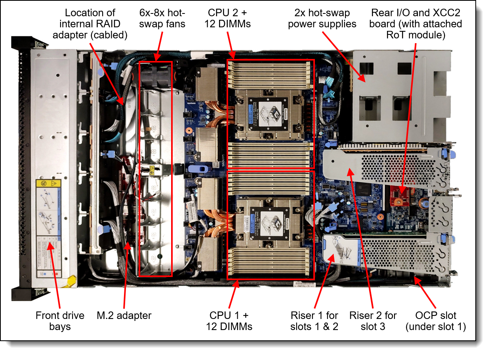
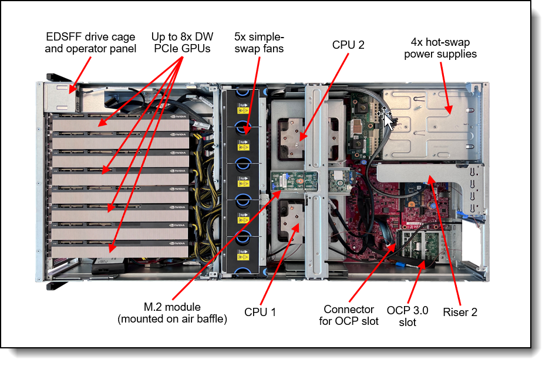

# Buy-in

## Overview
The University of Arizona's High Performance Computing (HPC) clusters are servers (computing nodes) and associated high performance storage. There are additional nodes to meet specific needs like high amounts of memory or GPUs. All UArizona research faculty can sign up for free monthly allocation [following these directions](/registration_and_access/account_creation/). For researchers who need compute resource beyond the free standard allocation, and who have funding available, we encourage 'buy-in' of additional compute nodes.

## Benefits of Buy-in
|||
|-|-|
| **Dedicated Research Compute** | Research groups can 'Buy-In' (add resources such as processors, memory, etc.) to the base HPC systems as funding becomes available. Researchers receive 100% of the CPU*hour time their purchases create as a monthly high-priority allocation. This time receives the highest priority queue on the HPC systems.|
|**Quality Environment**|The Buy-In option allows research groups to take advantage of the central machine room space that is designed for maintaining high performance computing resources. The UITS Research Technologies group physically maintains the purchased nodes, applies updates and patches, monitors the systems for performance and security, and manages software. Additionally, Research Technologies staff is [available for research support](../../support_and_training/consulting_services/). In short, essentially all costs associated with maintaining compute resources are covered by UITS rather than individual researchers.|
|**Flexible Capacity**|Buy-in research group members also benefit from their resources being integrated into a larger computing resource. This means the buy-in resources can be used in conjunction with the free allocation and resources provided to address computational projects that would be beyond the capacity of a group running an independent system alone.|
|**Shared Resource**|The University research computing community as a whole benefits from buy-in expansions to the HPC systems. As mentioned above, researchers who buy-in receive 100% of the allocation of time for their purchase. However if the buy-in resources are not fully utilized, they are made available as [windfall resources](../../resources/allocations#__tabbed_1_2). This helps to ensure full use of all HPC resources and can be used to justify future purchases of computing resources.|
|**Cost Competitiveness**|Lower costs included in the grant proposals (i.e. hardware only, no operational costs) and evidence of campus cost‐sharing give a positive advantage during funding agency review.|
|**Pricing**|For the year following the award the UArizona HPC request for proposal (RFP) pricing is locked in and is often considerably less than the "market price."|

## Buy-in Policies
* For Puma, the University of Arizona could only purchase whole chassis units from Penguin Computing. That is 4 CPU nodes (option 1D), 1 GPU node with 4 GPUs (option 2D), or 1 high memory nodes (option 3). Research Computing worked to match partial node buy-in requests to make full nodes.
* Monthly high priority time is calculated as: $\frac{{\text{{Number of CPUs}} \times 24 \text{{ hours/day}} \times 365 \text{{ days/year}}}}{{12 \text{{ months/year}}}}$
* Purchasing GPUs expands the limit the PI has on number of GPUs that can be used at any time.
* Buy-in high priority allocations are guaranteed for five years from the purchase, but will often last for the lifetime of the system. Puma was purchased in August 2020 and will be officially end-of-life August 2025.
* The HPC Buy-in program is not designed to replace or compete with the very large‐scale resources at national NSF and DOE facilities, e.g. [ACCESS](../../support_and_training/external_resources/#access), the Open Science Grid, etc. National resources are available at no financial cost to most US-based researchers through competitive proposal processes. Please contact our [consulting team](../../support_and_training/consulting_services/) if you are interested in applying for these resources.
* The HPC Buy-in program is designed to meet the needs of researchers with medium‐scale HPC requirements who want guaranteed, consistent access to compute resources.

## High-priority Allocation Policies
* Standard and high priority jobs will preempt windfall jobs when necessary. 
* Standard jobs do not run on high priority nodes since standard jobs can not be preempted
* High priority users have allocations on both the buy-in nodes and the centrally-funded nodese.

## Compute Buy-in Details for the new acquisition in March 2026
### Hardware

| Buy-in Option | Technical Specs |
|-|-|
| CPU-Only Node [Lenovo SR645 V3]  |This is a 1U server Technical specs for the node  - 192 cores: Dual socket AMD EPYC 9655 CPU (2x96 cores, 2.6 GHz)  - 768 GB RAM, DDR5-6400MHz (24 x 32 GB)  - 2 TB SSD local hard drive, 2.5”, NVMe|  ConnectX7 NDR infiniband|
|GPU Node  [Lenovo SR675 V3] |GPU server with 8 PCIe GPUs Technical specs for the server  - 96 cores: Dual socket AMD EPYC 9455 CPU (2x48 cores, 3.15 GHz)  - 8 NVIDIA Hopper H200 -PCIe, 141GB HBM3e, FP64 Tensor Core 60 TFLOPS, FP8 3,341 TFLOPS   - 1536 GB RAM, DDR5-6400 MHz4 (24 x 64 GB)  - 2 TB SSD local hard drive, NVMe|  ConnectX7 NDR infiniband|
|High Memory Node [Lenovo SR645 V3 |- 96 cores: Dual socket AMD EPYC 7642 CPU (2x48 cores, 2.4 GHz, 225 W)  - 3072 GB RAM, DDR4-2933 MHz LR, ECC, 4R (24 x 128 GB)   - 2 TB SSD local hard drive, NVMe|  ConnectX7 NDR infiniband|

### Cost and Allocations
???+ warning "Notice"
    * There is no locked in pricing. Each order will need a fresh quote.  
   
|Option Number|CPU Cores|H200 GPU|RAM (GB)|Monthly High-priority Allocation|Cost|
|-|-|-|-|-|-|
|**CPU-only Option**|The new nodes are a 1U server so they can be purchased individually whereas Puma nodes came four in one server|
|Price on 3/1/26: $150,000. This price fluctuates constantly|
| Full Lenovo SR645 V3|192|NA|768|138,240|Market Price|
| **GPU Node Options**|There are eight H200s in each server, so we support buying 1/8th of the server cost|
|Price on 3/1/26: $30,293 This price fluctuates constantly|
| 1/8 Lenovo SR675 V3|24|1|192|17,280|Market Price|
|**High Memory Node**|This is the same server as the standard node, with a lot more memory|
|Price on 3/1/26: $150,000. This price fluctuates constantly|
| Full Lenovo SR645 V3|192|NA|3072|138,240|Market Price| 
