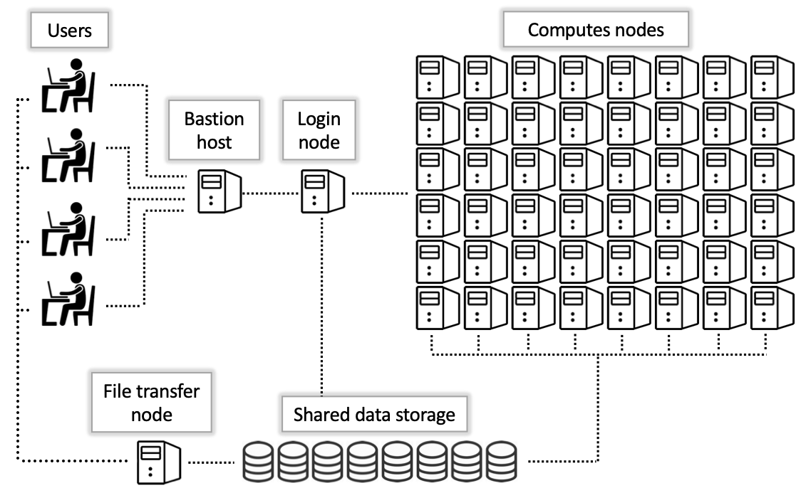

<link rel="stylesheet" href="../../assets/stylesheets/buttons.css">
# Accessing Compute Nodes

### The Compute Nodes

Unlike the bastion host and login nodes, there are many compute nodes and each has, as the name suggests, a large amount of computational resources available to run your work. For example, Puma standard nodes have 94 available CPUs and a whopping 470 GB of RAM. 

<center></center>

To get a sense of what the cluster looks like, try running the command ```nodes-busy```. The output should look something like this:

```
✚    Buy-in nodes. Only accept high_priority and windfall jobs
(puma) [netid@wentletrap ~]$ nodes-busy 
==============================================================

                      ▒ System Status ▒
              Wed Feb 14, 03:42:09 PM (MST) 2024

Standard Nodes
==============================================================
r1u16n2  :[▒▒▒▒▒▒▒▒▒▒▒▒▒▒▒▒▒▒▒▒] 100.0%   
r1u17n2  :[▒▒▒▒▒▒▒▒▒▒▒▒▒▒▒▒▒▒▒▒] 100.0%   
r1u18n1  :[▒▒▒▒▒▒▒▒▒▒▒▒▒▒▒▒▒▒▒▒] 100.0%   
r1u25n1  :[▒▒▒▒▒▒▒▒▒▒▒▒▒▒▒▒▒▒▒▒] 100.0%   
r1u26n1  :[▒▒▒▒▒▒▒▒▒▒▒▒▒▒▒▒▒▒▒▒] 100.0%   
r1u26n2  :[▒▒▒▒▒▒▒▒▒▒▒▒▒▒▒▒▒▒▒▒] 100.0%   
r1u27n1  :[▒▒▒▒▒▒▒▒▒▒▒▒▒▒▒▒▒▒▒▒] 100.0%   
```

Each line shows one compute node on the cluster you're connected to and how busy it currently is running jobs. By default, when you first log in you're connected to the Puma cluster. This is the largest and newest and generally provides the most in terms of computational resources. However, we have two other clusters available: Ocelote and El Gato, each with a good number of computational resources available and shorter wait times to access them. 

When you first connected to a login node in the previous section, your terminal should have displayed:

```
 ***
The default cluster for job submission is Puma
***
Shortcut commands change the target cluster
-----------------------------------------
Puma:
$ puma
(puma) $
Ocelote:
$ ocelote
(ocelote) $
ElGato:
$ elgato
(elgato) $
-----------------------------------------

```

This shows you the various shortcuts you can use to connect to the different clusters. Try running the command ```elgato``` now. You should see a change in your terminal prompt to indicate that your cluster has changed. 

```
(puma) [user@wentletrap ~]$ elgato
(elgato) [user@wentletrap ~]$ 
```
### Job Charging

Before we connect to a compute node, let's quickly cover how access is charged. 

Every HPC group gets a **free** allocation of CPU hours that they can spend every month to access compute resources. You can think of a CPU hour as a token to buy one CPU for one hour, so if you want to reserve 5 CPUs for 10 hours, this will charge 50 CPU hours to your account. You can see more detailed information on job queues, allocations, and job charging on our [Time Allocations](../../resources/allocations/) page which has a comprehensive breakdown. 

For this tutorial, we'll focus on the standard partition. This is a job queue and is the one that consumes your standard allocation. To use this job queue, you'll need to know your account name. To check, use the command ```va``` which stands for "view allocation". The output will look something like:

```
(elgato) [user@gpu5 ~]$ va
Windfall: Unlimited

PI: parent_974 Total time: 7000:00:00
    Total used*: 1306:39:00
    Total encumbered: 92:49:00
    Total remaining: 5600:32:00
    Group: group_name Time used: 862:08:00 Time encumbered: 92:49:00

*Usage includes all subgroups, some of which may not be displayed here
```

You should see a name next to the ```Group``` field (in the example above, this is ```group_name```). If you see multiple groups, then you are sponsored in multiple groups and can choose any one of your group names. Note the name of your account and hang onto it for the upcoming sections.

### Interactive Jobs

Now, let's actually access a compute node. When you're connected to a login node, you can initiate a Slurm job to interactively connect to a compute node by using the command ```interactive```. By default, this will give you one CPU for one hour. You can adjust this using the different flags available which are documented on our [Interactive Jobs](../../running_jobs/interactive_jobs/) page. For now, we'll stick with the default resources. 

To access a session, run the following, substituting your own group name (that you found with ```va``` in the section above) for ```<group_name>```:
```
interactive -a <group_name>
```

For example, in my case:
```
(elgato) [netid@wentletrap ~]$ interactive -a hpcteam
Run "interactive -h for help customizing interactive use"
Submitting with /usr/local/bin/salloc --job-name=interactive --mem-per-cpu=4GB --nodes=1    --ntasks=1 --time=01:00:00 --account=hpcteam --partition=standard
salloc: Granted job allocation 1800857
salloc: Nodes cpu39 are ready for job
[netid@cpu39 ~]$ hostname
cpu39.elgato.hpc.arizona.edu
```

You'll notice once your job starts that your command line prompt changes to display the name of the compute node. If you run ````hostname````, this should match your command line prompt and show you the name of the compute node you're connected to. In my case, I'm connected to the El Gato compute node ```cpu39```.

You'll also notice that your session has been assigned a job number (in the above, you can see this as ```Granted job allocation 1800857```). A job number is assigned to every job on the system and is used to keep track of job statistics and metrics. 

Since you're in an interactive session, you now have exclusive access to the resources you've reserved which means you can do things like use software to develop, test, run, and debug your code. Interactive sessions are optimal for these sorts of actions. However, you might run into problems executing your analyses if:

* Your session times out due to inactivity
* Your internet connection gets disrupted
* Your computer gets closed or turned off
* You want to run more than one job at a time

That's where batch jobs come in. 


## Batch Jobs

Batch jobs are the real workhorses of HPC. In contrast to interactive jobs, batch jobs are a way of submitting work to run on a compute node without the need for an active connection. Batch scripts are text files that act as blueprints that the scheduler uses to allocate resources and execute the terminal commands needed to run your analysis. 

Batch jobs are initiated by submitting a batch script using the command ```sbatch myscript.slurm```. The instructions in that script are then sent to the scheduler, which puts your job in queue to wait while it looks for the necessary resources. Once the resources required become available, your job automatically begins running. The time your job spends in queue depends on many factors, including the scale of your resource request and the overall system usage. To check on jobs you have submitted, use the command ```squeue --user=<your_netid>```. 

After the scheduler has received your request, the rest happens automatically. This means you can close your SSH connection, or even turn off your personal computer and walk away without interrupting your jobs. This workflow enables you to submit tens, hundreds, or even thousands of jobs to run simultaneously, dramatically increasing your productivity over what is possible with a local workstation.

Constructing batch scripts involves specific syntax and parameters that are too detailed to cover in this Quick Start. Instead, see [Intro to Batch Jobs](../../running_jobs/batch_jobs/intro/) for details. 


<html>
<div class="button-container">
    <a href="/quick_start/storage_and_transfers/"><button class="left-button"></button></a>
    <a href="/quick_start/software/"><button class="right-button"></button></a>
</div>
</html>
