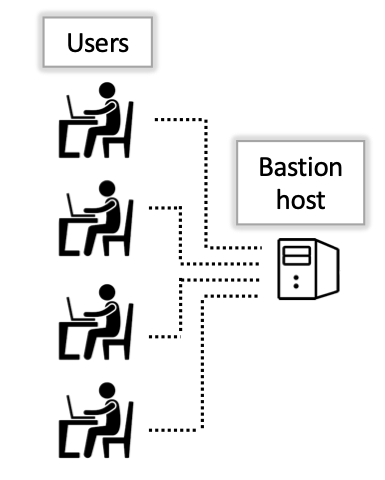

<link rel="stylesheet" href="../../assets/stylesheets/buttons.css">

# Logging In and System Layout

??? warning "Account creation is necessary to log in"
    If you have not yet done so, you will need to register for an account to log in. See <a href="../../registration_and_access/account_creation/" target="_blank">our registration documentation</a> for steps. 

## System Access

!!! tip 
    If you experience any issues during the login process, [see our FAQs for common problems](../../support_and_training/faqs/account_access/).

Once you've succesfully registered for an HPC account, you're ready to log in. There are two main methods to access the HPC system

1. **Open OnDemand**

	This is a browser-based application that provides users with a graphical interface to access the HPC filesystem, run software that requires a graphical component, or access an interactive desktop environment. The login portal for Open OnDemand uses the familiar UArizona WebAuth login screen. HPC accounts are tied to university accounts, so use your standard NetID and password (i.e. the one used for your email).

2. **Terminal**

	The terminal is a text-based command interpreter provided by the operating system on your local machine. Mac and Linux users can access the "Secure SHell" (SSH) command by default, and Windows users will either have to use the [Linux subsystem for Windows](https://learn.microsoft.com/en-us/windows/wsl/install), or a program called [PuTTY](https://www.putty.org/). Using these tools, users can access a command-line environment on the HPC, which can be used to manage files, write code, install software, and submit jobs. See our [Bash Cheat Sheet](../../support_and_training/cheat_sheet) for an overview of common commands.

## System Layout

The inner workings of HPC systems may be somewhat obscured to new users. In this section, we'll give you an idea of how the system is laid out so you understand exactly where you are at each stage of the login process and what activities are performed where. 

### The bastion host

In another browser window, open [our instructions on logging in from the command line](../../registration_and_access/system_access/#command-line-access). Start by following the first step shown that's specific to your operating system. Stop when your terminal displays 

```
Success. Logging you in...
Last login:
This is a bastion host used to access the rest of the RT/HPC environment.

Type "shell" to access the job submission hosts for all environments
```
If all has gone well, you are now connected to what is known as the bastion host. 

<center></center>

The bastion host is the first computer you land on when you log in using the hostname ```hpc.arizona.edu```. This machine is only used to validate your credentials and provide a gateway to the rest of the HPC environment. It is not used for storing files and has no software installed so no computational work is done at this stage. As a test, try running the command ```hostname```:

```
[user@gatekeeper 14:50:49 ~]$ hostname
gatekeeper.hpc.arizona.edu
```

The output shows ```gatekeeper``` which is the name of this node and is how you can tell you're connected to the bastion. 

Next, to advance from the bastion host, type the command ```shell```.


### The login nodes

After you type ```shell``` on the bastion host, you're connected to a computer called a login node. 

<center></center>

We have two of these available and you will be assigned one at random. If you run the ```hostname``` command as you did on the bastion host, you should see either ```wentletrap``` or ```junonia```. 

A login node is a shared workspace with minimal computational capabilities and very little software installed. This is not the place where computational work is done so users should not run their analyses, compile their software, or perform computationally intensive work in this location. Instead, the login nodes are meant for activities such as managing files, writing scripts, submitting and monitoring jobs, and viewing system resources.


<html>
<div class="button-container">
    <a href="/quick_start/common_misconceptions/"><button class="left-button"></button></a>
    <a href="/quick_start/storage_and_transfers"><button class="right-button"></button></a>
</div>
</html>
