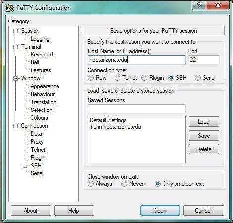
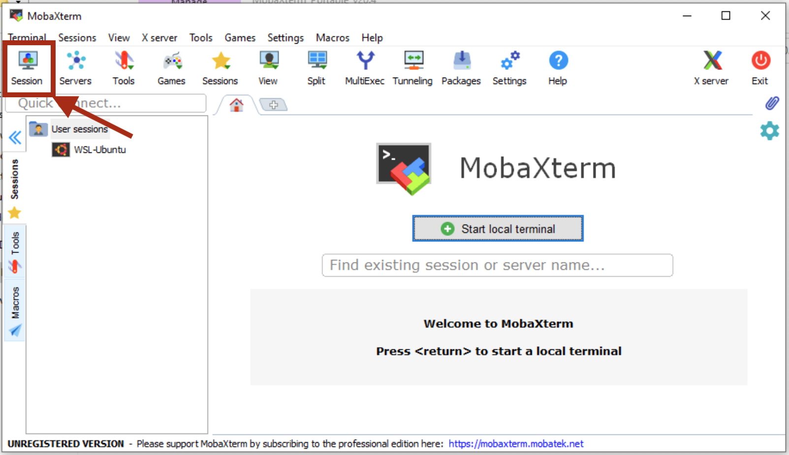
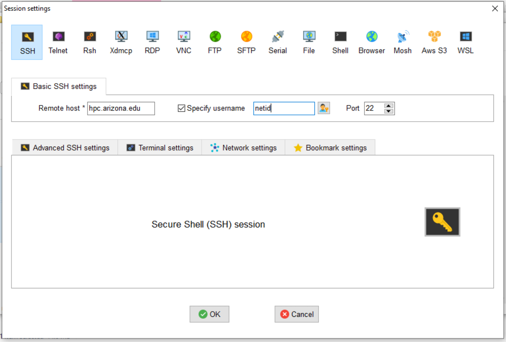
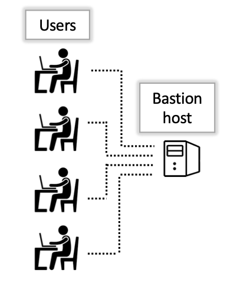
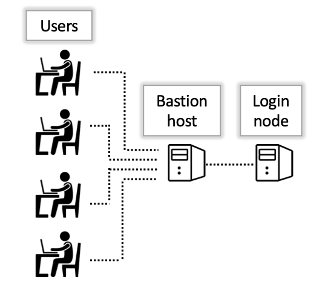

<link rel="stylesheet" href="../../assets/stylesheets/buttons.css">
<link rel="stylesheet" href="../../assets/stylesheets/images.css">

# Logging In

## System Access
!!! warning "Account creation is necessary to log in"
    If you have not yet done so, you will need to register for an account to log in. See <a href="../../registration_and_access/account_creation/" target="_blank">our registration documentation</a> for steps. 


!!! info "Login issues"
    If you experience any issues during the login process, [see our FAQs for common problems](../../support_and_training/faqs/).

??? danger "Do not run computations on the login nodes." 
    See [Running Jobs](../../running_jobs/overview/) for detailed instructions on the proper way to run computationally intensive tasks. 

Once you've successfully registered for an HPC account, you're ready to log in. There are two main methods to access the HPC system

1. **Open OnDemand**

	This is a browser-based application that provides users with a graphical interface to access the HPC filesystem, run software that requires a graphical component, or access an interactive desktop environment. The [login portal for Open OnDemand](https://ood.hpc.arizona.edu/) uses the familiar UArizona WebAuth login screen. HPC accounts are tied to university accounts, so use your standard NetID and password (i.e. the one used for your email).

2. **Terminal**

	The terminal is a text-based command interpreter provided by the operating system on your local machine. Mac and Linux users can access the "Secure SHell" (SSH) command by default, and Windows users will either have to use the [Linux subsystem for Windows](https://learn.microsoft.com/en-us/windows/wsl/install), or a program called [PuTTY](https://putty.software/). Using these tools, users can access a command-line environment on the HPC, which can be used to manage files, write code, install software, and submit jobs. See our [Bash Cheat Sheet](../../support_and_training/cheat_sheet/) for an overview of common commands.

## System Layout

The inner workings of HPC systems may be somewhat obscured to new users. In this section, we'll give you an idea of how the system is laid out so you understand exactly where you are at each stage of the login process and what activities are performed where. 

### The bastion host

!!! question "HPC Credentials"
    Note that for all HPC services, you will use your University of Arizona NetID and password. There are no HPC-specific usernames or passwords needed.

Let's get started by connecting to HPC using a local SSH client. The term SSH refers to a network protocol that allows you to securely connect to a remote server. In this case, the remote server is HPC. 

Select your local computer's operating system from the tabs below and follow the instructions given on how to connect. 


=== "Linux/Mac"
    ???+ info "Mac terminal access"
        Mac systems provide a built-in SSH client, so there is no need to install any additional software. You will find the terminal application under **Applications → Utilities → Terminal**.
        
    Open the terminal and enter:
    ```bash
    ssh <netid>@hpc.arizona.edu
    ```
    where `<netid>` is your UArizona NetID. When you press enter, you will be prompted for your university password. Type it on the command line, then press ++enter++. Note that when you enter your password on the command line, no characters will appear. This is normal security behavior and doesn't mean your terminal is frozen. After successfully entering your password, you will be prompted to Duo Authenticate. 


=== "Windows"
    Windows systems have limited native support for SSH. It is generally recommended to use one of these programs.
        
    === "PuTTY"
        PuTTY is the most popular open source SSH Windows client. To use it: download, install, and open the [Putty client](https://putty.software/). Next, open a connection and enter `hpc.arizona.edu` under **Host Name** and press **Open**
            
        
            
        This will open a terminal. At the prompt, enter the following, replacing ```<netid>``` with your own NetID:
            
        ```bash
        Login as: <netid>
        ```
            
        You will then be prompted to enter your NetID password, then to Duo-Authenticate.
        
    === "MobaXterm"

        **Basic Connection**

        MobaXterm is an available SSH Windows client. To connect to HPC, [download and install MobaXterm](https://mobaxterm.mobatek.net/download.html), open the software, select **Session** 
            
        

        From there, select **SSH** and enter ```hpc.arizona.edu``` under **Remote host**. Next, select the box next to **Specify username** and enter your UArizona NetID. To connect, click OK at the bottom of the screen:
        
        
            
        This will open a terminal and will prompt you for your NetID password. You will then need to Duo-authenticate. 


If everything was successful, you will be connected to what's know as the **bastion host**. When you first connect to this machine, you should see the following:

```
Success. Logging you in...
Last login:
This is a bastion host used to access the rest of the RT/HPC environment.
   
Type "shell" to access the job submission hosts for all environments
```

<center></center>

The bastion host is the first computer you land on when you log in using the hostname `hpc.arizona.edu`. ==This machine is only used to validate your credentials and provide a gateway to the rest of the HPC environment. It is not used for storing files and has no software installed so no computational work is done at this stage==. 

As a test, try running the command `hostname`:

```
[user@gatekeeper 14:50:49 ~]$ hostname
gatekeeper.hpc.arizona.edu
```

The output shows ```gatekeeper``` which is the name of this node and is how you can tell you're connected to the bastion. 

Next, to advance from the bastion host, type the command ```shell```.


### The login nodes
<center></center>

After you type ```shell``` on the bastion host, you're connected to a computer called a **login node**. 


We have two of these available and you will be assigned one at random. If you run the `hostname` command as you did on the bastion host, you should see either `wentletrap` or `junonia`. 

```
(puma) [user@junonia ~]$ hostname
junonia.hpc.arizona.edu
```

A login node is a shared workspace with minimal computational capabilities and very little software installed. This is not the place where computational work is done so users should not run their analyses, compile their software, or perform computationally intensive work in this location. Instead, the login nodes are meant for activities such as managing files, writing scripts, submitting and monitoring jobs, and viewing system resources.

<br style="clear: both;">


<html>
<div class="button-container">
    <a href="/quick_start/common_misconceptions/"><button class="left-button"></button></a>
    <a href="/quick_start/storage_and_transfers/"><button class="right-button"></button></a>
</div>
</html>
