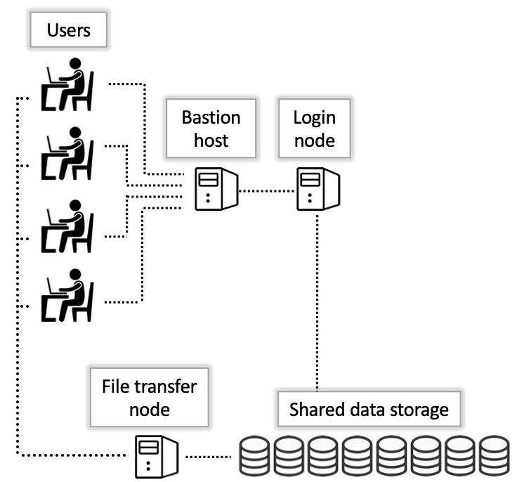

<link rel="stylesheet" href="../../assets/stylesheets/buttons.css">
# Storage and Transfers

When you first access a login node, you're located in your home directory. This is a space with a 50 GB limit and is accessible to only you. The files you store here are housed on a large storage array and are accessible anywhere you are on the system except the bastion host. 

!!! warning "Do not overfill your home directory"

    Once your data reaches the 50 GB limit you will experience problems, like the inability to log into Open OnDemand because the session file cannot be created. And your jobs may fail with unexpected errors depending on how your software reacts to no more space for writing output. 

To store your files in your home, you will need to transfer them to the system. Small files can most easily be transferred to/from HPC using our web interface [Open OnDemand](https://ood.hpc.arizona.edu/). In the upper-left you'll see a dropdown called Files where you can select Home Directory. 

On the following page, select "Upload" to open a window where you can drag/drop files.

For larger files, we have a designated **Data Transfer Node** (DTN). Comprehensive instructions for alternative methods for file transfers can be found on [our data transfer page](../../storage_and_transfers/transfers/overview/). 

With larger files comes the need for more storage. If you find your home is insufficient to store your data, group allocations are available. See our [storage documentation](../../storage_and_transfers/storage/hpc_storage/) for details on options that are available. 

Now that we're on the login nodes and know where our files are, it's time to access a compute node. 

<html>

    <a href="/quick_start/logging_in/"><button class="left-button"></button></a>
    <a href="/quick_start/accessing_compute/"><button class="right-button"></button></a>

</html>
