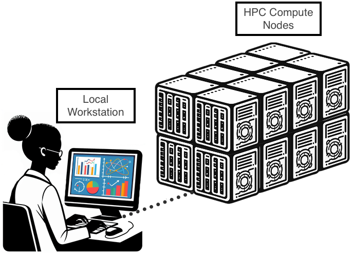

<link rel="stylesheet" href="../../assets/stylesheets/buttons.css">
<link rel="stylesheet" href="../../assets/stylesheets/images.css">

# What is HPC?
!!! tip "Keywords in bold"
    Important concepts are emphasized in bold in the text below. We will explore these keywords in depth in the upcoming HPC Quick Start sections. 

If you've never used an HPC system before, you may be wondering what one is and why you'd want to use it. This section is designed to give you a big picture understanding of what these systems offer and how they may benefit your research.

## Introduction to HPC

### What is HPC?

HPC stands for **High Performance Computing** and is synonymous with the more colloquial term **Supercomputer**. A supercomputer is a collection, or cluster, of a large number of regular computers (referred to as **compute nodes**) connected over a network. Each of the computers is like a local workstation though typically much more capable. For example, a standard laptop might have 4 CPUs and 8 GB of RAM. Compare this with a standard compute node on one of our clusters, Puma, which has a whopping 94 CPUs and 470 GB of RAM. 

### Shared Resource Model

Another main difference between a supercomputer and a personal workstation is that the supercomputer is a **shared resource**. This means there may be hundreds or even thousands of simultaneous users. Each of these users connects to HPC from their own local workstation and can run work on one or more of HPC's compute nodes. You can imagine with this shared resource model, however, that without some sort of coordination, managing which users get what resources turns into a major logistical challenge. That's why supercomputers use **job schedulers**. 

### Role of Job Schedulers
!!! tip "Batch Jobs Documentation"
    More comprehensive information on using job schedulers and running batch jobs can be found in the [Running Jobs](../../running_jobs/batch_jobs/intro/) section.

A job scheduler is software used to coordinate user jobs. In our case, we use a scheduler called [Slurm](https://slurm.schedmd.com/documentation.html). You can use it by writing a **batch script** that requests compute resources (e.g., CPUs, RAM, GPUs) and includes instructions for running your code. You submit this script to the job scheduler which then goes and finds available resources on the supercomputer for your job. When the resources become available, it initiates the commands included in your batch script, and outputs the results to a text file. 

## Benefits of HPC

### Scaling Up and Scaling Out

Supercomputers provide opportunities for data storage and parallel processing that far surpass what is capable in a standard workstation. These systems provide researchers with the ability to **scale up** or **scale out** their work.

Increasing the data throughput of a single job is known as **scaling up**. This may mean moving from a 500 GB database on a workstation to a 5 TB database on the HPC, or raising the resolution of your simulation by a factor of 10 or 100. 

Other types of analyses may benefit from an increased number of jobs, such performing parameter sweeps, running Monte Carlo simulations, or performing molecular dynamics simulations. Local machines are limited by the number of cores accessible to them, decreasing the number of simultaneous computations as compared to an HPC. An increase in the number of CPUs used during analysis is known as **scaling out** your work.

### Workflow Automation 

**Automation** is another feature of HPC systems that allows users to schedule jobs ahead of time, and for those jobs to be run without supervision. Managing a workstation or keeping an SSH terminal active while scripts are running can lead to major complications when running extended analyses. Batch scripts allow a prewritten set of instructions to be executed when the scheduler determines that sufficient resources will be available. This allows for jobs with extended completion times to be run for up to 10 days (a limit imposed by the scheduler). Real-time output is saved to a text file, allowing you to check the progress of the job. **Checkpointing** is recommended for jobs that require longer than 10 days.

<html>

    <a href="/quick_start/overview/"><button class="left-button"></button></a>
    <a href="/quick_start/common_misconceptions/"><button class="right-button"></button></a>

</html>