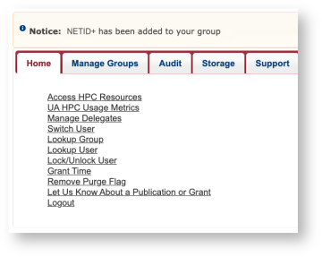
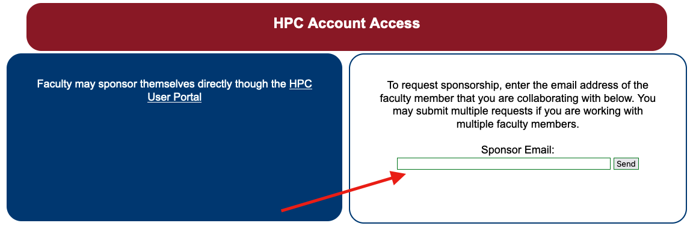

# Account Creation

## Overview
All UArizona Faculty, Staff, Students, and Affiliates are eligible for HPC accounts free of cost.

If you are considered to be a PI in the University's employee system (EDS) you may establish a PI account. PI Accounts are self-sponsored, manage their own HPC group(s), and receive their own time and storage allocations to be shared among group members. Staff, students and affiliates must be sponsored by a PI at the PI's discretion to obtain HPC access. Users may be a member of more than one HPC group.

## How to Register

The process of registering for an HPC account varies depending on your affiliation with the university. Take a look at the list below to determine how you should register:

<html>
<link rel="stylesheet" href="../../assets/stylesheets/animated_dropdown.css">

<button class="collapsible">I'm a faculty member/principal investigator (PI)</button>

    
If you are a research faculty member or principal investigator, you can sponsor yourself for access through our user portal. 
      
    <b>Step 1</b>: Visit <a href="https://portal.hpc.arizona.edu/">https://portal.hpc.arizona.edu/</a>. This will automatically create an HPC account for you. 
      
    <b>Step 2</b>: Go to <a href="https://portal.hpc.arizona.edu/portal/sendlink.php">https://portal.hpc.arizona.edu/portal/sendlink.php</a> and click the link on the left-hand side as shown below
     
    
     
     
     This will automatically redirect you back to the user portal, create a research group for you, and add you as a member. You will briefly see a pop-up notification verifying you've been added to your group. You can check this by going to the Manage Groups tab and clicking your group's dropdown menu to view its members. 
      
     
    

     
<button class="collapsible">I'm a student, postdoc, staff member, or Designated Campus Colleague</button>

    

     If you are affiliated with the University of Arizona but are not faculty, you will need to request sponsorship from a faculty member. This can be done through our web portal.
       
    <b>Step 1</b>: Create an HPC account by navigating to <a href="https://portal.hpc.arizona.edu/">https://portal.hpc.arizona.edu/</a>.
      
    <b>Step 2</b>: Request sponsorship from a UArizona faculty member. Note: Your faculty sponsor will need their own HPC account before they are able to sponsor others.
      
    To request sponsorship, navigate to <a href="https://portal.hpc.arizona.edu/portal/sendlink.php">https://portal.hpc.arizona.edu/portal/sendlink.php</a>. On the right-hand side, enter your sponsor's email address and click send. 
    
    

    Your sponsor will then receive an email with a link used to authorize your account. Once they confirm your request, you will receive an email with instructions for accessing the HPC systems.
      
    Note: it may take up to 15 minutes after approval to receive a confirmation email and for your account to officially be activated.
     
    If you do not receive an email verification, you should contact your sponsor and confirm receipt and approval of the HPC account request. If your account has been approved but you have not received verification, you should contact HPC consulting and provide your NetID, your name, and the email address of your sponsor. 
    

    
<button class="collapsible">I'm not affiliated with the university</button>

 
    

    HPC systems are restricted to those with valid university credentials and are not available for general public use. However, if you are not officially affiliated with the university but are actively collaborating with university members, you may register for <a href="https://it.arizona.edu/service/designated-campus-colleague-accounts">Designated Campus Colleague (DCC) status</a>. This is done through human resources and provides collaborators with active UArizona credentials. Once your DCC status is approved, you may request sponsorship from a university faculty member (see the section above).
    

</html>
