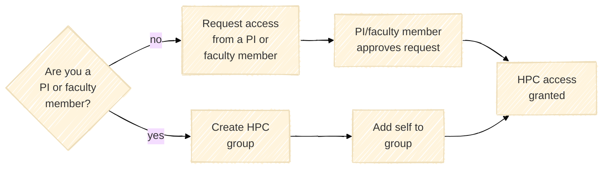
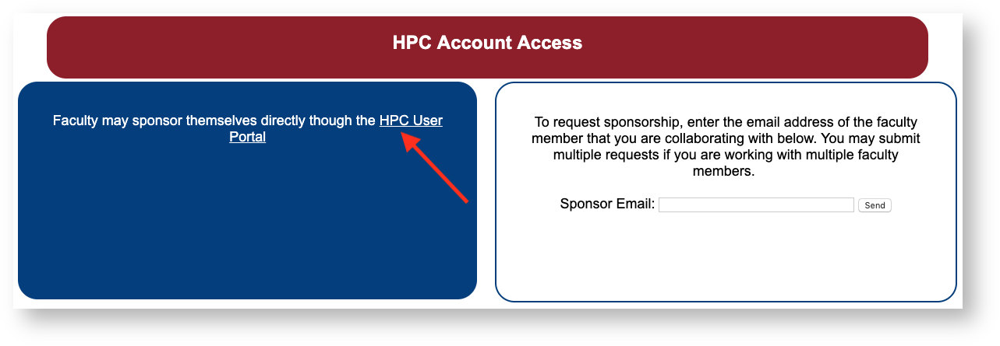
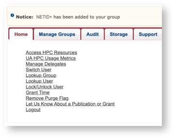
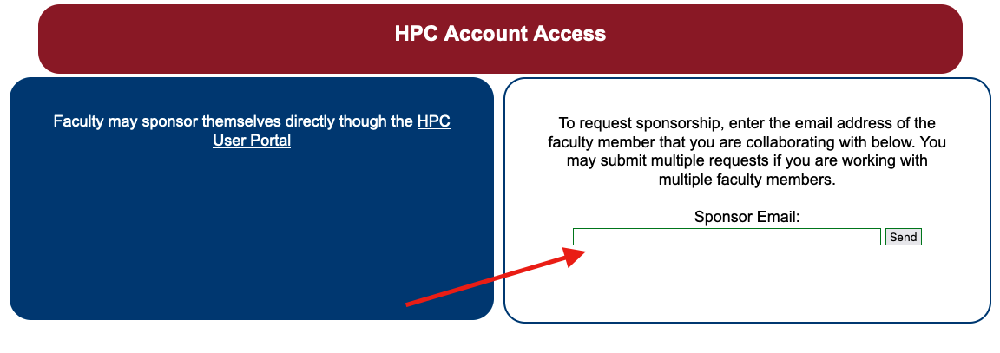

# Account Creation

??? link "Getting Started with HPC - Helpful Pages"

    - [HPC Quick Start](../../quick_start/overview/) - introduction to our HPC system
    - [Standard Practices](../../policies/standard_practices/) - important policies, recommendations, and helpful tips 
    - [Frequently Asked Questions](../../support_and_training/faqs/) - solutions to common issues
    - [HPC Terms Glossary](../../support_and_training/glossary/) - definitions and explanations of selected jargon
    - [Linux Cheat Sheet](../../support_and_training/cheat_sheet/) - helpful information on linux, bash, file permissions, etc.

## Overview

All University of Arizona Faculty, Staff, Students, and Affiliates are eligible for HPC accounts **free of cost**. Access to the HPC systems is managed through faculty or principal investigator (PI)-sponsored HPC groups. Every user must be a member of at least one(1) HPC group to log in and use resources.
{ .annotate }

1.  HPC members are permitted to be members of multiple groups.

The general process for obtaining access is:

* A PI or faculty member creates an HPC group in our user portal.
* The PI or faculty member adds themselves to their HPC group. (1)
  { .annotate }

    1.  This step is important for ensuring 

        * the PI/faculty member has HPC access
        * that the proper storage partitions are set up for the group.

* The PI or faculty member may then sponsor other university members by adding them to their group. This grants them access. 

```mermaid
---

config:
  theme: base
  look: handDrawn
---
flowchart LR
        A["Are you a<br>PI or faculty <br>member?"]
        A -->|yes| B["Create HPC<br>group"]
        B --> C["Add self to<br>group"]
        A -->|no| D["Request access<br>from a PI or<br>faculty member"]
        D --> E["PI/faculty member<br>approves request"]
        E --> F["HPC access<br>granted"]
        C --> F
        A@{ shape: diam}
```

## How to Register

The specific details of registering for an HPC account are described in this section. Which process you use varies depending on your affiliation with the university. Take a look at the list below to determine how you should register:

<html>
<link rel="stylesheet" href="../../assets/stylesheets/animated_dropdown.css">
<button class="collapsible">I'm a faculty member/principal investigator (PI)</button>

    
If you are a research faculty member or principal investigator, you can sponsor yourself for access through our user portal. <mark><b>Important:</b> you must complete both steps or your account will not be set up correctly.</mark>
      
    <b>Step 1</b>: Visit <a href="https://portal.hpc.arizona.edu/" target="_blank">https://portal.hpc.arizona.edu/</a>. This will register you in our system. 
      
    <b>Step 2</b>: Go to <a href="https://portal.hpc.arizona.edu/portal/sendlink.php" target="_blank">https://portal.hpc.arizona.edu/portal/sendlink.php</a> and click the link on the left-hand side as shown below
     
    
     
     
     This link is a shortcut and will <b>create a research group for you</b> (named your NetID), and <b>add you as a member</b>. You will be redirected to the user portal as part of this process. 
       
     Double check your group and membership in the portal by going to the <b>Groups</b> tab and clicking your group's dropdown menu to view its members. 
      
     
    

    
<b>Ensure that you are a member of your group</b>. If you are not a member, you will not have access to the system and your group's storage will be limited.
    
      
    If for some reason you are not a member, enter your NetID in the box under <b>Add a new group member</b> and click the button <b>Add Member</b> below (as seen in the screenshot above). This will manually sponsor you for access. 
      
    For more information on how you can manage your HPC group, see our <a href="../group_management/">Group Management</a> documentation.

     
<button class="collapsible">I'm a student, postdoc, staff member, or Designated Campus Colleague</button>

    

     If you are affiliated with the University of Arizona but are not faculty, you will need to request sponsorship from a faculty member with an HPC account. <b>If the faculty member you are working with does not have an HPC account, they will first need to create one</b>. You can have them do so by directing them to this documentation and having them follow the instructions under the dropdown <b>I'm a faculty member/principal investigator (PI)</b> above. 
       
     The process for requesting access is the following:
       
    <b>Step 1</b>: Register yourself in our system first by navigating to <a href="https://portal.hpc.arizona.edu/" target="_blank">https://portal.hpc.arizona.edu/</a>.
      
    <b>Step 2</b>: Request sponsorship from a UArizona faculty member. To request sponsorship, navigate to <a href="https://portal.hpc.arizona.edu/portal/sendlink.php" target="_blank">https://portal.hpc.arizona.edu/portal/sendlink.php</a>. On the right-hand side, enter your sponsor's <b>@arizona.edu</b> email address and click send. 
    
    
     
    Your sponsor will then receive an email with a link used to authorize your account. Once they confirm your request, you will receive an email with instructions for accessing the HPC systems.
      
    Note: it may take up to 15 minutes after approval to receive a confirmation email and for your account to officially be activated.
     
    If you do not receive an email verification, you should contact your sponsor and confirm receipt and approval of the HPC account request. If your account has been approved but you have not received verification, you should <a href="../../support_and_training/consulting_services/">contact HPC consulting</a> and provide your NetID, your name, and the email address of your sponsor. 
    

    
<button class="collapsible">I'm not affiliated with the university</button>

 
    

    HPC systems are restricted to those with valid university credentials and are not available for general public use. However, if you are not officially affiliated with the university but are actively collaborating with university members, you may register for <a href="https://it.arizona.edu/service/designated-campus-colleague-accounts" target="_blank">Designated Campus Colleague (DCC) status</a>. This is done through human resources and provides collaborators with active UArizona credentials. Once your DCC status is approved, you may request sponsorship from a university faculty member (see the section above).
    

</html>