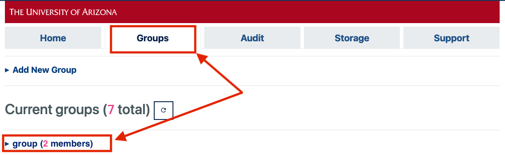
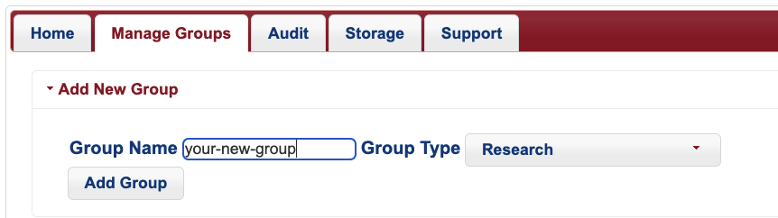

# Group Management 

## Overview

HPC groups allow faculty members to manage file permissions, job allocations, and group members. When a PI creates a new HPC account, a group is created with an allocation of space and time. Additional storage is available for free upon request, called [xdisk](../../storage_and_transfers/storage/hpc_storage/)

There are two types of Groups: **Research Groups** and **Class Groups**.

* Research groups include any faculty, postdocs, graduate students, DCCs, staff, or student workers actively affiliated with your group's research. 
* Class groups are for educational purposes only and will include students enrolled in a semester-long course.

## Research Groups

If you are a faculty member who has [registered for an HPC account](../account_creation/), a research group named after your UArizona NetID has been automatically created for you. This group has [an allocation of CPU hours](../../resources/allocations/) associated with it as well as [communal storage for your data](../../storage_and_transfers/storage/hpc_storage/).

**Membership and Allocation**

Members of research groups have full access to the PI's allocation. PIs are able to create multiple research groups that pull from the same allocation. Users are able to be members of multiple research groups. Creating multiple research groups does not change the total CPU-time allocation.

**Permissions**

Research groups can also be used to manage access permissions to files and folders on HPC. The PI can use the ```chgrp``` command to change which group has access rights corresponding to the 'group' setting on a particular item. See our [Linux File Permissions](/support_and_training/cheat_sheet/#linux-file-permissions) cheat sheet for more information.


### Adding Members

To add members to your research group, go to [https://portal.hpc.arizona.edu/](https://portal.hpc.arizona.edu/) and click the **Manage Groups** tab at the top of the screen. Click your group's dropdown tab and click **Add Member**



Enter the user's UArizona NetID in the box that appears, and select **Add**


To add members in bulk, you may also select **Upload Member List** and upload a CSV file of UArizona NetIDs.

The process of adding new members may take a few seconds to complete. Once the changes have taken place, you will see the user's NetID in your group:


### Creating a New Group

A new group can be created at any time through the user portal. New groups will share their time and storage allocations with your primary group. Alternate research groups can be a good solution for managing file permissions. For example, if a particular directory and its contents needs restricted access, you could do this by creating a new research group, adding the group members who need access to those files, and then changing the group ownership of the files/directories.

To create a new group, log into the user portal, select the **Manage Groups** and select the **Add New Group** dropdown menu. 



Once your group has been created, you will see it when running ```va``` (short for View Allocation) in the same block as your primary group:

```bash
(puma) [faculty-netid@junonia ~]$ va
PI: parent_1206 Total time: 7000:00:00
    Group: faculty-netid Time used: 0:00:00 Time encumbered: 0:00:00
    Group: your-new-group Time used: 0:00:00 Time encumbered: 0:00:00
    Total used: 0:00:00
    Total encumbered: 0:00:00
    Total remaining: 7000:00:00
```

## Class Groups

!!! tip 
    If you are interested in having an HPC staff member come to your class to do an Intro to HPC presentation, reach out to our consultants.
    
If you are a faculty member and are teaching a course that makes use of HPC resources, you can create a class group that will grant your students system access. Class groups are designed to be created and used for one semester only.

### Creating a Class Group

Log into your [user portal](https://portal.hpc.arizona.edu/), navigate to the **Manage Groups** tab, and select the **Add New Group** dropdown option at the top of the page.There will be an option to specify your **Group Type** on the right. Choose **Class** from the dropdown menu


Under **Group Name**, enter something descriptive and then complete the process by clicking **Add Group**.


Once this process is complete, you can find your group's dropdown tab under **Manage Groups**. There you can add students either individually or in batch by uploading a CSV file with your student's NetIDs. You may also remove students from the group by clicking their NetIDs and then selecting Remove Member(s), or delete the group itself by selecting Delete Group.


### File Permissions and Storage
Students in your class group will only be able to access files and directories owned by the class group. This means they will not be able to access files and directories owned by your standard research group. 

### Running Jobs and Allocations
Due to Arizona sales tax restrictions, class groups may only use the windfall queue on Puma. However, standard hours may be used by students on Ocelote. To submit standard jobs on Ocelote, students will use the class group's name for the ```--account``` SLURM directive. For example:

```bash
#SBATCH --account=hpc101
#SBATCH --partition=standard
```
Standard hours used on Ocelote are pulled from the same pool as your research group so make sure to plan accordingly. If you run the command ```va```, you will see the class group as being nested under the total time allocated to your primary research group as well as any others you may have created. Students will not see the names of your other research groups if they run va unless they are members. 

```bash
(ocelote) [faculty_netid@wentletrap ~]$ va
Windfall: Unlimited
 
PI: parent_000 Total time: 100000:00:00
    Group: hpc101 Time used: 0:00:00 Time encumbered: 0:00:00
    Group: faculty_netid Time used: 0:00:00 Time encumbered: 0:00:00
    Total used: 0:00:00
    Total encumbered: 0:00:00
    Total remaining: 100000:00:00
```

## Delegating Group Management Rights

### Adding a Delegate
PI's can delegate management rights to trusted group members. Delegates may create research and class groups, sponsor users, remove users, and request and manage storage offerings on behalf of their faculty sponsor. To add a group member as a delegate, the PI can click the **Manage Delegates** link on the home page of the [user portal](https://portal.hpc.arizona.edu/portal/). In the Manage Delegates window that appears, select **Add Delegate**, enter your group member's NetID, and click **Add**.


### Instructions for Delegates

Once a group member has been added as a delegate, they can log into the user portal, select **Switch User**, enter their PI's NetID in the pop-up field, and click **Switch User**. This will allow them to perform functions on their PI's behalf. They may switch back to their own account at any time by selecting Switch User and entering their own NetID.


