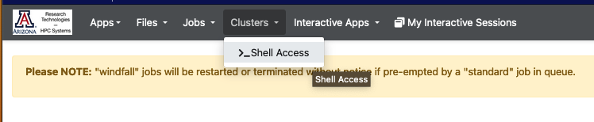
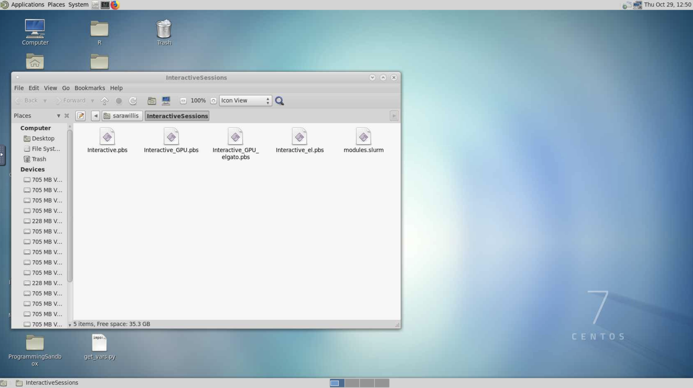
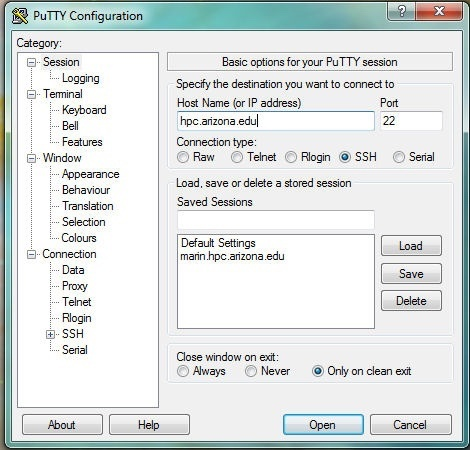
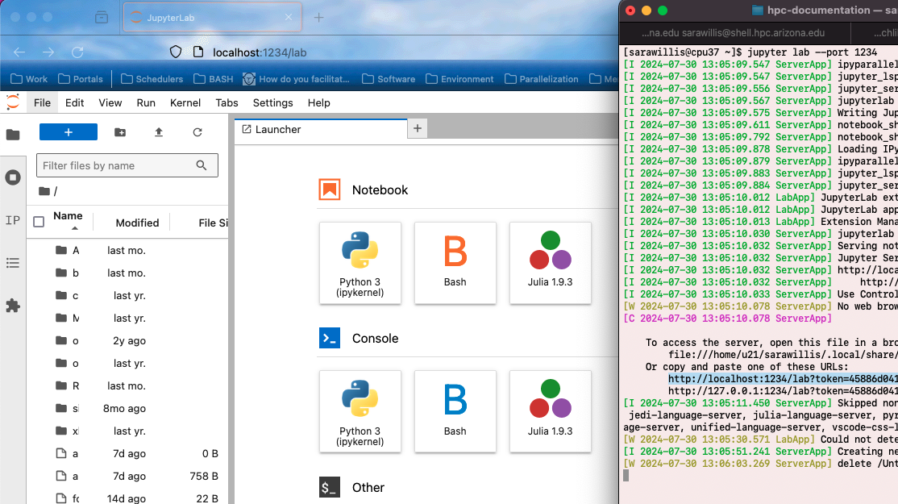

<link rel="stylesheet" href="../../../assets/stylesheets/animated_dropdown.css">
<link rel="stylesheet" href="../../../assets/stylesheets/spacing.css">

# System Access

## Overview

Logging into the HPC supercomputers starts with your UArizona NetID and password with two-factor authentication enabled. This section is intended to provide you with instructions on getting terminal access to the system from your specific OS, how to log into the system from our web interface (Open OnDemand), how to set up X11 (image) forwarding, and how to configure your account to allow for a password-less login with SSH keys.

If you experience any problems, refer to our [FAQ page](../../support_and_training/faqs/) which provides some solutions to common problems.

## Web Access

<center>[Open OnDemand](https://ood.hpc.arizona.edu){ .md-button }</center>


=== "Browser Terminal"


    Users can gain command line access to HPC through our OOD web interface as an alternative to using a local SSH Client. To use this interface:

    1. Log into [Open OnDemand](https://ood.hpc.arizona.edu/)
    2. Go to the dropdown menu at the top of the screen and select ```Clusters```
    3. Click ```>_Shell Access```
    
        
        
    4. This will put you on the command line on one of the login nodes where you may perform regular housekeeping work, submit jobs, or request an interactive session. By default, you will automatically be connected to Puma. To navigate to a different cluster, use the displayed shortcuts. 
        
=== "Virtual Desktop"
    Users may also interact with a cluster using a virtual desktop interface. To do this:

    1. Log into [Open OnDemand](https://ood.hpc.arizona.edu/) and, under My Interactive Sessions, select Interactive Desktop under Desktops on the left-hand side of the page.
        
    2. A form will appear where you will select the target cluster, enter the amount of time you'd like to be allotted (in hours), the number of cores you need, your PI Group (if you are unsure what your group name is, you can check in [https://portal.hpc.arizona.edu/portal/](https://portal.hpc.arizona.edu/portal/)), and the queue. Once you've filled in your request, click Launch.
        
        
        
    3. A window will appear with the status of your request. It will start in a Pending state and will switch to Running when your desktop session is ready. Click Launch Interactive Desktop to access your session.
        
        
        
    4. That's it! You can now use the cluster with a Desktop interface
        
        

## Command Line Access

???+ tip 
    * **Credentials**: To log into HPC, you will need NetID+ enabled, an HPC account, and internet access. Because we require Duo-authentication to access the system, no VPN is required. 
    * **Password Visibility**: When entering your password in the terminal at the prompt, you will not see any characters appear on the screen while typing during this step. This is normal and everything is working as it should.


=== "Linux/Mac"
    ???+ tip
        Mac systems provide a built-in SSH client, so there is no need to install any additional software. You will find the terminal application under Applications → Utilities → Terminal.
        
    Open the terminal and enter:
    ```bash
    ssh <netid>@hpc.arizona.edu
    ```
    where `<netid>` is your UArizona NetID. When you press enter, you will be prompted for your university password. After successfully entering your password, you will be prompted to Duo Authenticate. If everything is successful, you will be connected to the bastion host.

=== "Windows"
     Windows systems do not have any built-in support for using SSH, so you will have to download a software package to do so. There are several available for Windows workstations.  Free SSH clients are available for download from the University of Arizona's [Site License website](https://uarizona.service-now.com/sp?id=sc_cat_item&sys_id=26fe95e12f309150a55e95acf699b686&sysparm_category=4bced1e12f309150a55e95acf699b6ad).  
        
    === "PuTTY"
        PuTTY is the most popular open source SSH Windows client. To use it: download, install, and open the [Putty client](https://www.putty.org/). Next, open a connection and enter ```hpc.arizona.edu``` under **Host Name** and press **Open**
            
        
            
        This will open a terminal. At the prompt, enter the following, replacing ```<netid>``` with your own NetID:
            
        ```bash
        Login as: <netid>
        ```
            
        You will then be prompted to Duo-Authenticate. If the process is successful, you will be connected to the bastion host.
        
    === "MobaXterm"
        MobaXterm is another available SSH Windows client. To connect to HPC, [download and install MobaXterm](https://mobaxterm.mobatek.net/download.html), open the software, select **Session** 
            
        

        From there, select **SSH** and enter ```hpc.arizona.edu``` under **Remote host**. Next, select the box next to **Specify username** and enter your UArizona NetID. To connect, click OK at the bottom of the screen:
        
        
            
        This will open a terminal and will prompt you for your UArizona password. You will then need to Duo-authenticate. If everything is successful, you will be connected to the bastion host.
        
        
Once you reach the bastion host, regardless of method, you should see the following:
```
Success. Logging you in...
Last login:
This is a bastion host used to access the rest of the RT/HPC environment.
   
Type "shell" to access the job submission hosts for all environments
```
From there, type ```shell``` to connect to the login nodes that will provide access to our three clusters. On the login nodes, you should see:
```bash
***
The default cluster for job submission is Puma
***
Shortcut commands change the target cluster
-----------------------------------------
Puma:
$ puma
(puma) $
Ocelote:
$ ocelote
(ocelote) $
ElGato:
$ elgato
(elgato) $
-----------------------------------------
```
    
    
### X11 Forwarding

X11 forwarding is a mechanism that allows a user to start up a remote application (e.g. VisIt or Matlab) and forward the application display to their local machine. The key to make forwarding work successfully is to include the ```-X``` flag at each login step. To check whether X11 forwarding is active, you may run the command:

```bash
echo $DISPLAY
```
If it comes back blank, X11 forwarding is not enabled.


=== "Mac/Linux"
    ???+ tip "Tips"
        *  Mac users will want to install the additional software package XQuartz onto their machines to use X11 forwarding with HPC. 
            
        * On a Mac, if you get a blank response to ```echo $DISPLAY```, you might need this line in your ```~/.ssh/config``` file: ```ForwardX11Trusted yes```
   
        * Be aware forwarding X traffic does not work with the DEPRECATED menu interface enabled.  You should disable the menu option and use the hostname shortcuts instead.
    Start a terminal session and connect as you typically would with an additional flag ```-X``` in your ssh command. Once you're connected to the bastion host, enter the name of the cluster you want to access, including the additional ```-X``` flag again. An example of this process is provided below:
    ```bash
    $ ssh -X netid@hpc.arizona.edu
    Password:
    Duo two-factor login for netid
    Enter a passcode or select one of the following options:
 
    1. Duo Push to XXX-XXX-8969
    2. Phone call to XXX-XXX-8969
    3. Phone call to XXX-XXX-0502
    4. SMS passcodes to XXX-XXX-8969
 
    Passcode or option (1-4): 1
    Success. Logging you in...
    Last login:
    This is a bastion host used to access the rest of the RT/HPC environment.
  
    Type "shell" to access the job submission hosts for all environments
    -----------------------------------------            
    [netid@gatekeeper ~]$ echo $DISPLAY
    localhost:13.0
 
    [netid@gatekeeper ~]$ shell -X
    ***
    The default cluster for job submission is Puma
    ***
    Shortcut commands change the target cluster
    -----------------------------------------
    Ocelote:
    $ ocelote
    (ocelote) $
    Puma:
    $ puma
    (puma) $
 
    (puma)[netid@junonia ~]$ echo $DISPLAY
    localhost:18.0
    ```
=== "Windows"
    To use X11 forwarding on a Windows system, you will need to download an X11 display server such as Xming. 
        
    === "PuTTY"
        To enable X11 forwarding in PuTTY, go to SSH → X11 and select the box next to Enable X11 forwarding.
            
        
            
        Once you've connected to the bastion host, connect to the login nodes with the an additional flag ```-X```:
            
        ```bash
        shell -X
        ```
    === "MobaXterm"
        To enable X11 forwarding in MobaXterm, open a new session, select **SSH**, and open **Advanced SSH settings**. Select the option below called **X11-Forwarding**.
            
        
            
        Once you've connected to the bastion host, connect to the login nodes with the an additional flag ```-X```:
        ```bash
        shell -X
        ```
    
Once you're connected to the login nodes, you'll need to include an X11 forwarding flag when you start an [interactive session](../../running_jobs/interactive_jobs/). When using the `interactive` command, use the flag `-x`. When using `salloc` directly, use `--x11`.


### Port Forwarding
Port forwarding is a technique used to redirect network traffic from one network address and port number to another. In the context of HPC systems, port forwarding allows users to access remote resources or services that are not directly accessible due to network configurations.

Common use cases for port forwarding include accessing remote desktops, running graphical applications, or accessing web-based interfaces of applications. Some examples of this might include using Jupyter Lab or a containerized RStudio instance. 

The steps to set up port forwarding are the following:

1. **Start a job**

    This can either be done using an [interactive session](../../running_jobs/interactive_jobs/) or an [Open OnDemand job](../../running_jobs/open_on_demand/) (e.g. an interactive desktop session). Once your job starts, make note of the node name. For example, in an interactive session, you can use the command `hostname`

    ```
    (elgato) [user@wentletrap ~]$ interactive -a hpcteam -t 5:00:00
    [user@cpu37 ~]$ hostname
    cpu37.elgato.hpc.arizona.edu
    ```

2. **Connect to the HPC VPN**

    [The HPC VPN](../vpn/) can be used with Cisco AnyConnect using `vpn.hpc.arizona.edu`. This is different from the standard university VPN and will allow you to connect directly to a compute node, bypassing the bastion and login nodes. 

    !!! warning "Use the HPC VPN"

        Note that it's always safer and more efficient to connect directly to your compute node rather than tunneling through the bastion and login nodes. If you tunnel through the bastion/login nodes, you may inadvertently use the same port as another user causing unwanted interference. Additionally, tunneling will result in reduced performance.

3. **SSH to your compute node**

    Once you're connected to the HPC VPN, ssh into your compute node with the additional arguments `-L <port>:localhost:<port>` where `<port>` is the port you want to use. For example:

    ```
    ssh -L 1234:localhost:1234 user@cpu37.elgato.hpc.arizona.edu
    ```
4. **Start your application and launch it in a web browser**

    In your new terminal window, start your application, specifying the port number. For example:

    ```
    [user@cpu37 ~]$ jupyter lab --port 1234
    ```

    Your application should give you a URL that you can then use to access your session in a local web browser. 

    


### SSH Keys
#### Why Use SSH Keys?

The Bastion Host uses two-factor authentication and will, by default, prompt you for a password and 2nd factor when you attempt to log in. As an alternative, you can use PKI (Public Key Authentication). This means you will not have to provide a password or Duo-authenticate for any future sessions. In brief, you will need to create an SSH Key on your local workstation and copy the public key to the ```~/.ssh/authorized_keys``` file in your HPC account on the bastion host. More detailed explanation & instructions below.

#### Setting Up SSH Keys On Linux/Mac

The proper use of SSH keys involves creating a public/private keypair, and configuring a couple of files on each system. 

Both Source and Destination systems need a directory in you ```home``` called ```.ssh```. This is a hidden folder that will store the keypair and configuration files. 

Note that you will need to enter your password to access the system until this process is complete and all files are set up correctly.

!!! danger "Important Note on Account Security"
    Do not store a backup of these keys on **any** other system! If you lose the keys, you will still be access the HPC using your UA password. If a third party obtains your SSH key, they will gain access to your account.


<html>

<b>1. Setting up on Source</b>

<div style="margin-left: 1cm">
<p>The following files need to be present in <code>$HOME/.ssh</code> on <i>Source</i></p>

<ul>
    <li>private key: <code>id_rsa</code> -- Do not share this with anybody! It is analogous to your password; anybody who has this file will gain access to your account.</li>
    <li>public key: <code>id_rsa.pub</code> -- Upload this onto any servers that you wish to automatically login to. It is recommended to use different keys for different servers.</li>
    <li>configuration file: <code>config</code></li>
</ul>

<p>The keypair is generated on <i>Source</i> with the command <code>ssh-keygen -t rsa</code>. You will be prompted to enter a passphrase. This is optional but recommended. </p>

<p>You may need to enter a name other than the default <code>id_rsa</code> if you already have a keypair with that name on your system, or if you wish to use mutliple SSH keys to access different servers.</p>
</div> 

<b>2. Setting up on Destination</b>

<div style="margin-left: 1cm">
<p>The following files need to be present in <code>$HOME/.ssh</code> on <i>Destination</i></p>

<ul>
    <li>list of accepted public keys: <code>authorized_keys</code></li>
</ul>

<p>You will then need to copy the contents of <code>id_rsa.pub</code> from <i>Source</i> into the <code>authorized_keys</code> file on <i>Destination</i>. </p>

<p>This can be done with the command <code>ssh-copy-id netid@hpc.arizona.edu</code>. If your computer does not support the this command, or if this process does not yield desired results, you will need to copy it manually:</p>

```bash
scp ~/.ssh/id_rsa.pub netid@hpc.arizona.edu:
ssh netid@hpc.arizona.edu
mkdir -p ~/.ssh && cat ~/id_rsa.pub >> .ssh/authorized_keys && rm ~/id_rsa.pub 
```
</div>

<b>3. Configuring the SSH Agent</b>

<div style="margin-left: 1cm">
<p>Sometimes the ssh agent does not associate the right key with the right server, and you may still have to enter your password. If this occurs, setting up a config file can correct the error. </p>

<p>On <i>Source</i>, run <code>touch ~/.ssh/config</code></p>

<p>Then, copy the following code block into the new file, making sure to replace <code>&lt;netid&gt;</code> with your correct UA net id. You can change the contents of <code>Host</code> to any name you like. Do not change <code>HostName</code>. Make sure <code>IdentityFile</code> matches the key you generated in step one, in particular if you gave it a different name.</p>

```bash
Host uahpcbastion
    HostName hpc.arizona.edu
    User <netid>
    IdentityFile ~/.ssh/id_rsa
```

<p>This will associate the identity file with the HPC server, and will also allow you to replace <code>hpc.arizona.edu</code> with <code>uahpcbastion</code> in the command line, e.g. <code>ssh uahpcbastion</code></p>

<p>Now, logout and attempt to login to the server again. You should not be prompted for a password!</p>
</div>

<b>4. Direct Access to Login Nodes</b>

<div style="margin-left: 1cm">
<p>You can set up a proxy jump in order to access the login nodes without having to type "shell" from the Bastion Host. Put an empty line after the last entry in <code>$HOME/.ssh/config</code> and add the following contents, again making sure to replace <code>&lt;netid&gt;</code> with you correct UA net id. You may change the "Host" entry as you prefer, and make sure the name after "ProxyJump" matches the name you gave to the Bastion Host in the previous entry. </p>

```bash
Host uahpclogin
    HostName shell.hpc.arizona.edu
    User <netid>
    IdentityFile ~/.ssh/id_rsa
    ProxyJump uahpcbastion
```

Now you should be able to run `ssh uahpclogin` from *Source* to directly access the login nodes
</div>

<b>5. Accessing the File Transfer Node</b>

<div style="margin-left: 1cm">

<p>Note that SSH Keys can also be used to avoid entering a password and 2nd factor when transferring files to or from the cluster via the file transfer node (<code>filexfer.hpc.arizona.edu</code>).</p>

<p>Put an empty line after the last entry in <code>$HOME/.ssh/config</code> and add the following contents, again making sure to replace <code>&lt;netid&gt;</code> with you correct UA net id.</p>

```bash
Host uahpcfxfr
    HostName filexfer.hpc.arizona.edu
    User <netid>
    IdentityFile ~/.ssh/id_rsa
```

<p>You should now be able to use <code>scp</code>, <code>sftp</code>, and the like without entering your password. </p>

<p>You may also wish to access the file transfer node from the login node without entering your password, for example to copy data from <code>/rental</code>. In this case, you will need to perform steps 1-3 but treating <i>Source</i> as the login node and <i>Destination</i> as the file transfer node. It may be helpful to name this new key something indicating that is for the file transfer node, for example <code>fxfr</code> and <code>fxfr.pup</code>. </p>

<p>Since both <i>Source</i> and <i>Destination</i> share access to your home folder, your public and private keys will both be in the <code>$HOME/.ssh</code> folder on the HPC, as will the <code>authorized_keys</code> and <code>config</code> files. Make sure to create these and put the contents of <code>fxfr.pub</code> into <code>authorized_keys</code>. </p>

<p>Then, add the following code block to <code>$HOME/.ssh/config</code>:</p>

```bash
Host uahpcfxfr
    HostName filexfer.hpc.arizona.edu
    User <netid>
    IdentityFile ~/.ssh/fxfr
```

<p>Now, you should be able to perform <code>ssh</code>, <code>scp</code>, <code>sftp</code>, and the like from the HPC login node to/from the HPC file transfer node without having to enter your password.</p>

</div>

</html>

#### Setting Up SSH Keys On Windows

To set up SSH keys on Windows with the PuTTy client, refer to the [official PuTTy documentation](http://the.earth.li/~sgtatham/putty/0.63/htmldoc/Chapter8.html#pubkey).

To set up SSH keys on Windows for file transfers using WinSCP, refer to the [official WinSCP documentation](https://winscp.net/eng/docs/guide_public_key).

If you are a Windows user and would like to set up SSH keys to access the file transfer node from a login node without entering your password, please read through the above section on setting up SSH Keys on Linux, since the HPC is a Linux system. Some information in steps 1-4 may be relevant, but you should not perform those actions on your local computer. Then, refer to step 5 for specific directions on setting this up. Do so from an active SSH session on an HPC login node.

#### Learn More

If you would like to learn more about SSH keys and more, please refer to this [in-depth guide](https://www.digitalocean.com/community/tutorials/ssh-essentials-working-with-ssh-servers-clients-and-keys "SSH Essentials") created by our friends at Digital Ocean.