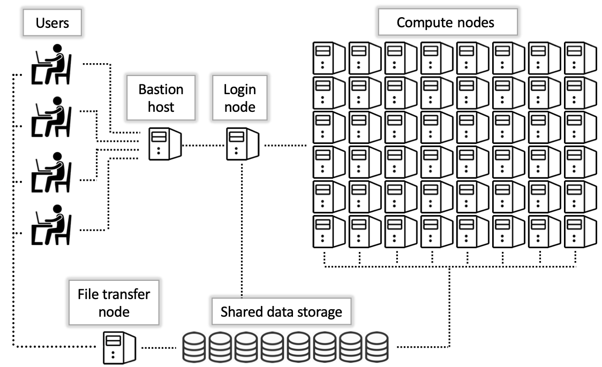

# System Overview

The HPC system has a structure of interconnected nodes and storage systems. It is important to be aware of this structure while using the HPC to help with navigation and ensure proper usage of each type of node. To see more about the compute resources available, please see [this page](../../resources/compute_resources/). 

Below is a graphic depiction of the layout of the HPC nodes:

<center></center>

**Bastion Host**

This is the first node that users access when using an [SSH connection](../system_access/#command-line-access). Open OnDemand users do not directly access this node. 

The Bastion Host, also called "gatekeeper", is a security feature, and only serves to provide access to the main system. As you can see in the diagram above, it does not connect to any part of the HPC other than the login nodes. 

There is a very limited amount of storage on the Bastion Host, and you will not be able to access any of your normal files from here. After SSH-ing to hpc.arizona.edu, you will see this message:

```bash
[user@local-machine ~]$ ssh user@hpc.arizona.edu
Last login: Thu Apr  4 15:14:47 2024 from ip72-201-152-35.ph.ph.cox.net
This is a bastion host used to access the rest of the RT/HPC environment.

Type "shell" to access the job submission hosts for all environments
-----------------------------------------

[user@gatekeeper ~]$
```

Please type ```shell``` to jump onto a login node, where you can access your file, and the compute/data-transfer nodes. [SSH Keys](../system_access/#ssh-keys) can be used to set up password-free access.

**Login Nodes**

After accessing a login node, you will see this message:

```bash
Last login: Mon Apr  8 09:40:58 2024 from junonia.hpc.arizona.edu
***
The default cluster for job submission is Puma
***
Shortcut commands change the target cluster
-----------------------------------------
Puma:
$ puma
(puma) $
Ocelote:
$ ocelote
(ocelote) $
ElGato:
$ elgato
(elgato) $
-----------------------------------------

(puma) [user@wentletrap ~]$
```

There are two login nodes: ```wentletrap``` and ```junonia```. If you need to switch between them, you can type ```ssh <node-name>```. 

The login nodes are for managing files and [launching jobs](../../running_jobs/overview/). 

!!! danger "No Jobs on Login Nodes"

	Do not run computationally intensive work, including running scripts or compiling software, on the login nodes. 

**Compute Nodes**

These are the workhorses of HPC. They are designed to handle large computational loads, and time on them is managed by our job scheduler, [Slurm](https://slurm.schedmd.com/documentation.html). 

To access the compute nodes, please refer to our section on [running jobs](../../running_jobs/overview/). To view technical specs on our compute nodes, including quantity, see our [resources page](../../resources/compute_resources/).

**Data Transfer Nodes**

These are used to facilitate data transfers to and from the HPC filesystem. Copying files from a local machine to the HPC should use syntax like ```rsync localfiles user@filexfer.hpc.arizona.edu``` to transfer files onto the HPC, or in the reverse order to transfer out of HPC. The crucial element is the ```filexfer``` in the HPC domain name. 

They are also used to access your ```/rental``` share if you have one. From a login node, you can run ```ssh filexfer.hpc.arizona.edu``` to access this. Once you have done so, you can access your rental storage by typing ```cd /rental/<pi-netid>```. If you are not on a DTN, you will not be able to see this share. This means data will have to be copied over to the main HPC filesystem in order to be accessible to compute nodes. 

Note that only preinstalled system executables are able to be run from the DTNs. If you have custom software to grab data from somewhere, it may not work from here.


