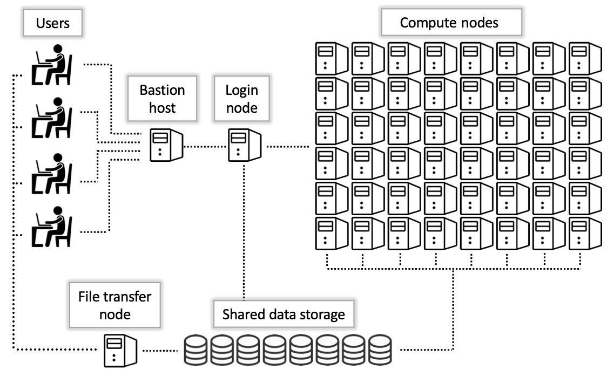

# System Layout

The HPC system has a structure of interconnected nodes and storage systems. It is important to be aware of this structure while using the HPC to help with navigation and ensure proper usage of each type of node. 

???+ link "You may also be interested in:"
	
	- [Standard Practices](../../policies/standard_practices/) - important policies, recommendations, and helpful tips 
    - [Compute Resources](../../resources/compute_resources/) - details on the number and type of compute nodes
    - [Running Jobs](../../running_jobs/overview/) - how to run your work on the HPC 
    - [Frequently Asked Questions](../../support_and_training/faqs/) - solutions to common issues

Below is a graphic depiction of the layout of the HPC nodes:

<center></center>

!!! danger "Do not run computations on the login nodes." 
    See [Running Jobs](../../running_jobs/overview/) for detailed instructions on the proper way to run computationally intensive tasks. 

**Bastion Host**

!!! tip "Password-free access"
    [SSH Keys](../system_access/#ssh-keys) can be used to set up password-free access.

This is the first node that users access when using an [SSH connection](../system_access/#command-line-access). Open OnDemand users do not directly access this node. 

The Bastion Host, also called "gatekeeper", is a security feature, and only serves to provide access to the main system. As you can see in the diagram above, it does not connect to any part of the HPC other than the login nodes. 

There is a very limited amount of storage on the Bastion Host, and you will not be able to access any of your normal files from here. After SSH-ing to hpc.arizona.edu, you will see this message:

```bash
[user@local-machine ~]$ ssh netid@hpc.arizona.edu
Last login: Thu Apr  4 15:14:47 2024 from ip72-201-152-35.ph.ph.cox.net
This is a bastion host used to access the rest of the RT/HPC environment.

Type "shell" to access the job submission hosts for all environments
-----------------------------------------

[netid@gatekeeper ~]$
```

Type `shell` to jump onto a login node, where you can access your files, and the compute/data-transfer nodes. 

**Login Nodes**

After accessing a login node, your terminal prompt will change to show that you are either connected to the host `wentletrap` or `junonia`, e.g.:

```bash
[netid@gatekeeper 15:43:33 ~]$ shell
Last login: Tue Aug  4 10:44:15 2026 from hpc.arizona.edu
(puma) [netid@wentletrap ~]$ 
```

These are the two login nodes. The login nodes are small machines only intended for managing files and [launching jobs](../../running_jobs/overview/) and do not provide computational resources for running analyses. ==Anything requiring significant compute must be performed on a compute node==. You can think of login nodes as small, communal staging areas where analyses are set up and then launched to much larger machines. 
 

**Compute Nodes**

These are the workhorses of HPC. They are designed to handle large computational loads, and time on them is managed by our job scheduler, [Slurm](https://slurm.schedmd.com/documentation.html). 

Accessing compute nodes requires submitting a job to the job scheduler. For specifics on this, refer to our section on [running jobs](../../running_jobs/overview/). To view technical specs on our compute nodes, including quantity, see our [resources page](../../resources/compute_resources/).

**Data Transfer Nodes**

These are used to facilitate data transfers to and from the HPC filesystem. Copying files from a local machine to the HPC should use syntax like ```rsync localfiles user@filexfer.hpc.arizona.edu``` to transfer files onto the HPC, or in the reverse order to transfer out of HPC. The crucial element is the ```filexfer``` in the HPC domain name. 

Note that only preinstalled system executables are able to be run from the DTNs. If you have custom software to grab data from somewhere, it may not work from here.


