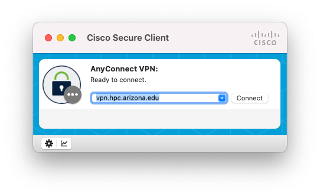
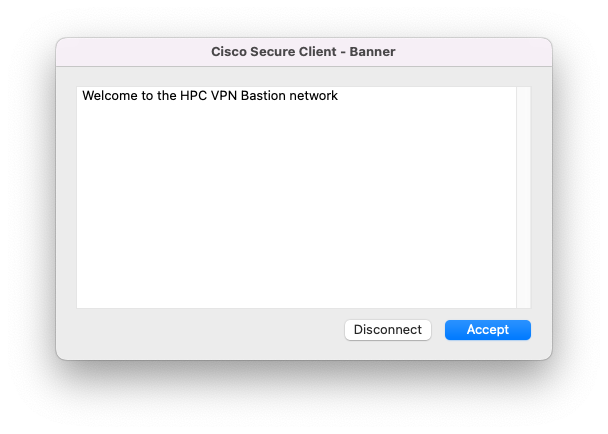

# VPN

## Overview

A virtual private network (VPN) is a mechanism for creating a secure connection between a computer and a computing network using an insecure communication medium like the Internet. You can access the resources available within the network from your computer using a VPN.

You will find the following VPN services useful for accessing some of the resources offered by the Research and Discovery Technologies:

* UArizona SSL VPN (```vpn.arizona.edu```): If you are not connected to the UArizona campus network you will need to connect to this VPN to access R-DAS.
* UArizona HPC VPN (```vpn.hpc.arizona.edu```): You will need to connect to this VPN to use graphical applications that need X11 forwarding with the HPC clusters.


## Instructions for Connecting


=== "GUI"
    You can connect to the UArizona VPN services with the software Cisco Secure Client. It is available for Windows, Mac, and Linux distributions. On Linux distributions you might have a better experience with OpenConnect VPN (see CLI). Follow the [UITS Knowledge Base guide](https://uarizona.service-now.com/sp?id=kb_article_view&sysparm_article=KB0011701&sys_kb_id=a83f1b551b5dda103578773bdc4bcbea&spa=1) to install Cisco Secure Client on your computer. 
        
    Follow the steps below to connect to UArizona HPC VPN (the screenshots are from a Mac, but the experience is similar across OSs):
        
    1. Open Cisco Secure Client
    2. Enter ```vpn.hpc.arizona.edu``` in the address bar and click **Connect**.<br>
    3. In the window that launches, enter your UArizona NetID as your Username and click **OK**.<br>
    4. In the next window, enter your UArizona NetID password and click **OK**.<br>
    5. In the window that launches, enter the NetID+ method you selected when you enrolled.<br>
    6. Lastly, review the notice box and click Accept.<br>
        
=== "CLI"
    !!! failure "Use of sudo"
        Do not run any ```sudo``` commands on the HPC clusters when following the instructions below. These are strictly meant for your personal machines.
        
    You can connect to UArizona VPN services from the command line with OpenConnect VPN. To do this, you will need ```sudo``` privileges.
        
    OpenConnect VPN is available for Windows, Mac and Linux distributions, however installation on Windows can be difficult. On Windows, you might have a better experience with Cisco Secure Client (see GUI). You can find more information on platforms supported by OpenConnect from the [project website](https://www.infradead.org/openconnect/platforms.html). Select your operating system from the list below to view installation instructions:
        

    === "Mac"
        Install with the Homebrew package manager: ```brew install openconnect```
                
    === "Linux"
        Follow the instructions from [Open Build Service](https://software.opensuse.org/download.html?project=home%3Abluca%3Aopenconnect%3Arelease&;package=openconnect) for your distribution.
                
    Once you have OpenConnect installed, you can connect to UArizona VPNs using the following:
        
    
    === "UA SSL VPN"
        1. Open your terminal
        2. Enter ```sudo openconnect vpn.arizona.edu```
        3. A prompt will appear asking you to choose a VPN ```GROUP```. Enter ```1```.
        4. A prompt will appear asking you for your Username. Enter your UArizona NetID.
        5. A prompt will appear asking for your Password. Enter your UArizona NetID password. 
        6. A second prompt will appear asking for your Password. Enter the NetID+ method you selected when you enrolled. 
            1. If you selected the Push method, then enter ```push```.
            2. If you selected the SMS method, enter ```sms```. If you do this, it will show that the login has failed and will ask you to reenter your Username, Password, and NetID+ method. For Username and Password do the same as before. For NetID+ method, enter the SMS passcode you received.
            3. If you selected the Passcode method, then enter your passcode. 
    === "UA HPC VPN"
        1. Open your terminal
        2. Enter ```sudo openconnect vpn.hpc.arizona.edu```
        3. A prompt will appear asking you for your Username. Enter your UArizona NetID.
        4. A prompt will appear asking for your Password. Enter your UArizona NetID password. 
        5. A second prompt will appear asking for your Password. Enter the NetID+ method you selected when you enrolled. 
            1. If you selected the Push method, then enter ```push```.
            2. If you selected the SMS method, enter ```sms```. If you do this, the prompt will appear again. Enter the SMS passcode that you received. 
            3. If you selected the Passcode method, then enter your passcode.         
