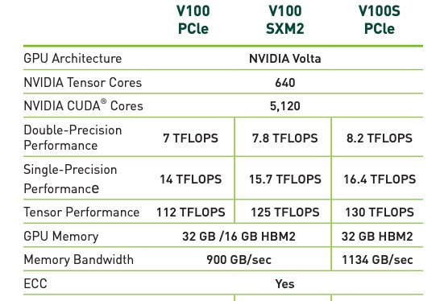

# Compute Resources

## Compute Resources Available by Cluster

Below is a list of the node types and physical hardware that are available on each of our three clusters. These can be used as a reference when submitting jobs to the system to ensure you are targeting the correct machines and getting the computational resources you need.

!!! tip "Requesting resources in jobs"
    For information on the specifics of requesting the compute resources detailed below, see our [Batch Jobs](../../running_jobs/batch_jobs/batch_directives/), [Interactive Jobs](../../running_jobs/interactive_jobs/#the-interactive-command), and/or [Open OnDemand Jobs](../../running_jobs/open_on_demand/#interactive-graphical-applications) guides. 

**Node Types**

|Node Type|Description|
|-|-|
|Standard CPU Node|This is the general purpose node, designed to be used by the majority of jobs.|
|High Memory CPU Node|Similar to the standard nodes, but with significantly more RAM. There a only a few of them and they should only be requested for jobs that are known to require more RAM than is provided by standard CPU nodes.|
|GPU Node|Similar to the standard node, but with one or more GPUs available. The number of GPUs available per node is cluster-dependent.|
|Buy-in Node|Nodes that have been purchased by research groups as part of [our buy-in process](../../policies/buy_in/). Buy-in nodes are only accessible to [high priority and windfall jobs](../allocations/).|

**Available Hardware by Cluster and Node Type**

!!! tip "CPUs and Memory"
    For information on memory to CPU ratios, shown as RAM/CPU in the tables below, see [CPUs and Memory](../../running_jobs/cpus_and_memory/)

=== "Puma"
    **Resources Available**
    
    | Node Type | 
Number of Nodes
| CPUs/Node|RAM/CPU|CPU RAM/Node|GPUs/Node|
RAM/GPU
|GPU RAM/Node|Total GPUs|
    |-|-|-|-|-|-|-|-|-|
    |Standard|192 standard 108 buy-in|94|5 GB|470 GB|-|-|-|-|
    |High Memory|3 standard 2 buy-in| 94|32 GB|3008 GB|-|-|-|-|-|
    |GPU|9 standard 6 buy-in|94|5 GB|470 GB|4|32 GB (v100s) 20 GB (MIGs)|128 GB|36 standard 24 buy-in|
    
    
=== "Ocelote"
    | 
Node Type
 | Number of Nodes| CPUs/Node|RAM/CPU|CPU RAM/Node|GPUs/Node|RAM/GPU|GPU RAM/Node|Total GPUs|
    |-|-|-|-|-|-|-|-|-|
    |Standard|360|28|6 GB|168 GB|-|-|-|-|
    |High Memory|1| 48|41 GB|1968 GB|-|-|-|-|
    |Single GPU Nodes|25|28|8 GB|224 GB|1|16 GB|16 GB|25|
    |Dual GPU Nodes|35|28|8 GB|224 GB|2|16 GB|32 GB|70|
    
=== "El Gato"
    | Node Type | Number of Nodes| CPUs/Node|RAM/CPU|CPU RAM/Node|
    |-|-|-|-|-|
    |Standard|118|16|4 GB|64 GB|

## GPU Nodes

=== "Puma"
    
    Puma has a different arrangement for GPU nodes than Ocelote. Whereas Ocelote has one GPU per node, Puma has four. This has a financial advantage for providing GPU's with lower overall cost, and a technical advantage of allowing jobs that can use multiple GPU's to run faster than spanning multiple nodes.
    
    Puma's GPU nodes have four Nvidia V100S model GPUs. They are provisioned with 32 GB memory compared to 16 GB on the P100's.  

    In addition to the V100 nodes, one node has four A100s, each subdivided into three smaller virtual GPUs. See the MIG (Multi-instance GPU) Resources section below for details. 
    
    **Multi-Instance GPU (MIG) Resources**    

    !!! info "MIG resources are only available on Puma"

    The Four A100 GPUs on Puma Node r5u13n1 are each subdivided into three smaller virtual GPUs using the Nvidia MIG (Multi-Instance GPU) method.  Each of these MIG slices allows the use of 20 GB of GPU memory. The vast majority of jobs run on Puma in 2023 used less than this amount of GPU memory. The 12 MIG GPUs increase overall GPU availability on Puma by freeing the 32 GB V100 GPUs for users requiring larger amounts of GPU memory.

    Jobs requesting MIG resources will ideally be scheduled more quickly than those requesting the standard V100 GPUs, so MIG resources should be preferred when sufficient.

    A limitation is that only one MIG slice can be addressed by a single application, so {==MIG slices are not appropriate for jobs utilizing multiple GPUs==}.

    The addition of the MIG devices to the Slurm queues will have a number of impacts, and some users may need to make changes to submissions to ensure proper functioning of analyses. 

=== "Ocelote"

    

    Ocelote has 25 compute nodes with one Nvidia P100 and 35 compute nodes with two Nvidia P100 GPUs that are available to researchers on campus. Research groups are limited to using a maximum of 10 GPUs simultaneously. 

    Previously, one node with a V100 was available, but it has since been replaced with a P100. 

=== "El Gato"
    El Gato has no GPU nodes. During the quarterly maintenance cycle on April 27, 2022 the El Gato K20s and Ocelote K80s were removed after support was ended by Nvidia.

## System Technical Specifications

||El Gato|Ocelote|Puma|
|-|-|-|-|
|Model|IBM System X iDataPlex dx360 M4|Lenovo NeXtScale nx360 M5|Penguin Altus XE2242|
|Year Purchased|2013|2016 (2018 P100 nodes)|2020|
|Node Count|118|360 CPU-only 60 GPU 1 High Memory|300 CPU-only 15 GPU 5 High Memory |
|Total System Memory|23.5 TB|83.3 TB|169.7 TB|
|Processors|2x Xeon E5-2650v2 8-core (Ivy Bridge)|2x Xeon E5-2695v3 14-core (Haswell) 2x Xeon E5-2695v4 14-core (Broadwell) 4x Xeon E7-4850v2 12-core (Ivy Bridge)|2x AMD EPYC 7642 48-core (Rome)|
|Cores/Node (Schedulable)|16|28 (48 - High-memory node)|94|
|Total Cores|1888|11724[^1]|30720[^1]|
|Processor Speed|2.66 GHz|2.3 GHz (2.4GHz - Broadwell CPUs)|2.4 GHz|
|Memory/Node|64 GB|192 GB (2 TB - High-memory node)|512 GB (3 TB - High-memory nodes)|
|Accelerators||60 NVIDIA P100 (16GB)|56 NVIDIA V100S 12 A100 20 GB MIG slices|
|/tmp[^2]|~840 GB spinning|~840 GB spinning|~1440 TB NVMe|
|HPL Rmax (TFlop/s)|46|382||
|OS|CentOS 7|CentOS 7|CentOS 7|
|Interconnect|FDR Inifinband|FDR Infiniband for node-node 10 Gb Ethernet node-storage|1x 25 Gb/s Ethernet RDMA (RoCEv2) 1x 25 Gb/s Ethernet to storage|

[^1]: Includes high-memory and GPU node CPUs
[^2]: /tmp is scratch space and is part of the root filesystem
