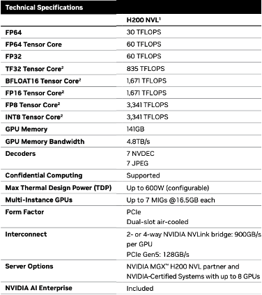
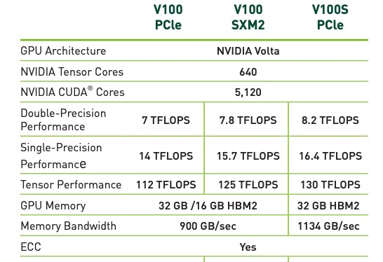
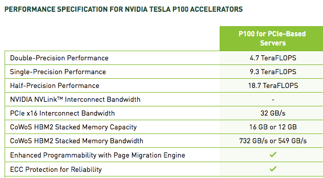

# Compute Resources

!!! danger "Do not run computations on the login nodes." 
    The compute resources described on this page are designed for handling computationally intensive tasks, but the login nodes are not.

???+ link "You may also be interested in these pages:"

    - [Standard Practices](../../policies/standard_practices/) - important policies, recommendations, and helpful tips 
    - [Running Jobs](../../running_jobs/overview/) - how to run your work on the HPC 
    - [Frequently Asked Questions](../../support_and_training/faqs/) - solutions to common issues

## Compute Resources Available by Cluster

Below is a list of the node types and physical hardware that are available on each cluster. These can be used as a reference when submitting jobs to the system to ensure you are targeting the correct machines and getting the computational resources you need.

!!! tip "Requesting resources in jobs"
    For information on the specifics of requesting the compute resources detailed below, see our [Batch Jobs](../../running_jobs/batch_jobs/batch_directives/), [Interactive Jobs](../../running_jobs/interactive_jobs/#the-interactive-command), and/or [Open OnDemand Jobs](../../running_jobs/open_on_demand/#interactive-graphical-applications) guides. 

**Node Types**

|Node Type|Description|
|-|-|
|Standard CPU Node|This is the general purpose node, designed to be used by the majority of jobs.|
|High Memory CPU Node|Similar to the standard nodes, but with significantly more RAM. There a only a few of them and they should only be requested for jobs that are known to require more RAM than is provided by standard CPU nodes.|
|GPU Node|Similar to the standard node, but with one or more GPUs available. The number of GPUs available per node is cluster-dependent.|
|Buy-in Node|Nodes that have been purchased by research groups as part of [our buy-in process](../../policies/buy_in/). Buy-in nodes are only accessible to [high priority and windfall jobs](../allocations/).|

**Available Hardware by Cluster and Node Type**

!!! tip "CPUs and Memory"
    For information on memory to CPU ratios, shown as RAM/CPU in the tables below, see [CPUs and Memory](../../running_jobs/cpus_and_memory/)

=== "The new cat"
    **Resources Available**

    | Node Type | 
Number of Nodes
| CPUs/Node|RAM/CPU|CPU RAM/Node|GPUs/Node|
RAM/GPU
|GPU RAM/Node|Total GPUs|
    |-|-|-|-|-|-|-|-|-|
    |Standard|40 standard 15 buy-in|192|4 GB|768 GB|-|-|-|-|
    |High Memory|1 standard 0 buy-in| 94|32 GB|3008 GB|-|-|-|-|-|
    |GPU|2 standard 3 buy-in|94|5 GB|1536 GB|8|141 GB/H200|1128 GB|16 standard 24 buy-in|

=== "Puma"
    **Resources Available**
    
    | Node Type | 
Number of Nodes
| CPUs/Node|RAM/CPU|CPU RAM/Node|GPUs/Node|
RAM/GPU
|GPU RAM/Node|Total GPUs|
    |-|-|-|-|-|-|-|-|-|
    |Standard|192 standard 108 buy-in|94|5 GB|470 GB|-|-|-|-|
    |High Memory|3 standard 2 buy-in| 94|32 GB|3008 GB|-|-|-|-|-|
    |GPU|9 standard 6 buy-in|94|5 GB|470 GB|4|32 GB (v100s) 20 GB (MIGs)|128 GB|36 standard 24 buy-in|
    
    
=== "Ocelote"
    | 
Node Type
 | Number of Nodes| CPUs/Node|RAM/CPU|CPU RAM/Node|GPUs/Node|RAM/GPU|GPU RAM/Node|Total GPUs|
    |-|-|-|-|-|-|-|-|-|
    |Standard|360|28|6 GB|168 GB|-|-|-|-|
    |High Memory|1| 48|41 GB|1968 GB|-|-|-|-|
    |Single GPU Nodes|25|28|8 GB|224 GB|1|16 GB|16 GB|25|
    |Dual GPU Nodes|35|28|8 GB|224 GB|2|16 GB|32 GB|70|
    

## GPU Nodes

=== "The new cat"

    There are 8 H200s in both of the GPU nodes.

    The new cat may have MIG provisioned on the GPUs, depending on the results of our tests.The GPUs would be subdivided into two virtual GPUs using the Nvidia MIG (Multi-Instance GPU) method.  Each of these MIG slices allows the use of 70 GB of GPU memory.

     

=== "Puma"
    
    There are 4 V100S's in each of the 9 Puma nodes. The new cat will have 8 H200's in each node. Ocelote has 2 P100s in each of the 36 nodes. 
    
    On Puma, one node has four A100s, each subdivided into two smaller virtual GPUs. See the MIG (Multi-instance GPU) Resources section below for details. We may implement this on the new cat.
    
    **Multi-Instance GPU (MIG) Resources**    

    The Four A100 GPUs on Puma Node r7u25n1 are each subdivided into two smaller virtual GPUs using the Nvidia MIG (Multi-Instance GPU) method.  Each of these MIG slices allows the use of 40 GB of GPU memory. The increased VRAM enables workloads requiring more memory than the V100 GPUs. 

    A limitation is that only one MIG slice can be addressed by a single application, so {==MIG slices are not appropriate for jobs utilizing multiple GPUs==}.

    The addition of the MIG devices to the Slurm queues will have a number of impacts, and some users may need to make changes to submissions to ensure proper functioning of analyses. 

    To see the proper syntax for requesting a MIG slice versus a V100, please see our page on [Batch Directives](../../running_jobs/batch_jobs/batch_directives/#gpus). 

=== "Ocelote"

    

    Ocelote has 36 compute nodes each with two Nvidia P100 GPUs that are available to researchers on campus. Research groups are limited to using a maximum of 10 GPUs simultaneously. 

    We plan to keep the GPU nodes for Ocelote as long as the GPU's are useful. We have observed the wait time is usually short and they are good for lightweight AI / ML / visualization workloads.

## System Technical Specifications

   These counts include the buy-in high priority nodes

||The new cat|Ocelote|Puma|
|-|-|-|-|
|Model|Lenovo V3 Servers|Lenovo NeXtScale nx360 M5|Penguin Altus XE2242|
|Year Purchased|2026|2016 (2018 P100 nodes)|2020|
|Node Count|55 CPU-only 5 GPU 1 High Memory|360 CPU-only 36 GPU|300 CPU-only 15 GPU 5 High Memory |
|Total System Memory|41.4 TB|83.3 TB|169.7 TB|
|Processors|2x AMD 9655 96-core (Turin) 2x AMD 9455 48-core (Turin) 2x AMD 9455 48-core (Turin)|2x Xeon E5-2695v3 14-core (Haswell) 2x Xeon E5-2695v4 14-core (Broadwell) 4x Xeon E7-4850v2 12-core (Ivy Bridge)|2x AMD EPYC 7642 48-core (Rome)|
|Cores/Node (Schedulable)|192|28 (48 - High-memory node)|94|
|Total Cores|11136|11724[^1]|30720[^1]|
|Processor Speed|2.66 GHz 3.15GHz|2.3 GHz (2.4GHz - Broadwell CPUs)|2.4 GHz|
|Memory/Node|768 GB 3 TB - High memory|192 GB|512 GB (3 TB - High-memory|
|Accelerators|40 NVIDIA H200|36 NVIDIA P100 (16GB)|56 NVIDIA V100S 8 A100 40 GB MIG slices|
|/tmp[^2]|~1.9 TB NVMe|~840 GB spinning|~1.9 TB NVMe|
|HPL Rmax (TFlop/s)||382||
|OS|Rocky Linux 9|CentOS 7|Rocky Linux 9|
|Interconnect|NDR Inifiniband for MPI 25 Gb Ethernet |FDR Infiniband for MPI 10 Gb Ethernet node-storage|1x 25 Gb/s Ethernet RDMA (RoCEv2) 1x 25 Gb/s Ethernet to storage|

[^1]: Includes high-memory and GPU node CPUs
[^2]: /tmp is scratch space and is part of the root filesystem
