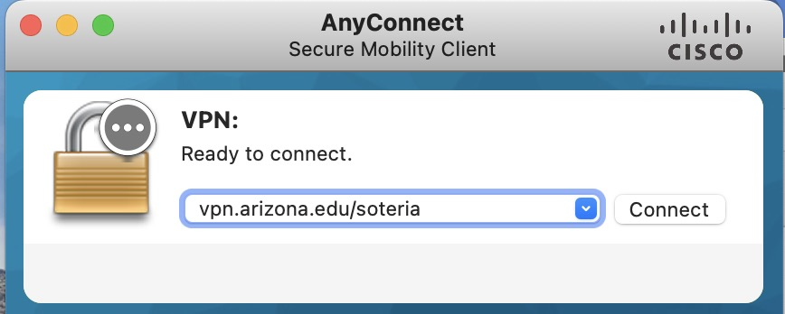

# Secure Services


Research Technologies in partnership with the Data Science Institute is providing a secure research enclave that is HIPAA compliant called Soteria. In Greek mythology, Soteria (Greek: Σωτηρία) was the goddess or spirit (daimon) of safety and salvation, deliverance, and preservation from harm.

Soteria uses the same Slurm scheduling system and software module interface as our main HPC computing clusters. For general information on HPC usage, the rest of our documentation site can be used. The information below covers everything specific to Soteria. Additional information can also be found at [https://soteria.arizona.edu](https://soteria.arizona.edu)

## Prerequisites and Registration

To gain access, you will need to submit a [Soteria request form](https://forms.office.com/pages/responsepage.aspx?id=BVXjXo7rKUmTfWRd9QEyiAwvQ9H2-M5Poko2BzIp3UhUMEExR1NBUFEzOENWSTNaMFRQRFg4VDNPQy4u). Once your form has been reviewed and approved, you will receive an email with the subject **UA Soteria Access Request Approved**. This email will contain the next steps to take which are detailed below:

- [x] **Complete Required Training in Edge Learning**

    The CRRSP (regulated research) team will register you for three required trainings listed below 

    1. HIPAA Essentials
    2. Information Security: Insider Threat Awareness
    3. Information Security Awareness Certification

    You will receive instructions on accessing these courses in your confirmation email. Courses will also be findable here: [https://uaccess.arizona.edu](https://uaccess.arizona.edu).

- [x] **Assignment to the Soteria VPN**

    Once you have completed your required training, the CRRSP team will notify you via email when you have been assigned access to the Soteria VPN. This VPN is an important part of our HIPAA compliance and differentiates Soteria usage from the standard HPC clusters. {==Soteria access cannot be established when not connected to the VPN==}. For VPN access, use: ```vpn.arizona.edu/soteria```.

    

- [x] Additional Requirements

    The computer you will use to access Soteria services must meet the following requirements:

    1. The Operating System and applications must be updated with the latest patches.
    2. You must have a strong password to log into the computer (at least 8 characters and a mix of character types). 
    3. This must not be a shared computer with other users.
    4. Up to date anti-virus software.

## Access

!!! warning "VPN Required"
    You must be connected to the [Soteria VPN](#prerequisites-and-registration) to access the system.

### Command Line Access

Soteria command line access is available with SSH using the hostname ```shell.cougar.hpc.arizona.edu``` as shown below (replacing `<your_netid>` with your own NetID):

```
$ ssh <your_netid>@shell.cougar.hpc.arizona.edu
 
Authorized uses only. All activity may be monitored and reported.
Last login: Tue Nov 29 06:18:33 2022 from ans-02.hpc.arizona.edu
Authorized uses only. All activity may be monitored and reported.
netid@taub:~ $
```

Taub is a login node and will provide the same functionality and have the same policies as the other HPC clusters. Modules are available on Soteria's compute nodes but not on the login node. The command ```interactive``` is available to request a session on a compute node and jobs may be submitted using the standard `sbatch`. More details on Slurm commands can be found in [Running Jobs](../../running_jobs/batch_jobs/intro/).

### Graphical Interface

Similar to the other HPC clusters, we offer the service [Open OnDemand](../../running_jobs/open_on_demand/ "Documentation on using Open OnDemand") to provide web browser access to Soteria. This can be used to navigate, view, and edit files as well as gain access to graphical applications.

To access the Soteria-specific OOD service, open the following link in your favorite browser: [https://ondemand-hipaa.hpc.arizona.edu](https://ondemand-hipaa.hpc.arizona.edu "Access the OOD website here")

The applications currently available are  RStudio, Matlab and Python 3.9 (Jupyter). 


## Available Compute Resources

This small cluster has four standard compute nodes. Each has 94 cores and 470 GB memory available. The two GPU nodes have the same resources but there are also four V100 GPU's in each. You can use the [Running Jobs documentation](../../running_jobs/overview/ "running jobs overview") to learn how to use Slurm with these nodes.

|Node Type|Node Names|
|-|-|
|Standard Nodes| r1u26n1,r1u27n1,r1u28n1,r1u29n1|
|GPU Nodes| r1u30n1,r1u32n1|

## Compute Time Allocations

All PI groups will receive a time allocation of 100,000 CPU hours per month. For general information on time allocations and charging, see our [Allocations documentation](../allocations/ "Learn about allocations and job charging")


## Storage

All users are granted a home directory. Additional communal space can be found in a `/groups` directory allocated to each PI. Your files can be accessed both on the HPC [filexfer nodes](../../storage_and_transfers/transfers/overview/ "learn about our data transfer nodes")(1) as well as when connected to Soteria. A summary of Soteria's storage is listed below: 
{ .annotate }

1.  hostname: ```filexfer.hpc.arizona.edu```

|Storage Allocation|Availability|Quota|<div style="width:120px">Location on Soteria</div>|<div style="width:200px">Location on `filexfer`</div>|
|-|-|-|-|-|
|Home|Allocated to each user|50 GB|`/home/u<xx>/<your_netid>`|`/hipaa/home/u<xx>/<your_netid>`|
|Groups|Allocated to each PI group|Unlimited|`/groups/<pi_netid>`|`/hipaa/groups/<pi_netid>`|


## Transferring Data

Globus can be used for moving data in and out of the Soteria environment. For more information on using Globus, see our [Globus documentation](../../storage_and_transfers/transfers/globus/)

Soteria's endpoint is: **UA HPC HIPAA Filesystems**