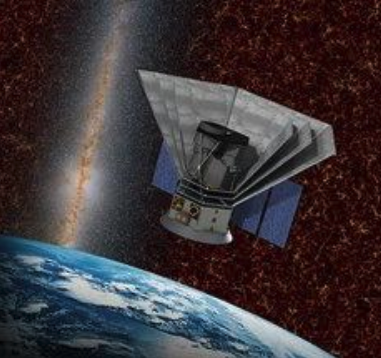
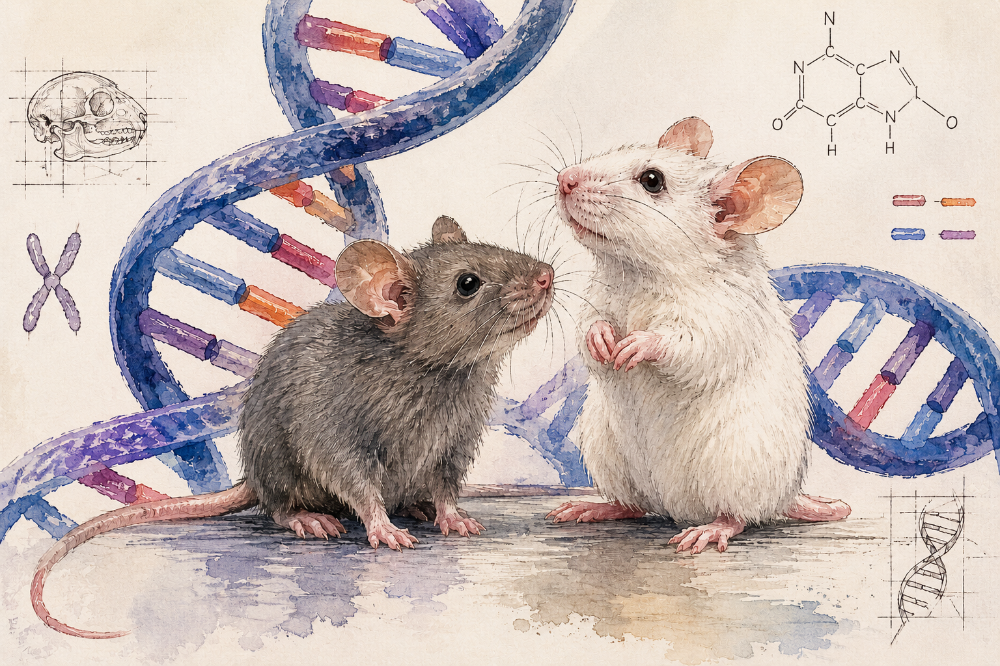
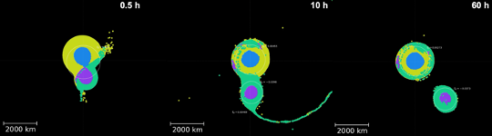
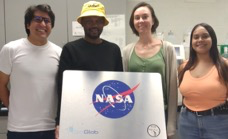
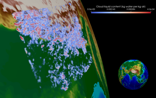
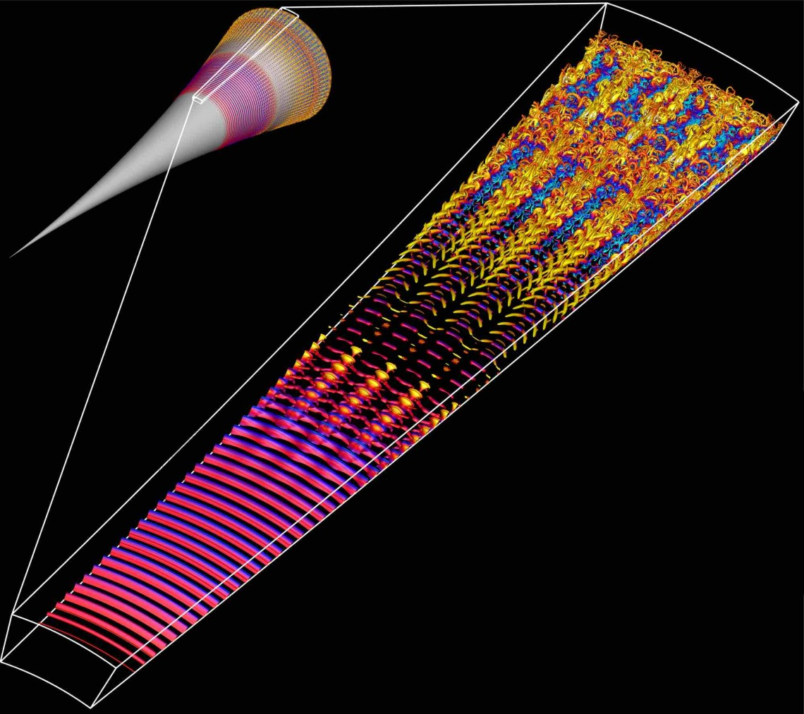

# Research Stories

<link rel="stylesheet" href="../../assets/stylesheets/images.css">

## SPHEREx

A new space telescope launches into orbit to explore the origins of the Universe. The mission will use sophisticated software developed at the Arizona Cosmology Lab to help astronomers understand what happened in the first trillionth of a second after the Big Bang.

SPHEREx, Spectro-Photometer for the History of the Universe, Epoch of Reionization and Ice Explorer, is a NASA mission that will use a wide-field telescope to gather optical and infrared data on more than 450 million galaxies, as well as more than 100 million starts in the Milky Way.

Tim Eifler, associate professor, says; "We are looking for tracers. Galaxies trace he presence of dark matter. Where there are lot of galaxies, there is likely a lot of dark matter because of gravity". Elisabeth Krause, also associate professor, is looking for the imprints of the very early universe by making the largest ever 3D map of galaxies.

Given the very large amounts of data the Arizona Cosmology Lab has turned to machine learning to accelerate the software.

The state-of-the-art high performance computing system on the U of A campus makes this kind of innovation possible, according to the research team

## Ten Millionth Job

Puma has been a tremendous resource for our research community. Just recently it processed the 10 millionth job since we provisioned it in 2020. Just to get a perspective on that, if you took one step for each job you could walk to Niagara Falls. And back.

David Castellano, a member of Dr. Ryan Gutenkunst's team, was the researcher who achieved this milestone. They study the evolutionary processes that generated the complex networks that comprise life. Dr. Gutenkunst told us that David’s been maximizing his chances to hit this milestone with all the jobs he’s been running.

David says about his work: “Understanding the relationship between DNA mutation rates and fitness effects is central to evolutionary biology. My work is investigating this relationship in three species: Homo sapiens, Mus musculus, and Arabidopsis thaliana. The inference of fitness effects from population genomics data requires intensive computation which could not be possible without a High Performance Computing service.”

The software used in their research is called  `dadi`: Diffusion Approximations for Demographic Inference. This work on three species with 96 mutation types and 1000 bootstrap replicates equates to 288,000 compute jobs.

------

## Planetary History

    
**Reconstructing the History of the Solar System Using HPC**

Erik Asphaug’s Planetary Formation Lab in the Lunar and Planetary Laboratory uses smoothed-particle hydrodynamics (SPH) simulations to explore how collisions between bodies in the Solar System shape its evolution through time. These three-dimensional simulations, which approximate planetary bodies as collections of particles, incorporate realistic geologic properties to track their structural and thermal changes during and after giant impacts. 

!!! quote "From Eric"
    The access to increased time allocations as well as large volumes of temporary storage on xdisk provided by the HPC has revolutionized our ability to run our most complex simulations at high resolution, with enough space and time to explore the full parameter space necessary to make key discoveries that inform our understanding of Solar System evolution.

One of their major projects has occupied a large fraction of their HPC hours and storage: the capture of Pluto’s moon, Charon, from a giant impact early in the Solar System’s history.

High resolution is also critical to track detailed interactions between Pluto and Charon, including any material transferred between them. Without the HPC and the allocation of computation time and storage space, they would not have been able to run the hundreds of models necessary to successfully reproduce systems that look similar to Pluto and Charon today. The models have revealed new insights about how bodies like Pluto capture satellites: the dwarf planet and its proto-satellite collide, briefly merge, and then re-separate as Charon slow begins to move outward. They call this new process, which significantly redefines our understanding of giant collisions, “kiss and capture.” An example kiss-and-capture is shown in the image above. The simulation shown covers 60 hours of model time, which takes ~1.5 months on the HPC. The ability to run such long simulations in parallel was crucial to completing this work. 

[Read more about the full story here!](https://news.arizona.edu/news/how-pluto-got-its-heart){ .md-button .md-button--primary }

------

## Cloud Research

Sylvia Sullivan is an Assistant Professor in Chemical and Environmental Engineering who performs atmospherically related research and has a joint appointment to the Department of Hydrology and Atmospheric Sciences. Her academic background is in chemical engineering, but she has picked up atmospheric science and computing skills along the way to model and understand cloud and storm systems. “I really liked environmental work because I felt it was very impactful,” she says.  Her research includes investigating cloud ice formation. From a chemical engineering perspective, you can think about clouds as a control volume, flows in and out and phase changes occurring inside. Along with this more technical view, Sylvia says she “fell in love with clouds because they are very beautiful and poetic”. This blend of fields brought her to the University of Arizona as it is one of the only Universities where Chemical and Environmental Engineering are in the same department. And besides, “Tucson is a wonderful location”.

She is building a research group to study the impact of ice clouds, particularly their energetic and precipitation effects. Sylvia’s group runs very high-resolution simulations called storm resolving simulations, where the meshes are fine enough to represent individual storms. In global climate models, the mesh has a resolution on the order of 100 km, in which several storm cells can form simultaneously. These storm-resolving computations are very expensive and produce terabytes of data, which then need to be post-processed and visualized. Currently, Sylvia and her group are very focused on working with other visualization experts on campus to illustrate the structures and evolution of clouds and storm systems.

------

## Hypersonic Flow

    
**Faster Speeds Need Faster Computation**

Professors Christoph Hader, Hermann Fasel, and their team are exploring the use of our GPUs to optimize Navier-Stokes codes for simulating the flow field around hypersonic vehicles traveling at size times the speed of sound (Mach 6) or more.

In the image to the right, instantaneous flow structures obtained from a DNS for a flared cone at Mach 6 are visualized using the Q-isocontours colored with instantaneous temperature disturbance values. The small scales towards the end of the computational domain indicate the regions where the boundary layer is turbulent. 