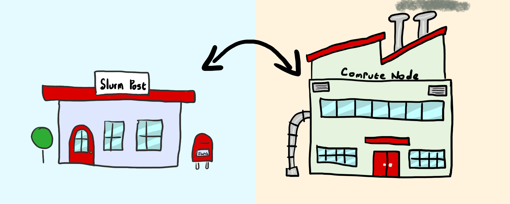

<link rel="stylesheet" href="../../../assets/stylesheets/tables.css">
<link rel="stylesheet" href="../../../assets/stylesheets/code.css">

<link rel="stylesheet" href="../../../assets/stylesheets/images.css">
# Introduction to Batch Jobs

???+ note "You may also be interested in:"
    
    - [Standard Practices](../../policies/standard_practices/index.md) - important policies, recommendations, and helpful tips 
    - [Compute Resources](../../resources/compute_resources/) - details on the number and type of compute nodes
    - [Resource Optimization](../../running_jobs/resource_optimization) - improve the efficiency of your jobs on HPC
    - [Frequently Asked Questions](../../support_and_training/faqs/) - solutions to common issues

-   :material-code-json:{ .lg .middle } __[Batch Directives :octicons-arrow-right-24:](./batch_directives/)__

    ---

    Details regarding various Slurm job configuration options

-   :material-application-variable-outline:{ .lg .middle } __[Environment Variables :octicons-arrow-right-24:](./environment_variables/)__

    ---

    A list of relevant environment variables that get created during a job

-   :material-grid:{ .lg .middle } __[Array Jobs :octicons-arrow-right-24:](./array_jobs/)__

    ---

    How to submit many similar jobs with a single batch script

-   :material-view-headline:{ .lg .middle } __[Jobs with GNU Parallel :octicons-arrow-right-24:](./gnu_parallel_jobs/)__

    ---

    An overview of the GNU utility for parallelization of tasks

-   :material-repeat-variant:{ .lg .middle } __[Job Dependencies :octicons-arrow-right-24:](./job_dependencies/)__

    ---

    Split jobs into sections with conditions for completion

-   :material-email-fast-outline:{ .lg .middle } __[Submitting Jobs :octicons-arrow-right-24:](./submitting_jobs/)__

    ---

    The basics of `sbatch` and job submission

## What are Batch Jobs?

Batch jobs differ from [interactive jobs](../../interactive_jobs/) and [graphical jobs](../../open_on_demand/#interactive-graphical-applications) because they do not require user input while running. Instead, the user writes a script containing the instructions (code) that is sent to a compute node via the scheduler (Slurm). This allows your workflow to run automatically without you needing to be physically present. Here are a few benefits of using batch jobs:

1. **No Need to Stay Logged In**: You don’t have to remain logged into the HPC system for your work to continue. This avoids potential issues like your terminal timing out, local internet disruptions, or your computer going to sleep—all of which could prematurely end your analysis, especially for long-running jobs.

2. **Submit Many Jobs at Once**: Some workflows require running hundreds or thousands of analyses. For example, you might want to run the same script with different input values multiple times. Doing this interactively could be cumbersome or even impossible. Batch jobs can [easily handle this use case](../array_jobs/).

## Batch Job Workflow and Analogy

Think of a batch job like a researcher who wants something custom-made at a factory. There are a few steps they need to take:

1. **Get the Address**: First, they need to know where the factory is so they can contact the right person to make their request.
2. **Provide Instructions**: Next, they need to write instructions, or schematics, for the person who will do the manufacturing.
3. **Send the Instructions**: Finally, they need to send these instructions to the factory so the builder can receive them and start working.

We'll continue with this analogy, breaking down each step in more detail in the [Batch Tutorial](./batch_tutorial/).

