# Open OnDemand

<link rel="stylesheet" href="../../assets/stylesheets/images.css">

Open OnDemand (OOD), which is an NSF-funded open-source HPC portal, is available for users and provides web browser access for graphically interfacing with HPC. This service is available at [https://ood.hpc.arizona.edu/](https://ood.hpc.arizona.edu/). 

### Why use Open OnDemand?

Since there are many ways to access HPC, including the command line terminal, why use Open OnDemand? Here are a few of the main reasons:

- [x] **GUI software available**

    Many commonly used research software packages, such as RStudio and ANSYS, have graphical interfaces that streamline analysis workflows. Open OnDemand allows for easy access to these applications without the complications of server setup or image/port forwarding. 

- [x] **User friendly** 

    Open OnDemand includes an interactive desktop application which mimics what you might find on your local workstation. This environment may be more intuitive to navigate when getting familiarized with the HPC.

- [x] **Standardized batch access** 

    Open OnDemand includes forms to submit batch jobs which include all the relevant parameters in one place. 


### List of Available Features in Open OnDemand

|Basic Functions|GUI Software|Servers|Batch/Slurm|
|-|-|-|-|
|File Browser|Abaqus|Jupyter Notebook|Job Composer|
|Interactive Desktop|ANSYS|R Studio|Job Viewer|
| |Mathematica|Shell| |
| |MATLAB| | |
| |Stata| | |
| |VS Code| | |

## Command Line Access

Need command line access to a terminal on HPC? No problem! Simply select the **Clusters** dropdown menu to connect to one of HPC's login nodes. This is also detailed under [System Access](/registration_and_access/system_access/#web-access)

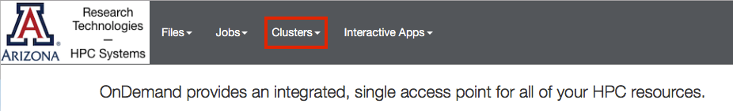

## File Browser

The file browser provides easy access to your `/home`, `/xdisk`, and `/groups` directories and allows you to view, edit, copy, and rename your files. You may also transfer small files (under 64 MB) between HPC and your local workstation using this interface. For larger transfers, see our section on [Transferring Data](/storage_and_transfers/transfers/overview/) for more efficient methods. 

**Access**

In the browser at the top of the screen, select the **Files** dropdown

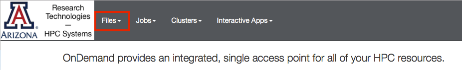

You will be able to select your `/home` directory, `/groups`, or `/xdisk`. If you select `/groups` or `/xdisk`, enter your PI's NetID in the **Filter** field to find your shared group space.

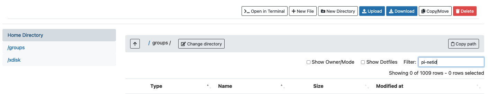

**Editing Files**

First, navigate to the file you wish to edit. Then, click the vertical ellipses on the right-hand side and select **Edit**

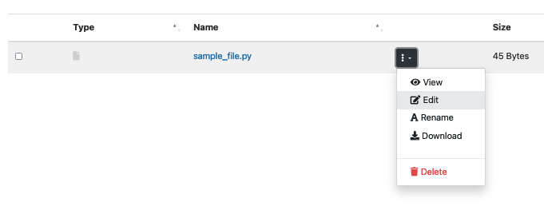

This will open a file editor in your browser where you may select your color theme, text size, and syntax highlighting.

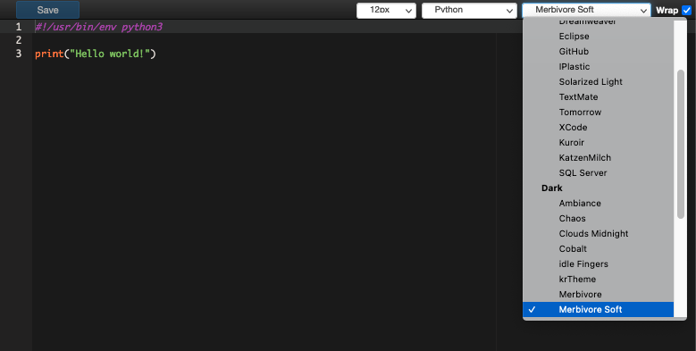

## Job Viewer and Composer

**Job Viewer**

The Job Viewer allows you to check the status and time remaining of your running jobs. You can also cancel your jobs using this interface. Note: be careful looking at **All Jobs** since this will likely timeout trying to organize them all. To use the Job Viewer, navigate to the **Jobs** dropdown and select **Active Jobs**

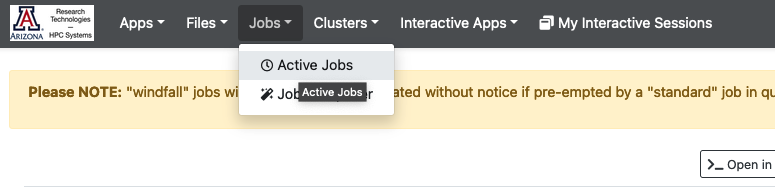

This will open a new page listing all your running and pending jobs. You may delete them by clicking the red trash icon under Actions, or view more information about individual jobs using the dropdown on the left next to the ID.


**Job Composer**

The Job Composer lets you create and run a Slurm script on any of our three clusters. It should be noted that the Job Composer creates a special string of directories in your `/home` starting with `ondemand/` which is where both your submission scripts and output files will be stored. Make note of the path to your files on the right-hand side of the Job Composer screen under **Script location**.

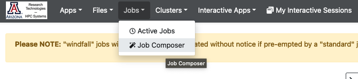

## Interactive Graphical Applications

Open OnDemand provides access to graphical interfaces for some popular software. These can be found under **Interactive Apps** through the Open OnDemand web browser. The process of starting and accessing these jobs is the same regardless of which application you select.

**Web Form**

First, select the desired application from Interactive Apps. This will take you to a form where you will enter your job information. This includes the entries in the following table:

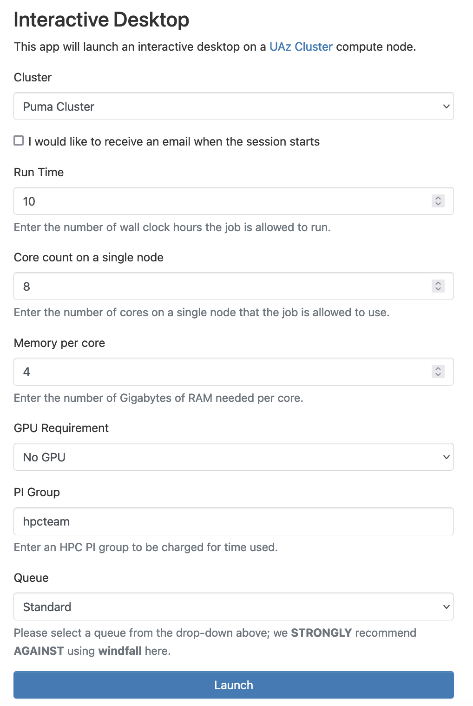


|Field|Description|Example|
|-|-|-|
|Cluster|Select which cluster to submit the job request to.	|Puma|
|Run Time|	The maximum number of hours the job can run. Please note that the maximum possible run time is 10 days (240 hours).| 4|
|Core Count on a single node| The number of CPUs needed. This affects the amount of memory your job is allocated. The maximum that can be requested is [dependent on which cluster you choose](../../resources/compute_resources/). | 16|
|Memory per core|The amount of memory needed {==per core==} in GB. The amount that can be requested is dependent on which cluster you choose and your desired node type. For more information, see our [CPUs and Memory page](../cpus_and_memory/).|5|
|GPUs required|[The number and type of GPUs](../../resources/compute_resources/#gpu-nodes) needed for your job, if any. |One A100 20GB GPU|
|PI Group|Your accounting group. If you do not know your group name, you can either check in the user portal, or can run `va` on the command line. If the group you entered does not exist, you will receive an error `sg: group 'group_name' does not exist`|your-group|
|Queue| The queue, or partition, to use. Standard is the most common. If your group has buy-in hours, you may use High Priority.|Standard|

Once you've entered all your details, click **Launch** at the bottom of the page. This will take you to a tile with information about your job including job ID and session ID. This information can used for debugging purposes. 

When you first submit your job, it will show as having a status of "Queued". Once your job reaches the front of the queue, it will show a status of "Starting". When your session is ready, you can launch the application using **Connect** at the bottom of the tile.

## Applications Available

=== "Virtual Desktop"

    !!! bug "Anaconda compatibility issues"
        If you have Anaconda initialized in your account, ensure you have [turned off Conda's auto-activation feature](../../software/popular_software/anaconda/#__tabbed_1_1). If auto-activation is enabled, your desktop jobs will likely fail with the error `Could not connect to session bus` 

    One nice feature of Open OnDemand is the ability to interact with HPC using a virtual Desktop environment. This provides a user-friendly way to run applications, perform file management, and navigate through your directories as though you were working with a local computer. Additionally, it eliminates the need to use [X11 forwarding](../../registration_and_access/system_access/#x11-forwarding) when working with GUI applications allowing an easy way to interact with software such as Matlab, VisIt, or Anaconda.

    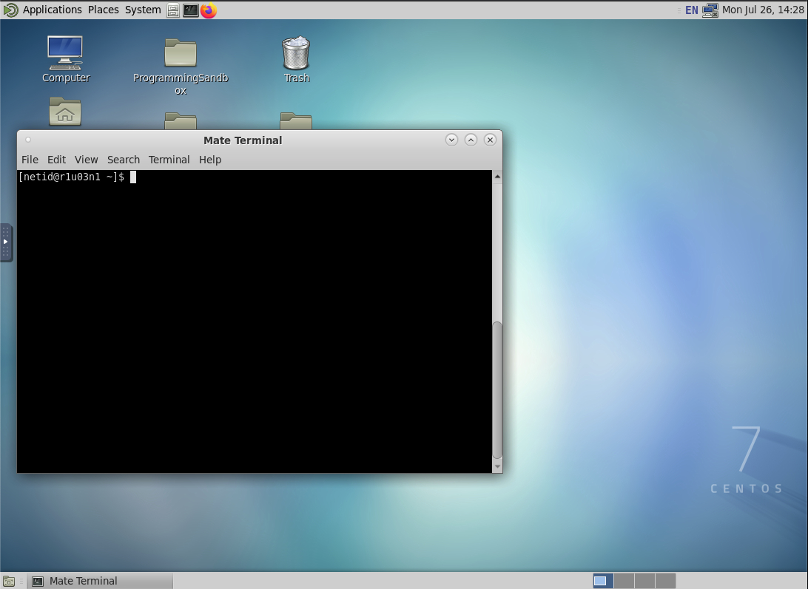

=== "Jupyter Notebooks"
    !!! tip
        To access your own python packages in Jupyter, you can create custom kernels either using [a python module](../../../software/popular_software/python/#custom-jupyter-kernel) or [using anaconda](../../../software/popular_software/anaconda/#custom-jupyter-kernel).

    The Jupyter Notebook is an open-source web application that allows you to create and share documents that contain live code, equations, visualizations, and narrative text.

    When you start a Jupyter notebook, by default your working directory will be your home. If you would like to change this so that your session starts in a different location, you'll need to add a line to the [hidden file](../../support_and_training/cheat_sheet/#hidden-files-and-directories) `~/.bashrc`. To do this, open your `~/.bashrc` in a text editor and add the following, substituting your desired path in for `</path/to/directory>`:

    ```
    export NOTEBOOK_ROOT=</path/to/directory>
    ```

    


=== "RStudio"

    RStudio is an integrated development environment (IDE) for R. It includes a console, syntax-highlighting editor that supports direct code execution, as well as tools for plotting, history, debugging and workspace management. For an overview of the RStudio IDE, see: [https://www.rstudio.com/products/RStudio/](https://www.rstudio.com/products/RStudio/).

    For information on using R on HPC, see our [online documentation on Using R Packages](../../../software/popular_software/R/).

    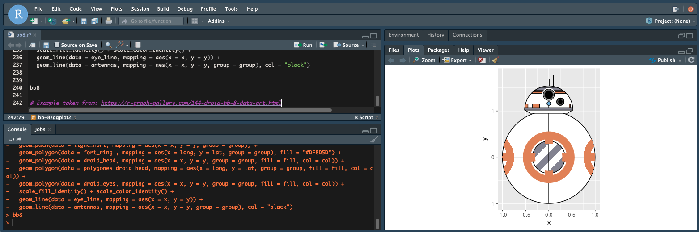

=== "Matlab"

    A GUI for multiple versions of Matlab is available. You can select which version to use in the web form when specifying your resources.

    

=== "Ansys"
    Multiple versions of the [engineering application Ansys](https://www.ansys.com/) are available. You can specify which version to use in the web form when specifying your resources. To receive Ansys-specific support, see: [Community and External Resources](../../../support_and_training/external_resources/#ansys)

    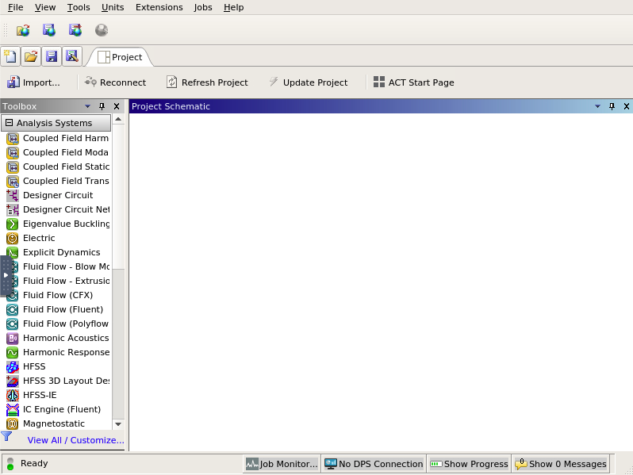

=== "Abaqus"
    A GUI for [Abaqus](https://www.technia.us/software/simulia/abaqus/) is available.

    
