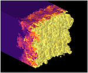
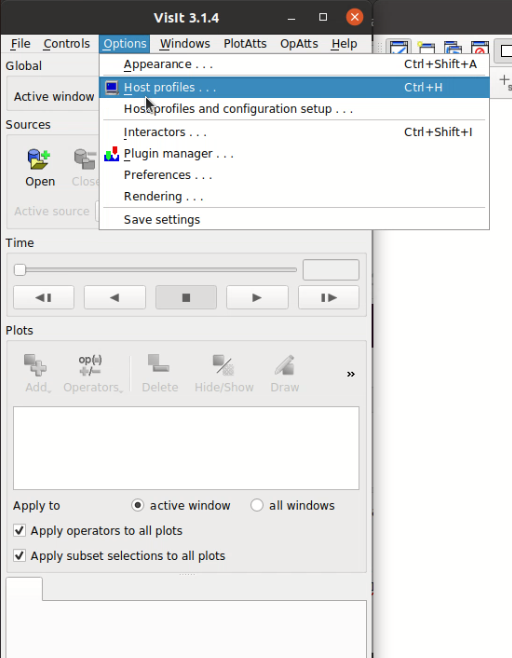
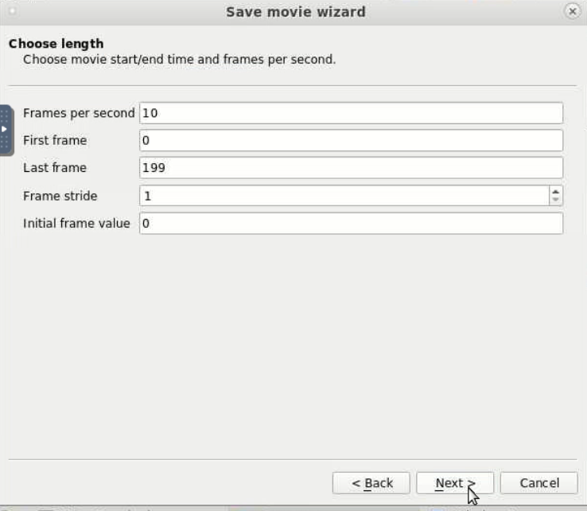
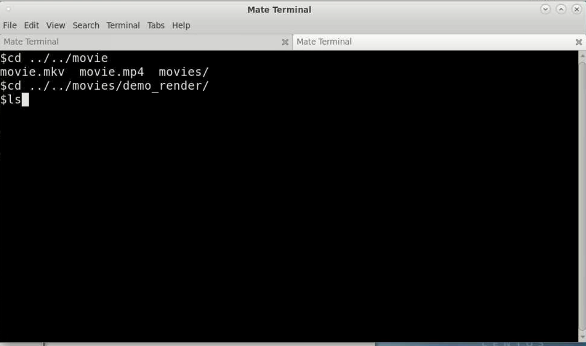

# VisIt

* Goal
* Using OOD
* Client/Server Configuration
    * Pre-requisite Installations
    * Steps on the HPC
        * Setting up ssh keys for passwordless authentication to the HPC.
        * Installing the VisIt server
        * Copying the launcher script into server folder
    * Steps for Linux
        * Connecting to the HPC VPN.
        * Installing visit
            * local machine
            * Installing the HPC host profiles
            * running visit
            * Filling in host profile
    * Support related to this document

#TODO add these to the right sections

[test](images/spheres_and_paths_smaller.png)

Goal

By the end of this document you will know how to start up VisIt client server work sessions with Open On Demand or between your local machine and the compute nodes of the HPC in client server configuration.
Using OOD

This method makes use of a remote desktop that the user can start up on the HPC. This benefits from putting the user in a familiar graphical environment so things like starting visit are the same here as on their local workstation.  Open a browser and go to ood.hpc.arizona.edu

When prompted fill out the authentication

Now select Interactive Desktop  from the Interactive Apps 

Here you can see the values that were set to run a 1 hour visit session on Ocelote with a gpu. It should be noted that this workflow can also be performed with cpu only allocations too. You will need to fill out your PI where the highlighter is over visteam .

Once you have hit Launch  and your allocation is granted you will see this on the page. Now you will click on the Launch Interactive Desktop button.

A new tab will be created that shows a remote desktop in the window. Here you will right click on the background and select Open In Terminal .

Then you will need to change directory to wherever Visit 3.2.1 was installed. If you haven't done this then follow this script to install it in the directory you are in

Download the redhat EL7 w/ Mesa option by running these commands replacing the <PIname>  with your PI's name
mkdir visit_setup
cd visit_setup
wget "https://github.com/visit-dav/visit/releases/download/v3.2.1/visit3_2_1.linux-x86_64-rhel7-wmesa.tar.gz"
tar xf visit3_2_1.linux-x86_64-rhel7-wmesa.tar.gz
cd visit3_2_1.linux-x86_64

Once you are located in the visit3_2_1.linux-x86_64  folder navigate to the bin  folder and run ./visit -debug 5 

You will now see Visit starting in the remote desktop. Use the Open button to bring up a data set you want to visualize and export a movie from. Here the aneurysm dataset is selected, if you'd like to use it you may download it here https://visit-dav.github.io/largedata/datarchives/aneurysm.

Then choose to add a simple plot.

For this data one of the interesting parts is the velocity field and how it changes over time.

Once you have selected the velocity field make sure to draw it to the adjacent Visit window.

Now that we have the first frame drawn in the viewing window, let's render all the frames of the simulation out as a movie. Select File  to show the drop down menu of options.

From the options select Save Movie which will open a wizard window to step you through the export configuration.

Select next with the default option to create a New simple movie 

In the next window select the format drop down and select one of the options. A benefit to exporting individual frames as still images is it provides greater flexibility over quality options for the conversion to video which is outlined later. Here PNG  will be used

Click the -> arrow to queue this format to the export options. It is possible to make several outputs from a single export pass by clicking the -> arrow multiple times for a range of formats/options.

Clicking next shows a window with parameters about the video to be made. These options are default set to create a frame for each time step in the video, but if a particular range is of interest you may set the First Frame  and Last Frame  to customize.

Finally we will specify where the outputs are supposed to go. Use the drop down button at the far right to open a file browser window to aid you in finding the optimal destination if it isn't the default one shown. You may change the Base Name  to specify an alternate prefix for each rendered frame which is followed by a frame number padded with 4 0's.

Since we have already configured a visit instance with out data and plot we will use the currently allocated processors . More advanced workflows may require the other options but they are not documented here as of yet.

Once you select finish a new window opens which shows the terminal output of the process, as well as a progress bar window that helps you see how the export is unfolding.

Once this finishes you may return to the terminal, and navigate to the folder where the individual frames were output. Use the ls  command to make sure you are in the correct location.

You must also load in a few modules in order to process the images into a video from the command line.
module load gnu8
module load ffmpeg

This is the final step. You will run ffmpeg to concatenate all the images together into a video whose format you may specify. To let ffmpeg know we are using all the images that match a pattern that starts with the word movie, then has 4 digits, then file type mp4 we use this string movie%04d.png . The -r specifies the rate in fps. The -f  notifies ffmpeg that we are using the image2  filter to convert an image->something else.
ffmpeg -f image2 -i movie%04d.png -r 10 output.mp4

All done!

Client/Server Configuration

This setup differs from OOD in that there is no remote rendering of the visit window contents, and allows for rapid response from interaction with the menus because the client runs natively on the local machine. The trade off is that certain capabilities are c`c
Pre-requisite Installations

VPN system like Cisco Anyconnect
Steps on the HPC
Setting up ssh keys for passwordless authentication to the HPC.

The documentation for this step exists on confluence at this link System Access#SSHKeys but you must complete these steps for shell.hpc.arizona.edu  not the bastion hpc.arizona.edu  host. Note that performing a ssh <netid>@shell.hpc.arizona.edu  and replacing the <netid>  with your netid is only possible when we are on the hpc vpn.
Installing the VisIt server

Download the redhat EL7 w/ Mesa option by running these commands replacing the <PIname>  with your PI's name
cd /groups/<PIname>
mkdir visit_setup
cd visit_setup
wget "https://github.com/visit-dav/visit/releases/download/v3.1.4/visit3_1_4.linux-x86_64-rhel7-wmesa.tar.gz"
tar xf visit3_1_4.linux-x86_64-rhel7-wmesa.tar.gz
cd visit3_1_4.linux-x86_64

Copying the launcher script into server folder

The contents of the visit installation are laid out as follows.

Navigate to the bin folder within 3.1.4  and copy in the customlauncher code

cd 3.1.4/bin
wget "https://gist.githubusercontent.com/DevinBayly/310c8689c6221fd379aad34243441dda/raw/a8f5071bb8b1e96127e1ea01b2e8667940849f1a/customlauncher" -O customlauncher

If you'd like to inspect the code a copy is available here as well.

File

Steps for Linux
Connecting to the HPC VPN.

For more information about this step please consult the respective confluence page VPN - Virtual Private Network. Here's an example of the process shown in screenshots:

	

	

At this point you need to use either `push` for duo factor auth on the smart device, or `phone` for a call or `sms` for a collection of one time passcodes. It's also worth noting that on linux openconnect http://www.infradead.org/openconnect/ is a great tool for the job.

Installing visit
local machine

https://visit-dav.github.io/visit-website/

https://visit-dav.github.io/visit-website/releases-as-tables/#series-31

Installing the HPC host profiles

download the host_uahpc2.xml  file and save it to the visit directory in your home folder. Here's what that looks like in my case:

xml file

Once downloaded, transfer it to `~/.visit/hosts`

running visit

Navigate to the visit3.1.4 folder who's contents should appear like this

Enter the `bin` folder and start visit in debug mode
cd bin
 
./visit -debug 5

This mode will be helpful for tracking down any errors that come up when configuring the client server session.
Filling in host profile

There are the values that need to be changed in the host profile to support your user on the HPC. Open the host profiles from the options tab and then select UAHPC2

On the Host Settings  page we will update the following entries that are highlighted. The first one is the path to the visit installation on the HPC. Here you must get the absolute path to the VisIt installation on the HPC which should be /groups/<PIname>/visit_setup/visit3_1_4.linux-x86_64 replacing <PIname>  with your PI's name. If you installed VisIt somewhere else you will use a different absolute path to that location.

Second you must replace baylyd  with your own netid

Then we will change the options in the Launch Profiles by selecting that tab in the Host Profiles  window.

Then select the parallel  settings tab ensuring to replace visteam  with your own PI

Once that's complete you may attempt to open a session

Select the UAHPC2  host

Then navigate to a data set you wish to visualize in the client server session

In my case I'll be using the sample aneurysm data which can be downloaded here https://visit-dav.github.io/largedata/datarchives/aneurysm

You will then have the option to select a compute launcher configuration. I'm going with elgato. Again check to make sure that the Bank field has your PI's netid in it.

After selecting OK you will see a progress bar:

This is displayed while the slurm batch allocation that was automatically generated for you waits in a queue. When it is approved and launched the progress window goes away. You can double check that the VisIt session is running successfully on the HPC by logging into hpc.arizona.edu  and running squeue -u <netid>. You will see an entry like this who's name is visit.<netid> 

At this point you can request for VisIt to perform operations and graph different aspects of your data.

If your data is timeseries you may also hit the play button and it will step through your data visualizing each step.

Support related to this document

If you are interested in this workflow but need support you can send an email to vislab-consult@list.arizona.edu for technical support a Data & Visualization consultant.
