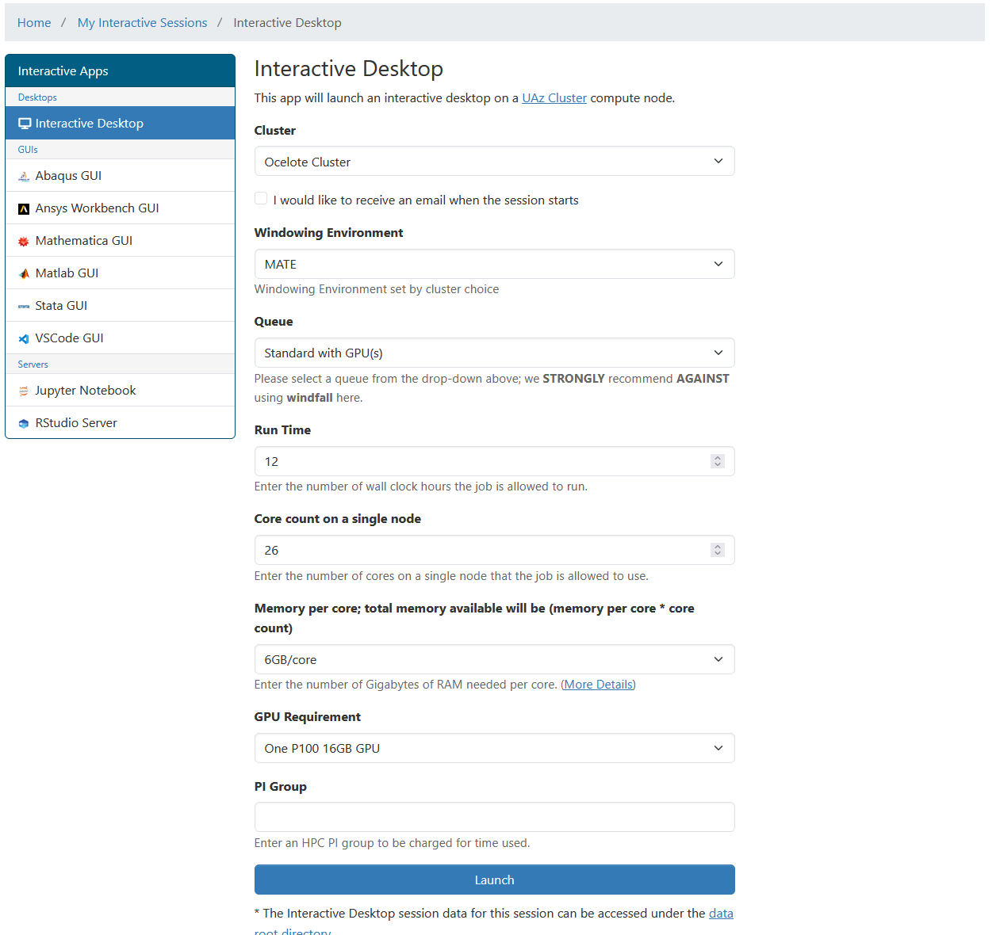
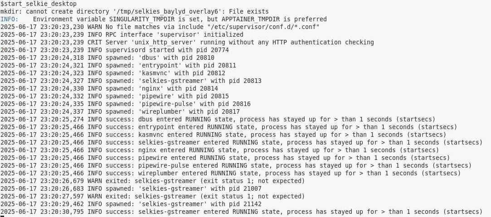
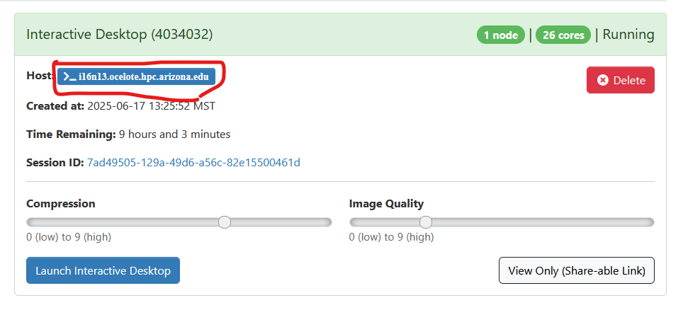

## Selkies Accelerated Remote Desktop

This page documents how to get started with the selkies remote desktop container. To read more about the project please visit https://selkies-project.github.io/selkies/. By default the remote desktops provided by OOD, don't actually automatically take advantage of GPU's to speed up graphical user interfaces (GUIs). To assist with setting up such a complex configuration we will be making use of module files that launch the selkies container. 

### Special note!

The workflow describe here utilizes a connection that isn't by default secured with SSL, so any information you submit through the remote desktop is transmitted in plaintext in the vpn. This is more secure than using plain http without a vpn, but may still make some feek they should hesitate to enter private information... **listen to this feeling** and use this interface primarily for analysis and interaction with applications that don't require authentication. 
### Getting started

The first step of the process is to request a GPU allocation on either `Ocelote` or `Puma`. The following values would be enough for a nice long interactive session. Ensure that you fill out the **PI Group** with your own information. 

### Loading the module

In a terminal open and type out the following
```
module load contrib
module load chrisreidy/baylyd/selkies
```

### Launch the remote desktop

Once that completes you will have a new command available `start_selkie_desktop` which will begin a long running task in the terminal. If all works correctly you will see this text output, and then it will stop.


### Connecting to the remote desktop

To connect to this desktop we need to be able to directly communicate with the compute node we are on. Please follow the [hpc vpn instructions](../../../../registration_and_access/vpn/index.md). 

Once that's completed you will use the hostname of the compute node in your local machine browser to connect. You can find the name by either typing `hostname` in a terminal, or by looking at your OOD https://ood.hpc.arizona.edu/pun/sys/dashboard/batch_connect/sessions interface


For example, the hostname here is `i16n13.ocelote.hpc.arizona.edu`. To connect you will navigate in the browser to the hostname and specific port `8080` that this remote desktop is listening on `i16n13.ocelote.hpc.arizona.edu:8080`, and when prompted specify these two pieces of information
* username: ubuntu
* password: mypasswd

You will now be able to launch and use GUIs on the remote desktop that leverage the presence of a GPU card. 
