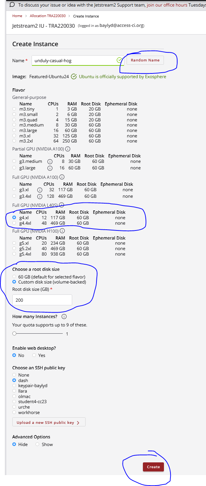
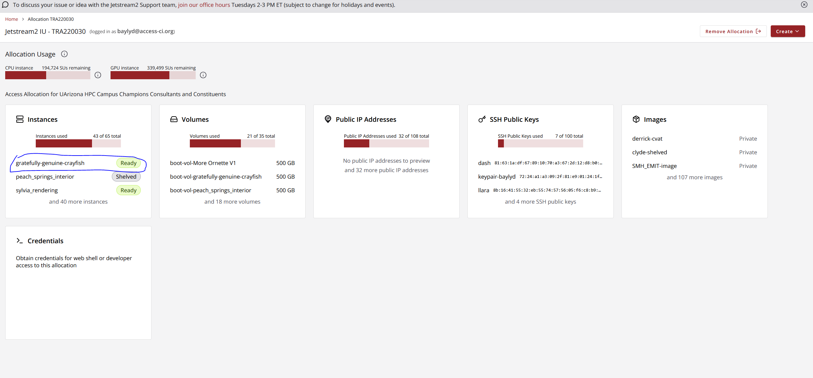
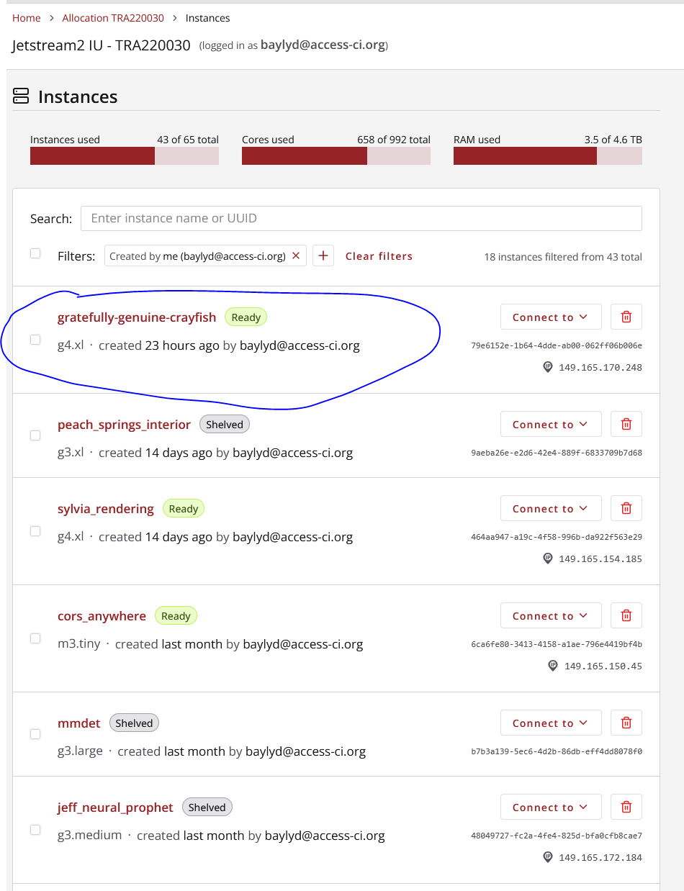
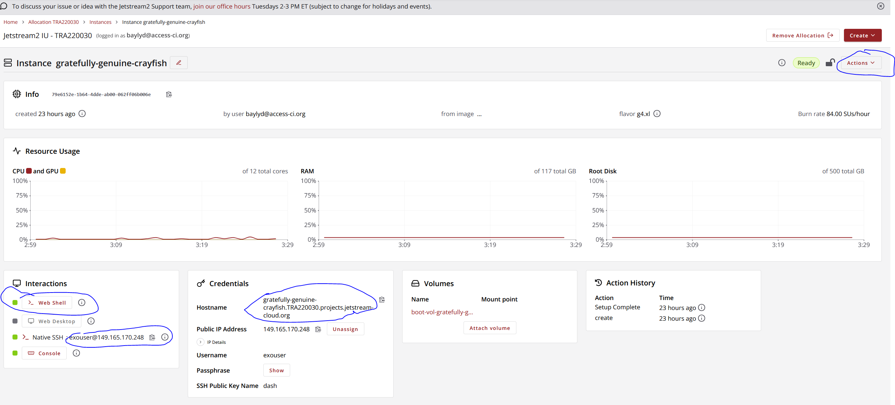

## Selkies Accelerated Remote Desktop

This page documents how to get started with the selkies remote desktop container. To read more about the project please visit https://selkies-project.github.io/selkies/. By default the remote desktops provided by OOD, don't actually automatically take advantage of GPU's to speed up graphical user interfaces (GUIs). To assist with setting up such a complex configuration we will be making use of module files that launch the selkies container. 


### Special note!

The workflow describe here utilizes a connection that isn't by default secured with SSL, so any information you submit through the remote desktop is transmitted in plaintext in the vpn. This is more secure than using plain http without a vpn, but may still make some feek they should hesitate to enter private information... **listen to this feeling** and use this interface primarily for analysis and interaction with applications that don't require authentication. 
### Getting started

The first step of the process is to request a GPU allocation on either `Ocelote` or `Puma`. The following values would be enough for a nice long interactive session. Ensure that you fill out the **PI Group** with your own information. 

### Loading the module

In a terminal open and type out the following
```
module load contrib
module load chrisreidy/baylyd/selkies
```

### Launch the remote desktop

Once that completes you will have a new command available `start_selkie_desktop` which will begin a long running task in the terminal. If all works correctly you will see this text output, and then it will stop.


### Connecting to the remote desktop

To connect to this desktop we need to be able to directly communicate with the compute node we are on. Please follow the [hpc vpn instructions](../../../../registration_and_access/vpn/index.md). 

Once that's completed you will use the hostname of the compute node in your local machine browser to connect. You can find the name by either typing `hostname` in a terminal, or by looking at your OOD https://ood.hpc.arizona.edu/pun/sys/dashboard/batch_connect/sessions interface


For example, the hostname here is `i16n13.ocelote.hpc.arizona.edu`. To connect you will navigate in the browser to the hostname and specific port `8080` that this remote desktop is listening on `i16n13.ocelote.hpc.arizona.edu:8080`, and when prompted specify these two pieces of information
* username: ubuntu
* password: mypasswd

You will now be able to launch and use GUIs on the remote desktop that leverage the presence of a GPU card. 


## Using Selkies on Jetstream 2 

Running selkies works differently on different machines. The above section covers using selkies here at the U of A on our HPC, but there are many reasons to work with other sites like Jetstream 2 in Indianna. The basic steps for setup are slightly different, but in a number of ways it's easier.

### Preliminary steps, Making instance and understanding exosphere interface

Make sure that you've picked a new  Ubuntu 24.04 instance g4.xl flavor 



Then wait for this instance to finish building before clicking on the tile from the allocations dashboard 


then check out the individual instances' home page 



On that page we will be using a few pieces of information to access the instance



* the webshell: it can be used instead of a terminal to access the instance via the cli
* the ssh line: this can be used to connect to the instance from a terminal (works better when you need to use copy paste for cli commands)
* the domain name: this is the address of the instance visible to the public internet. We will use this to ensure that we can connect via https and make sure our typed out information is encrypted. I recommend using chrome so the clipboard works in the remote desktop so accessing with `https://<domain>:8080` and accepting the screen that says "self signed cert detected"
* the actions: **This is a very important part of the screen**, here you will be using **"un/shelve"** when you are done working with an instance at the end of the day. This will keep us from burning credits when no work is happening

### Starting the accelerated remote desktop

The very first command to run is `nvidia-smi` so that we can make sure there's a gpu attached to your machine

After this if you see a window printing out information about the current processes on the card you can grab the selkies docker container (this is also the **restart** command)
```
    # this just turns off/removes the previously disconnected container, don't worry about error if it says no container with that name
    docker stop egl;docker rm egl 
    # this runs the container in the background so you can disconnect from the shell and it'll stay up (for about a day or so)
    docker run --name egl -it -d --network host -v /home/exouser/Downloads:/home/ubuntu/Downloads --gpus 1 --tmpfs /dev/shm:rw -e TZ=UTC -e DISPLAY_SIZEW=1920 -e DISPLAY_SIZEH=1080 -e DISPLAY_REFRESH=60 -e DISPLAY_DPI=96 -e DISPLAY_CDEPTH=24 -e PASSWD=mypasswd -e SELKIES_ENCODER=nvh264enc -e SELKIES_VIDEO_BITRATE=8000 -e SELKIES_FRAMERATE=60 -e SELKIES_AUDIO_BITRATE=128000 -e SELKIES_BASIC_AUTH_PASSWORD=mypasswd -e SELKIES_ENABLE_HTTPS=true -e SELKIES_HTTPS_CERT=/etc/ssl/certs/ssl-cert-snakeoil.pem -e SELKIES_HTTPS_KEY=/etc/ssl/private/ssl-cert-snakeoil.key -p 8080:8080 ghcr.io/selkies-project/nvidia-egl-desktop:latest

    # last step, make sure the download folder is mounted (only need to do this once)
    sudo chown ubuntu:ubuntu Downloads ## ensures that the user in the container can modify the contents of the volume mounted Downloads directory 
```

and then navigate in a browser to

`https://<domain>:8080 `

accepting the screen that says "self signed cert detected"

For instance
    https://gratefully-genuine-crayfish.TRA220030.projects.jetstream-cloud.org:8080 ( i recommend chrome so the clipboard is shared ) 

    Again, save everything in the "Downloads" folder so that it maps back to the container's host. 