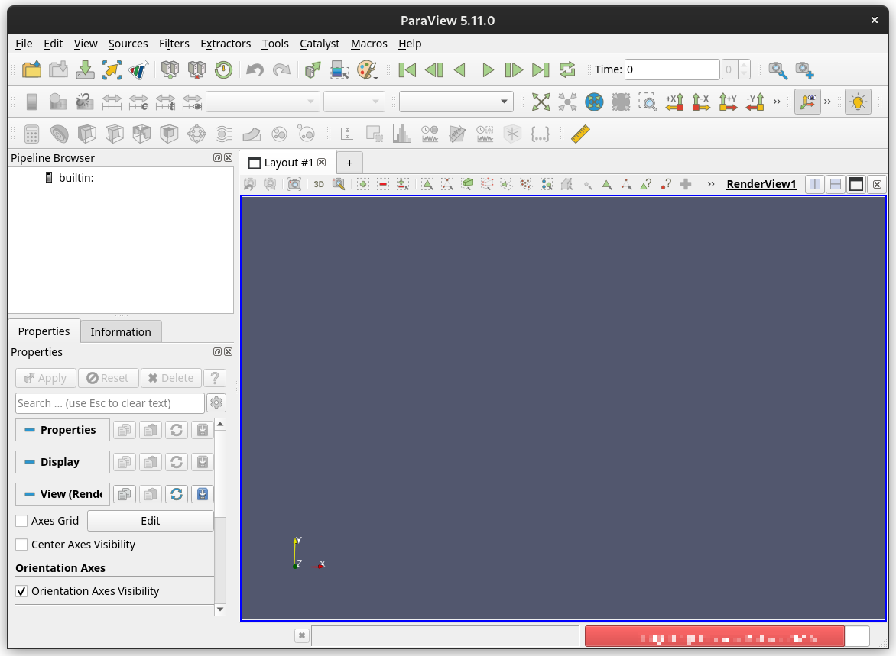
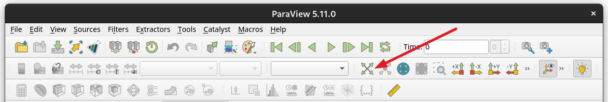
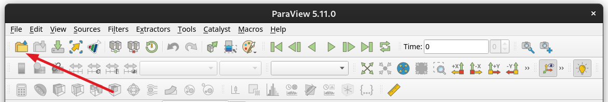
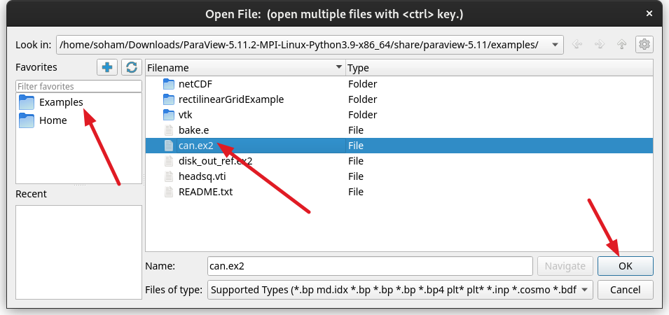
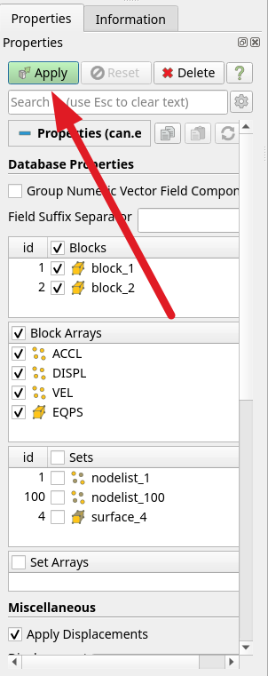
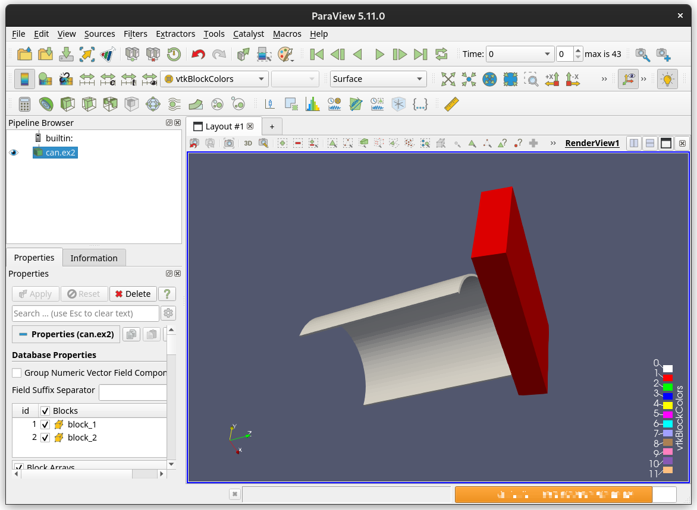
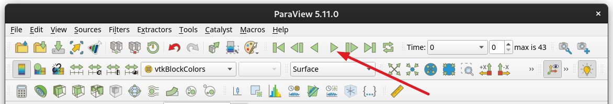
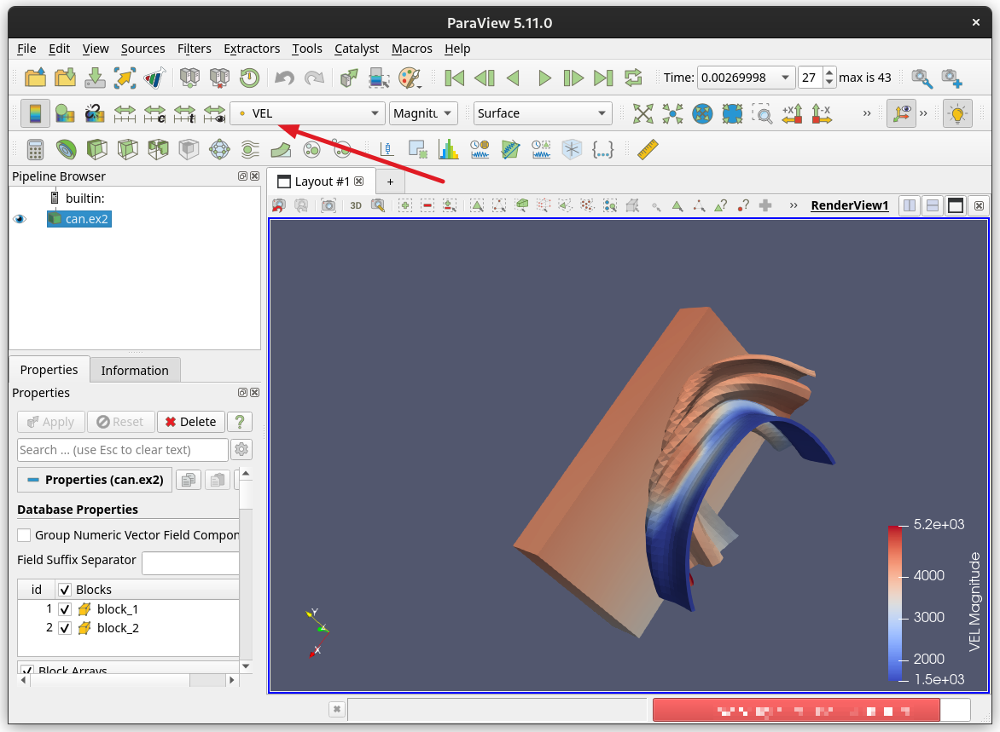
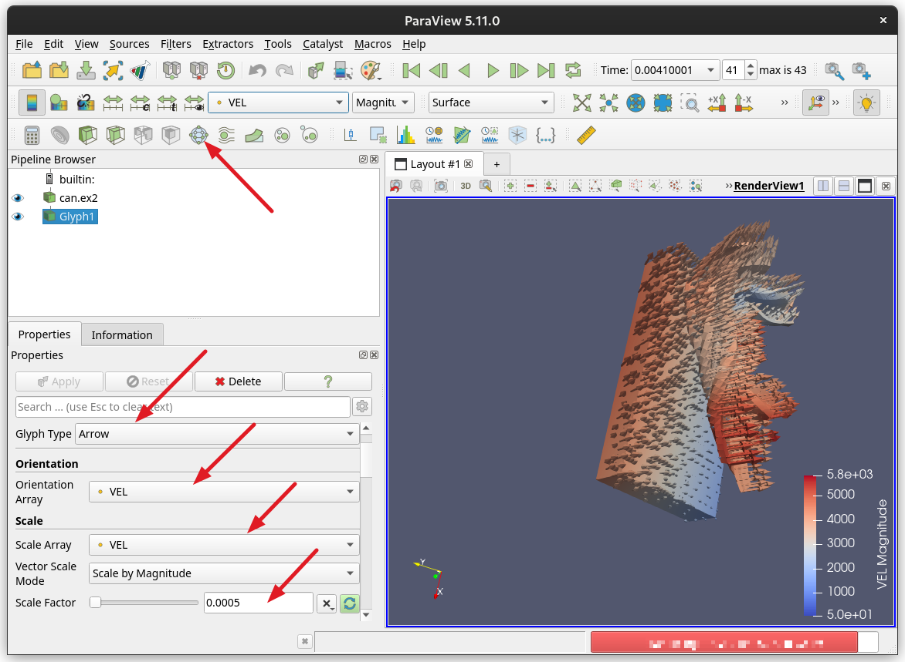

ParaView is a powerful data visualization software that many researchers can find useful for getting a visual understanding of their data. This guide will be a brief introduction to ParaView including how to install it and use its GUI interface. For more information on how to use the ParaView terminal (PvPython), see [Getting Started With ParaView Terminal](../getting_started_with_paraview_terminal/index.md).

## Installing ParaView

You can setup ParaView on our HPC cluster or on your workstation. Follow the instructions below based on which system you want to install ParaView on.
!!! example "Choose your system"
    === "HPC"
        These instructions will get you setup with the Paraview GUI on our HPC systems. Feel free to copy and paste this code into an OOD Remote Desktop Terminal, and consult the lower explanations for details about each line.
        
        ```bash
        apptainer pull docker://ghcr.io/devinbayly/vtk:latest # (1)!
        wget "https://www.paraview.org/paraview-downloads/download.php?submit=Download&version=v5.11&type=binary&os=Linux&downloadFile=ParaView-5.11.0-MPI-Linux-Python3.9-x86_64.tar.gz" -O paraview.tar.gz # (2)!
        tar xf paraview.tar.gz # (3)!
        apptainer exec vtk_latest.sif ./ParaView-5.11.0-MPI-Linux-Python3.9-x86_64/bin/paraview # (4)!
        ```

        1. This pulls an Apptainer container with packages prepared by our visualization consultant to run ParaView on the HPC. For more information on Apptainer containers, see [What are Containers](../../../../software/containers/what_are_containers/index.md).
        2. This pulls the `paraview` binary from their downloads, and renames it to `paraview.tar.gz`.
        3. This line extracts the contents of the gzipped tar file.
        4. This line executes the `paraview` binary and launches the GUI.

    === "Workstation"
    
        ParaView is available for Windows, Mac, and Linux and can be downloaded from [https://www.paraview.org/download/](https://www.paraview.org/download/). You can choose which version to download from a drop-down menu on the page. This tutorial uses version 5.11.0, but you can use other versions if those work for you better. Run the downloaded executable (on Linux you will have to extract the files from a tarball) and follow the instructions to install it.

## Running ParaView

<!-- There are two ways to work with ParaView, either through the GUI (visual -->
<!-- editor) or through a terminal. This tutorial will focus on the GUI, if -->
<!-- you wish to use the terminal, check out the PvPython tutorial -->
<!-- <a href="https://www.notion.so/Getting-Started-With-The-Paraview-Terminal-PvPython-b81abd6f027e4b9c87d716ec36c02129" class="external-link">here</a>. -->

### ParaView GUI

To run the ParaView GUI, find the ParaView executable and run it on your computer.

Once open, close any popups and you will see the default layout.



If you plan on working with Python, from the top drop-down you can click **View → Python Shell**. This Python shell is equivalent to PvPython in the ParaView Terminal option.

To get started with the terminal, first, add a shape. Try adding a sphere to the scene from the drop-down by clicking **Sources → Geometric Shapes → Sphere**. While nothing is added to the view here, you can see that in the pipeline tab on the left, a sphere has been added. To show this in the view, you can click the eye icon to the left of the new object.

To maneuver in the view you can use your left mouse button to rotate, your right mouse button to zoom, and your middle mouse button to pan. Alternatively, **Shift + right mouse button** can be used to pan and the scroll wheel can be used to zoom. The view can be reset at any time with the **Reset** button shown below:



### Loading Data

Let’s load some example data into ParaView. Click the **Open** button from the toolbar (shown below), or go to **File → Open**, or press **Crtl + O**.



On the left side under Favorites, there should be a directory called `Examples`. From that, click `can.ex2` and hit **OK**.



No data should appear yet but information about the data should appear in the properties tab. In this, we can select what information from our data set we want to load. For this example, we can leave all the default settings. Click **Apply** to confirm the settings and you should see the example data appear in the view.





### Changing The Visualization

This visualization can be played with the green play button at the top of the screen.



Currently, the colors just show the two different shapes. Let’s say we want to visualize the acceleration of all the points of the shape. In the toolbar, find the drop-down that currently says `vtkBlockColors` and switch it to `VEL`. Play the animation again to visualize the result.



While this does provide some useful information, it may not be the best way of visualizing velocity. Instead, let's add some vectors to see how each point is moving.

Start by adding a Glyph to your data. With your data selected click the **Glyph** button from the toolbar. Next, set both the **Orientation Array** and **Scale Array** to `VEL` and hit **Apply**. You should notice that the arrows do get added but they are way too large. Change this by editing your scale factor until it looks right (0.0005 worked for me).



And there you have it! You can play the animation and watch as the arrows change with time.

Later tutorials will work with specific data types as well as other features included in ParaView but after this, you should have a base understanding of how to navigate the scene and load some basic data.

## ParaView on HPC video walkthrough
<iframe width="1000" height="750" title="Paraview on HPC walkthrough" src="https://www.youtube.com/embed/Ku9rtS3DHlU" allowfullscreen></iframe>
