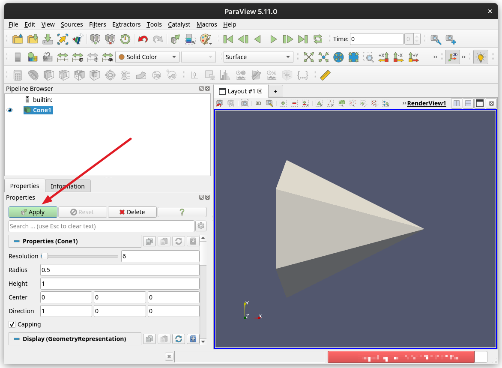
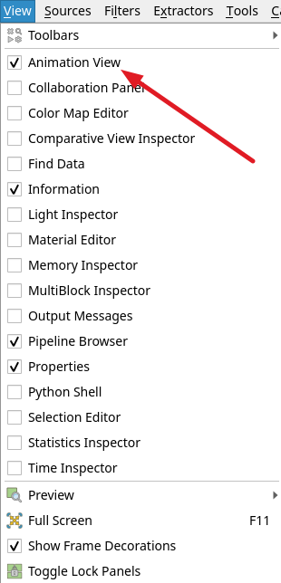
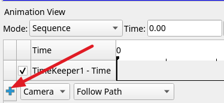
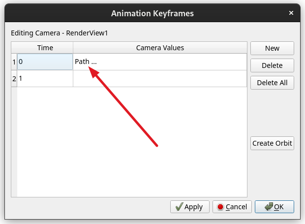
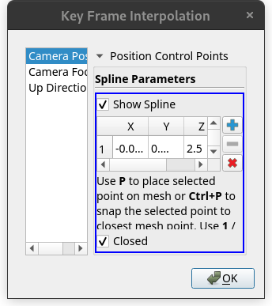
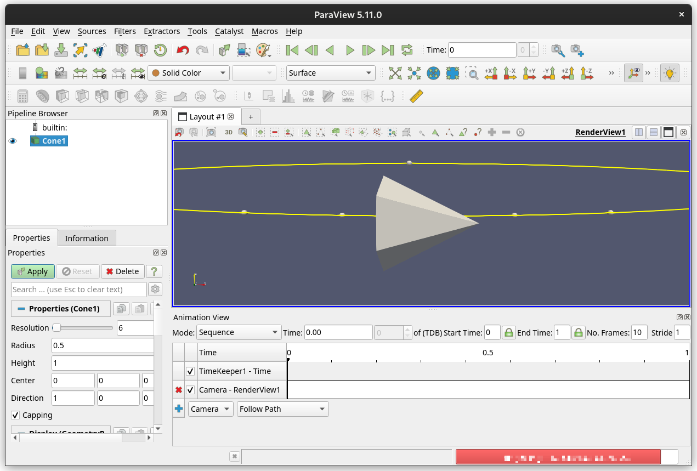
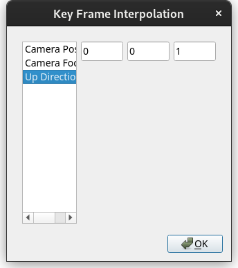
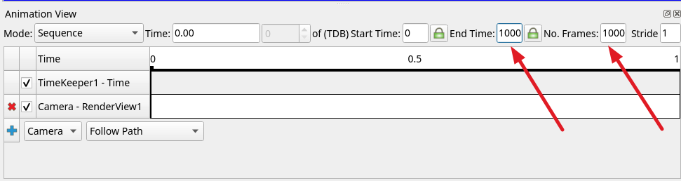
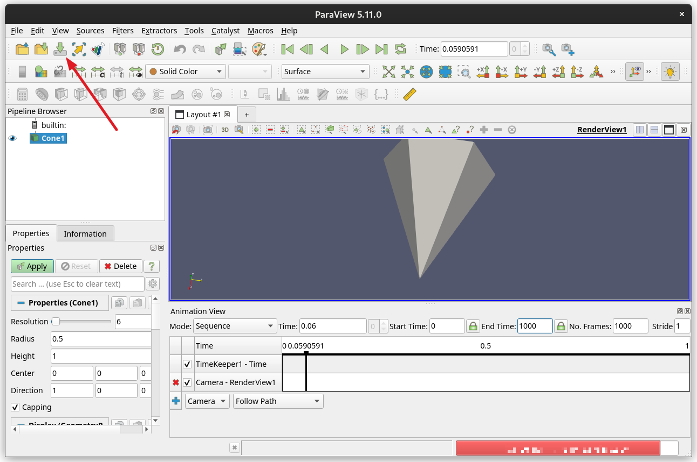

When producing a rendering video we can speed things up tremendously by recognizing that each frame is independent of every other. This allows us to perform the rendering of each frame of a video output in parallel. In this tutorial you will learn to prepare a scene in ParaView, and save its "state" so that Slurm array jobs can then render all the frames in parallel, taking a fraction of the time it would otherwise take. At the end of the process you will use FFmpeg to stitch all the frames together into a movie.

## Making an animation with ParaView GUI

Follow the steps in [Getting Started With ParaView GUI](../getting_started_with_paraview_gui/index.md) to launch ParaView. Generate a simple geometric shape, such as a cone, for this tutorial. You can select one from the **Sources → Geometric Shapes** drop down menu. Select **Apply** to see the geometry in the viewport on the right.



Select the **Animation View** option from the **View** drop down menu. A pane titled **Animation View** will appear in the bottom of the window.



The **Animation View** pane will show an option to add an orbit camera animation track. Click the blue cross to add it. For more information on cameras, see [Cameras And Keyframes](../cameras_and_keyframes/index.md).



After adding a **Camera**, double click on it. This will open a window titled **Animation Keyframes**, containing a table. Double click the cell that says *Path*.



This will open up a window titled **Key Frame Interpolation**.



Selecting the **Camera Position** element will add a yellow line added to the viewport containing the cone geometry. You can move the yellow line from the middle of the geometric shape with the middle mouse button.



Select the **Up Direction** element in the **Key Frame Interpolation** window and change the values to 0, 0, 1. Without this the camera will face sideways. 



Click **Ok**, and return to the **Animation View**. Set both the *Number of Frames* and *End Time* to 1000. This will be important later when we use Slurm array jobs to produce a rendering video, as it will allow Slurm to identify frames by whole numbers. 



Click the **Play** button and see the camera orbiting around the geometric shape in the viewport. If this looks correct, save the ParaView state file by either clicking the **Save State** button, or selecting **Save State** from the **File** drop down menu.



## Parallel Rendering with Slurm Array Jobs

The ParaView state file represents the data corresponding to the geometric shape and the animated camera perspective. We will render it in parallel with Slurm array jobs and create a video. 

Start an interactive session on the HPC, and pull an Apptainer container with a headless version of ParaView 5.11.0 in it:
```bash
apptainer pull oras://ghcr.io/e-eight/containers/paraview-headless
```
This will create a file called `paraview-headless_latest.sif`. Headless means that the program does not have access to a display to make graphical outputs. This works because we will use ParaView only to render the frames, not to view the movie. If the pulling the container fails for any reason, you can create one from an Apptainer definition file containing the following:
```bash
Bootstrap: docker
From: debian:bookworm-slim

%post
  apt update -y
  apt install -y libgomp1 curl wget libglu1-mesa-dev freeglut3-dev mesa-common-dev libxcursor*
  cd /opt
  wget "https://www.paraview.org/paraview-downloads/download.php?submit=Download&version=v5.11&type=binary&os=Linux&downloadFile=ParaView-5.11.0-osmesa-MPI-Linux-Python3.9-x86_64.tar.gz" -O paraview.tar.gz
  tar xf paraview.tar.gz
  rm paraview.tar.gz
  apt-get clean && rm -rf /var/lib/apt/lists/*

%environment
  export PATH=/opt/ParaView-5.11.0-osmesa-MPI-Linux-Python3.9-x86_64/bin:$PATH
```
See [Containers](../../../../software/containers/what_are_containers/index.md) to learn more about Apptainer containers, and how to create them. 


We will now construct one Slurm script and one Python script that we will use for our rendering. The Slurm script will submit an array job. For more information, on Slurm array jobs, see [Array Jobs](../../../batch_jobs/array_jobs/index.md). The Python script will contain all the logic for rendering the frames with ParaView.

### Slurm Script

In the following script replace `visteam` with your allocation account. 

```bash title="headless_batch.slurm"
#!/bin/bash
#SBATCH --output=logs/%x-%a.out
#SBATCH --error=logs/%x-%a.err
#SBATCH --job-name=paraview-headless
#SBATCH --ntasks=1
#SBATCH --nodes=1
#SBATCH --time=00:30:00
#SBATCH --partition=standard
#SBATCH --account=visteam

pvsm_pth=$1
apptainer exec paraview-headless_latest.sif pvpython render.py --pvsm "$pvsm_pth" --frame ${SLURM_ARRAY_TASK_ID}
```

As it is written this will allocate 1 CPU task for the task of headlessly rendering a single frame with an upper time limit of 30 mins. Note that there is a `${SLURM_ARRAY_TASK_ID}` environment variable in use but no `#SBATCH --array=` line. This is because it is often nice to have the option to specify the size of the array job at run time as we will see below. This will simply start the Apptainer container for each array job and execute a script that is a wrapper around the ParaView `pvpython` program. For more information on the `pvpython` program, see [Getting Started with ParaView Terminal](../getting_started_with_paraview_terminal/index.md).

This next file is where many of the interesting bits actually are. 

### Python Script

This script was initially generated with the `trace` utility built into ParaView. With the `trace` utility you can make a Python script by recording interactions with the ParaView GUI. For more information, see [Trace Recorder](https://www.paraview.org/Wiki/ParaView_and_Python#Trace_Recorder). The comments in the script explain what the code does.

```python title="render.py"
# state file generated using paraview version 5.11.0
from paraview.simple import *
import paraview
import os
import argparse
from pathlib import Path
import time

# this is for helping us determine the run time of each frame's render
start = time.perf_counter()
# get frame number to render and the path to the pvsm file to load
parser = argparse.ArgumentParser()
parser.add_argument("--pvsm", type=Path)
parser.add_argument("--frame")
args = parser.parse_args()

# load the pvsm file
# this brings in our geometric shape, as well as the animation track that we created with the orbiting camera
paraview.simple.LoadState(args.pvsm.name)
paraview.compatibility.major = 5
paraview.compatibility.minor = 11

#### import the simple module from the paraview
#### disable automatic camera reset on 'Show'
paraview.simple._DisableFirstRenderCameraReset()

# ----------------------------------------------------------------
# setup views used in the visualization
# ----------------------------------------------------------------
timekeeper = GetTimeKeeper()

renderView1 = GetActiveViewOrCreate("RenderView")
# ensure axes are hidden
renderView1.OrientationAxesVisibility = 0
renderView1.CenterAxesVisibility = 0

# ----------------------------------------------------------------
# setup color maps and opacity mapes used in the visualization
# note: the Get..() functions create a new object, if needed
# ----------------------------------------------------------------

print(GetSources())

# find out how many frames are in our animation

anim = GetAnimationScene()
print("animation length is",anim.EndTime)


if __name__ == '__main__':
# figure out what the output folder is for the frame

    render_folder = Path(f"{Path(args.pvsm.stem)}_renders")

# we will make this folder if it doesn't already exist
    render_folder.mkdir(parents=True,exist_ok =True)

# get the argument provided  indicating which frame we are supposed to render
    frame = int(args.frame)

# find out the maximum array job id
    max_array_id = int(os.environ["SLURM_ARRAY_TASK_MAX"])
    print("starting render")

# as long as we aren't above the last frame number continue to run
    while (frame < int(anim.EndTime)):
      print("running frame,",frame)

# move our animation track head to the frame we want to render
      anim.AnimationTime = float(frame)

# establish the HD and 4K file paths for our still frame render
      png_pth_hd = Path(f"{render_folder}/frame_{frame:06d}_HD.png")
      png_pth_4k = Path(f"{render_folder}/frame_{frame:06d}_4K.png")

# if there's already renders for this frame go ahead and skip
      if png_pth_hd.exists() and png_pth_4k.exists():
        print("skipping, already exists")
        frame+=max_array_id
        continue

# otherwise go ahead and render them out using the correct resolutions
      SaveScreenshot(f"{png_pth_hd}",renderView1,ImageResolution=[1920,1080])
      SaveScreenshot(f"{png_pth_4k}",renderView1,ImageResolution=[3840,2160])
      print("saved")

# move on to the next frame that might need rendering using the number of array jobs as our offset
# this ensures that we can use smaller sets of array jobs and still render all the frames we need.
      frame+=max_array_id

# get an end time for performance measuring
    end = time.perf_counter()
    print(f"elapsed {end-start}")
``` 

### Submitting Array Jobs

Submit a Slurm job array with the following, replacing `<state_file>` with the path to the ParaView state file that you had saved earlier:
```bash
sbatch --array=0-900 headless_batch.sh <state_file>
```
The `--array` option allows us to dynamically specify the number of array jobs that we want to run, `0-900` means we specified a job array with array indices 0 to 900. After submitting the job, it might take a while to start, depending on the resource availability of the cluster. You can check the status of the job with `squeue -u <netid>`, replacing `<netid>` with your NetID. Assuming you have not submitted any other jobs and this job has started, you will see an output like the following:
```bash
             JOBID PARTITION     NAME     USER ST       TIME  NODES NODELIST(REASON)
 2125119_[101-900]  standard paraview sohampal PD       0:00      1 (None)
         2125119_4  standard paraview sohampal  R       0:01      1 cpu39
         2125119_5  standard paraview sohampal  R       0:01      1 cpu43
         2125119_6  standard paraview sohampal  R       0:01      1 cpu43
         2125119_7  standard paraview sohampal  R       0:01      1 cpu45
         2125119_8  standard paraview sohampal  R       0:01      1 cpu45
         2125119_9  standard paraview sohampal  R       0:01      1 cpu45
        2125119_10  standard paraview sohampal  R       0:01      1 cpu45
        2125119_11  standard paraview sohampal  R       0:01      1 cpu45
        2125119_12  standard paraview sohampal  R       0:01      1 cpu45
        2125119_13  standard paraview sohampal  R       0:01      1 cpu45
        2125119_14  standard paraview sohampal  R       0:01      1 cpu45
        2125119_15  standard paraview sohampal  R       0:01      1 cpu45
        2125119_16  standard paraview sohampal  R       0:01      1 cpu45
        2125119_17  standard paraview sohampal  R       0:01      1 cpu45
        2125119_18  standard paraview sohampal  R       0:01      1 cpu45
        2125119_19  standard paraview sohampal  R       0:01      1 cpu45
        2125119_20  standard paraview sohampal  R       0:01      1 cpu45
...
```
The output has been truncated to fit in to the space. You can see the jobs with array indices 101 to 900 are yet to start, while jobs with lower array indices are running. It will take close to 14 seconds per frame for a simple animated scene like this, and since there are more frames to render than there are jobs to run, some jobs will take longer than others because they will render more than one frame. Perform either an HD or a 4K render of your material, instead of both, if the render times become too long.

### Rendering Movie

From an interactive session load the `ffmpeg` module:

```bash
module load ffmpeg
```
Stitch together all the frames to generate a video, replacing `<video_name>` with the desired name for your video file:

```bash
ffmpeg -i frame_%06d_HD.png -r 10 -c:v copy <video_name>
```
You can automate the creation of this video with Slurm job dependencies. For more information, see [Job Dependencies](../../../batch_jobs/job_dependencies/index.md). This is the highest possible quality video that you can use in other video editing software without any codec. It shows the entire render in sequence even though all the frames were generated in parallel. Below is a gif created from the video file for a cone geometry.


