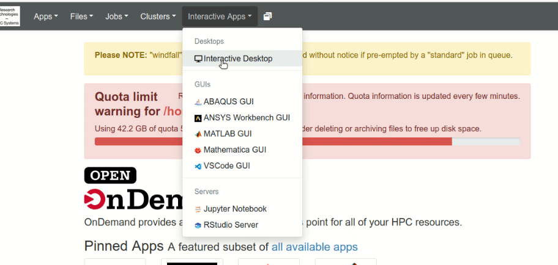

# VisIt

* Goal
* Using OOD
* Client/Server Configuration
    * Pre-requisite Installations
    * Steps on the HPC
        * Setting up ssh keys for passwordless authentication to the HPC.
        * Installing the VisIt server
        * Copying the launcher script into server folder
    * Steps for Linux
        * Connecting to the HPC VPN.
        * Installing visit
            * local machine
            * Installing the HPC host profiles
            * running visit
            * Filling in host profile
    * Support related to this document

Goal
====

By the end of this document you will know how to start up VisIt client
server work sessions with [Open On
Demand](/wiki/spaces/UAHPC/pages/75990636/Open+On+Demand) or between
your local machine and the compute nodes of the HPC in client server
configuration.

Using OOD
=========

This method makes use of a remote desktop that the user can start up on
the HPC. This benefits from putting the user in a familiar graphical
environment so things like starting visit are the same here as on their
local workstation.  Open a browser and go to ood.hpc.arizona.edu

When prompted fill out the authentication

Now select `Interactive Desktop`  from the `Interactive Apps` 

Here you can see the values that were set to run a 1 hour visit session
on Ocelote with a gpu. It should be noted that this workflow can also be
performed with cpu only allocations too. You will need to fill out your
PI where the highlighter is over `visteam` .

  

Once you have hit `Launch`  and your allocation is granted you will see
this on the page. Now you will click on the `Launch Interactive Desktop`
button.

  

A new tab will be created that shows a remote desktop in the window.
Here you will right click on the background and
select `Open In Terminal` .

Then you will need to change directory to wherever Visit 3.2.1 was
installed. If you haven't done this then follow this script to install
it in the directory you are in

Download the redhat EL7 w/ Mesa option by running these commands
replacing the `<PIname>`  with your PI's name

    mkdir visit_setup
    cd visit_setup
    wget "https://github.com/visit-dav/visit/releases/download/v3.2.1/visit3_2_1.linux-x86_64-rhel7-wmesa.tar.gz"
    tar xf visit3_2_1.linux-x86_64-rhel7-wmesa.tar.gz
    cd visit3_2_1.linux-x86_64

Once you are located in the `visit3_2_1.linux-x86_64`  folder navigate
to the `bin`  folder and run `./visit -debug 5` 

You will now see Visit starting in the remote desktop. Use the Open
button to bring up a data set you want to visualize and export a movie
from. Here the aneurysm dataset is selected, if you'd like to use it you
may download it here
<a href="https://visit-dav.github.io/largedata/datarchives/aneurysm" class="external-link">https://visit-dav.github.io/largedata/datarchives/aneurysm</a>.

Then choose to add a simple plot.

For this data one of the interesting parts is the velocity field and how
it changes over time.

Once you have selected the velocity field make sure to draw it to the
adjacent Visit window.

Now that we have the first frame drawn in the viewing window, let's
render all the frames of the simulation out as a movie. Select `File` 
to show the drop down menu of options.

From the options select `Save Movie` which will open a wizard window to
step you through the export configuration.

Select next with the default option to create a `New simple movie` 

In the next window select the format drop down and select one of the
options. A benefit to exporting individual frames as still images is it
provides greater flexibility over quality options for the conversion to
video which is outlined later. Here `PNG`  will be used

Click the `->` arrow to queue this format to the export options. It is
possible to make several outputs from a single export pass by clicking
the `->` arrow multiple times for a range of formats/options.

Clicking next shows a window with parameters about the video to be made.
These options are default set to create a frame for each time step in
the video, but if a particular range is of interest you may set the
`First Frame`  and `Last Frame`  to customize.

Finally we will specify where the outputs are supposed to go. Use the
drop down button at the far right to open a file browser window to aid
you in finding the optimal destination if it isn't the default one
shown. You may change the `Base Name`  to specify an alternate prefix
for each rendered frame which is followed by a frame number padded with
4 0's.

Since we have already configured a visit instance with out data and plot
we will `use the currently allocated processors` . More advanced
workflows may require the other options but they are not documented here
as of yet.

Once you select finish a new window opens which shows the terminal
output of the process, as well as a progress bar window that helps you
see how the export is unfolding.

Once this finishes you may return to the terminal, and navigate to the
folder where the individual frames were output. Use the `ls`  command to
make sure you are in the correct location.

You must also load in a few modules in order to process the images into
a video from the command line.

    module load gnu8
    module load ffmpeg

This is the final step. You will run ffmpeg to concatenate all the
images together into a video whose format you may specify. To let ffmpeg
know we are using all the images that match a pattern that starts with
the word movie, then has 4 digits, then file type mp4 we use this string
`movie%04d.png` . The `-r` specifies the rate in fps. The `-f`  notifies
ffmpeg that we are using the `image2`  filter to convert an
image-&gt;something else.

    ffmpeg -f image2 -i movie%04d.png -r 10 output.mp4

All done!

  

Client/Server Configuration
===========================

This setup differs from OOD in that there is no remote rendering of the
visit window contents, and allows for rapid response from interaction
with the menus because the client runs natively on the local machine.
The trade off is that certain capabilities are c\`c

Pre-requisite Installations
---------------------------

VPN system like Cisco Anyconnect

Steps on the HPC
----------------

### Setting up ssh keys for passwordless authentication to the HPC.

The documentation for this step exists on confluence at this link
[System
Access\#SSHKeys](/wiki/spaces/UAHPC/pages/75990560/System+Access#SystemAccess-SSHKeys)
but you must complete these steps for `shell.hpc.arizona.edu`  not the
bastion `hpc.arizona.edu`  host. Note that performing a
`ssh <netid>@shell.hpc.arizona.edu`  and replacing the `<netid>`  with
your netid is only possible when we are on the hpc vpn.

### Installing the VisIt server

Download the redhat EL7 w/ Mesa option by running these commands
replacing the `<PIname>`  with your PI's name

    cd /groups/<PIname>
    mkdir visit_setup
    cd visit_setup
    wget "https://github.com/visit-dav/visit/releases/download/v3.1.4/visit3_1_4.linux-x86_64-rhel7-wmesa.tar.gz"
    tar xf visit3_1_4.linux-x86_64-rhel7-wmesa.tar.gz
    cd visit3_1_4.linux-x86_64

  

### Copying the launcher script into server folder

The contents of the visit installation are laid out as follows.

Navigate to the bin folder within 3.1.4  and copy in the customlauncher
code

  

    cd 3.1.4/bin
    wget "https://gist.githubusercontent.com/DevinBayly/310c8689c6221fd379aad34243441dda/raw/a8f5071bb8b1e96127e1ea01b2e8667940849f1a/customlauncher" -O customlauncher

If you'd like to inspect the code a copy is available here as well.
<a href="customlauncher" download>Customlauncher</a>

Steps for Linux
---------------

### Connecting to the HPC VPN

Connect to the HPC VPN, preferably with Cisco AnyConnect. For detailed information on connecting to the HPC VPN, see [VPN - Virtual Private Network](../../../registration_and_access/vpn/).

Note that {==The HPC VPN==} is needed to connect directly to a compute node. This differs from the standard UArizona VPN or campus network which are not sufficient. The HPC VPN is `vpn.hpc.arizona.edu`.

### Installing visit

#### local machine

<a href="https://visit-dav.github.io/visit-website/" class="external-link">https://visit-dav.github.io/visit-website/</a>

<a href="https://visit-dav.github.io/visit-website/releases-as-tables/#series-31" class="external-link">https://visit-dav.github.io/visit-website/releases-as-tables/#series-31</a>

  

#### Installing the HPC host profiles

download the `host_uahpc2.xml`  file and save it to the visit directory
in your home folder. Here's what that looks like in my case:

[host_uahpc2.xml](host_ua_hpx2.xml) 
 
Once downloaded, transfer it to \`~/.visit/hosts\`

  

#### running visit

Navigate to the visit3.1.4 folder who's contents should appear like this

Enter the \`bin\` folder and start visit in debug mode

    cd bin

    ./visit -debug 5

This mode will be helpful for tracking down any errors that come up when
configuring the client server session.

#### Filling in host profile

There are the values that need to be changed in the host profile to
support your user on the HPC. Open the host profiles from the options
tab and then select UAHPC2

On the `Host Settings`  page we will update the following entries that
are highlighted. The first one is the path to the visit installation on
the HPC. Here you must get the absolute path to the VisIt installation
on the HPC which should be
`/groups/<PIname>/visit_setup/visit3_1_4.linux-x86_64`
replacing `<PIname>`  with your PI's name. If you installed VisIt
somewhere else you will use a different absolute path to that location.

Second you must replace `baylyd`  with your own netid

Then we will change the options in the `Launch Profiles` by selecting
that tab in the `Host Profiles`  window.

Then select the `parallel`  settings tab ensuring to replace `visteam` 
with your own PI

Once that's complete you may attempt to open a session

Select the `UAHPC2`  host

Then navigate to a data set you wish to visualize in the client server
session

In my case I'll be using the sample aneurysm data which can be
downloaded here
<a href="https://visit-dav.github.io/largedata/datarchives/aneurysm" class="external-link">https://visit-dav.github.io/largedata/datarchives/aneurysm</a>

You will then have the option to select a compute launcher
configuration. I'm going with `elgato`. Again check to make sure that
the `Bank` field has your PI's netid in it.

After selecting `OK` you will see a progress bar:

This is displayed while the slurm batch allocation that was
automatically generated for you waits in a queue. When it is approved
and launched the progress window goes away. You can double check that
the VisIt session is running successfully on the HPC by logging
into `hpc.arizona.edu`  and running `squeue -u <netid>`. You will see an
entry like this who's name is `visit.<netid>` 

At this point you can request for VisIt to perform operations and graph
different aspects of your data.

  

If your data is timeseries you may also hit the play button and it will
step through your data visualizing each step.

  

  

  

  

  

Support related to this document
--------------------------------

If you are interested in this workflow but need support you can send an
email to <a href="mailto:vislab-consult@list.arizona.edu" class="external-link">vislab-consult@list.arizona.edu</a>
for technical support a Data & Visualization consultant.

{"serverDuration": 18, "requestCorrelationId":
"79d8fd98c6fa410395673f3939c1f8ca"}
