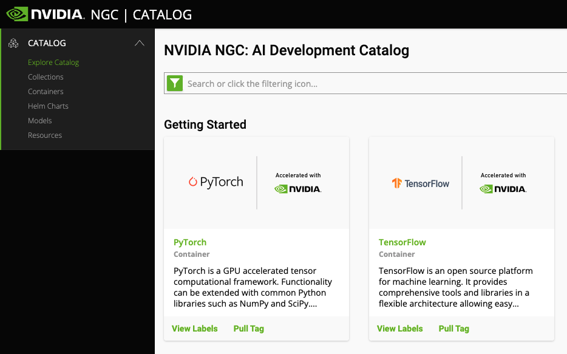
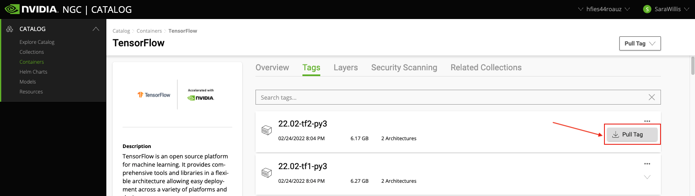

# Pulling Containers

!!! warning 
    The Apptainer cache can fill up your home quickly. To set a different location, see our [Cache Directory documentation](../containers_on_hpc/#cache-directory). 

## Pulling Docker Containers

Apptainer has the ability to convert available docker images into sif format allowing them to be run on HPC. If you find an image on [Docker Hub](https://hub.docker.com/) that you would like to use, you can pull it using the ```apptainer pull command <local_image_name>.sif docker://docker_image```. 

As an example, we could pull an Ubuntu image from Docker Hub with OS 22.04 by searching for Ubuntu, opening the Tags tab, and copying their ```docker pull``` command:


Then, on HPC, we can run:

```
[netid@cpu37 pull_example]$ apptainer pull ubuntu_22.04.sif docker://ubuntu:22.04
INFO:    Converting OCI blobs to SIF format
INFO:    Starting build...
Getting image source signatures
Copying blob 01007420e9b0 done  
Copying config 3db8720ecb done  
Writing manifest to image destination
Storing signatures
2024/02/20 09:02:02  info unpack layer: sha256:01007420e9b005dc14a8c8b0f996a2ad8e0d4af6c3d01e62f123be14fe48eec7
INFO:    Creating SIF file...
[netid@cpu37 pull_example]$ ls
ubuntu_22.04.sif
```

## Pulling Nvidia Images

The NVIDIA GPU Cloud (NGC) provides GPU-accelerated HPC and deep learning containers for scientific computing.  NVIDIA tests HPC container compatibility with the Apptainer runtime through a rigorous QA process. Application-specific information may vary so it is recommended that you follow the container-specific documentation before running with Apptainer. If the container documentation does not include Apptainer information, then the container has not yet been tested under Apptainer. Apptainer can be used to pull, execute, and bootstrap off Docker images. 

To pull images, you'll need to [register with Nvidia](https://ngc.nvidia.com/signin). Once you have an account, you can view their images [from their catalogue](https://catalog.ngc.nvidia.com/). Click on the name of the software you're interested in to view available versions



If you click on the **Tags** tab at the top of the screen, you'll find the different versions that are available for download. For example, if we click on TensorFlow, we can get the pull statement for the latest tag of TensorFlow 2 by clicking the ellipses and selecting Pull Tag.



This will copy a ```docker pull``` statement to your clipboard, in this case:

```
$ docker pull nvcr.io/nvidia/tensorflow:22.02-tf2-py3
```

To pull and convert this NGC image to a local Apptainer image file, we'll convert this to:

```
$ apptainer build ~/tensorflow2-22.02-py3.sif docker://nvcr.io/nvidia/tensorflow:22.02-tf2-py3
```

The general format for any pull you want to do is:

```
$ apptainer build <local_image_name> docker://nvcr.io/<registry>/<app:tag>
```

This Apptainer build command will download the app:tag NGC Docker image, convert it to Apptainer format, and save it to the local filename local_image_name. 
