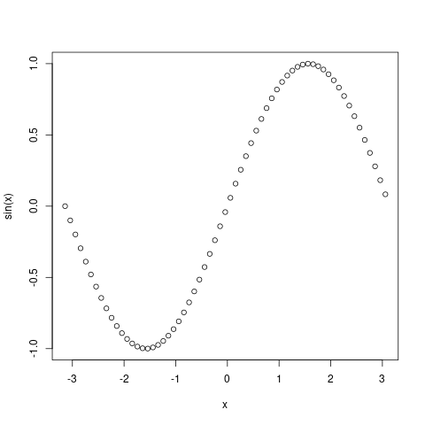

<link rel="stylesheet" href="../../../assets/stylesheets/animated_dropdown.css">

# R

R is a popular language for data analysis and visualization. Different versions are available as software modules and we provide the graphical interface RStudio through our [Open OnDemand web interface](https://ood.hpc.arizona.edu).

Similar to other languages that use package managers to install libraries contributed by the user community, we recommend you create and manage your own local libraries in your account. This ensures a stable global environment for all users and that you have the most control over your packages' versions and dependencies.

We provide instructions below for how to create, use, and switch between libraries as well as some debugging techniques for when package installations fail.

## Creating R Libraries

### What is a Library?

An R library is a directory where the R packages you install are stored. Creating a custom library allows you to have control over where your packages are installed (faciliting storage management and enabling library sharing among groups), lets you isolate your environments (great for version control), and allows you to switch between different package ecosystems. 

### Library Best Practices

Before we cover how to create a library, here are a few important considerations to ensure a stable R environment and avoid runtime and installation failures:

1. **Each R library you create should correspond to a single version of R.**

    Installing different R packages using multiple versions of R into a common library will frequently lead to installation and runtime failures. If you're changing R versions, change your library.


2. **Each R library should correspond to a single operating system (OS).**

    Installing R packages on one OS and attempting to use them on another will frequently result in crashes. If you're switching between clusters that use different operating systems (for example, switching from Puma to Ocelote), ensure the R library you're using was built on that OS. 

3. **Create your own libraries and avoid using the default that R creates for you.**

    If you haven't set up a custom library and install R packages, R will create a default directory for you stored under:

    ```
    ~/R/x86_64-pc-linux-gnu-library/<R_version>
    ``` 

    Any packages installed in this library will **always** be loaded into your environment whenever you use R version `<R_version>`, regardless of whether you're specifying a custom library or not. On your local computer, this may not be an issue, but in the context of HPC, this can become a source of trouble. The largest drawback is the potential for mixing operating systems when switching between clusters. Installing packages on one OS and attempting to use them on another will most often lead to software failures. 

    If you find you have accidentally created a default R library, you can either delete it, or you can move it to a new location and [manually load it when desired](#how-to-switch-libraries).


### Create Your First Library

1. **Make a directory to store your packages.**

    We recommend including information about your library in the name, e.g.:

    1. Which version of R you're using.
    2. Which OS was used to create it. Puma's OS is Rocky Linux 9. Ocelote and El Gato run on CentOS 7.
    
    It's important to maintain a consistent version of R with your libraries since installing packages into one library with multiple versions of R will often cause trouble. Similarly, installing an R package on one operating system and using it on another will result in failures. 

    An example of creating a library:

    ```bash 
    mkdir -p ~/R/library_4.2_rocky9
    ```
  
2. **Create an environment file.**

    R reads from a [dot file (a hidden, plain text file)](../../../support_and_training/cheat_sheet/#hidden-files-and-directories) called `~/.Renviron` when it starts. This allows you to define custom behavior. In the case of creating a custom library, we can tell R where to look for and install packages by setting the variable `R_LIBS` in this file. A quick, easy way to do this is to run:

    ```bash
    echo 'R_LIBS=~/R/library_4.2_rocky9/' >> ~/.Renviron
    ```

    replacing `~/R/library_4.2_rocky9/` with the path to your own library. All this does is append the line `R_LIBS=~/R/library_4.2_rocky9/` to the file `~/.Renviron`.

    
3. **Install your packages.**

    That's it! Once you have a custom library and `R_LIBS` is defined in `~/.Renviron`, you can install packages by starting R and using something like `install.packages()`. For example, we could install the package `ggplot2` using:


    ```bash
    $ module load R/4.2
    $ R
    > install.packages("ggplot2")
    ```

    


### How to Switch Libraries

If you're changing the version of R you're using, or if you're changing operating systems (for example, switching clusters from Puma to Ocelote), we recommend using a different library. To do this: 

1. **Create a new directory, if needed.**

    If you already have an existing library set up for the environment you're planning to use, you can skip this step. Otherwise, you can create a new library using similar steps to those [shown in the preceding section](#create-your-first-library)

    If you're creating a new library, remember to include pertinant information in the name. For example:

    ```bash
    mkdir -p ~/R/library_4.4_centos7
    ```

2. **Edit your `~/.Renviron` file.**

    Open the file `~/.Renviron` in a text editor. If you're not familiar with command line text editing, check out the [Command Line Text Editors section in our Linux Cheat Sheet](../../../support_and_training/cheat_sheet/#command-line-text-editors). For example, you could open the file using `nano`:

    ```bash
    nano ~/.Renviron
    ```

    Once your text editor opens, set the `R_LIBS` variable previously defined in your file to the name and location of your new library. In this example, this would look like:

    ```bash
    R_LIBS=~/R/library_4.4_centos7
    ```
    Then, save and exit.

That's it! Now, when you install new packages, they will be saved to this new directory. 

## Tips for Installing Packages

### Use a Terminal

When installing R packages, we recommend using an [interactive terminal session](../../../running_jobs/interactive_jobs/) and avoiding RStudio. This is because RStudio uses a [container](../../containers/what_are_containers/) under the hood which may override some system variables necessary for successful compilations. 
    
This is particularly true if your software relies on [software modules](../../modules/). For example, hdf5r and Seurat rely on modules hdf5 and gdal, respectively (see [popular packages](#popular-packages) for more information). RStudio does not have access to modules, so these packages will not be able to compile in that environment. Instead, they should be compiled on the command line with the necessary software modules loaded. If modules were needed to compile a package, they may be loaded in RStudio by following the instructions further down on this page under [Loading Modules in RStudio](#loading-modules-in-rstudio-material-alert-decagramnew). {==Note that using this method only allows you to **load** R packages that have already been installed on the command line and does **not** work for **compile time** issues==}. This is due to Apptainer overriding environment variables necessary for compilation. 

### Explicitly Specify R Version
    
We recommend **always** loading `R` with its version specified, both when installing packages and when running [batch jobs](../../../running_jobs/batch_jobs/intro/). I.e.:

```
module load R/<version>
```

and not simply using `module load R`. When a version is not specified, modules default to the newest version. This means that when an update is made, the default version of R that is loaded changes which can lead to version conflicts and incompatabilities. 

### Remove Anaconda From Your Environment

Anaconda is a common culprit for R package installation failures. If you have Anaconda or Miniconda initialized in your account, we recommend fully removing it from your environment prior to attempting any R package installations. We have information on how to do this on our Anaconda page under **Removing Anaconda From Your Environment** --> **Temporary Removal** which can be [found here](http://localhost:6120/software/popular_software/anaconda/#__tabbed_1_2).


## Common Problems and How to Debug Them

### Presence of Anaconda

Anaconda is a common culprit for R package installation failures. If you have Anaconda or Miniconda initialized in your account, we recommend fully removing it from your environment prior to attempting any R package installations. We have information on how to do this on our Anaconda page under **Removing Anaconda From Your Environment** --> **Temporary Removal** which can be [found here](http://localhost:6120/software/popular_software/anaconda/#__tabbed_1_2).

### Mixed R Versions

If packages are failing to load or install, double check that your library was built with a consistent version of R. To check this, you can open an R session and run:

```R
installed.packages()[, c("Package", "Version", "Built")]
```

This will display the versions of R used to install each package in the right column. Some example output might look like:

```R
> installed.packages()[, c("Package", "Version", "Built")]
                     Package                Version     Built  
abind                "abind"                "1.4-8"     "4.4.0"
AnnotationDbi        "AnnotationDbi"        "1.68.0"    "4.4.0"
boot                 "boot"                 "1.3-28"    "4.2.2"
class                "class"                "7.3-20"    "4.2.2"
cluster              "cluster"              "2.1.4"     "4.2.2"
```
Note in the above example, two different versions of R (4.4.0 and 4.2.2) were used during package installations. If your library has this issue, reinstalling packages, uninstalling packages, or creating a new library to ensure all packages were installed using a consistent version of R may resolve your problem.

### Mixed Operating Systems

If your R workflows are failing with errors referencing `glibc`, `libstdc++`, or other system libraries, this may be an issue resulting from installing packages on one OS and trying to run them on a different one. 

Ocelote and ElGato run on the OS CentOS 7 while Puma runs on Rocky Linux 9. If you're getting errors of the type mentioned above, try loading your packages on a different cluster (with a different OS) to see if you get the same errors. If your packages load successfully, they were likely compiled there. 

To run your analyses on a different OS, you will need to create a new library and reinstall your packages in that new environment. 

### R Environment Issues

R Stores previous saved sessions and configuration options in different files, typically stored in your home. For example, old sessions may be saved as a hidden file `~/.RData`. Alternatively, they may be stored under `~/.local/share/rstudio`. Where they are stored is dependent on the version of R you are using. These may sometimes cause environment corrpution, or for your job to run out of memory immediately after starting. Removing or moving these old session files may help. Note that if these files are causing storage issues, it's possible to [set a new user state directory](#setting-a-new-user-state-directory).

It's also important to pay attention to the lines added to the following files, if they exist: `~/.Renviron`, `~/.UAz_ood/rstudio.sh`, and `~/.R/Makevars`. Corruption of environment variables and loading nonexistent modules may cause package installation failures, RStudio sessions to crash before starting (e.g., in your job tile in OOD, RStudio will immediately go from Starting to Completed), among other unwanted behavior. 


### Installations in RStudio

If you're trying to install an R package in RStudio, you may run into dependency or system library issues. We recommend retrying the installation in an [interactive terminal session](../../../running_jobs/interactive_jobs/) on the command line to see if this resolves the issue. 

This is particularly true if your R package dependes on an external software module such as hdf5 or gdal (see [Popular Packages](#popular-packages) lower on this page for some examples of this case).

See [our best practices section above](#use-a-terminal) for more detailed information. 

    


## Using RStudio


=== "Open OnDemand"
    We provide access to the popular development environment RStudio through our [Open OnDemand](../../../running_jobs/open_on_demand/#applications-available/) web interface. This is a very handy tool, though it should be noted that it is a less flexible environment than using R from the command line. This is because RStudio sets its own environment which prevents easy access to third party software installed as system modules.

=== "Apptainer/Singularity"
    In some circumstances, you may want to run RStudio using your own Apptainer (rebranded from Singularity) image. For example, this allows access to different versions of R not provided when using our OOD application. We have some instructions on one way to do this below.

    First, log into HPC using an Open OnDemand Desktop session and open a terminal. A Desktop session is the easiest solution to access RStudio since it eliminates the need for port forwarding.

    In the terminal, make an RStudio directory where all of the necessary files will be stored. In this example, we'll be working in our home directory and will pull an RStudio image from Dockerhub to use as a test. If you're interested, you can find different RStudio images under [rocker in Dockerhub](https://hub.docker.com/u/rocker).

    ```
    mkdir $HOME/RStudio
    cd $HOME/RStudio
    apptainer pull ./geospatial.sif docker://rocker/geospatial.sif
    ```

    Next, create the necessary directories RStudio will use to generate temporary files. You will also generate a secure cookie key.

    ```
    TMPDIR=$HOME/RStudio/rstudio-tmp
    mkdir -p $TMPDIR/tmp/rstudio-server
    uuidgen > $TMPDIR/tmp/rstudio-server/secure-cookie-key
    chmod 600 $TMPDIR/tmp/rstudio-server/secure-cookie-key
    mkdir -p $TMPDIR/var/{lib,run}  
    ```

    Next, create a file in your RStudio directory called rserver.sh and make it an executable:

    ```
    touch rserver.sh
    chmod u+x rserver.sh
    ```
    Open the file in your favorite editor and enter the content below. Modify the variables under ```USER OPTIONS``` to match your account if necessary. You can change ```PASSWORD``` to any password you'd like to use. Once you've entered the contents, save and exit:

    ```
    #!/bin/bash
 
    # --- USER OPTIONS --- #
    WD=$HOME/RStudio
    SIFNAME=geospatial.sif
    PASSWORD="PASSWORD"
 
    # --- SERVER STARTUP EXECUTED BELOW --- #
    NETID=$(whoami)
    TMPDIR=$WD/rstudio-tmp
    SIF=$WD/$SIFNAME
    PASSWORD=$PASSWORD apptainer exec -B $TMPDIR/var/lib:/var/lib/rstudio-server -B $TMPDIR/var/run:/var/run/rstudio-server  -B $TMPDIR/tmp:/tmp $SIF rserver --auth-none=0 --auth-pam-helper-path=pam-helper --server-user=$NETID --www-address=127.0.0.1
    ```

    Now, in your desktop session's terminal, execute the rserver.sh script using ```./rserver.sh```

    

    Next, open a Firefox window and enter ```localhost:8787``` for the URL. In your browser, you will be prompted to log into your RStudio server. Enter your NetID under Username. Under Password, enter the password you defined in the script server.sh.

    

    This will open your RStudio session:

    


### Loading Modules in RStudio {==(:material-alert-decagram:New!)==}

!!! danger annotate "Library installations still must be performed on the command line"
    The method detailed below is used to faciliate **loading** R libraries in RStudio when they depend on system software modules. R library **installations** will still need to take place in an [interactive session](../../../running_jobs/interactive_jobs/) on the command line. (1)
    
    
1.  This is because the container that is necessary to start RStudio overrides environment variables set by modules that are necessary for successful library compilations.


If you are using the RStudio application in Open OnDemand, it is now possible to load additional [software modules](../../modules/) into your environment. You might want to do this if your R libraries depend on modules. An example of this might be the [Seurat package](#popular-packages) which depends on the modules gdal, proj, sqlite3, and geos. 

!!! danger inline end "Use caution"
    Be careful with the lines you add to rstudio.sh. If you add invalid commands (e.g., try to load a nonexistent module), new RStudio sessions will crash during initialization. 

**Method to Load Modules**

To load modules, you will need to create a [hidden directory](../../../support_and_training/cheat_sheet/#hidden-files-and-directories) in your home called `~/.UAz_ood`. Inside that directory, create a file called `rstudio.sh`. You can then add any `module load` statements you need to this file. The file `rstudio.sh` is sourced when your RStudio session initiates, so {==if you modify this file, you will need to start a new RStudio session for the changes to take effect==}.

An example of how to create this file with example contents is shown below. 

**Example**

This example assumes you are working on the command line. Start by first creating the necessary directory and file:

```bash
mkdir -p ~/.UAz_ood
touch ~/.UAz_ood/rstudio.sh
```
Next, open `rstudio.sh` in your favorite text editor. One option is to use the command line text editor nano. If you have not used a command line text editor, see [this page](../../../support_and_training/cheat_sheet/#command-line-text-editors) for details. For example:

```bash
nano ~/.UAz_ood/rstudio.sh
```
Next, in the file add the modules that you would like to load in RStudio. For example:

```
module load gdal/3.8.5 geos/3.9.5 proj/9.4.0 sqlite/3.45
```

Now, save and exit. Once your file exists with the desired contents, start an new OnDemand RStudio session. 

### Setting a New User State Directory

When working on a large project in RStudio, it is possible for your R session's data to fill up your home directory resulting in out-of-space errors (e.g. when trying to edit files, create new OOD sessions, etc). With the newest version of RStudio, you can find these saved session files under ```~/.local/share/rstudio```.

To preserve space in your home, you can specify a different directory by setting the environment variable ```RSTUDIO_DATA_HOME```. To do this, open the hidden file ```~/.bashrc``` and add:

```
export RSTUDIO_DATA_HOME=</path/to/new/directory>
```

where ```</path/to/new/directory>``` is the path to a different location where you have a larger space quota. For example, ```/groups/<YOUR_PI>/<YOUR_NETID>/rstudio_sessions```.

### Setting Your Working Directory

=== "Current Session"
    If you'd like to change your working directory in an RStudio session, one option is to use ```setwd("/path/to/directory")``` in your terminal. Alternatively, if you'd like to see the contents of your new workspace in your file browser, you can navigate to the **Session** dropdown tab, navigate to **Set Working Directory**, and click **Choose Directory...**

    

    From there, either navigate to the desired subdirectory, or click the ellipsis ```...``` in the upper right to enter the full path to a directory.

    

    Once you click **OK** and then **Choose** in the main file navigation window, R will change its working directory and you should see the contents of your new space under the Files browser in the lower right.

    

=== "All Non-Project Sessions"
    If you'd like to permanently set a different default working directory for all non-project RStudio sessions, navigate to the **Tools** dropdown tab and select **Global Options...**

     

     This will open a menu where you can set your default working directory under **General**. Click the **Browse...** button to open a file navigator

     

    To select a new working directory, either navigate to the subdirectory of your current working space, or select the ellipsis ```...``` in the upper right to allow you to enter the full path. 

    

    The ellipsis option allows for more flexibility such as pointing to an ```/xdisk``` or ```/groups``` space.

    

    Next, click **OK**, then **Choose** in the Choose Directory window, then **Apply** in the Global Options menu. This will set your working directory for your current session as well as all future sessions.

    

### Font Issues

The RStudio application available through Open OnDemand uses [Apptainer](../../containers/what_are_containers/) under the hood. As a result, there are some environment differences that may affect correct font formatting in images generated in RStudio. If you are experiencing this, add the following line to the hidden file `~/.Renviron` in your account (you can create this file if it does not exist):

```
FONTCONFIG_PATH=/opt/ohpc/pub/apps/fontconfig/2.14.2/etc/fonts
```

## Popular Packages

Below, we document some installation instructions for common R packages. We attempt to keep these instructions reasonably up-to-date. However, given the nature of ongoing software and package updates, there may be discrepancies due to version changes. If you notice any instructions that don't work, [contact our consultants](../../../support_and_training/consulting_services/) and they can help. 

{==Installs below assume you are using the Puma cluster==}. The module dependencies shown may not work properly for clusters that run on a different operating system and may need to be adjusted.

=== "Seurat and SeuratDisk"

    !!! bug "Anaconda must be removed from your environment"
        You will need to make sure Anaconda is completely removed from your environment prior to the install. If you have Anaconda initialized in your account, see the code block on our Anaconda page under [Removing Anaconda From Your Environment --> Temporary Removal](../anaconda/#removing-anaconda-from-your-environment).

    !!! warning "RStudio Users"
    
        To install Seurat and SeuratDisk, you'll need to be in an [interactive terminal session](../../../running_jobs/interactive_jobs/) and {==not in an RStudio session==}. Once your installation is successful, it is possible to load these modules in RStudio using [the method described here](#loading-modules-in-rstudio-material-alert-decagramnew). 


    === "Seurat"
        !!! tip "CentOS 7 Installation"
            The additional module `libpng/1.6.37` is required if installing Seurat on Ocelote or ElGato.

        ```
        (puma) [netid@junonia ~]$ interactive -a <your_group>
        [netid@r6u19n1 ~]$ module load R/<version>
        [netid@r6u19n1 ~]$ module load gdal/3.8.5 glpk/5.0  # software modules that are needed for Seurat's dependencies
        [netid@r6u19n1 ~]$ R
        > install.packages("Seurat")
        ```

        If you want to load this software in an RStudio session, you will need to create the file `~/.UAz_ood/rstudio.sh`. See the [Loading Modules in RStudio](#loading-modules-in-rstudio-material-alert-decagramnew) section above for more information. 

    === "SeuratDisk"

        !!!tip "CentOS 7 Installation"
            The additional modules `libpng/1.6.37` and `libgit2/1.8.1` are required if installing Seurat on Ocelote or ElGato. 
            
            Additionally, you will need to run `unset CPPFLAGS` after loading the dependency modules, prior to starting R. This is due to a [reported issue with the dependency hdf5r](https://github.com/hhoeflin/hdf5r/issues/132):

        SeuratDisk is similar to Seurat with a few more dependencies. 

        ```
        (puma) [netid@junonia ~]$ interactive -a <your_group>
        [netid@r6u19n1 ~]$ module load R/<version> gdal/3.8.5 hdf5/1.14.0 glpk/5.0
        [netid@r6u19n1 ~]$ R
        > install.packages("Seurat")
        > install.packages("remotes")
        > remotes::install_github("mojaveazure/seurat-disk")
        ```

        If you want to load this software in an RStudio session, you will need to create the file `~/.UAz_ood/rstudio.sh`. See the [Loading Modules in RStudio](#loading-modules-in-rstudio-material-alert-decagramnew) section above for more information. 

=== "Monocle3"

    !!! warning "RStudio Users"

        To install Monocle3, you'll need to be in an [interactive terminal session](../../../running_jobs/interactive_jobs/) and {==not in an RStudio session==}. Once your installation is successful, it is possible to load these modules in RStudio using [the method described here](#loading-modules-in-rstudio-material-alert-decagramnew). 

    !!! bug "Anaconda must be removed from your environment"
        You will need to make sure Anaconda is completely removed from your environment prior to the install. If you have Anaconda initialized in your account, see the code block on our Anaconda page under [Removing Anaconda From Your Environment --> Temporary Removal](../anaconda/#removing-anaconda-from-your-environment).


    [Monocle3's documentation](https://cole-trapnell-lab.github.io/monocle3/docs/installation/) includes steps that you can use for a successful installation.

    ```
    (puma) [netid@junonia ~]$ interactive -a your_group
    [netid@r6u19n1 ~]$ module load R/<version> gdal/3.8.5
    [netid@r6u19n1 ~]$ R
    > install.packages("BiocManager")
    > BiocManager::install(c('BiocGenerics', 'DelayedArray', 'DelayedMatrixStats',
                           'limma', 'lme4', 'S4Vectors', 'SingleCellExperiment',
                           'SummarizedExperiment', 'batchelor', 'HDF5Array',
                           'terra', 'ggrastr'))
    > install.packages("remotes")
    > remotes::install_github('cole-trapnell-lab/monocle3')
    ```

    Then, to load Monocle3 in RStudio, you will need to create the file `~/.UAz_ood/rstudio.sh` as detailed in the [Loading Modules in RStudio](#loading-modules-in-rstudio-material-alert-decagramnew) section above. 

=== "Terra"

    !!! warning "RStudio Users"
        To install Monocle3, you'll need to be in an [interactive terminal session](../../../running_jobs/interactive_jobs/) and {==not in an RStudio session==}. Once your installation is successful, it is possible to load these modules in RStudio using [the method described here](#loading-modules-in-rstudio-material-alert-decagramnew). 

    !!! bug "Anaconda must be removed from your environment"
        You will need to make sure Anaconda is completely removed from your environment prior to the install. If you have Anaconda initialized in your account, see the code block on our Anaconda page under [Removing Anaconda From Your Environment --> Temporary Removal](../anaconda/#removing-anaconda-from-your-environment).

    To install the R package `terra`, you will need to load the module `gdal` which will pull in other dependencies (`geos`, `proj`, and `sqlite`). In this example, we'll use the modules `R/4.3` and `gdal/3.8.5`

    ```
    (puma) [netid@junonia ~]$ interactive -a <your_group>
    [netid@r6u19n1 ~]$ module load R/<version> gdal/3.8.5
    [netid@r6u19n1 ~]$ R
    > install.packages("terra")
    ```


## Example Jobs

!!! tip "Specify your R version"
    Note that it's always a good idea to explicitly specify the version of R you want to use when loading an R module in a batch script. When modules are updated, the default changes to the most recent version. This may create conflicts and library issues. Always specifying your R version is a good way to ensure a consistent environment. 

!!! example "Batch job basics"
    The examples below assume a basic familiarity with batch scripts. If you've never submitted a batch script before, check out our [Introduction to Batch Jobs](../../../running_jobs/batch_jobs/intro/) for a comprehensive walkthrough. 

Below are some examples on how to submit R analyses as batch jobs. R jobs may also be run using [interactive terminal sessions](../../../running_jobs/interactive_jobs/) or using RStudio through [Open OnDemand](../../../running_jobs/open_on_demand/ "Open OnDemand documentation"). 


=== "Basic R Example"

    [Download Example](files/basic-r-job.tar.gz){ .md-button .md-button--primary }

    To run an R job as a batch submission, you can include all of your R commands in a single file and execute it with the command `Rscript`.

    **R Script**

    To start, we'll create a simple R script that will print the line `Hello World!`. We'll call this script `hello_world.r` and can create it using the command `touch`:
    ```
    [netid@wentletrap ~]$ touch hello_world.r
    ```
    Now, open the file in your favorite text editor and add the R commands that you want to run in your job. In this case, we'll use:
    ``` 
    #!/usr/bin/env Rscript

    hello_string <- "Hello World! "
    print (hello_string, quote=FALSE)
    ```

    **Slurm Script**


    To call this R script in a batch submission, we'll load the R version we'd like to use and then execute our workflow with the command `Rscript hello_world.r`. Create a batch submission file using the same method as before,`touch submit_r_script.slurm`, and open it in your favorite text editor. Then, in your Slurm submission file, add the following:

    ```
    #!/bin/bash
    #SBATCH --job-name=R-Plotting-Job
    #SBATCH --ntasks=1
    #SBATCH --nodes=1 
    #SBATCH --time=00:01:00   
    #SBATCH --partition=standard
    #SBATCH --account=YOUR_GROUP

    module load R/4.4.0
    Rscript hello_world.r
    ```

    **Submitting your job**

    To run the batch job, submit it to the scheduler using the command `sbatch` followed by the Slurm file’s name. This will return a job ID that you can use to track the status of your job. In this case:

    ```
    [netid@wentletrap ~]$ sbatch submit_r_script.slurm 
    Submitted batch job 53341
    ```     

    **Output**

    An output file will be generated by the scheduler containing any output that would have been printed to the terminal had you run your batch script interactively.
    ```
    [netid@wentletrap ~]$ cat slurm-53341.out 
    [1] Hello World! 
    ```

=== "Plotting in a Batch Script"

    [Download Example](files/r-plotting.tar.gz){ .md-button .md-button--primary }

    Creating and saving figures as a part of your workflow is possible in a batch script. You can save your figure to a specified directory (the default is your working directory), give it a custom name, control your image quality and dimensions, and choose your output format (e.g., pdf, png, jpg, etc.). An example is included below.

    **RScript**

    To start, we'll write an R script that will create a sinusoidal plot. We'll call this script `example.r` and can create it using the command `touch`:

    ```
    [netid@wentletrap ~]$ touch example.r
    ```

    Now open the text file in your favorite editor and add the following:

    ```
    print ("In R Script. Plotting...")
    x <- seq(-pi,pi,0.1)
    png("rplot.png") 
    plot(x, sin(x))
    dev.off()
    ```

    In the example above, we're using `png("rplot.png")` to save our output figure to png format rather than displaying the image interactively and the `dev.off()` closes the file after it is generated. 

    **Batch Script**

    Next, we'll create our submission file using `touch submit_r_script.slurm` and add the contents:
    ```
    #!/bin/bash
    #SBATCH --job-name=R-Plotting-Job
    #SBATCH --ntasks=1
    #SBATCH --nodes=1 
    #SBATCH --time=00:01:00   
    #SBATCH --partition=standard
    #SBATCH --account=YOUR_GROUP

    module load R/4.4.0
    Rscript example.r
    ```

    The command `RScript` is used to execute our R script in batch mode allowing it to be run non-interactively.

    **Job Submission**
    
    Next, we'll submit our job using `sbatch`:

    ```
    [netid@wentletrap ~]$ sbatch submit_r_script.slurm 
    Submitted batch job 53337
    ```

    **Output**

    Once our job has completed, we should see both a Slurm output file which contains any text that would have been printed to the terminal had we run our commands interactively, as well as the image file we specified. 
    ```
    [netid@wentletrap ~]$ ls
    slurm-53337.out  rplot.png  example.r  submit_r_script.slurm
    [netid@wentletrap ~]$ cat slurm-53337.out 
    [1] "In R Script. Plotting..."
    null device 
              1    
    ```
    The contents of `rplot.png` should be:

    

=== "R Array Jobs"
    
    !!! tip "Array Jobs Intro"
        Unsure what an array job is? See our [Array Jobs documentation](../../../running_jobs/batch_jobs/array_jobs/) which provides in-depth information on their function and implementation. 

    [Download Example](files/r_array_example.tar.gz){ .md-button .md-button--primary }
    
    In this example, we’ll create an R script that generates 1000 randomized 1s and 0s, stores them as a dataframe, then saves the dataframe to an output file. We’ll run this R script as an array job to simulate what a researcher might do if they were performing multiple independent simulations using the same R script.

    

    **R Script**

    This script is designed to accept command line input using the following syntax:

    ```
    Rscript r_array_example.R $SLURM_ARRAY_TASK_ID
    ```
    Since we’re using the same file for each simulation, if we were to create a single static output filename for our `save()` command, each simulation would overwrite the one that came before it. To deal with this issue, we’ll make use of the Slurm environment variable `$SLURM_ARRAY_TASK_ID` to differentiate them.
    
    The use of `commandArgs()` is to pull in that task ID to our R script so that we can use it in our output filenames.

    Start by creating an R script by using the `touch` command

    ```
    [netid@cpu4 ~]$ touch save_example.R
    ```
    Next, open the file in your favorite text editor and add the contents:

    ```
    # We'll pull in any command line arguments used in executing this script.
    # This is to grab the SLURM_ARRAY_TASK_ID that's associated with this particular
    # array subjob. We'll use this integer to differentiate save files so multiple
    # simulations don't overwrite one another.
    args<-commandArgs(TRUE)

    # An example of a workflow is included below

    # Generate sample of 1000 random 0s and 1s
    a <-sample(0:1, 1000, rep = TRUE)
    # Save as data.fame
    df <- data.frame(replicate(10,sample(0:1,1000,rep=TRUE)))

    # Now we'll save our dataframe to a unique filename. If we run our job with:
    # Rscript r_array_example.R $SLURM_ARRAY_TASK_ID
    # then args[1] will be set to the job's unique integer. Using paste, we can
    # add this into our save filename.
    filename <- paste("random_sample_df_run", args[1], ".rda", sep = "", collapse = NULL)

    # For demonstration purposes, we'll print out the expected filename
    sprintf("Simulation complete. Saving dataframe to filename: %s", filename)

    save(df, file = filename)
    ```

    **Submission Script**

    Our submission script includes the usual directives as well as the additional `--array=1-2` directive. This tells the scheduler to submit two jobs with array indices 1 and 2. 

    ```
    #!/bin/bash
    #SBATCH --account=your_group_here
    #SBATCH --partition=standard
    #SBATCH --time=00:01:00
    #SBATCH --ntasks=1
    #SBATCH --nodes=1
    #SBATCH --array=1-2

    module load R/4.4.0

    Rscript save_example.R $SLURM_ARRAY_TASK_ID
    ```

    **Job Submission**

    ```
    [netid@cpu4 ~]$ sbatch r_array_example.slurm 
    Submitted batch job 260764
    ```

    **Output**

    We can now see that two jobs were submitted, each with their own Slurm output file as well as their own distinct R output.

    ```
    [netid@cpu4 ~]$ cat slurm-260764_* | grep Simulation
    [1] "Simulation complete. Saving dataframe to filename: random_sample_df_run1.rda"
    [1] "Simulation complete. Saving dataframe to filename: random_sample_df_run2.rda"
    [netid@cpu4 ~]$ ls random_sample_df_run*
    random_sample_df_run1.rda  random_sample_df_run2.rda
    ```
