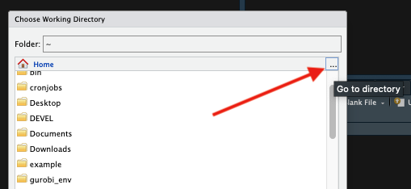
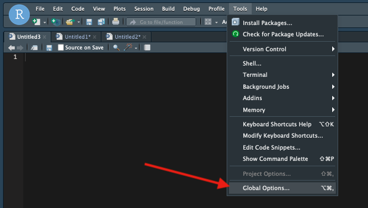
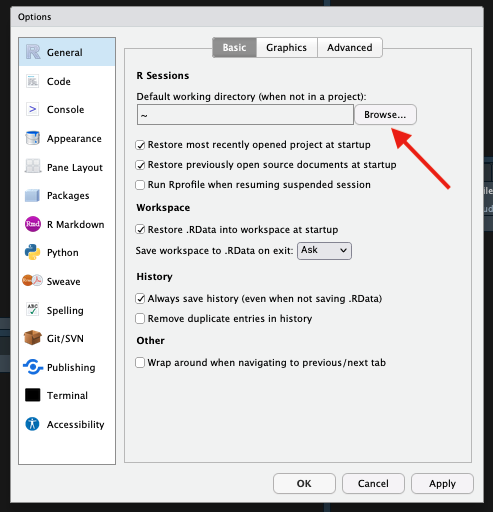

# R

R is a popular language for data analysis and visualization. Different versions are available as software modules and we provide the graphical interface RStudio for R through our Open OnDemand web interface.

Similar to other languages that use package managers to install libraries contributed by the user community, we recommend you create and manage your own local libraries in your account. This ensures a stable global environment for all users and that you have the most control over your packages' versions and dependencies.

We provide instructions below for how to create, use, and switch between libraries as well as some debugging techniques for when package installations fail.

RStudio is a popular method for running analyses (and for good reason!), but for longer-running jobs (say, many hours or days) or workflows that need more flexibility in their environment (e.g., need access to software installed as system modules such as gdal), we recommend batch submissions.

## Creating a Custom Library

!!! tip ""
     R packages can be finicky. See [Switching Between Custom Libraries](#switching-between-custom-libraries) and [Common Problems](#common-problems-and-how-to-debug-them) below to help with frequent user issues.

**Creating your first library**

1. Make a local directory to store your packages. It's recommended to include information about your library in the name, e.g., which version of R you're using. It's important to maintain a consistent version of R with your libraries since installing packages into one library with multiple versions or R will often cause trouble. Need to switch versions of R? [Creating a new library](#switching-between-custom-libraries) will help.
   ```bash
   mkdir -p ~/R/library_4.2
   ```
  
2. Tell R where your library is by creating an environment file
    ```bash
    echo 'R_LIBS=~/R/library_4.2/' >> ~/.Renviron
    ```
    The file ```~/.Renviron``` [is a "dot" file](../../../support_and_training/cheat_sheet/#hidden-files-and-directories) which means it does not show up when you run a standard ```ls```.. This particular file can be used to control your R environment for each subsequent time you start a session. All the `echo` command does is append the line ```R_LIBS=~/R/library_4.2/``` to this file. 
    
3. That's it! Now you can install packages and they will be stored in the directory you just created. For example, to install and load the package ```ggplot2```:
    ```bash
    module load R/4.2
    R
    install.packages("ggplot2")
    ```


## Switching Between Custom Libraries

If you're switching versions of R, we recommend you use a different library. See **Common Problems** below for more information. When creating a library, consider including pertinent information in the name such as R version. For example, if you were previously using R 4.2 and wanted to switch to using R 4.1, you could create a directory called ```library_4.1``` using:
```bash
mkdir -p ~/R/library_4.1
```
Then, to use your new library, edit your ```~/.Renviron``` file using a text editor such as ```nano```:
```bash
nano ~/.Renviron
```
Once your text editor opens, set the ```R_LIBS``` previously defined in your file to the name and location of your new library. In this case, this would look like:
```bash
R_LIBS=~/R/library_4.1
```
To exit ```nano```, use ++ctrl+x++ and save at the prompt. Once your file is saved, you're ready to start installing files into your new library. 

## Common Problems and How to Debug Them

Working on a cluster without root privileges can lead to complications. For general information on package installations, see the [r-bloggers documentation](http://www.r-bloggers.com/installing-r-packages/). For information on common installation problems on our clusters, see the section below with with suggested solutions:

=== "Anaconda"
    One common reason R packages won't install is an altered environment. This can frequently be caused by the presence of Anaconda (or Miniconda) installed locally or initialized in your account from our system module.
    
    When Anaconda is initialized, your ```.bashrc``` file is edited so that it becomes the first thing in your ```PATH``` variable. This can cause all sorts of mayhem. To get around this, you can either use `conda deactivate` and then manually remove Anaconda from your ```PATH```, or comment out/delete the initialization in your ```~/.bashrc``` if you want the change to be permanent.

    === "Turn off Auto-activation"
        !!! danger "Removing Auto-activation may not always be sufficient"

            Sometimes turning off auto-activation won't be enough because Anaconda will still be present in your ```PATH```. In this case, follow the instructions in the tab ***Temporary Removal*** or ***Permanent Removal***

        Anaconda's initialization will tell it to automatically activate itself when you log in (when Anaconda is active, you will see a "(conda)" preceding your command prompt). To disable this behavior, run the following from the command line in an interactive terminal session:

        ```
        conda config --set auto_activate_base false
        ```

        This will suppress Anaconda's activation until you explicitly call ```conda activate``` and is a handy way to have more control over your environment. Once you run this, you will need to log out and log back in again.

        

    === "Temporary Removal"
        You can either use the command ```conda deactivate``` and then manually edit your ```PATH``` variable to remove all paths where of `anaconda` or `miniconda` are present. Alternatively, copy the following code block and run it in your terminal:
        ```
        conda deactivate > /dev/null 2>&1
        IFS=':' read -ra PATHAR <<< "$PATH"
        for i in "${PATHAR[@]}"
            do if [[ $i == *"conda"* ]]
                then echo "removing $i from PATH"
            else NEWPATH=$i:$NEWPATH
            fi
        done
        export PATH=$NEWPATH
        module unload gnu8 && module load gnu8
        unset NEWPATH
        echo "Successfully removed conda"
        ```

    === "Permanent Removal"
        !!! warning "Be careful when editing your `~/.bashrc`"
            Your ```~.bashrc``` file configures your environment each time you start a new session. Be careful when editing it. You may consider making a backup in case of unwanted changes.

        The most permanent solution for removing Anaconda from your environment is to edit your `~/.bashrc` to manually remove its initilization. This change will remove Anaconda from all future terminal sessions but will not make the changes live right away. To make the changes live, log out of HPC and log back in again.
        
        Start by opening the file ~/.bashrc. This can be done using the command ```nano```

        ```
        $ nano ~/.bashrc # opens your bashrc file to edit
        ```

        Then comment out or delete the following lines and the text in between:

        ```
        # >>> conda initialize >>>
        ...
        # <<< conda initialize <<<
        ```
        To exit use ++control+x++, select ++y++ to save, and hit ++enter++ to confirm your filename.

        If you need Anaconda again in the future, you can either uncomment the lines you commented out, or you can [initialize Anaconda](../python_and_anaconda/anaconda/) again.

=== "A Corrupted Environment"

    If Anaconda is not initialized in your account, there might be other culprits that are corrupting your environment.

    Look for any of the file types listed below on your account. If you find them, try removing them (make a backup if you need them) and try the installation again.

    * Saved R sessions. If this is the case, after starting a session, you will get the message `[Previously saved workspace restored]`. Old sessions may be saved as a hidden file ```.RData``` in your home directory. Alternatively, they may be stored under `~/.local/share/rstudio`. Where old sessions are stored is dependent on the version of R you are using.
    * Gnu compilers
    * Windows files

=== "Library Issues"

    Have you set up a custom library? Are you switching between custom libraries? You may want to check that everything is being loaded from the correct location and that there are not multiple or unwanted libraries being used.
    
    Double-check that you have an ```.Renviron``` file. This is a hidden file located in your home directory and should set the path to your custom R library. If you do not have a custom library name set up, R will create one for you saved as something like:
    ```bash
    ~/R/x86_64-pc-linux-gnu-library
    ```
    This directory can lead to unwanted behavior. For example, if you're trying to use a new custom library (such as when switching R version), R will still search x86_64-pc-linux-gnu-library for package dependencies and may cause installs to fail. To fix this, rename these types of folders something unique and descriptive.

    To set up/switch custom libraries, follow the instructions in the [Creating a Custom R Library](#creating-a-custom-library) section above.

=== "Mixing R Versions"

    Because HPC is a cluster where multiple versions of R are available, users should take care to avoid mixing and matching. Because packages often depend on one another, libraries using different versions of R can turn into a tangled mess.  Common errors that can crop up include: `Error: package or namespace load failed.`

    If you're switching R versions and have a custom library defined in your `~/.Renviron` file, we recommend creating a new library.

=== "Open OnDemand RStudio Issues"
    RStudio is a great tool! Sometimes though, because it's a different environment than working directly from the terminal, you may run into problems. Specifically, these typically arise for installs or when using packages that rely on software modules.  

    **Package Installations**

    If you're trying to install a package in an OOD RStudio session and you've tried all the troubleshooting advice in the other tabs without luck, try starting R in the terminal and give the installation another try. You can access an R session in the terminal by first starting an [interactive session](../../../running_jobs/interactive_jobs/), then using:

    ```
    $ module load R/<version>
    $ R
    > install.packages("package_name")
    ```

    **Accessing Modules**

    RStudio does not have access to **module load** commands. This means that if you have a package that relies on a system module, the easiest option is to work through an [interactive terminal session](../../../running_jobs/interactive_jobs/) or to [submit a batch script](../../../running_jobs/batch_jobs/intro/).

    The alternative is to to modify your RStudio environment. For example, the library hdf5r relies on the hdf5 software module. If you try to load hdf5r, you will get an error complaining about a shared object file. To get around this, you will need to manually add that shared object to your environment using `dyn.load()`. For example:

    ```
    > library("hdf5r") # without using dyn.load()
    Error: package or namespace load failed for ‘hdf5r’ in dyn.load(file, DLLpath = DLLpath, ...):
    unable to load shared object '/home/u21/sarawillis/R/lib_4.0/hdf5r/libs/hdf5r.so':
    libhdf5_hl.so.100: cannot open shared object file: No such file or directory
    > dyn.load("/opt/ohpc/pub/libs/gnu8/hdf5/1.10.5/lib/libhdf5_hl.so.100")
    > library("hdf5r") # success!
    >
    ```
    This requires that you know the location of the relevant file(s). These can usually be tracked down by looking at your system path variables (e.g. `LD_LIBRARY_PATH`) after loading the relevant module in a terminal. It should be noted that modifying your system paths from RStudio will not help since RStudio has its own configuration file that overrides these. 

    **Font Issues**

    RStudio uses [Apptainer](../../containers/what_are_containers/) under the hood. As a result, there are some environment differences that may affect correct font formatting in images generated in RStudio. If you are experiencing this, add the following line to the hidden file `~/.Renviron` in your account (you can create this file if it does not exist):

    ```
    FONTCONFIG_PATH=/opt/ohpc/pub/apps/fontconfig/2.14.2/etc/fonts
    ```


## Using RStudio

=== "Open OnDemand"
    We provide access to the popular development environment RStudio through our [Open OnDemand](../../../running_jobs/open_on_demand/graphical_applications/) web interface. This is a very handy tool, though it should be noted that it is a less flexible environment than using R from the command line. This is because RStudio sets its own environment which prevents easy access to third party software installed as system modules. These issues can sometimes worked around by following the guide in the debugging section above.

=== "Singularity"
    In some circumstances, you may want to run RStudio using your own Singularity image. For example, this allows access to different versions of R not provided when using our OOD application. We have some instructions on one way to do this below.

    First, log into HPC using an Open OnDemand Desktop session and open a terminal. A Desktop session is the easiest solution to access RStudio since it eliminates the need for port forwarding.

    In the terminal, make an RStudio directory where all of the necessary files will be stored. In this example, we'll be working in our home directory and will pull an RStudio image from Dockerhub to use as a test. If you're interested, you can find different RStudio images under [rocker in Dockerhub](https://hub.docker.com/u/rocker).

    ```
    mkdir $HOME/RStudio
    cd $HOME/RStudio
    singularity pull ./geospatial.sif docker://rocker/geospatial.sif
    ```

    Next, create the necessary directories RStudio will use to generate temporary files. You will also generate a secure cookie key.

    ```
    TMPDIR=$HOME/RStudio/rstudio-tmp
    mkdir -p $TMPDIR/tmp/rstudio-server
    uuidgen > $TMPDIR/tmp/rstudio-server/secure-cookie-key
    chmod 600 $TMPDIR/tmp/rstudio-server/secure-cookie-key
    mkdir -p $TMPDIR/var/{lib,run}  
    ```

    Next, create a file in your RStudio directory called rserver.sh and make it an executable:

    ```
    touch rserver.sh
    chmod u+x rserver.sh
    ```
    Open the file in your favorite editor and enter the content below. Modify the variables under ```USER OPTIONS``` to match your account if necessary. You can change ```PASSWORD``` to any password you'd like to use. Once you've entered the contents, save and exit:

    ```
    #!/bin/bash
 
    # --- USER OPTIONS --- #
    WD=$HOME/RStudio
    SIFNAME=geospatial.sif
    PASSWORD="PASSWORD"
 
    # --- SERVER STARTUP EXECUTED BELOW --- #
    NETID=$(whoami)
    TMPDIR=$WD/rstudio-tmp
    SIF=$WD/$SIFNAME
    PASSWORD=$PASSWORD singularity exec -B $TMPDIR/var/lib:/var/lib/rstudio-server -B $TMPDIR/var/run:/var/run/rstudio-server  -B $TMPDIR/tmp:/tmp $SIF rserver --auth-none=0 --auth-pam-helper-path=pam-helper --server-user=$NETID --www-address=127.0.0.1
    ```

    Now, in your desktop session's terminal, execute the rserver.sh script using ```./rserver.sh```

    

    Next, open a Firefox window and enter ```localhost:8787``` for the URL. In your browser, you will be prompted to log into your RStudio server. Enter your NetID under Username. Under Password, enter the password you defined in the script server.sh.

    

    This will open your RStudio session:

    

## Setting a New User State Directory

When working on a large project in RStudio, it is possible for your R session's data to fill up your home directory resulting in out-of-space errors (e.g. when trying to edit files, create new OOD sessions, etc). With the newest version of RStudio, you can find these saved session files under ```~/.local/share/rstudio```.

To preserve space in your home, you can specify a different directory by setting the environment variable ```RSTUDIO_DATA_HOME```. To do this, open the hidden file ```~/.bashrc``` and add:

```
export RSTUDIO_DATA_HOME=</path/to/new/directory>
```

where ```</path/to/new/directory>``` is the path to a different location where you have a larger space quota. For example, ```/groups/<YOUR_PI>/<YOUR_NETID>/rstudio_sessions```.

## Setting Your Working Directory in RStudio

=== "Current Session"
    If you'd like to change your working directory in an RStudio session, one option is to use ```setwd("/path/to/directory")``` in your terminal. Alternatively, if you'd like to see the contents of your new workspace in your file browser, you can navigate to the **Session** dropdown tab, navigate to **Set Working Directory**, and click **Choose Directory...**

    

    From there, either navigate to the desired subdirectory, or click the ellipsis ```...``` in the upper right to enter the full path to a directory.

    

    Once you click **OK** and then **Choose** in the main file navigation window, R will change its working directory and you should see the contents of your new space under the Files browser in the lower right.

    

=== "All Non-Project Sessions"
    If you'd like to permanently set a different default working directory for all non-project RStudio sessions, navigate to the **Tools** dropdown tab and select **Global Options...**

     

     This will open a menu where you can set your default working directory under **General**. Click the **Browse...** button to open a file navigator

     

    To select a new working directory, either navigate to the subdirectory of your current working space, or select the ellipsis ```...``` in the upper right to allow you to enter the full path. 

    

    The ellipsis option allows for more flexibility such as pointing to an ```/xdisk``` or ```/groups``` space.

    

    Next, click **OK**, then **Choose** in the Choose Directory window, then **Apply** in the Global Options menu. This will set your working directory for your current session as well as all future sessions.

    

## Popular Packages

!!! info "Updates and Version Changes"
    We attempt to keep these instructions reasonably up-to-date. However, given the nature of ongoing software and package updates, there may be discrepancies due to version changes. If you notice any instructions that don't work, [contact our consultants](../../../support_and_training/consulting_services/) and they can help. 

=== "Seurat and SeuratDisk"
    !!! tip "R Studio Version"
        If you use RStudio for your analyses, make sure that you load the same version of R when working with modules on the command line.
    
    To install Seurat and SeuratDisk, you'll need to be in an [interactive terminal session](../../../running_jobs/interactive_jobs/) and not in an RStudio session. This is because these libraries depend on software modules that RStudio doesn't have access to (see ***Common Problems → OOD RStudio Issues*** above for more information).

    You will also need to make sure Anaconda is completely removed from your environment prior to the install. If you have Anaconda initialized in your account, see the code block under ***Resolving Anaconda Issues → Temporary Removal*** above.

    === "Seurat"
        ```
        (elgato) [netid@junonia ~]$ interactive -a <your_group>
        [netid@cpu38 ~]$ module load R/<version>
        [netid@cpu38 ~]$ module load gdal glpk libpng # software modules that are needed for Seurat's dependencies
        [netid@cpu38 ~]$ R
        > install.packages("Seurat")
        ```

        If you want to load this software in an RStudio session, you will first need to use the following ```dyn.load``` commands. When using the ```dyn.load```s in RStudio, you will need to be careful to run them in the order shown below, otherwise you may wind up with "Undefined symbol" errors. If you repeatedly run into library errors working in RStudio, you might consider converting your workflow to a batch script that you can submit through the command line. See the section Example R Scripts above for more information.
        ```
        > dyn.load("/opt/ohpc/pub/apps/glpk/5.0/lib/libglpk.so.40")
        > dyn.load("/opt/ohpc/pub/apps/gdal/3.3.2/lib/libgdal.so.29")
        > dyn.load("/opt/ohpc/pub/apps/proj/7.2.1/lib/libproj.so.19")
        > library(Seurat)
        ```
    === "SeuratDisk"
        SeuratDisk is similar to Seurat with a few more dependencies. It also includes the line ```unset CPPFLAGS``` due to a [reported issue with the dependency hdf5r](https://github.com/hhoeflin/hdf5r/issues/132):

        ```
        (elgato) [netid@junonia ~]$ interactive -a <your_group>
        [netid@cpu1 ~]$ module load R/<version> gdal geos hdf5/1.10.5 libpng/1.6.37 glpk
        [netid@cpu1 ~]$ unset CPPFLAGS
        [netid@cpu1 ~]$ R
        > install.packages("Seurat")
        > install.packages("remotes")
        > remotes::install_github("mojaveazure/seurat-disk")
        ```

        Then, to load the software in RStudio:

        ```
        > dyn.load("/opt/ohpc/pub/apps/glpk/5.0/lib/libglpk.so.40")
        > dyn.load("/opt/ohpc/pub/apps/proj/7.2.1/lib/libproj.so.19")
        > dyn.load("/opt/ohpc/pub/apps/gdal/3.3.2/lib/libgdal.so.29")
        > dyn.load("/opt/ohpc/pub/libs/gnu8/hdf5/1.10.5/lib/libhdf5_hl.so.100")
        > library(Seurat)
        > library(SeuratDisk)
        ```

=== "Monocle3"
    To install Monocle3, you'll need to be in an [interactive terminal session](../../../running_jobs/interactive_jobs/) and not in an RStudio session. This is because it depends on software modules that RStudio doesn't have access to (see **Common Problems** → **OOD RStudio Issues** above for more information).

    You will also need to make sure Anaconda is completely removed from your environment prior to the install. If you have Anaconda initialized in your account, see the code block under **Resolving Anaconda Issues** → **Temporary Removal** above.

    When using the `dyn.load` in RStudio, you will need to be careful to run them in the order shown below, otherwise you may wind up with "Undefined symbol" errors. If you repeatedly run into library errors working in RStudio, you might consider converting your workflow to a batch script that you can submit through the command line. 

    [Monocle3's documentation](https://cole-trapnell-lab.github.io/monocle3/docs/installation/) includes steps that you can use for a successful installation.

    ```
    (elgato) [netid@junonia ~]$ interactive -a your_group
    [netid@cpu1 ~]$ module load R/<version> gdal
    [netid@cpu1 ~]$ R
    > install.packages("BiocManager")
    > BiocManager::install(c('BiocGenerics', 'DelayedArray', 'DelayedMatrixStats',
                           'limma', 'lme4', 'S4Vectors', 'SingleCellExperiment',
                           'SummarizedExperiment', 'batchelor', 'HDF5Array',
                           'terra', 'ggrastr'))
    > install.packages("devtools")
    > devtools::install_github('cole-trapnell-lab/monocle3')
    ```

    Then, to load Monocle3 in RStudio:

    ```
    dyn.load("/opt/ohpc/pub/apps/gdal/3.3.2/lib/libgdal.so.29")
    dyn.load("/opt/ohpc/pub/apps/proj/7.2.1/lib/libproj.so.19")
    library(monocle3)
    ```


