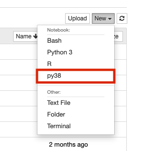
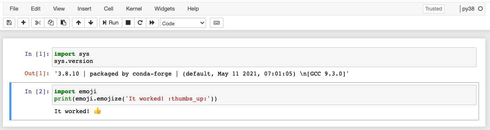

# Anaconda

!!! Warning "Known Issues with Anaconda"

    Anaconda is known to cause potential issues on HPC Clusters. If it is possible to design your workflow around the native Python package manager Pip, we highly encourage you to do so. 

    If you decide to use Anaconda on our HPC system, please read this page carefully and make yourself aware of the common problems and how to best avoid them.


## Overview

We have several versions of Anaconda installed as system modules for use. You can initialize these in your home directory for access and package management. 

|Version|Accessibility|
|-|-|
|2020.02|```module load anaconda/2020.02```|
|2020.11|```module load anaconda/2020.11```|
|2022.05|```module load anaconda/2022.05```|

## Initializing Anaconda

Initializing Anaconda in your account only needs to be performed once and is what makes Anaconda available and ready for customization (e.g., installing custom packages) in your account. 

!!! tip "Faster Reloading"
    Conda will direct you to close and reopen your shell to complete the initialization process. You can skip this by running the command ```source ~/.bashrc``` listed in the instructions below. 
    
!!! danger "Turn Off Auto-Activate"
    To ensure proper functioning of built-in system functions, turning off auto-activation is {==**highly recommended**==}. Do this by running ```conda config --set auto_activate_base false``` in a terminal following initialization.
    
In an interactive session, replacing `<version>` with your desired Anaconda module version:

```bash
module load anaconda/<version>
conda init bash                  
source ~/.bashrc  
conda config --set auto_activate_base false
```

## Creating a Conda Environment
Once conda has been configured following the steps above, you can create a local environment. This allows you to control the version of Python you want to use, install your own software, and even create custom Juypyter kernels (making your environment accessible in an OnDemand notebook). To do this, you can use the command ```conda create```. For example, in an interactive session:

```bash
conda activate
conda create --name py37 python=3.7 # Build a local environment with a specific version of python
conda activate py37
```

To view the environments available to you, use the command

```bash
conda env list
```

## Installing Conda Packages and Other Software

Once you have created a conda environment, you can install the packages you need. To do this, follow the software-specific installation instructions. This may be as simple as running ```conda install <my_package>```, or it may involve installing a handful of dependencies. If the installation instructions ask you to create a new environment, you do not have to repeat this step. 

Once you have performed the install, you should then be able to access your software within this environment. If you are unable to load your software, check your active environment with

```bash
conda info
```

and the installed packages with 

```bash
conda list
```

## Custom Jupyter Kernel

If you want to make one of your conda environments available for use in one of our Open OnDemand Jupyter Notebooks, you can do so by creating a custom kernel. To do this, start an interactive terminal session and activate your environment:

```bash
conda activate
conda activate <your_environment>
```

Next, pip-install Jupyter and use it to create a custom kernel using the command ```ipython``` and replacing ```<your_environment>``` with your own environment's name:

```bash
pip install jupyter
ipython kernel install --name <your_environment> --user
```

Once you've configured your kernel, go to [Open OnDemand](https://ood.hpc.arizona.edu/) and start a Jupyter notebook. Once the session starts, open it and click the "new" dropdown menu in the upper right. If everything is working correctly, you should see your custom name. For example, if you created a conda environment with the kernel name py38, you should see the following:



Once you've selected your environment, try checking the Python version in your notebook using the ```sys``` module. Additionally, for demonstration purposes, we'll check that a custom package installed in py38 (emoji) can be imported and is working. 



### Loading Modules in Jupyter

In OnDemand Jupyter sessions, accessing HPC software modules directly from within a notebook can be challenging due to system configurations. However, it's still possible to access these modules when needed. For instance, machine learning packages like TensorFlow or PyTorch often require additional software modules such as CUDA for GPU utilization.

To access software modules in your Jupyter notebooks, follow the steps below:

**Step 1:** If you haven't already done so, create a custom kernel for your Jupyter notebook environment.

**Step 2:** You will then need to edit your kernel configuration file `kernel.json` which is what sets up your environment at runtime. This file can be found in the following location, where `<kernel_name>` is a placeholder for the name you gave your kernel when it was created:

```
$HOME/.local/share/jupyter/kernels/<kernel_name>/kernel.json
```

**Step 3:** Next, you will need to modify your kernel's configuration by editing this file. Start by opening it with a text editor, for example `nano $HOME/.local/share/jupyter/kernels/<kernel_name>/kernel.json`. The contents of this file should look something like the following:

```
{
 "argv": [
  "</path/to/your/environment>/bin/python",
  "-m",
  "ipykernel_launcher",
  "-f",
  "{connection_file}"
 ],
 "display_name": "<kernel_name>",
 "language": "python",
 "metadata": {
  "debugger": true
 }
}
```

The part you need to change is the section under `argv`. We will change this from executing a Python command to a Bash command with a module load statement. Make a note of the path `</path/to/your/environment>/bin/python` to use in the edited file. The edited file should look like the following:

```
{
 "argv": [
 "bash",
 "-c",
 "module load <your_modules_here> ; </path/to/your/environment>/bin/python -m ipykernel_launcher -f {connection_file}"
 ],
 "display_name": "<kernel_name>",
 "language": "python",
 "metadata": {
 "debugger": true
 }
}
```

Replace `<your_modules_here>` with the modules you would like to load and `</path/to/your/environment>/bin/python` with the path to your environment's python. 

**Step 4:** Save the `kernel.json` file and restart your Jupyter notebook session.


## Removing Anaconda From Your Environment

 When Anaconda is initialized, your ```.bashrc``` file is edited so that conda becomes the first thing in your ```PATH``` variable any time you're logged into HPC. This can cause all sorts of mayhem when using other system functions or software. 
 
 If you are running into issues (particularly when using other package managers or compiling), we recommend removing Anaconda from your environment as part of your debugging process. Sometimes it can be as simple as turning off Anaconda's auto-activation, other times it becomes necessary to modify your environment and its variables. 

 Below are three methods for removing Anaconda from your environment:

=== "Turn off Auto-activation"
    !!! danger "Removing Auto-activation may not always be sufficient"

        Sometimes turning off auto-activation won't be enough because Anaconda will still be present in your ```PATH```. In this case, follow the instructions in the tab ***Temporary Removal*** or ***Permanent Removal***

    By default, Anaconda's initialization will tell it to automatically activate itself when you log in (when Anaconda is active, you will see a `(base)` preceding your command prompt). This is known to cause issues, for example, this behavior breaks OnDemand Desktop sessions preventing you from making a connection.
    
    If you have not already done so, disable this behavior by running the following from the command line in an interactive terminal session:

    ```
    conda config --set auto_activate_base false
    ```

    This will suppress Anaconda's activation until you explicitly call ```conda activate``` and is a handy way to have more control over your environment. Once you run this, you will need to log out and log back in again.

        

=== "Temporary Removal"

    If you have already turned off Anaconda's auto-activation feature and are still running into issues, it may be necessary to modify your environment variables to fully remove Anaconda. This is because `conda deactivate` is insufficient and Anaconda binaries and libraries will still be accessible. 

    To fully remove Anaconda, you can either use the command ```conda deactivate``` and then manually edit your ```PATH``` variable to remove all paths where `conda` is present, or you can copy the following code block and run it in your terminal:
    ```
    conda deactivate > /dev/null 2>&1
    IFS=':' read -ra PATHAR <<< "$PATH"
    for i in "${PATHAR[@]}"
        do if [[ $i == *"conda"* ]]
            then echo "removing $i from PATH"
        else NEWPATH=$i:$NEWPATH
        fi
    done
    export PATH=$NEWPATH
    module unload gnu8 && module load gnu8
    unset NEWPATH
    echo "Successfully removed conda"
    ```

    This is a temporary solution and will only modify your current working environment. Anaconda will still be present for all future HPC sessions. If you would like to make the change permanent, follow the instructions under the **Permanent Removal** tab. 

=== "Permanent Removal"
    !!! warning "Be careful when editing your `~/.bashrc`"
        Your ```~/.bashrc``` file configures your environment each time you start a new session. Be careful when editing it. You may consider making a backup in case of unwanted changes. Not sure what a `~/.bashrc` is and want more information? Check out our [Linux cheat sheet guide](../../../../support_and_training/cheat_sheet/#hidden-files-and-directories).

    The most permanent solution for removing Anaconda from your environment is to edit your `~/.bashrc` to manually remove its initilization. This change will remove Anaconda from all future terminal sessions.
        
    Start by opening the file `~/.bashrc`. This can be done using the command ```nano```

    ```
    nano ~/.bashrc # opens your bashrc file to edit
    ```

    Then comment out or delete the following lines and the text in between:

    ```
    # >>> conda initialize >>>
    ...
    # <<< conda initialize <<<
    ```
    To exit use ++control+x++, select ++y++ to save, and hit ++enter++ to confirm your filename.

    This change will not take effect right away. To make the changes live, log out of HPC and then log back in again.

    If you need Anaconda again in the future, you can either uncomment the initialization lines (if you commented them out), or you can initialize Anaconda again.