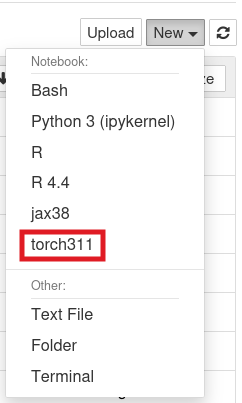
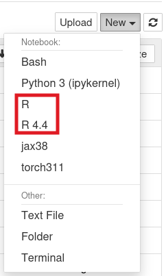

# Mamba

Mamba is a package manager to create and manage Conda environments. Following definitions will help you to understand the relevant terms that you might come across when using Mamba:

Conda
: Conda is a package management system and environment management system for installing multiple versions of software packages and their dependencies and switching between them.

Anaconda
: Anaconda is a distribution built around Conda. It includes hundreds of packages, and access to the Anaconda repository, besides the package manager itself. The use of Anaconda on our HPC systems is now deprecated, due to recent developments in how the company behind Anaconda licenses the Anaconda repository. You can read more on that in the [Anaconda FAQs](https://www.anaconda.com/pricing/terms-of-service-faqs).

Mamba
: Mamba is a package manager which was initially developed as a faster alternative to Conda. It can create and manage Conda environments. For most cases, Mamba is a drop-in replacement for Conda. Mamba comes in multiple flavors, see the [Mamba documentation](https://mamba.readthedocs.io/en/latest/) for more information. The most relevant to us is the binary `micromamba`. For the rest of the document we will specifically focus on `micromamba`.

Environment
: In the context of this document, an environment is a directory that contains a specific collection of packages that you have installed. We will only consider Conda environments in this document, i.e. environments that can be created and managed with Conda. All flavors of Mamba, including `micromamba`, can create and manage Conda environments.

!!! Tip "TL;DR"

    If you were using Conda/Anaconda, use `micromamba` instead.

## Initializing `micromamba`

You can check the available versions of `micromamba` with `module avail micromamba`. Once you have decided which version you want, you can load it and initialize it. You have to initialize it only once.

In an interactive session, replacing <version> with your desired `micromamba` module version:
```bash
module load micromamba/<version>
micromamba shell init -s bash -r ~/micromamba
source ~/.bashrc
```
This will create a directory called `micromamba` in your home folder in which your Conda environments and associated packages will be installed.

!!! Tip

    Your home directory can fill up pretty fast with environments and packages installed with `micromamba`. You can change the location where your environments and packages are installed to avoid that. Your PI's group directory can be a good choice for this. Run the following commands to change the location:
    ```bash
    micromamba config append envs_dirs <new_location>/envs
    micromamba config append pkgs_dirs <new_location>/pkgs
    ```

## Creating a Conda Environment

!!! Warning 

    1. Always create a local Conda environment with `micromamba` before installing packages with in.
    2. Do not mix Conda environments with any other type of virtual environments.
    
!!! Tip

    For more information on environments, check out our [Software and Environments](../../events/workshop_materials/) workshop.

After initializing `micromamba`, you can create a local Conda environment with it to install packages. If you are used to using Conda to create local environments, then `micromamba` is very similar. For example, in an interactive session, after loading the `micromamba` module:
```bash
micromamba create -n myenv
micromamba activate myenv
```

This will create and activate a Conda environment called `myenv`. To view the environments available to you, run:
```bash
micromamba env list
```

Unlike some versions of Conda, `micromamba` will always create an empty environment with no packages installed. If you want to install packages, you can do so after activating the environment. You can also mention the packages you want to install when you create the environment. For example, the following command will create an environment named `py312` with Python 3.12 installed in it:
```bash
micromamba create -n py312 python=3.12
```

## Installing packages in Conda environments

After activating a Conda environment, you can install packages with:

1. `micromamba install <package-name>`
2. Language-specific package installers (such as `pip` for Python, or `install.packages` for R)
3. You can also mix both approaches

Which option you choose will depend on the package, and how the package maintainers make it available.

By default `micromamba` downloads packages from the [`conda-forge`](https://conda-forge.org/packages/) repository or channel. `conda-forge` is a community maintained repository containing a large number of packages typically used in scientific computing, data science, and others. However, if you want to install packages from other repositories you can do so. For example, the [`bioconda`](https://bioconda.github.io/conda-package_index.html) repository provides many packages used in bioinformatics. 

To install a package from the `bioconda` repository, run the following in an interactive environment, replacing `<package-name>` with the name of your desired package:
```bash
micromamba install <package-name> -c bioconda
```
If you want to install packages from any other repositories, simply replace `bioconda` with the name of the repository in the above command.

!!! Tip

    By default, `micromamba` does not access the Anaconda repository, and we recommend not changing that. To ensure that you do not install from the Anaconda repository, you can run the following:
    ```bash
    micromamba config append channels conda-forge
    micromamba config append channels nodefaults
    micromamba config set channel_priority strict
    ```

## `micromamba` in Batch Jobs

Assuming that you have initialized `micromamba` (recommended), you will need to load the `micromamba` module and activate a Conda environment before you can access the packages installed in that environment. Add the following, replacing `<env-name>` with the name of your desired Conda environment, as your first bash commands in your batch script:

```bash
module load micromamba
micromamba activate <env-name>
```

!!! Tip

    You should install packages in your Conda environment from an interactive session. Do not put those instructions in a batch script.

## Language specific suggestions

You can use `micromamba` for some Python or R workflows which would otherwise be non-trivial to do with the corresponding language modules.
!!! Warning
    
    Do not use the `micromamba` module along with the language specific modules. Choose one or the other.

### Python

One of the typical Python workflows on the HPC involves Jupyter through the Open OnDemand (OOD) interface. One issue of this is that if you use the Python modules then you are tied to the specific version of Python that Jupyter on OOD uses. If Jupyter on OOD uses Python 3.8, then you can only use the `python/3.8` module to install your packages.
    
With `micromamba` you do not have that limitation. You can use your desired version of Python. All you have to do is the following:
    
1. Create and activate a Conda environment with your desired Python version
2. Install Jupyter in it
3. Create a Jupyter kernel
    
For example, if you want to use Python 3.11, you can try running the following commands from an interactive environment:
```bash
micromamba create -n <env_name> python=3.11
micromamba activate <env_name>
micromamba install jupyter # alternatively you can use pip install jupyter
ipython kernel install --name <env_name> --user
``` 
Once you've configured your kernel, go to OOD and start a Jupyter notebook. Once the session starts, open it and click the **New** dropdown menu in the upper right. If everything is working correctly, you should see your kernel. For example if the kernel's name is `torch311`:
    

    
### R

Some of the most widely used R packages on the HPC have non-trivial installation processes when installed with the R modules, see the [Popular Packages](../R/index.md#popular-packages) for more information. Here we show how you can install these packages with `micromamba`.
    
!!! Info "Updates and Version Changes"
    
    We attempt to keep these instructions reasonably up-to-date. However, given the nature of ongoing software and package updates, there may be discrepancies due to version changes. If you notice any instructions that don't work, [contact us](../../../support_and_training/consulting_services/) and we will help. 
    

{==You have to be in an [interactive terminal session](../../../running_jobs/interactive_jobs/) and not in an RStudio session to run the commands below.==} To install any of the R packages, first create a Conda environment with R installed in it:
```bash
micromamba create -n <env_name> r=4.4
micromamba activate <env_name>
```
If you want to install any other version of R, then replace 4.4 with that version number in the above command. You might have to choose different versions of the packages in the examples below if you use a version of R below 4.4.
    
=== "Seurat & SeuratDisk"
    
    To install Seurat, run:
    ```bash
    micromamba install r-seurat
    ``` 
    Seurat can also be installed with R's built-in package manager `install.packages`. However installing it with `micromamba` is way faster, since it just downloads the relevant binaries, and does not have to do any local compilation.
    
    For SeuratDisk, assuming you have already installed Seurat:
    
    1. Install dependencies:
    ```bash
    micromamba install r-hdf5r r-remotes
    ```
    2. Start an R prompt:
    ```bash
    R
    ```
    3. Install SeuratDisk with the `install_github` function from the `remotes` R package:
    ```R
    remotes::install_github("mojaveazure/seurat-disk")
    ``` 
            
=== "Terra & Monocle3"

    To install Terra, run:
    ```bash
    micromamba install r-terra
    ```
    Terra can also be installed with R's built-in package manager `install.packages`. However installing it with `micromamba` is way faster, since it just downloads the relevant binaries, and does not have to do any local compilation.

    For Monocle3, assuming you have already installed Terra:
    
    1. Install dependencies:
    ```bash
    micromamba install r-biocmanager r-remotes r-ggrastr
    ```
    2. Start an R prompt:
    ```bash
    R
    ```
    3. Install more dependencies with BiocManager:
    ```R
    BiocManager::install(c('BiocGenerics', 'DelayedArray', 'DelayedMatrixStats',
                   'limma', 'lme4', 'S4Vectors', 'SingleCellExperiment',
                   'SummarizedExperiment', 'batchelor', 'HDF5Array'))
    ```
    4. Install Monocle3 with `install_github` function from the `remotes` R package:
    ```R
    remotes::install_github('cole-trapnell-lab/monocle3')
    ```

#### Jupyter

Jupyter is typically thought of as belonging to the Python ecosystem, but R is one of the core languages that Jupyter supports (1). While R practitioners tend to gravitate towards RStudio, you might find that Jupyter is an equally capable, in not more, IDE for programming in R. Particularly, if you are using the Open OnDemand (OOD) interfaces of Jupyter and RStudio, you might find the Jupyter experience to be smoother. With `micromamba` you can easily set up Jupyter for your R workflow. 
{ .annotate }

1. It is in the name: **Ju**[lia]**Pyt**[hon]e**R**. The three core languages that Jupyter supports.

To use your R packages from Jupyter, you have to install Jupyter in your Conda environment and then create a with the IRkernel package:

1. Install Jupyter and IRkernel:
```bash
micromamba install jupyter r-irkernel
```
2. Start an R prompt:
```bash
R
```
3. Create a R kernel for Jupyter, replacing `<kernel_name>` and `<display_name>` with your desired kernel and display names:
```R
IRkernel::installspec(name = "<kernel_name>", displayname = "<display_name>")
```

Once you've configured your kernel, go to OOD and start a Jupyter notebook. Once the session starts, open it and click the "new" dropdown menu in the upper right. If everything is working correctly, you should see your kernel. For example, if you had given a display name `R 4.4` (the default kernel and display names are `ir` and `R`, respectively):



#### RStudio

To use the Open OnDemand (OOD) interface of RStudio with your Conda environment, do the following:

1. Create a directory `.UAz_ood` under your home directory. 
2. Create a file `rstudio.sh` under `.UAz_ood` with the following contents, replacing `<env_name>` with the name of your environment:
   ```bash
   #!/bin/bash

   source ~/.bashrc
   micromamba activate <env_name>
   ``` 

!!! Warning "Version Issues"
    Loading some packages such as `terra` in the RStudio Console might fail with an error message like the following:
    ```bash
    Error: package or namespace load failed for 'terra' in dyn.load(file, DLLpath = DLLpath, ...):
     unable to load shared object '/groups/sohampal/micromamba/envs/r-test/lib/R/library/terra/libs/terra.so':
      /lib64/libssl.so.3: version `OPENSSL_3.2.0' not found (required by /groups/sohampal/micromamba/envs/r-test/lib/R/library/terra/libs/../../../.././libcurl.so.4)
    ```
    The likely solution in such a case will be to install the correct version of the dependency, in this case, OpenSSL 3.2.0. However, doing so might require you to downgrade the version of R installed in your Conda environment. If you do not want to downgrade, then you might want to consider using Jupyter instead of RStudio as your IDE.
