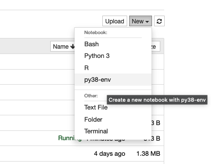

# Python Modules
## Overview 

Different versions of Python are available on HPC both as system modules as well as system software on each compute node.

## Installation and Package Policy

We maintain a two tiered approach to Python packages:

* Tier 1: We install the basic Python packages that are required by most users (these are mostly libraries rather than packages, such as numpy and scipy). This is done for the versions of Python that we install as modules. 

* Tier 2: For packages that we do not provide, or updates to the versions we do, we STRONGLY recommend the use of virtual environments, which is detailed below and provides a custom and easy to use personal Python environment.

## Available Python Versions

!!! danger "Python 2 is no longer officially supported by the Python Software Foundation."

!!! warning "Using the `python` command"
    The command `python` defaults to the system 2.7.5 version. To use Python 3, use the command ```python3```.

Multiple versions of Python are available on HPC. They are only available on compute nodes and are accessible either using a batch submission or interactive session. 


|Version|Accessibility|
|-|-|
|Python 2.7.5|system version (no module)|
|Python 3.6.8|system version (no module)|
|Python 3.6.5|module load python/3.6/3.6.5|
|Python 3.8.2|module load python/3.8/3.8.2|
|Python 3.9.10|module load python/3.9/3.9.10|
|Python 3.11.4|module load python/3.11/3.11.4|

## Installing Python Packages Using a Virtual Environment

???+ tip "Virtual environment tips"
    * Useful overview of virtualenv and venv: [InfoWorld Article: Python virtualenv and venv do's and don'ts](https://www.infoworld.com/article/3306656/python/python-virtualenv-and-venv-dos-and-donts.html?idg_eid=33b8cb1248bcd5c9ddcec9cbccd1b5cb&email_SHA1_lc=579ec7d94c8828baab0995f0b5d55ab21c1a5f2a&cid=ifw_nlt_infoworld_daily_2018-09-19&utm_source=Sailthru&utm_medium=email&utm_campaign=InfoWorld%20Daily:%20Weekday%20Edition%202018-09-19&utm_term=infoworld_daily)
    * In the following instructions any module commands have to be run from an interactive session on a compute node
<div style="float: right; width: 0px; height: 1px"></div>
<div style="float: right; clear: right"><iframe width="420" height="315" title="Virtual environment walkthrough" src="https://www.youtube.com/embed/YOSkjsTVtrc" allowfullscreen></iframe></div>

One of the best things about Python is the number of packages provided by the user community. On a personal machine, the most popular method today for managing these packages is the use of a package manager, like ```pip```. Unfortunately, these may require root access preventing you from being able to successfully install the libraries you need.

There is an easy solution, however. You can use a virtual environment to create a personal Python environment that will persist each time you log in. There is no risk of packages being updated under you for another user and allows greater control over your environment.

Virtual Environment Instructions

1. Set up your virtual environment in your account. This step is done one time only and will be good for all future uses of your Python environment. You will need to be in an interactive session to follow along. 
 
    Note: In the commands below, ```</path/to/virtual/env>``` is the path to the directory where all of your environment's executables and packages will be saved. For example, if you use the path ```~/mypyenv```, this will create a directory in your home called ```mypyenv```. Inside will be directories ```bin```, ```lib```, ```lib64```, and ```include```. 

    === "Python Version $\geq$ 3.8"
        ```bash
        module load python/<version>
        virtualenv --system-site-packages </path/to/virtual/env>
        ```
    === "Python Version $<$ 3.8"
        ```bash
        module load python/<version>
        python3 -m venv --system-site-packages </path/to/virtual/env>
        ```
        
2. To use your new environment, you'll need to activate it. Inside your virtual environment, there's a directory called `bin` that has a file called `activate`. Sourcing this will add all of the paths needed to your working environment. To activate, run the following, replacing `</path/to/virtual/env>` with the path specific to your account:

    ```bash
    source </path/to/virtual/env>/bin/activate
    ```
3. Once your environment is active, you can use `pip` to install your Python packages. You should first upgrade to the latest version of pip. For example, to add the pycurl package to the virtual environment:
    
    ```bash
    pip install --upgrade pip
    pip install pycurl
    ```
4. That's it! As long as your virtual environment is active, you will have access to the packages you have installed. Virtual environments deactivate when you log out, so for each subsequent session or in batch jobs, you will just need to reactivate the environment to get access to your packages:
    ```bash
    module load python/<version>
    source </path/to/virtual/env>/bin/activate
    ```

## Custom Jupyter Kernel

!!! warning 
    The default version of Python available in an OnDemand Jupyter Notebook is 3.8.2. If you would like to create a virtual environment using a standard Python module, you will need to use Python version 3.8.2. If you want to use a different version of python, you can use an [Anaconda environment](../anaconda/).

If you want to make one of your virtual environments available for use in one of our Open OnDemand Jupyter Notebooks, you can do so by creating a custom kernel. To do this, start an interactive terminal session and activate your environment (if you do not have an environment, refer to the sections above on how to do so):

```bash
module load python/3.8/3.8.2                     
source </path/to/your/virtual/environment>/bin/activate
```

Once your environment is ready to go, pip-install ```jupyter``` and create your own custom kernel. The ```--force-reinstall``` flag will allow you to install the ```jupyter``` package in your local environment and will not affect the system version. This will create the directory ```~/.local/share/jupyter/kernels/``` in your account. In the following commands, replace ```<your_environment>``` with the name of your own environment: 

```bash
pip install jupyter --force-reinstall
ipython kernel install --name <your_environment> --user 
```

Once you've successfully created your kernel, go to [Open OnDemand](https://ood.hpc.arizona.edu/) and start a Jupyter Notebook. Once the session starts, open it and click the "new" dropdown menu in the upper right. If everything is working correctly, you should see your custom kernel's name. For example, if the custom kernel's name was ```py38-env```:



Once you've selected your environment, try loading a custom package you've installed to check that everything is working as expected. In this example, we'll check with the non-standard package ```emoji``` which has been installed in this environment:


### Loading Modules in Jupyter

In OnDemand Jupyter sessions, accessing HPC software modules directly from within a notebook can be challenging due to system configurations. However, it's still possible to access these modules when needed. For instance, machine learning packages like TensorFlow or PyTorch often require additional software modules such as CUDA for GPU utilization.

To access software modules in your Jupyter notebooks, follow the steps below:

**Step 1:** If you haven't already done so, create a custom kernel for your Jupyter notebook environment.

**Step 2:** You will then need to edit your kernel configuration file `kernel.json` which is what sets up your environment at runtime. This file can be found in the following location, where `<kernel_name>` is a placeholder for the name you gave your kernel when it was created:

```
$HOME/.local/share/jupyter/kernels/<kernel_name>/kernel.json
```

**Step 3:** Next, you will need to modify your kernel's configuration by editing this file. Start by opening it with a text editor, for example `nano $HOME/.local/share/jupyter/kernels/<kernel_name>/kernel.json`. The contents of this file should look something like the following:

```
{
 "argv": [
  "</path/to/your/environment>/bin/python",
  "-m",
  "ipykernel_launcher",
  "-f",
  "{connection_file}"
 ],
 "display_name": "<kernel_name>",
 "language": "python",
 "metadata": {
  "debugger": true
 }
}
```

The part you need to change is the section under `argv`. We will change this from executing a Python command to a Bash command with a module load statement. Make a note of the path `</path/to/your/environment>/bin/python` to use in the edited file. The edited file should look like the following:

```
{
 "argv": [
 "bash",
 "-c",
 "module load <your_modules_here> ; </path/to/your/environment>/bin/python -m ipykernel_launcher -f {connection_file}"
 ],
 "display_name": "<kernel_name>",
 "language": "python",
 "metadata": {
 "debugger": true
 }
}
```

Replace `<your_modules_here>` with the modules you would like to load and `</path/to/your/environment>/bin/python` with the path to your environment's python. 

**Step 4:** Save the `kernel.json` file and restart your Jupyter notebook session.