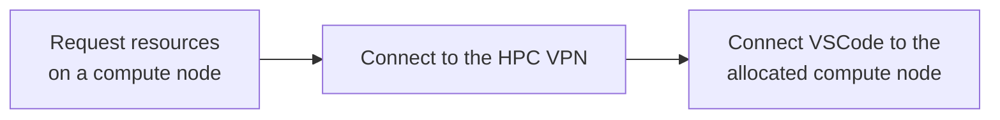

# VSCode Remote Connection


## Overview 

Visual Studio Code (VSCode) can be used to edit source code and other files on the HPC systems.  VSCode is available to run directly on HPC through the Open OnDemand system. 

VSCode can also be run locally on laptop or desktop computers and used to make a remote connection to the HPC systems.  This documentation is intended to detail the steps that must be taken to allow such a connection.  The details of how to make such a connection within the VSCode software itself is beyond the scope of this documentation. Refer to the VSCode documentation here: [https://code.visualstudio.com/docs/remote/ssh-tutorial](https://code.visualstudio.com/docs/remote/ssh-tutorial).  

##Creating and Using a Remote Connection

{==Remote VSCode sessions must connect to a compute node==}.  Briefly, the procedure is as follows:



The specific steps are these:

!!! tip "Use the HPC VPN"
    Note that {==The HPC VPN==} is needed to connect directly to a compute node. This differs from the standard UArizona VPN or campus network which are not sufficient. The HPC VPN is `vpn.hpc.arizona.edu`

1. Set up ssh key authentication on the file transfer node (```filexfer.hpc.arizona.edu```), which will allow VSCode to directly connect to the HPC systems without using passwords or Duo authentication.  Our documentation for setting up ssh keys on the bastion host appears here: [SSH Keys](/registration_and_access/system_access/#ssh-keys).  Follow the procedure documented on that page, but replace ```hpc.arizona.edu``` in any commands with ```filexfer.hpc.arizona.edu```.

2. Use the Cisco AnyConnect VPN software to connect to ```vpn.hpc.arizona.edu```.  Cisco AnyConnect is the software that you would also use to connect to the general UArizona VPN.  Information on downloading and connecting Cisco AnyConnect appears here: [https://it.arizona.edu/service/ua-virtual-private-network-vpn](https://it.arizona.edu/service/ua-virtual-private-network-vpn)
 
3. From the login node, start an interactive session for the length of time that you’d like to connect VSCode. Note that executing ```elgato``` or ```ocelote``` first will request your session on those less busy clusters and it will likely start faster:
 
    ```bash
    elgato
    interactive -t 4:00:00 -a <group_name>
    ```
    
    After the interactive session starts, type ```hostname```, which will give something like ```cpu25.elgato.hpc.arizona.edu```. This is the name that you will enter in your local VSCode as the remote computer to connect to. Note that each time you start an interactive session you will likely get a different node, and will therefore need to tell VSCode the specific host to connect to each time.