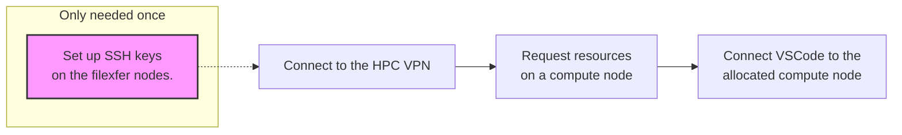
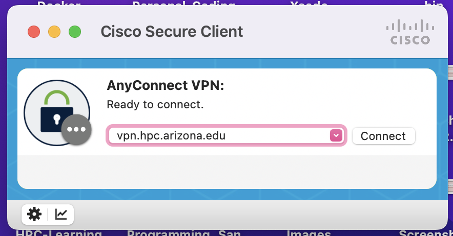
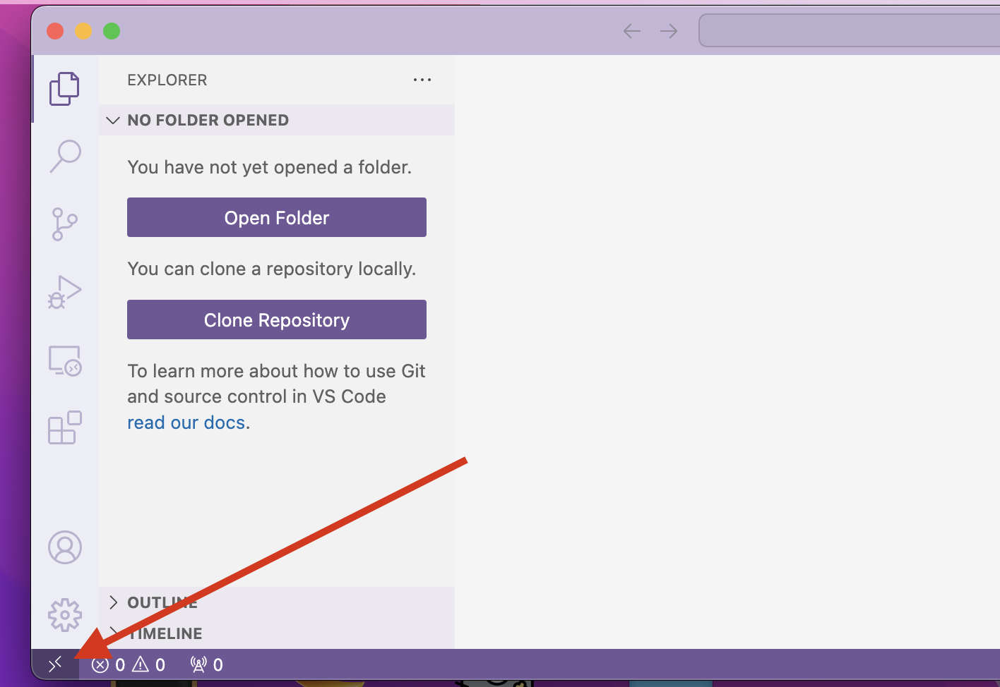
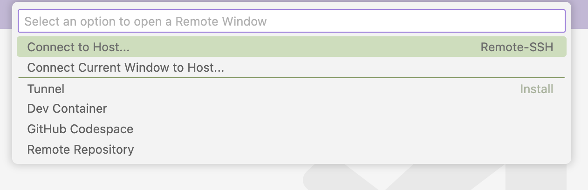
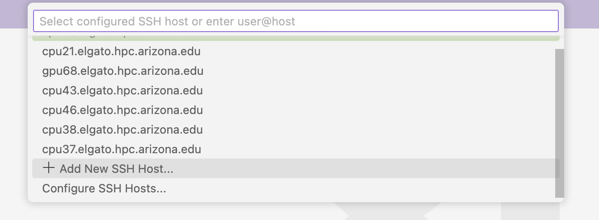
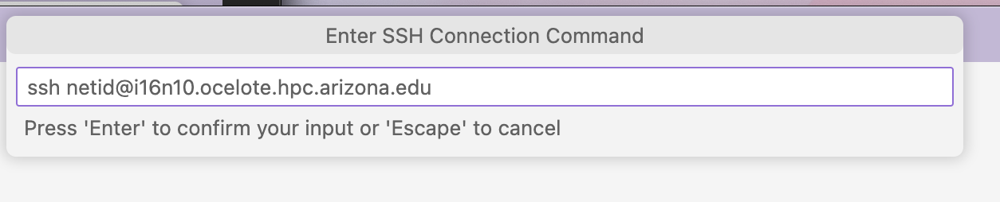
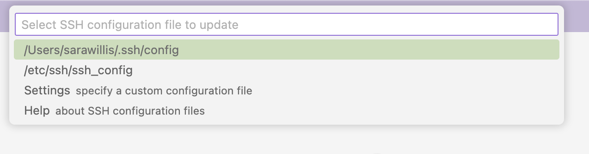
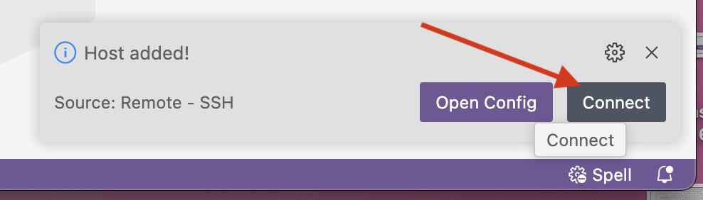
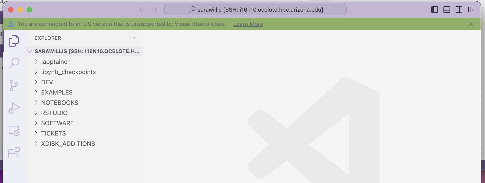

# VSCode Remote Connection


## Overview 

Visual Studio Code (VS Code) can be used to edit source code and other files on the HPC systems.  VS Code is available to run directly on HPC through the Open OnDemand system. 

VS Code can also be run locally on laptop or desktop computers and used to make a remote connection to the HPC systems. This documentation is intended to detail the steps that must be taken to allow such a connection. For more detailed information on establishing SSH connections, refer to the VS Code documentation here: [https://code.visualstudio.com/docs/remote/ssh-tutorial](https://code.visualstudio.com/docs/remote/ssh-tutorial). There is also a general example shown in the section [Connection Example](#specifics-with-example) below.

## General Method

{==Remote VSCode sessions should connect to a compute node==}. The reasons for this are:

1. Connecting to the bastion host (hostname: `hpc.arizona.edu`) will generate files that may overfill your 10 MB quota. This can cause unpredictable connection issues for any future SSH sessions. Additionally, the bastion host is not connected to the shared storage array which means your HPC files will not be accessible.

2. Connecting directly to the filexfer nodes is possible and will allow you to edit files. However, running applications for testing or debugging is not permitted on these machines, so anything beyond editing will need to be done with dedicated compute resources. 

Briefly, the general procedure is as follows:



## Specifics with Example
    

**Step 1: Set up SSH key authentication**

{==This step needs to be performed one time only==}. Once you've set up SSH keys, they will persist in your environment for subsequent sessions. The hostname for the file transfer nodes is `filexfer.hpc.arizona.edu`. Once this process is complete, it will allow VS Code to directly connect to the HPC systems without using passwords or Duo authentication (which may cause connection issues). 

We have detailed documentation for setting up SSH keys on the bastion host here: [SSH Keys](/registration_and_access/system_access/#ssh-keys). Follow the procedure documented on that page, but replace `hpc.arizona.edu` in any commands with `filexfer.hpc.arizona.edu`.

**Step 2: Connect to the HPC VPN (```vpn.hpc.arizona.edu```)**

Connect to the HPC VPN, preferably with Cisco AnyConnect. For detailed information on connecting to the HPC VPN, see [VPN - Virtual Private Network](../../../registration_and_access/vpn/).

<!-- [https://it.arizona.edu/service/ua-virtual-private-network-vpn](https://it.arizona.edu/service/ua-virtual-private-network-vpn) -->

Note that {==The HPC VPN==} is needed to connect directly to a compute node. This differs from the standard UArizona VPN or campus network which are not sufficient. The HPC VPN is `vpn.hpc.arizona.edu`

<!-- Start by opening Cisco Secure Client, then use the address `vpn.hpc.arizona.edu`. -->

<!--  -->

<!-- After clicking connect, enter your NetID, password, and Duo authentication method. -->

 
**Step 3: Start an HPC job for the length of time that you’d like to connect VS Code**

This can either be done directly on the command line, or you can start an Open OnDemand graphical job so you don't have to worry about timing out due to inactivity

Note that starting a job either on Ocelote or ElGato will likely get you though the queue faster. As an example, from the command line we could request an eight-hour session with:
 
```bash hl_lines="8 9" title="Interactive session on the command line"
(ocelote) [netid@wentletrap ~]$ interactive -a hpcteam -n 4 -t 8:00:00
Run "interactive -h for help customizing interactive use"
Submitting with /usr/local/bin/salloc --job-name=interactive --mem-per-cpu=4GB --nodes=1    --ntasks=4 --time=8:00:00 --account=hpcteam --partition=standard
salloc: Pending job allocation 3293757
salloc: job 3293757 queued and waiting for resources
salloc: job 3293757 has been allocated resources
salloc: Granted job allocation 3293757
[netid@i16n10 ~]$ hostname
i16n10.ocelote.hpc.arizona.edu
```

After the interactive session starts, type ```hostname```, which will give something like `i16n10.ocelote.hpc.arizona.edu` (shown highlighted in the code above). This is the name that you will enter in your local VS Code as the remote computer to connect to.

!!! tip "Different jobs are allocated different nodes"
    Note that each time you start an interactive session you will likely get a different node, and will therefore need to tell VS Code the specific host to connect to for each unique connection.
    
**Step 4: Open a remote connection in VS Code**

Once your session is running and you have the hostname of your compute node, you can connect VS Code directly to that machine. 

As an example, open a new window in VS Code on your local computer and select `><` from the bottom-left side



Select **Connect to Host...**, 



Select **+Add New SSH Host...**



Then enter the ssh connection information (replacing `netid` with your own NetID). In this case, the command with the specific hostname would be `ssh netid@i16n10.ocelote.hpc.arizona.edu`. 



You will be prompted to select the configuration file to update, this will typically be something like `~/.ssh/config`. 



If prompted, allow the connection by selecting Allow in the next window that pops up. In the bottom right, you should now see a tile with a button prompting you to connect. 



If a connection has been established, you should now be able to select **Open Folder**, then can enter the full path to your desired working directory. This may be under your `/home`, `/groups`, or `/xdisk`.


If everything has gone well, you should now be able to work with your files


