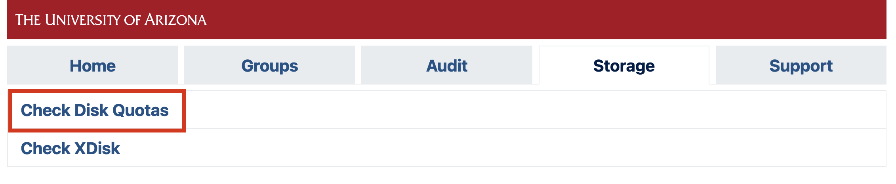
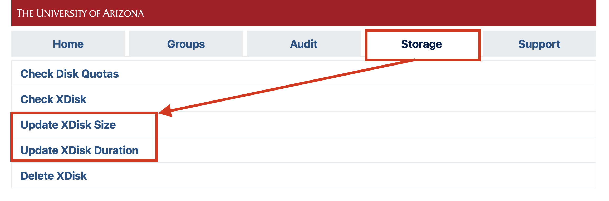
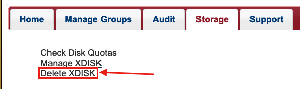
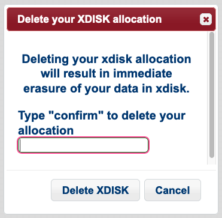

# HPC Storage 

## Overview

The University’s Research Data Center provides data storage for active analysis on the high-performance computers (HPCs). Using central computing storage services and resources, University researchers, faculty researchers, and post-doctoral researchers are able to:

* Share research data in a collaborative environment with other UArizona affiliates on the HPC system
* Store large-scale computational research data
* Request additional storage for further data analysis

The storage is mounted as a filesystem and all the clusters have access to the same filesystems.

Every user has access to individual and shared storage on the system where they can host data for active analyses. A summary of these locations is shown below:

|<div style="width:120px">Path</div>|Description|<div style="width:120px">Quota</div>|Duration|
|-|-|-|-|
|```/home/uxx/netid```|An individual storage allocation provided for every HPC user|50 GB|Accessible for the duration of user's account|
|```/groups/pi_netid```|A communal storage allocation provided for every research group|500 GB|Accessible for the duration of a PI's account|
|```/xdisk/pi_netid```|Temporary communal storage available for every group on request. See xdisk section below for details.|200 GB to 20  TB|Up to 300 days|
|```/tmp```|Local storage available on individual compute nodes.|$<$ 800 GB to 1.4 TB|Only accessible for the duration of a job's run.|


## Checking Your Storage Usage

=== "Command Line"
    To check your storage usage, on a compute node, file transfer node, or login node, use the command ```uquota```. This will show you all the spaces you have access to, their quotas, and current usage.
    ```
    (puma) [netid@junonia ~]$ uquota
                                            used  soft limit  hard limit
    /groups/pi_netid                            6.6G      500.0G      500.0G
    /home                                      37.1G       50.0G       50.0G
    /xdisk/pi_netid                            12.9G        9.8T        9.8T
    ```
    
=== "User Portal"
    You can check your storage allocation through our [online user portal](https://portal.hpc.arizona.edu/portal/) by navigating to the Storage tab and clicking Check Disk Quotas:
    
    


## xdisk
 
### What is xdisk?

xdisk is a temporary storage allocation available to all PIs and offers up to 20 TB of usable space for their group for up to 300 days. PIs may only have one active xdisk at a time.

A PI can request an allocation either via the command line or through our web portal (no paperwork necessary!). Only faculty members (PIs) may request, alter, or delete an allocation from the command line. Members of their research group may be [delegated management rights](../../../registration_and_access/group_management/#delegating-group-management-rights) allowing them to manage a group's xdisk on their PI's behalf through our web portal.

Once an xdisk allocation is created, it is immediately available for use. Groups can find their allocations under ```/xdisk/pi_netid```. By default, a subdirectory is created for each group member under ```/xdisk/pi_netid/netid```. If a group member is added after the allocation is created, a directory is not automatically created for them. To add one, [reach out to our consultants](../../../support_and_training/consulting_services/).

{==Because xdisk allocations are temporary, they will be removed as soon as their time limit is reached==}. Warnings will be sent to every group member at their netid@arizona.edu addresses beginning one month before the expiration. It is the group's responsibility to renew xdisk allocations or copy files to an alternate storage location prior to the expiration date. Once an xdisk allocation expires, everything in it is permanently deleted. The data is not deleted immediately, but on a regular basis or when the space is needed, so do not rely on it being recovered after expiration.

PIs may request a new xdisk allocation immediately after their previous one has expired. This ensures groups will always have access to increased storage on HPC on a rolling basis with the requirement that housekeeping be done once per academic year. 

### Requesting, Modifying, and Deleting an Allocation

=== "Requesting an Allocation"
    !!! warning
        If a group has an active xdisk allocation, a new one cannot be created until the active allocation expires or is deleted.
    
    PIs or delegates can request an xdisk allocation at any time through the user portal. Under the **Storage** tab, select **Manage XDISK**
    
    
    
    This will open a web form where you can enter your size and duration requirements. The maximum size that can be requested is 20000 GB and the maximum duration is 300 days. If a PI has created multiple research groups, you can specify the desired group ownership for the allocation from the Group dropdown menu. Once you click Ok, your allocation should immediately be available.
    
    

=== "Modifying an Allocation"

    PIs or delegates may manage their xdisk allocation at any time through the user portal. Under the **Storage** tab, select **Manage XDISK**
    
    
    
    This will open a form which will allow you to modify the size and duration of your xdisk. Xdisk allocations cannot be increased beyond 20000 GB and the maximum duration of 300 days. Note: the **Group** field may only be modified at the time of the allocation's creation.
    
    

=== "Deleting an Allocation"
    PIs or delegates may delete their xdisk allocation at any time through the user portal. Under the **Storage** tab, select **Delete XDISK**
    
    
    
    Clicking this link will open a window with a prompt. Type **confirm** and then select **Delete XDISK** to complete the process.
    
    
    
    If you would like to request a new xdisk, you may do so as soon as the request is processed. Note: sometimes processing the request can take a few minutes, depending on the number of files and the size of the allocation.
    
### CLI Commands (PIs only)

!!! warning
    The xdisk CLI commands are usable by PIs only. Group delegates can manage allocations via the user portal.
    
`xdisk` is a locally written utility for PI's to create, delete, resize, and expire (renew) xdisk allocations. Any PIs who wish to utilize the CLI to manage their allocations can do so using the syntax shown below:

|xdisk Function|Command|Examples|
|-|-|-|
|Display xdisk help|<pre><code>xdisk -c help</code></pre>| <pre><code>$ xdisk -c help</code></pre>|
|View Current Information|<pre><code>xdisk -c query</code></pre>|<pre><code>$ xdisk -c query<br>XDISK on host: ericidle.hpc.arizona.edu<br>Current xdisk allocation for &#60;pi_netid&#62;:<br>Disk location: /xdisk/&#60;pi_netid&#62;<br>Allocated size: 200GB<br>Creation date: 3/10/2020 Expiration date: 6/8/2020<br>Max days: 45    Max size: 1000GB</code></pre>|
|Create an xdisk|<pre><code>xdisk -c create -m [size in gb] -d [days]</code></pre>|<pre><code>$ xdisk -c create -m 300 -d 30<br>Your create request of 300 GB for 30 days was successful.<br>Your space is in /xdisk/&#60;pi_netid&#62;</code></pre>|
|Extend xdisk Expiration Date|<pre><code>xdisk -c expire -d [days]</code></pre>|<pre><code>$ xdisk -c expire -d 15<br>Your extension of 15 days was successfully processed</code></pre>|
|Resize an xdisk Allocation|<pre><code>xdisk -c size -m [size in gb]</code></pre>|<pre><code>$ # Assuming an initial xdisk allocation size of 200 gb<br>$ xdisk -c size -m 200<br>XDISK on host: ericidle.hpc.arizona.edu<br>Your resize to 400GB was successful<br>$ xdisk -c size -m -100<br>XDISK on host: ericidle.hpc.arizona.edu<br>Your resize to 300GB was successful</code></pre>|
|Delete an xdisk Allocation|<pre><code>xdisk -c delete</code></pre>|<pre><code>$ xdisk -c delete`<br>Your delete request has been processed</code></pre>|
