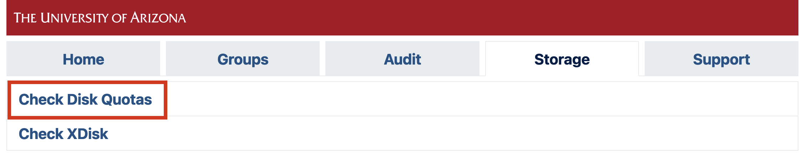
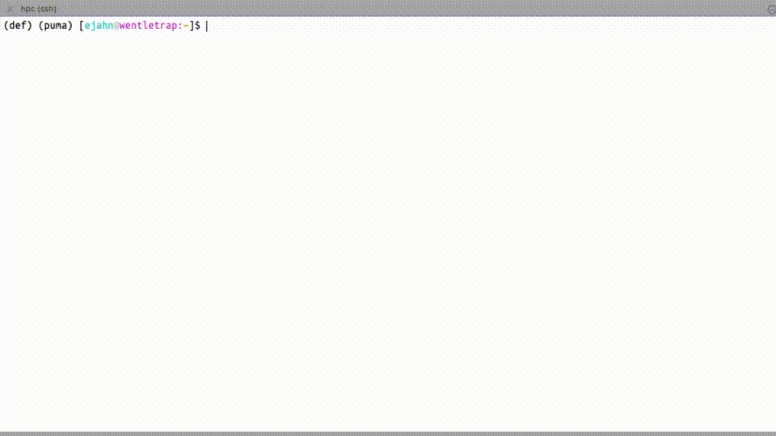

# HPC Storage 

## Overview

!!! danger "Data on HPC are not backed up"
    For information on our data policies, see the section [Storage Expectations and Policies](#storage-expectations-and-policies) below. Our storage arrays implement Snapshots so we may be able to restore your data if you notify us promptly.

The University’s Research Data Center provides data storage for active analysis on the high-performance computers (HPCs). Using central computing storage services and resources, researchers are able to:

* Share research data in a collaborative environment with other UArizona affiliates on the HPC system.
* Store large-scale computational research data.
* Request additional storage for further data analysis.

All clusters share access to the same mounted HPC storage, so your files are available regardless of which cluster you’re using.

Every user has access to individual and shared storage on the system where they can host data for active analyses. A summary of these locations is shown below:

|<div style="width:130px">Path</div>|Description|<div style="width:120px">Quota</div>|Duration|
|-|-|-|-|
|```/home/uxx/netid```|An individual storage allocation provided for every HPC user|50 GB|Accessible for the duration of user's account|
|```/groups/pi_netid```|A communal storage allocation provided for every research group|500 GB|Accessible for the duration of a PI's account|
|```/xdisk/pi_netid```|Temporary communal storage available for every group on request. [See our xdisk page](../xdisk/) for details.|200 GB to 20  TB|Up to 300 days|
|```/tmp```|Local storage available on individual compute nodes.|$<$ 800 GB to 1.4 TB|Only accessible for the duration of a job's run|
|```/rental```|An optional allocation at a reasonable rate. [See our rental storage page](../rental_storage/) for details.|Your budget|Accessible for the duration of PI's account.|

!!! tip "Managing permissions"
    If you're working with other members of your group and need to make your files more accessible, see our [bash cheat sheet](../../../support_and_training/cheat_sheet/#linux-file-permissions). This offers an overview on Linux file permissions, ownership, and some tips for working with collaborators. 

## Storage Expectations and Policies

Our HPC storage array is designed for high performance, not long-term storage. It is mostly built on high-speed flash, which is significantly more expensive and limited in capacity than typical data storage.

1. **{==Important: Your Data are Not Backed Up==}**

    Data stored on our system are not backed up. While we strive for high reliability, we cannot guarantee data recovery in the event of hardware failure, accidental deletion, or account termination. Our storage arrays implement Snapshots so we may be able to restore your data if you notify us promptly.

    In particular:

    * Users are responsible for making their own backups of important data to alternative storage for archival purposes. Examples include our [rental](../rental_storage/) or [AWS](../tier2_storage/) offerings, local lab storage, external hard drives, university storage services, among others. 

    * Data will be deleted when a user’s affiliation ends (e.g., graduation, job change, retirement), in accordance with our [data retention policy](../../../policies/loss_of_university_affiliation/).

2. **HPC Storage is Not Infinite**

    Because our flash-based storage is optimized for performance, we rely on all users to perform regular housekeeping to manage their storage usage. Assuming infinite space can lead to full filesystems, which can cause system-wide slowdowns or failures.

    Please:

    * Perform periodic housekeeping. 

    * Avoid accumulating redundant or outdated datasets.

    * Use alternative storage for archival purposes.

If you're unsure about how to move or back up your data, or would like recommendations, don’t hesitate to [contact support](../../../support_and_training/consulting_services/).

## Best Practices

The shared file system on HPC is the location for everything in ```/home```, ```/groups```, ```/xdisk``` and ```/rental```. The ```/tmp``` directory is also available to users, and refers to the local disk on each node. Your I/O activity can have dramatic activity on other users. Extreme read/write activity can cause bottlenecks and may be cancelled without warning. It is generally best to limit I/O whenever possible to avoid straining the system. The HPC consult team is available to help optimize workflows that may be impacted by I/O. 
    
- [x] **Data Locality**

	If you are using `/rental` storage you must consider performance. You are expected to use the all flash array to manage the I/O for your job.

	1. You can copy your data for the job within your submission script. So copy the data to /groups or /xdisk and copy results back to `/rental` when complete.

	2. You can copy the dataset to `/xdisk`, and run many jobs against that data, then copy the data back to rental at the conclusion of the project. This is best when the dataset is used repeatedly.

- [x] **Be aware of I/O load**
    
	Running multiple instances of jobs performing significant I/O activity may be detrimental to the system, especially if these occur within the same subdirectories. It may be best to read in data at the beginning of a workflow, perform the entire analysis, then write at the very end. Reconfiguring your workflow to limit I/O may cost some time up front, but will most likely be made back through faster job completion. 

    If you are running [array jobs](../../../running_jobs/batch_jobs/array_jobs/), please be cognizant of your I/O activity.

- [x] **Use /tmp for working space**

	If you have multiple jobs that will use the same data, consider copying it to ```/tmp``` and run multiple jobs. This can increase performance and reduce I/O load.


- [x] **Avoid storing many files in a single directory**

	Hundreds of files is probably ok; tens of thousands is not.    

- [x] **Avoid opening and closing files repeatedly in tight loops**

	If possible, open files once at the beginning of your workflow/program, then close them at the end.
     
- [x] **Watch your quotas**

	You are limited in capacity and exceeding your storage quotas may have unintended side effects (e.g., login issues, data loss, or failed jobs). See the section below on checking your storage usage.

- [x] **Avoid frequent snapshot files**
  
	This can stress the storage.

- [x] **Use parallel I/O**

	Some modules enable parallelized file operations, such as ```phdf5```.

## Checking Your Storage Usage

=== "Command Line"
    To check your storage usage, on a compute node, file transfer node, or login node, use the command ```uquota```. This will show you all the spaces you have access to, their quotas, and current usage.
    ```
    (puma) [netid@junonia ~]$ uquota
                                            used  soft limit  hard limit
    /groups/pi_netid                            6.6G      500.0G      500.0G
    /home                                      37.1G       50.0G       50.0G
    /xdisk/pi_netid                            12.9G        9.8T        9.8T
    /rental/pi_netid			       14.4T       20.0T       20.0T	
    ```
    
=== "User Portal"
    You can check your storage allocation through our [online user portal](https://portal.hpc.arizona.edu/portal/) by navigating to the **Storage** tab and clicking **Check Disk Quotas**:
    
    


------

## Home Directory Storage Management

Because home directories are limited to 50 GB, it can be easy for them to fill up leading to issues like the inability to use X11 forwarding, OnDemand access issues, job failures, and more. 

Below are some tips for managing your home directory's quota and tracking down usage.

### What's Using the Space?

Users may not be aware of [hidden files and directories](../../../support_and_training/cheat_sheet/#hidden-files-and-directories) in their home, often created automatically by software or package managers. These can take up a surprising amount of space over time. You can view the sizes of all of the objects in your home, including hidden objects, with the command:

```bash
cd ~
du -sh $(ls -A ~)
```

Common culprits to look out for include `~/.cache`, `~/.conda`, `~/.local`, `~/.singularity`, and `~/.apptainer`. 

#### Graphical Disk Utility

A recently added tool called `gdu` provides an interface within the terminal that allows users to navigate through folders using the arrows to interactively assess disk usage. It is activated with the simple command `gdu` and is available on login nodes and the file transfer node. It will scan the current folder by default, but a path can be specified with `gdu /path/to/location`.

<figure markdown="span">
  { align=right }
  <figcaption>Demonstration of using <code>gdu</code> to identify large files in the home directory</figcaption>
</figure>

### Cache Directories

Cache directories frequently contain cache files used for performance improvements. For example, the directory `~/.cache/pip` stores pip cache files to speed up package installations. These directories may start out small, but they can balloon over time. In particular, RStudio, Apptainer, and HuggingFace, the latter of which stores its large datasets under `~/.cache/huggingface`.

Often, software provides ways to redirect cache files to a new system location using [environment variables](../../../support_and_training/cheat_sheet/#environment-variables). By setting these [in your ~/.bashrc](../../../support_and_training/cheat_sheet/#configuration-files), you can ensure that your cache files will always go to an appropriate location.

#### Common Cache Environment Variables

|<div style="width: 150px;">Environment Variable</div>|<div style="width: 150px;">Default Location</div>|Usage|
|-|-|-|
|<pre><code>APPTAINER_CACHEDIR</code></pre>|`~/.apptainer`|Location for where to store cached apptainer files.|
|<pre><code>PIP_CACHE_DIR</code></pre>|`~/.cache/pip`|Defines the location for [pip's cache directory](https://pip.pypa.io/en/stable/topics/caching/).|
|<pre><code>RSTUDIO_DATA_HOME</code></pre>|`~/.local/share/rstudio`|Storage for RStudio cache files (including saved and active sessions). This directory can get very large, depending on the work you are doing.|
|<pre><code>HF_HOME</code></pre>|`~/.cache/huggingface/datasets`|Relocates HuggingFace cache and dataset files. See [their cache documentation](https://huggingface.co/docs/datasets/en/cache) for more information.|

#### Example of Cache Relocation

The typical method for relocating a cache is to move the existing directory to a new location that has more space (`/groups` or `/xdisk`), then set the corresponding cache variable (if one exists) to that new location.

For example, say you found RStudio's cache files were taking up a lot of space in your home (typically found under `~/.local/share/rstudio`). To change this location, you could move the default directory to a new location:

```bash
mkdir -p /groups/<pi_netid>/<your_netid>/cache_files
mv ~/.local/share/rstudio /groups/<pi_netid>/<your_netid>/cache_files/rstudio
```

Then, set the corresponding environment variable in your `~/.bashrc` to point to that new path. In this case, the line to add would be:

```bash
export RSTUDIO_DATA_HOME=/groups/<pi_netid>/<your_netid>/cache_files/rstudio
```


-----

## xdisk

!!! info "This section has moved"
    The information in this section has moved. Please see our new [xdisk page](../xdisk/) for information on this service.

