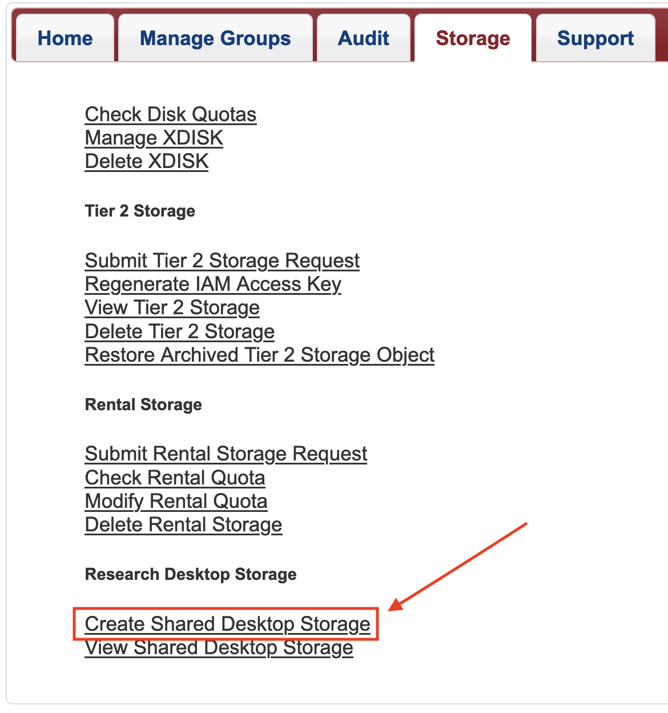
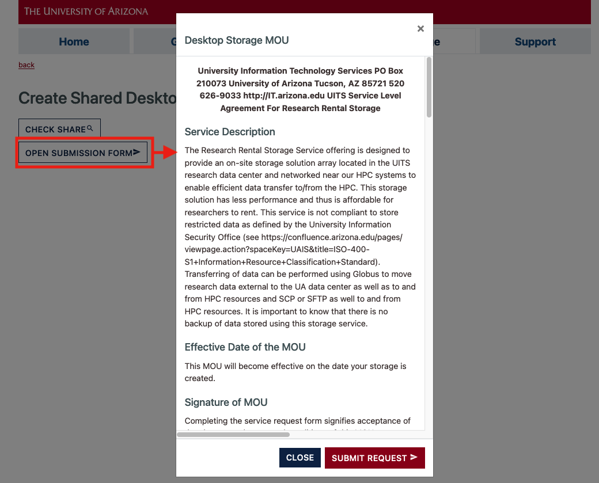
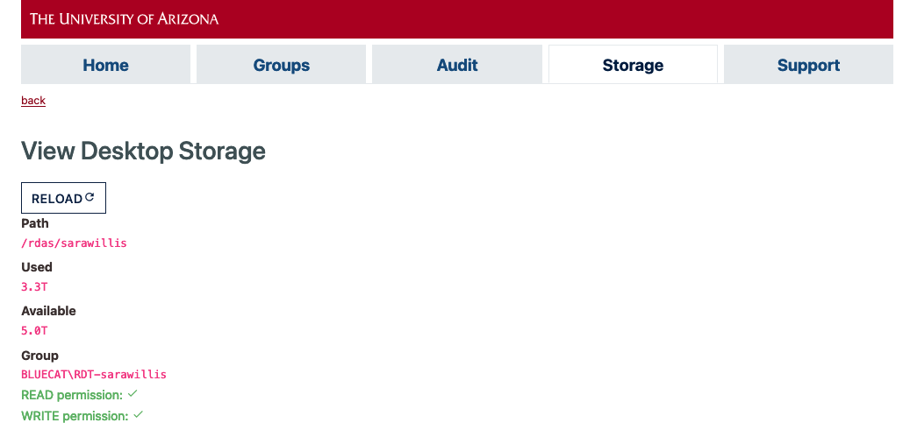
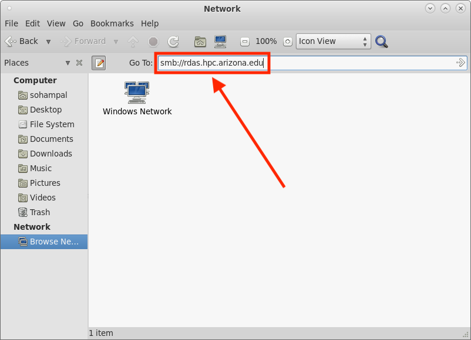
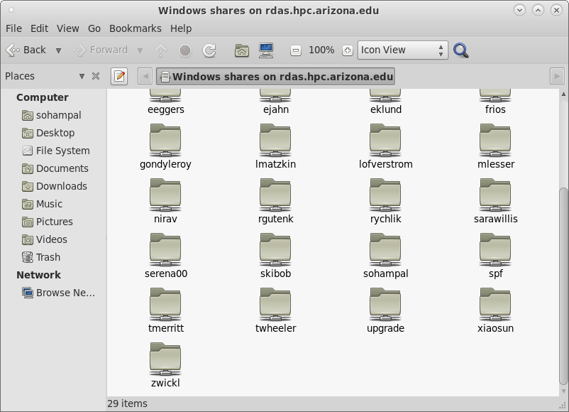
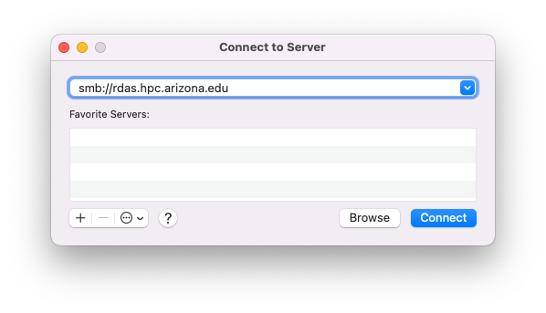
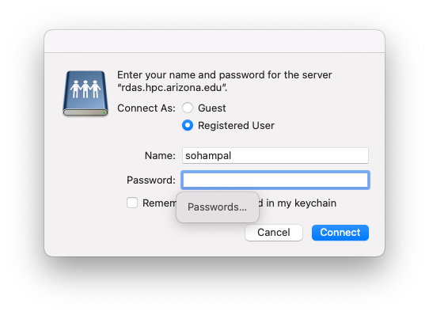
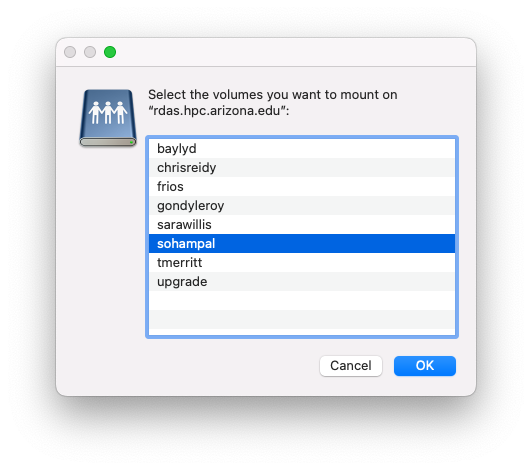
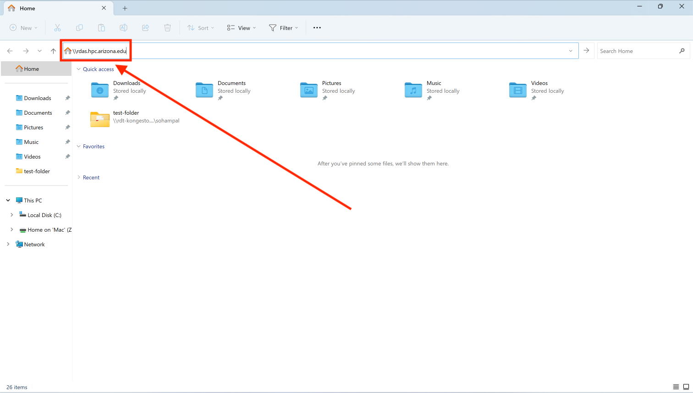

# Research Desktop Attached Storage (R-DAS)

## Overview

!!! danger "R-DAS not an HPC filesystem"
    R-DAS storage is not mounted on HPC compute or login nodes. Data stored in R-DAS will need to be copied over to the HPC filesystem in order to be accessible to jobs. Instructions on how to access R-DAS from HPC are included below.
    
!!! tip "Group Sharing"
    Faculty members/PIs can share their allocations with group members. To do so, in step 6 in the [Accessing Your R-DAS Allocation](#accessing-your-r-das-allocation) section below, group members will choose the allocation with their faculty member's/PI's NetID.

!!! warning "No Controlled Data"
    This service is not intended for HIPAA or otherwise controlled data. Please see [Secure HPC](../../../resources/secure_hpc/) for more information. 

On October 16, 2023, we went live with the Research Desktop Attached Storage Array (R-DAS). R-DAS provides up to 5 TB of no-cost storage capacity for each PI group. Our requirement was to enable our users to easily share data with other research group members. You can treat the allocation as a drive mounted on your local computer. R-DAS is intended for storing open research data, but not controlled or regulated data.


## Technical Requirements

R-DAS is a storage service backed by a Qumulo branded storage array. It supports the mounting of SMB shares for SMB 3.1. The supported operating systems are MacOS (Monterey or higher), Linux (kernel 3.7 or higher), and Windows (Windows 10 or 11).

## Performance

The storage array is located in the Research Data Center to benefit from the network infrastructure in the Computer Center. The performance you experience will depend on your network connectivity. The best case is likely wired ethernet in a newer building. Off campus usage requires connection to the VPN, and so performance can be variable. Our testing off campus regularly reached 3 MB/s.

## Requesting an Allocation

PIs can request an allocation on R-DAS from [https://portal.hpc.arizona.edu/portal](https://portal.hpc.arizona.edu/portal)

1. Go to the **Storage** tab
2. Select **Create Shared Desktop Storage** under **Research Desktop Storage**

    
    
3. Select **Open Submission Form :material-send:** from the window that opens. This will open the MOU agreement. Review it and, if it is acceptable to you, select **Submit Request :material-send:**. Note: you must scroll to the bottom of the MOU agreement to be able to submit the request. 
      
    
    
4. You can now select the **View Shared Desktop Storage** option from the main **Storage** page in the user portal

    
    
## Accessing Your R-DAS Allocation
!!! tip
    UArizona IP Address Required: To access your R-DAS allocation you need to be connected to either the UArizona campus network, or the UArizona SSL VPN. For information about connecting to a VPN, see [VPN - Virtual Private Network](../../../registration_and_access/vpn/). If you are accessing your R-DAS allocation from an HPC cluster, then you are already on the UArizona campus network and do not need to connect to the UArizona SSL VPN. 
    
R-DAS can be accessed from Linux, MacOS, or Windows. The screenshots are intended to be visual aids, but they include information from the consulting team. When you proceed, please enter your own information.


!!! example "Choose your operating system"

    === "Linux"
        !!! warning "No ```sudo``` on HPC"
            Do not attempt to run ```sudo``` commands on HPC, these are only meant for your personal Linux machines. To transfer data between R-DAS and HPC see [Transfer data between R-DAS and HPC storage](#transfer-data-between-r-das-and-hpc-storage).
            
        First, install the necessary software packages to access your allocation
        
        !!! example "Choose your distribution"
            === "Debian/Ubuntu"
                ```bash
                sudo apt install samba gvfs-backends smbclient
                ```
            === "Fedora/CentOS"
                ```bash
                sudo yum install samba gvfs-samba samba-client 
                ```
            === "Other Linux Distributions"
                Please check the documentation of your distribution.
        
        Next, access your allocation
        !!! example "Choose your connection method"
            === "GUI"
                On a desktop environment, such as MATE, GNOME, KDE, you can mount your R-DAS allocation as a local drive with the corresponding file manager (Caja on MATE, GNOME Files, Dolphin on KDE). On HPC, you can use a [virtual desktop](../../../running_jobs/open_on_demand/).
            
                1. Open the file manager (Caja, GNOME Files, Dolphin)

                2. Press ++ctrl+l++. This makes the location bar editable.

                3. Enter ```smb://rdas.hpc.arizona.edu``` in the location bar, and press ++enter++.

                    

                4. A few moments later a window opens, prompting for your **Username** (```BLUECAT\``` followed by your UArizona NetID) and **Password** (UA NetID password). After entering the details, select **Connect** (on other file managers this may be **OK**). Some file managers, such as Caja and GNOME Files, also have a **Domain** field, whereas others, like Dolphin, do not. Either way, you do not need to modify its default value.

                    

                5. Select the allocation named after your group from the list of allocations displayed.

                    

                6. On some file managers, such as Dolphin, you can right away access your allocation by double clicking on it. On others, such as Caja and GNOME Files, double clicking on it will open another window prompting for your **Username** (```BLUECAT\``` followed by your UArizona NetID) and **Password** (UA NetID password). Select **Connect as user**, enter the details, and select **Connect**. Your allocation will be mounted as a local drive.

                    

            === "CLI"

                You can interactively browse your R-DAS allocation with ```smbclient```:
                ```
                smbclient \\\\rdas.hpc.arizona.edu\\<share> -U BLUECAT\\<username>
                ```

                The ```<share>``` is the PI group that you belong to, and ```<username>``` is your UArizona NetID. The command will prompt for a password where you will enter your UArizona NetID password. This will start an ```smb``` shell. For example:

                ```
                ~ $ smbclient \\\\rdas.hpc.arizona.edu\\sohampal -U BLUECAT\\sohampal
                Password for [BLUECAT\sohampal]:
                Try "help" to get a list of possible commands.
                smb: \>
                ```

                Try ```help``` to get a list of possible commands:

                ```
                smb: \> help
                ?              allinfo        altname        archive        backup        
                blocksize      cancel         case_sensitive cd             chmod         
                chown          close          del            deltree        dir           
                du             echo           exit           get            getfacl  
                . . .
                ```

                Use the ```-L``` flag to get the list of shares on the Array. For example:

                ```
                smbclient -L \\\\rdas.hpc.arizona.edu -U BLUECAT\\sohampal
                Password for [BLUECAT\sohampal]:
 
                Sharename       Type      Comment
                ---------       ----      -------
                Q$              Disk      Default root share for SRVSVC.
                ipc$            IPC       Named Pipes
                upgrade         Disk      for qumulo upgrades
                tmerritt        Disk      Desktop share for tmerritt created on 09/12/2023 12:24 PM
                . . .
                ```

                Any command that you can run interactively from the smb shell, you can also run non-interactively with the ```-c``` flag. For example, to list the files and directories in your share, run:
                ```
                smbclient \\\\rdas.hpc.arizona.edu\\<share> -U BLUECAT\\<username> -c 'ls'
                ```
                You can also combine multiple commands with ```;```. For example to list the contents in a directory in your share, run:
                ```
                smbclient \\\\rdas.hpc.arizona.edu\\<share> -U BLUECAT\\<username> -c 'cd <directory>;ls'
                ```
                To copy a file from your local system to your R-DAS share use ```put```, and from your R-DAS share to your local system use ```get```:
                ```
                smbclient \\\\rdas.hpc.arizona.edu\\<share> -U BLUECAT\\<username> -c 'put <file>'
                ```
                To learn more about smbclient, run [```man smbclient```](https://www.samba.org/samba/docs/current/man-html/smbclient.1.html).

    === "Mac OS"
        If you are on a Mac, then you can mount your R-DAS allocation as a local drive with the following steps:
    
        1. Go to Finder
        2. Select **Go** from the top menu bar.
        3. From the drop-down menu, select **Connect to Server**.
        4. In the window that opens, enter ```smb://rdas.hpc.arizona.edu``` in the address bar, and select **Connect**.
    
            
        
        5. After a few moments a window opens prompting for your **Name** (UA NetID) and **Password** (UA NetID password). After entering the details, select Connect.
    
            
    
        6. A window will open with the list of allocations on the array. Select the allocation named after your group, and then select **OK**.

            
        
        
    === "Windows"
        If you are on Windows, you can mount your R-DAS allocation as a local drive with the following steps:

        1. Open Windows Explorer.
        2. Enter ```\\rdas.hpc.arizona.edu``` in the location bar, and press ++enter++.

            

        3. A few moments later a window will open, prompting for your **Username** (```BLUECAT\``` followed by your UArizona NetID) and **Password** (UA NetID password). After entering the details, select **OK**.

            

        4. Select the allocation named after your group from the list of allocations displayed. You can directly open the allocation by double-clicking on it, or mount it by right clicking on it and selecting **Map network drive**.

            

### Transfer data between R-DAS and HPC storage
The simplest way to transfer data between your R-DAS share and HPC storage is to first transfer data to your local machine, and then from local machine to the destination. For more information on transferring data from local machine, see [Transfers](../../transfers/overview/). However if you do not want to store the data to your local machine as an intermediate step, then you can transfer data between R-DAS and HPC storage with the following steps:

1. Mount the R-DAS share as a local drive following the steps above.
2. Transfer the data using `rsync`, see [rsync](../../transfers/rsync/) for more information. For example, if your local machine is a Mac, then you can transfer the data from R-DAS to HPC storage with the following:
   ```
   rsync -ravz /Volumes/<share-name>/<path-to-source> <netid>@filexfer.hpc.arizona.edu:<path-to-destination>
   ```

The above steps assumes that you know the mount point of the R-DAS share on your local machines:

- On Linux, it might take some amount of sleuthing to find out where it is mounted. File managers dependent on `gvfs` will typically mount it under `/run/user/<uid>/gvfs`.
- On a Mac, it will typically be mounted at `/Volumes/<share-name>`.
- On Window, you will have to map it to a drive.

We recommend that you use `rsync` to transfer the data from your R-DAS share to HPC storage. However, if you do not know the mount point of the R-DAS share, or if you do not want to use `rsync`, then the other alternative to transfer data between R-DAS and HPC storage is:

<div class="annotate" markdown>
1. Start an virtual desktop on Open OnDemand. See [Virtual Desktop](../../running_jobs/open_on_demand/#applications-available) for more information.
2. Mount the R-DAS share following the Linux [GUI](#__tabbed_3_1) steps. (1)
3. Transfer the data graphically, or using your favorite command line tool from the virtual desktop terminal. 
</div>

1.  On the HPC virtual desktop's MATE desktop environment, you can launch the file manager, Caja, by clicking the file drawer like icon in the top bar, or by selecting **Applications** > **System Tools** > **Caja**.
