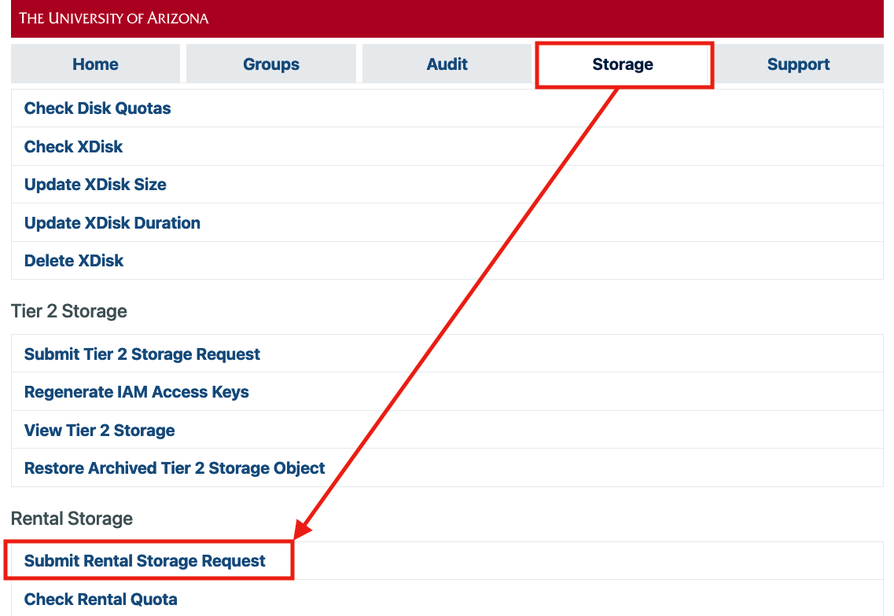
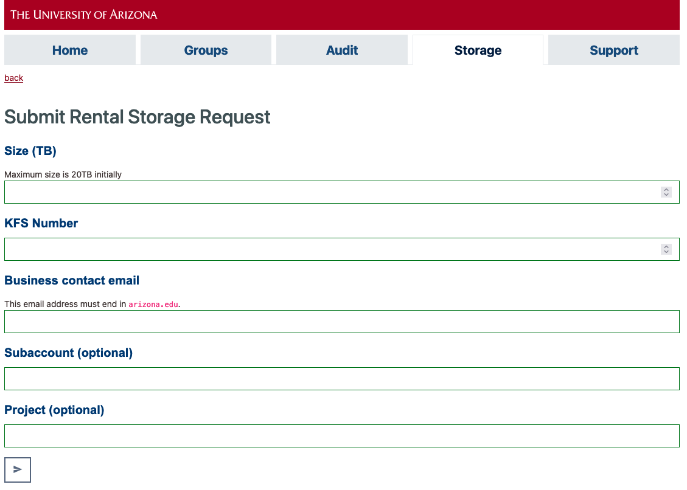
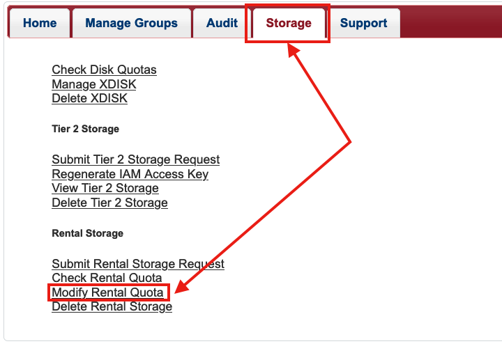
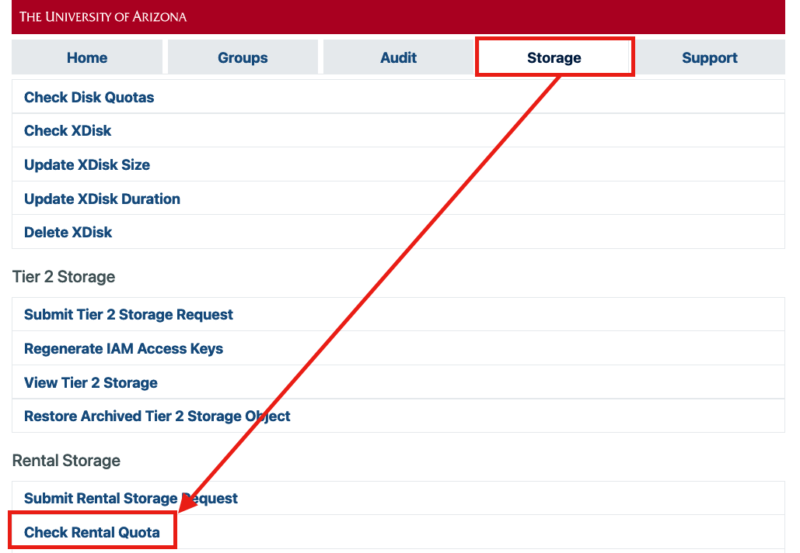
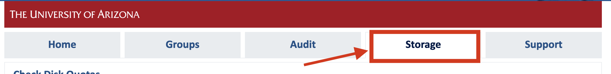
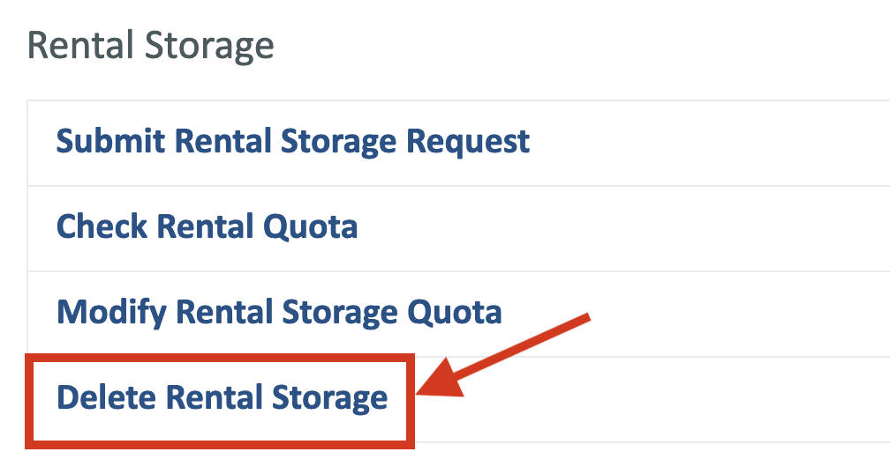
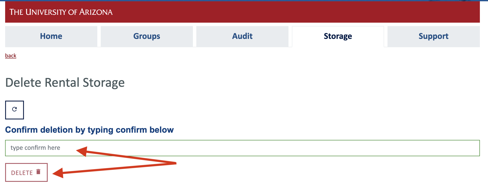

# Rental Storage

## Overview

!!! info "Accessibility"
    Your ```/rental``` allocation is only mounted on our Data Transfer Nodes (hostname `filexfer.hpc.arizona.edu`) and is not directly accessible from the HPC login or compute nodes. 

!!! warning "No Controlled Data"
    This service is not intended for HIPAA or otherwise controlled data. Please see [Secure HPC](/resources/secure_hpc/) for more information. 

We offer a rental storage solution that has less performance than our primary SSD array making it affordable for researchers to rent. This storage array is located in the Research Data Center and is mounted on our data transfer nodes which makes it more accessible than most other options. Data in your rental space will be accessible via the command line and the graphical transfer application Globus. 


## Pricing

### Cost per Year

The first-year rate is $94.50 per TB, and [RII](https://research.arizona.edu/ "Research, Innovation & Impact") will provide matching funds for first-year allocations to make the {==actual first-year cost to researchers $47.35==}. These matching funds will be applied automatically, so in practice you will see the $47.35 rate. The ongoing rate after year one is $47.35 per TB per year.

### Billing
Researchers must provide a KFS account for this service. Charges will be applied at the end of the academic year (June).

### Size Modifications

If the size of your allocation is modified, you will be billed for the maximum amount of space reserved during that fiscal year. 


## Data Location

!!! danger
    Your ```/rental``` allocation is only mounted on our Data Transfer Nodes and is not directly accessible from the HPC login or compute nodes. 


Your rental space will be on a storage array in our Research Data Center and mounted on our data transfer nodes (hostname: ```filexfer.hpc.arizona.edu```). Your space will be findable under 

```bash
/rental/<pi_netid>
```

Where ```<pi_netid>``` is the NetID of the faculty member who requested the allocation.

## Data Transfers

A few data transfer options are Globus, ```sftp```, and ```scp``` which will allow you to move data external to the data center to your allocation.

For data transfers between HPC storage (```/home```, ```/groups```, or ```/xdisk```) and your rental allocation, you may also ```ssh``` into ```filexfer.hpc.arizona.edu``` and use ```mv``` or ```cp```. For large copies done using this method, we recommend using a ```screen``` session to prevent timeouts. For example:
```bash
[netid@home ~]$ ssh netid@filexfer.hpc.arizona.edu
Authorized uses only. All activity may be monitored and reported.
Last login: Fri Sep 15 10:53:27 2023
[netid@sdmz-dtn-3 ~]$ cd /rental/pi/netid/example
[netid@sdmz-dtn-3 example]$ screen
[netid@sdmz-dtn-3 example]$ cp -r /xdisk/pi/CONTAINERS/ $PWD/CONTAINERS
[netid@sdmz-dtn-3 example]$ ls
CONTAINERS
[netid@sdmz-dtn-3 example]$ exit # exits screen session
[netid@sdmz-dtn-3 example]$ exit # exits filexfer node
logout
Come again soon!
Connection to filexfer.hpc.arizona.edu closed.
[netid@home ~]$
```

## How to Request Rental Storage

!!! warning
    Allocations up to 20TB in size can be requested through the user portal. For allocations larger than 20TB, [contact our consulting team](/support_and_training/consulting_services/) for help.
!!! tip
    It can take a few days to process the request as it has to route through the Financial Services Office (FSO). You will receive an email confirmation once it is complete.

1. PIs or [Group Delegates](../../../registration_and_access/group_management/#delegating-group-management-rights) can request rental storage on behalf of their group. To do so, navigate to the [User Portal](https://portal.hpc.arizona.edu) in your browser, choose the **Storage** tab, then select **Submit Rental Storage Request** under the **Rental Storage** heading.

    

2. This will open a web form. Add your KFS number under **KFS Number**(1) and the email address for the Department's financial contact under **Business contact email**. There will also be two optional fields: **Subaccount** and **Project**. These are used for tagging/reporting purposes in KFS billing. You can safely leave these entries blank if you're not sure what they are. Once you have completed the form, click **:material-send:**. 
    { .annotate }

    1.  A KFS number is used for accounting purposes and used by your Department's finance specialist. If you do not know your KFS number, contact your department's financial office. 

    

3. Once your space has been created, you will receive an email notification that it is ready for use.


## Resizing Your Allocation

!!! warning
    Resizing allocations up to 20TB can be done the user portal. For allocations larger than 20TB, [contact our consulting team](../../../support_and_training/consulting_services/) for help.

Your rental allocation can be resized through the user portal by navigating to the **Storage** tab and selecting **Modify Rental Quota** under the **Rental Storage** heading.


    

## Checking Your Usage

You can check your allocation's size and current usage either through the user portal or on the command line.

=== "User Portal"
    In the [user portal](https://portal.hpc.arizona.edu/portal/), navigate to the **Storage** tab and select **Check Rental Quota** from under the **Rental Storage** heading. This option is only available to PIs and group delegates.

    

=== "Command Line"
    From an HPC login node or on a filexfer node, enter the command `uquota`, for example:
    ```
    [user@local_machine ~]$$ ssh netid@hpc.arizona.edu
    [netid@gatekeeper ~]$ shell
    (puma) [netid@wentletrap ~]$ uquota
                                            used  soft limit  hard limit
    /groups/pi                                163.4G      500.0G      500.0G
    /home                                      13.2G       50.0G       50.0G
    /rental/pi                                 11.8G      931.3G      931.3G
    /xdisk/pi                                   9.0T        9.9T        9.9T
    ```

## Deleting Your Allocation

PI's can submit a deletion request to remove their rental storage through our [user portal](https://portal.hpc.arizona.edu).

{==Prior to submitting a deletion request==}, please:

1. Create a backup of any data you need to keep.
2. Delete the data stored in your `/rental` space. 

To submit a deletion request: 

1. Go to [portal.hpc.arizona.edu](https://portal.hpc.arizona.edu) and navigate to the **Storage** tab.

    

2. Scroll down to the section **Rental Storage** and click **Delete Rental Storage**.

    

3. In the page that opens, type **confirm** in the box that says **type confirm here** to confirm your deletion request. Once you have confirmed, click **DELETE**.

    

Submitting a deletion request will open a ServiceNow ticket and will initiate the process of deleting your rental space and the cancellation of any automatic renewal charges to your account. The ticket will be closed and you will be notified when the process is complete.